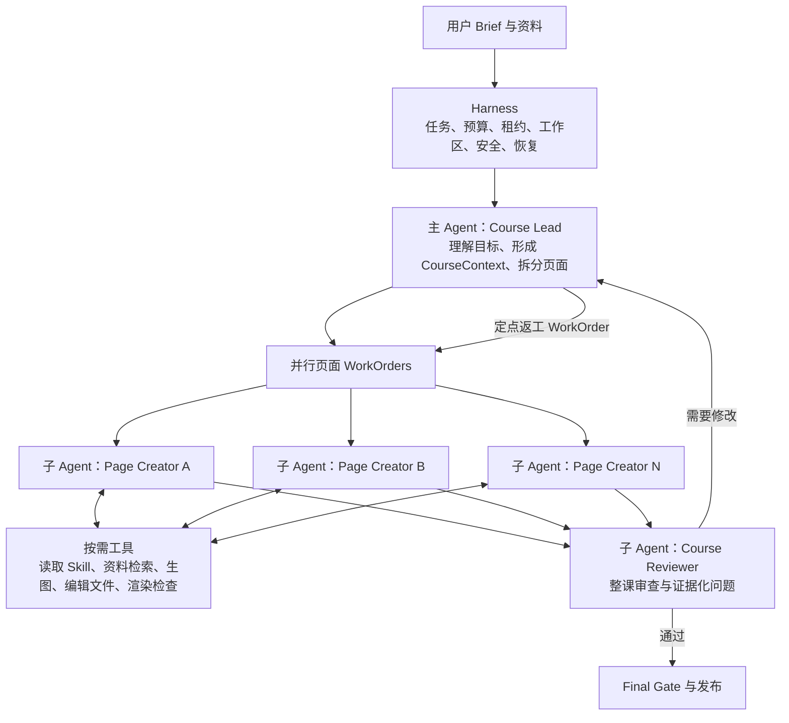

# 最小多 Agent Loop 生课架构

## 目标

首期只保留能让课程真正生成、并行协作、迭代修订和可靠发布的最小闭环。不开 DSL 页面槽位，不增加独立生图 Agent、Research Agent、Visual Agent、Integrator Agent、复杂 Blackboard 或新的分布式消息系统。

架构判断标准只有两个：

1. 是否让模型拥有足够创作空间，能像 Codex 编辑项目一样多轮制作页面；
2. 是否保留多 Agent 并行与独立审查，提升速度和质量。

## 最终角色数量

首期只需要三种职责。

| 层级 | 职责 | 实例数量 | 核心产物 |
| --- | --- | --- | --- |
| 主 Agent | `CourseLeadAgent` | 1 | `CourseContext`、页面 WorkOrder、最终课程决定 |
| 子 Agent | `PageCreatorAgent` | 每页 1 个，按并发池运行 | 页面 workspace、HTML、证据、Page Artifact |
| 子 Agent | `CourseReviewerAgent` | 1 | 课程级 Review 与定点返工请求 |

也就是：**1 个主 Agent 职责 + 2 个子 Agent 职责**。

如果一门课有 8 页，不代表同时常驻 10 个 Agent。首期沿用当前默认并发 3：一个 Lead 负责协调，最多 3 个 Page Creator 同时制作页面，全部页面完成后再运行一个 Reviewer。

## 精简流程图



这张图就是首期完整架构。其余角色和系统只有在核心闭环实际暴露瓶颈后再增加。

## 三种职责

### CourseLeadAgent

Lead 是课程负责人，但不亲自生成所有页面。

它只做：

- 理解用户目标、受众、资料和硬要求；
- 使用 Harness 首轮预加载的有界资料证据，只有页面需要更长原文时才点查资料；
- 使用 Harness 预加载的 Skill 核心说明，按需读取少量补充 reference；
- 形成一个轻量 `CourseContext`；
- 拆分页面目标与依赖，创建 Page WorkOrder；
- 根据 Reviewer 结果创建定点返工 WorkOrder；
- 决定整课是否完成。

`CourseContext` 只包含：

- 课程目标、受众、语言和学习弧线；
- 关键事实与资料引用；
- 简短视觉方向和已选择 Skill 引用；
- 每页存在的目的、前后关系和成功标准。

它不包含 pageType、functionalTemplateId、styleTemplateId、卡片数量、素材槽、固定互动类型或布局 DSL。

### PageCreatorAgent

Page Creator 是页面创作的核心 Agent Loop。每个实例只负责一个页面，拥有独立可写 workspace。

标准循环：

```text
Harness 预加载 CourseContext、本页 WorkOrder、事实边界与 workspace
        ↓
在 workspace 创建或修改 index.html
        ↓
按需读取 Skill、检索资料、调用生图 tool
        ↓
edit 工具自动渲染并返回截图、DOM、控制台和互动结果
        ↓
自主判断问题并继续修改
        ↓
达到页面目标后提交 ArtifactRef 与证据
```

生图只是 Page Creator 的一个 Tool：

```text
generate_image(prompt, purpose, aspectRatio)
        ↓
返回内部 asset URI
        ↓
Page Creator 自主决定是否以及怎样放入页面
```

不创建 `AssetMakerAgent`，也不要求页面预先声明图片槽位。课程不需要图片时，Agent 完全可以不调用该工具。

### CourseReviewerAgent

Reviewer 保持独立，避免 Lead 和 Page Creator 自己给自己验收。

它只读取：

- CourseContext；
- 所有已提交页面 HTML；
- 桌面、平板、手机截图；
- 必要的 DOM、互动回放和引用证据。

只输出两类决定：

- `pass`：可以进入 Final Gate；
- `revise`：列出目标 pageId、问题、证据和修改目标。

Reviewer 不直接改页面，也不增加固定分数、模板或布局规则。Lead 根据 Review 创建对应页面返工 WorkOrder。

## 最小通信协议

首期不新增复杂 Message Bus，也不允许 Agent 之间自由群聊。复用当前 WorkOrder、Artifact 和 Review 三种稳定协议即可。

### Lead -> Page Creator：PageWorkOrder

- `pageId`
- `goal`
- `courseContextRef`
- `dependencyPageRefs`
- `successCriteria`
- `allowedTools`
- `budget`
- `workspaceRef`

### Page Creator -> Lead：PageSubmission

- `pageArtifactRef`
- `summary`
- `evidenceRefs`
- `issues`

### Reviewer -> Lead：CourseReview

- `decision`
- `targetArtifactRefs`
- `findings[]`
- `evidenceRefs`
- `requestedChanges[]`

所有大内容都存 Artifact，协议只传引用与短摘要。不传私有 chain-of-thought，不在 Agent 间重复复制整份 HTML。

等未来出现“Page Agent 必须实时询问其他 Agent”“长任务消息无法由 WorkOrder 表达”等真实需求，再增加 AgentMessage/Mailbox。

## 最小工具集合

### Course Lead 工具

- `read_brief`
- `retrieve_reference`
- `read_skill`
- `create_page_work_orders`
- `read_page_submissions`
- `request_page_revision`
- `submit_course`

### Page Creator 工具

- `read_course_context`
- `read_skill`
- `retrieve_reference`
- `read_workspace`
- `edit_workspace`
- `generate_image`
- `render_page`
- `inspect_page`
- `submit_page`

### Reviewer 工具

- `read_course_context`
- `read_page_artifacts`
- `inspect_course`
- `submit_review`

工具名称可以复用现有实现；关键是 Page Creator 必须能直接编辑文件和查看真实结果，不再调用 Page Writer 或 HTML Engineer 完成核心创作。

## 最小 Harness

Harness 不是第四个 Agent，只承担程序必须做的事情：

- AgentRunner 与循环步数；
- WorkOrder、生成依赖与默认三路连续补位并发池；
- lease、CAS、幂等、超时、取消和恢复；
- 独立 workspace 与路径安全；
- 工具权限和预算；
- Artifact checkpoint；
- HTML 安全 envelope、iframe sandbox 和可信运行时；
- 三视口渲染与互动回放；
- Final Gate 与精确 CourseManifest。

Harness 不决定课程结构、卡片数量、页面类型、布局、风格模板、图片数量或互动类型。

## HTML 工作区与存储

改造前，HTML 由一次性 Model Step 产出后直接写入 `.data/keya.sqlite` 的 `course_artifacts.payload`，中间没有可持续编辑的 `.html` 文件。现在已增加 mutable workspace，仍不引入新的 Artifact Store 或对象存储：

```text
.data/agent-workspaces/{taskId}/{workOrderId}/
├── TASK.md
├── index.html
└── page.json
```

Page Creator 在 workspace 中反复编辑和渲染；新链路的 `edit_page_workspace` 自动保存当前 HTML checkpoint、运行 Playwright 并生成质量证据，`submit_page` 读取最终 `index.html` 并继续写入现有 `page_html` Artifact 和 SQLite，保持播放器、Manifest 与历史课程链路不变。

只有未来 HTML、截图和素材规模确实导致 SQLite 或部署问题时，再把大 Artifact 迁移到文件或对象存储。首期不做这层抽象。

## 后台 Browser Harness

页面渲染统一使用 Playwright 驱动 Headless Chromium，但 Playwright 只属于 Harness Tool，不成为 Agent，也不在 Web API 请求中直接运行长任务。

部署边界：

```text
Next.js Web/API
    ↓ 创建任务、读取状态
Course Worker
    ↓ 执行 Course Lead 与 Page Creator WorkOrder
Playwright Browser Harness
    ↓ 返回可被模型理解的证据
Page Creator 继续修改 / Reviewer 独立审查
```

首期让现有 `course-task-worker` 承载 Playwright。单 Worker 部署使用持久卷保存 workspace、素材与截图，SQLite 继续作为状态与 HTML Artifact 存储；只有扩展到多 Worker 后，才迁移共享数据库和对象存储。

Browser Harness 必须提供：

- 一个 Worker 进程复用一个 Chromium Browser Pool；
- 每次页面检查创建独立 BrowserContext，结束后关闭 Context；
- 默认阻止外部网络，只允许受信任的内部素材 URI；
- 桌面、平板、手机三个视口截图；
- DOM 溢出、裁切、零尺寸控件、触控尺寸与首屏覆盖指标；
- `console`、`pageerror`、`requestfailed` 证据；
- 受控互动回放，只支持 click、check、fill、expectVisible、expectText、expectAttribute 和完成事件检查，不执行模型提供的任意 JavaScript；
- 截图与诊断形成 `RenderEvidence`，绑定当前 page HTML Artifact revision。

Page Creator 调用 `edit_page_workspace` 后，工具自动渲染，下一轮模型输入包含三视口 PNG 与结构化诊断，因此同一个 Agent 可以观察页面并继续编辑；显式 `render_page` 保留给互动点查和历史恢复。Course Reviewer 默认读取最多 20 页的桌面截图概览和全课诊断摘要；只有发现问题时才按 pageId 加载三视口原图，避免一次塞入全部图片。

生产镜像必须安装与项目 Playwright 包版本匹配的 Chromium 和系统依赖。Playwright 应属于 Worker 运行依赖，构建阶段执行 `playwright install --with-deps chromium`；浏览器 Worker 使用非 root 用户和 Chromium sandbox，不能通过 `--no-sandbox` 放宽不受信任 HTML 的隔离。

## 代码处置

### 保留

- 当前 AgentRunner；
- 多页面 WorkOrder 与并行池；
- CourseRun、Artifact、lease、CAS、幂等和恢复；
- Reference、生图、浏览器 QA、sandbox；
- Task API、SSE、CourseManifest、播放器和历史课程。

### 改造

- Course Director 与 Architect 职责收敛为 `CourseLeadAgent`；
- Page Builder 改为可编辑 workspace 的 `PageCreatorAgent`；
- Reviewer 简化为整课 `pass/revise`；
- 增加最小 Workspace Manager 和文件编辑/渲染工具；
- 将当前页面并发机制继续用于 Page Creator。

### 新链路稳定后删除

- Page Writer Model Step；
- HTML Engineer 一次性创作入口；
- PageContentDSL；
- functional/style 模板强制选择和槽位验证；
- 固定 pageType、互动类型、素材槽和布局字段；
- 为 DSL 补丁存在的大量 HTML normalizer；
- 学科关键词正则特例；
- deterministic 页面 fallback 与固定一次 Repair。

有价值的教学、视觉和叙事方法转为 Skill，由 Lead 或 Page Creator 按需读取。

## 首期明确不做

- 不单独创建 Research Agent；
- 不单独创建 Curriculum Agent；
- 不单独创建 Visual Director Agent；
- 不单独创建 Asset/Image Agent；
- 不单独创建 Course Integrator Agent；
- 不创建完整 Actor Runtime、通用 Message Bus 或 Blackboard；
- 不迁移对象存储；
- 不设计通用网页 DSL；
- 不预设大量页面模板、互动模板或课程类型。

如果实际运行证明某项职责使 Lead 上下文过载、页面重复劳动严重或审查成为瓶颈，再从现有角色中拆分，而不是提前设计。

## 实施顺序

### 阶段 1：让 Page Creator 真正创作

- 增加 workspace、文件编辑和渲染工具；
- Page Builder 直接编辑 HTML；
- 生图保持 Tool；
- 保持现有 SQLite、Artifact 和播放器不变；
- 用固定课程集对比直出页面质量。

### 阶段 2：简化协议

- Course Lead 输出轻量 CourseContext 和 PageWorkOrder；
- 移除 PageContentDSL、模板槽位和固定页面结构；
- Page Creator 按生成依赖进入三路连续补位并发池；
- Reviewer 输出证据化 `pass/revise`。

### 阶段 3：删除旧链路

- 新闭环达到课程盲测、事实、安全和成功率门槛；
- 一次性切换生产入口；
- 删除旧 Model Step、DSL、模板 Gate、normalizer 和 fallback；
- 不保留双协议历史分支。

## 评测标准

- 与当前基线相比，人工盲测偏好至少 70%；
- 知识深度、教学有效性、视觉完成度、互动价值和跨页连贯性平均至少 4/5；
- 严重事实错误、安全问题和失效互动为 0；
- 最终课程交付成功率至少 90%；
- 并行生成确实降低墙钟时间；
- Reviewer 问题经过返工后持续收敛，不循环刷修订；
- 不以模板命中、固定步骤或 Schema 字段数量评价创造质量。

## TODO

- [x] 将目标角色收敛为一个主 Agent 与两个子 Agent 职责。
- [x] 将生图、资料检索和 Skill 统一为按需工具。
- [x] 删除首期独立 Research、Visual、Asset、Integrator 等角色设计。
- [x] 将通信协议精简为 WorkOrder、Artifact、Review。
- [x] 保持现有 SQLite，首期只增加 Agent workspace。
- [x] 完成方案阶段文档一致性复核。

## 实施任务

- [x] 把 Playwright Browser Harness、后台 Worker、证据回灌和部署约束纳入方案。
- [x] 实现 Page Creator 独立 workspace、HTML 文件读写、checkpoint 与恢复。
- [x] 扩展浏览器证据，包含三视口截图、DOM、Console、页面错误、网络失败和互动回放。
- [x] 让 Page Creator 在同一 Agent Loop 中读取真实证据并继续修改页面。
- [x] 让 Course Reviewer 读取整课桌面截图概览，并可按页加载三视口证据。
- [x] 切换最小多 Agent 生产入口，并将旧 DSL、模板和一次性 Model Step 隔离到历史任务恢复链路。
- [ ] 真实课程盲测达标后删除剩余 DSL、模板字段、normalizer 与旧 Model Step 兼容代码。
- [x] 补齐本阶段单元测试与 Browser Harness 集成测试，完成 lint 与 build 验证。
- [x] 更新当前架构文档与索引。
- [ ] 完成至少 10 条跨学科提示词的人工 A/B 偏好盲测；当前已有一门 5 页全课真实候选通过可靠性与质量 Gate，但单案例不能代表 90% 交付成功率，也不足以删除迁移兼容代码。

## 2026-08-06 第二阶段计划

- [x] 新任务让同一个 Course Lead Agent ID 同时承担课程规划和 Review 后决策，旧 `course-director` ID 只恢复已经持久化的历史 WorkOrder。
- [x] Course Lead 提交并通过确定性 Architecture Gate 后直接派发页面，删除新链路中重复的一次架构验收模型回合。
- [x] 保持 Reviewer 独立；Review 提交后再唤醒 Course Lead 做发布、定点返工或重新规划决定。
- [x] 把固定页型/互动模板导向的 Demo 验收改成目标、证据、运行时与人工盲测导向，并补齐缺失的基准清单。
- [x] 完成 CourseRun、Agent Registry、Demo Harness 的单元与集成回归。

## 2026-08-06 第二阶段实施记录

已完成：

- 新建 WorkOrder 的规划与 Review 后决策共用 `CourseLead` Agent ID；旧 `course-director` 插件只为历史运行恢复保留。
- 架构提交通过确定性 Gate 后直接激活并派发 Page WorkOrder，生产路径不再额外消耗一次架构验收模型回合。
- Course Lead Prompt 不再要求 pageType、interactionType、模板 ID 或素材槽，迁移期 Schema 自动补 `agent-authored`、`none` 等兼容默认值。
- 删除共享 CoursePlan 中固定首尾页型、讲解页、主动互动数量和互动间隔约束；页面 HTML Gate 不再要求 DSL 标记、模板映射或固定互动形态。
- 新 Page Creator ToolSet 只包含 workspace 编辑、检索、生图、渲染、检查与提交，旧生成/修复工具仅在运行时兼容历史 WorkOrder。
- Page Creator 的 `edit_page_workspace` 不再要求同时提交 blocks、interaction、layoutHints 等结构化 draft；HTML 成为内容真相，workspace 元数据只保留实际使用的资料引用，兼容 DSL 由 Harness 自动投影。
- Demo 验收删除固定页面角色和互动类型检查，增加 20 条跨学科质量提示词、3 个可运行基线配置以及确定性 A/B 盲测包生成工具。

验证结果：

- ESLint 通过，只有仓库原有模板资源的 2 个 warning；Next.js production build 通过。
- 最终全量回归 123 个文件通过、3 个文件跳过；932 个测试通过、9 个测试跳过。
- 真实 Chromium 的 Agent Loop Browser Harness 集成测试通过。
- 本阶段完成时尚未运行真实模型 Demo；用户后续已明确授权并完成试跑，结果见下文“真实 Provider 盲测试跑”。

## 2026-08-06 真实 Provider 盲测试跑

用户已明确授权使用当前外部 Provider。火星课程固定案例经过多轮不查看预生成答案的真实运行，暴露并修正了以下 Harness 问题：

- 首次完整课程运行 `2026-08-06T06-01-12-811Z` 的 4 页被错误接受，但三视口截图全部超时，产品页报 `RUNTIME_PAGE_ROOT_MISSING`。原因是新链路已取消作者 `data-page-id`，可信运行时仍只查找旧标记。现改为唯一 `main` 兜底并由 Harness 在运行时补标识。
- 截图失败原本只是 warning，导致没有视觉证据的页面也能提交。现在缺失、跳过或失败的必需截图均阻断交付。
- 首次真实 HTML 含无脚本“提交答案”按钮，浏览器没有任何动作，但页面与 Reviewer 都未拦截。现在 Browser Harness 计算 `inertButtonCount`，`BROWSER_INERT_BUTTON` 阻断交付；Prompt 明确允许 textarea、details 等本身成立的学习动作，禁止伪提交。
- Page Creator 曾把完全相同的 HTML 连续 checkpoint 七次。现在 workspace 拒绝无变化写入，Agent Loop 最多进行三轮有证据的质量修订；耗尽后由 Harness 直接执行唯一 `submit_page` / `block_page` 终态，不再消耗机械模型回合。
- 原三张截图每轮累计进入消息，真实运行后期出现连续 `MODEL_ERROR` 工具参数失败。现在只保留最新一轮三视口 PNG，历史工具记录继续保留。
- Demo 虽声明 parallel，却硬编码 `concurrency: 1`。现在 Demo 使用最多三路并发；Architecture Gate 对三页以上课程要求至少两个无生成依赖页面，防止 Lead 把学习顺序误写成串行构建链。
- 该轮曾为避免旧短画布误杀而临时启用自然纵向滚动。2026-08-07 根据产品重新明确的 HTML PPT 语义，当前合同已升级为 1920×1080 固定 16:9 舞台：播放器同比缩放且无滚动，内容过载通过构图、渐进互动或拆页解决；参见 `260807-upgrade-slide-canvas-and-visual-system.md`。
- Page Creator 原先使用 balanced `general` 路由。真实运行表明它容易退化为纵向白卡堆叠；现切换到 `page-writer` 强档，并保留 Browser Harness 证据闭环。

早期最佳试跑 `2026-08-06T06-47-15-822Z` 是 4 页中 3 页通过、综合观测分 `92.42`，剩余页被失效按钮正确阻断。继续排查后又修复了机械资料检索、固定画布、装饰 overflow 误报、固定批次并发、15 分钟 stale lease 和预算末端机械终态调用。

最终可靠性盲测 `2026-08-06T12-45-29-844Z` 使用固定 Doubao Seed 2.0 Pro 生成 5 页太阳系课程：Course Lead 33.676 秒一次提交，三路 Page Creator 连续补位，后端全链路 416.523 秒，Demo 总计 421 秒；综合分 93.32，0 issue / 0 warning，产品桌面和移动截图、导出归档均完成。

结论：新闭环已证明单门典型 5 页课程可以在 15 分钟 SLA 内完整交付，也能发现运行时、伪互动、真实裁切与并发问题；但尚未完成至少 10 条跨学科样本的 90% 成功率统计和人工 A/B 偏好门槛。剩余 DSL、模板字段、normalizer 和旧 Model Step 兼容代码继续保留，下一阶段评测不再围绕单案例调阈值。

最终工程验收：全量回归 942 个测试通过、12 个按环境跳过；真实 Chromium 的 Browser Harness 10 个集成测试通过；ESLint 0 error，仅保留历史模板资源的 2 个 warning；Next.js production build 通过。

## 2026-08-06 第一阶段实施记录

已完成：

- 新任务的 Page Creator 默认直接编辑 workspace，生产入口不再调用 Page Writer、HTML Engineer 或一次性 Page QA；旧 WorkOrder 只在缺少新工具权限时进入兼容恢复链路。
- `render_page` 保存 HTML checkpoint，复用 Chromium Browser Pool，并把三视口 PNG、DOM outline、Console、页面错误、网络失败和受控互动结果回灌给当前 Agent。
- `inspect_page` 只封装静态与浏览器证据；课程语义和视觉判断由 Page Creator 与独立 Reviewer 完成。
- Reviewer 默认读取各页桌面截图，可按 pageId 加载三视口原图。
- 架构阶段移除模板检索、模板注册表 Gate、图片槽位规则和全局学科关键词特例；Course Lead 兼容字段统一为 `agent-authored`。
- Playwright 移入运行依赖，Worker 退出时关闭 Browser Pool。

仍属于迁移边界：

- `CourseArchitecture`、`PageContentDSL`、旧模板 ID 和 Director/Architect 两阶段标识仍被投影、播放器和历史任务读取，不能在同一阶段直接删除。
- 下一阶段要把 Course Lead 两个运行阶段合并为一个可恢复 Agent Loop，并以新页面 Artifact 取代 DSL 作为下游真相；盲测达标后删除旧 Model Step 与 normalizer。

验证结果：

- ESLint 通过，仓库原有模板资源存在 2 个 warning，无新增 lint error。
- 本阶段相关 92 个单元测试通过；真实 Chromium 的 Agent Loop Browser Harness 集成测试通过。
- Next.js production build 通过。
- 第一阶段当时发现的 Demo 基准缺失已在第二阶段补齐；当前全量结果以第二阶段实施记录为准。
