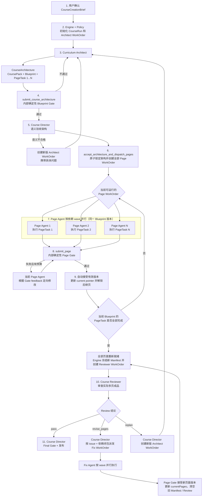
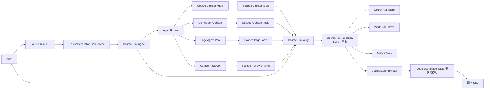
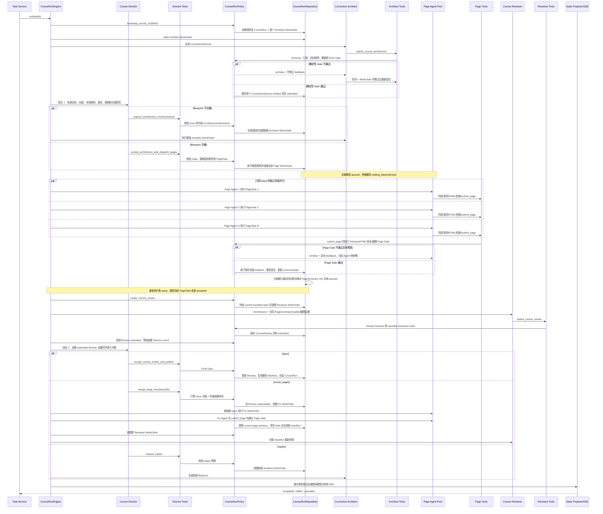
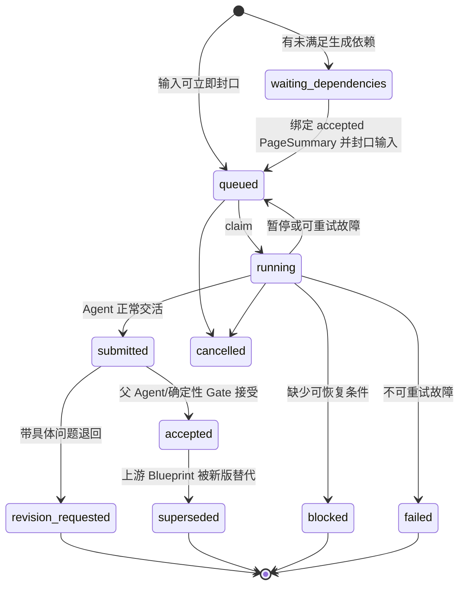
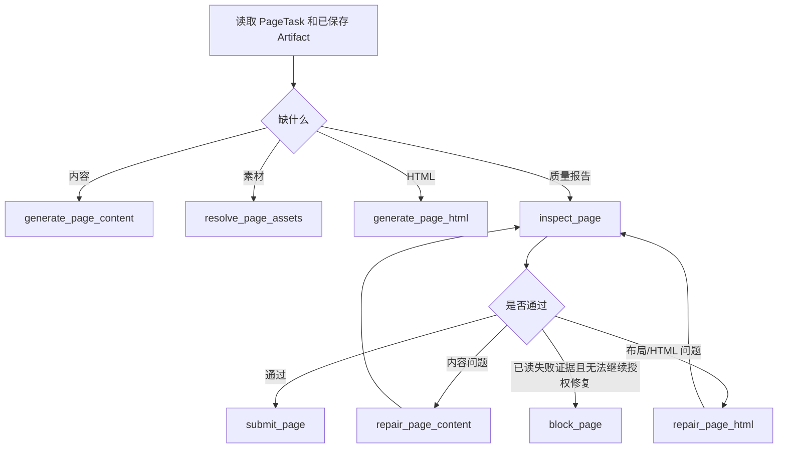

# 多 Agent 生课重构：技术架构与实施说明

## 1. 文档用途

这份文档直接用于指导“一句话生成多页 HTML 课程”的代码重构。

它回答五个问题：

1. 最终保留哪些模块，删除哪些模块；
2. 主 Agent 和子 Agent 如何派活、交活、验收和返工；
3. WorkOrder、Artifact、课程计划和审查报告怎样建模；
4. 任务如何并行、持久化、暂停、恢复和避免重复执行；
5. 按什么顺序改代码，怎样判断每个阶段已经完成。

当前状态：

- agent-v2 已成为新课程唯一生产执行链，现有 UI、Task API 和 SSE 合同保持不变；
- 四类 Agent、WorkOrder/Artifact、依赖 wave、两层 Gate、整课返工和重规划已落地；
- LangGraph、`createMinimalAgent()`、旧 Supervisor 和旧整课工作流已从生产代码删除；
- 原有 Writer/HTML/QA/Repair 等成熟能力已改名并收敛为 Model Step，不再伪装成 Agent；
- SQLite 恢复扫描、Next 启动单次恢复和显式 `npm run worker:course` 已实现；
- 本地自动化验证已完成；真实 Provider spike 已提供测试入口，但当前环境没有凭据，
  仍是部署前必须执行的外部验收项。
- 两轮独立审计发现的关键缺口已经收口：同课程数据库 claim、CourseStore
  checkpoint CAS/Task 围栏、跨进程 pause/cancel、Reviewer 大课程动态预算、
  Director/Reviewer 终态证据前置检查、直接追读 durable event 的跨进程 SSE、
  公开事件序号保真、Reviewer issue 精确证据、Page Builder 阻塞权限、返工目标
  实质变化、Reviewer blocked 机器资格、Director failed 机器资格和架构退回上限。

## 2. 最终架构结论

### 2.1 只保留四类 Agent

```text
Course Director       课程主 Agent
Curriculum Architect  课程策划 Agent
Page Builder × N      页面制作 Agent
Course Reviewer       整课审查 Agent
```

Pedagogy、Story、Visual 不再分别做 Agent。它们变成：

- `CourseBlueprint` 中的设计字段；
- Curriculum Architect 的规则和 Skill；
- Page Builder 和 Course Reviewer 的验收项。

Page Writer、Image Prompt、HTML Engineer、Page QA、Repair 也不再对外宣称 Agent。
它们保留为 Page Builder 可以调用的 Model Step、Tool 或 Validator。

### 2.2 只保留一套 Agent runtime

使用项目已经安装的 AI SDK 7：

```text
AI SDK ToolLoopAgent
```

它负责：

- 模型在一轮任务中多次调用工具；
- 根据工具结果决定下一步；
- 控制可用工具；
- 控制最大步骤数和停止条件。

不再保留生产 LangGraph。最终删除：

- `src/server/langgraph/course-generation/**`
- `@langchain/langgraph`
- 没有其他调用方后的 `@langchain/core`
- Graph stream mapper 和 Graph 专用测试

### 2.3 只保留一套可靠执行引擎

新增：

```text
CourseRunEngine
  ├─ CourseRun（当前版本根聚合）
  ├─ WorkOrderRepository
  ├─ ArtifactRepository
  ├─ AgentRunner
  ├─ CourseRunPolicy
  └─ CourseStateProjector
```

职责边界：

- Agent 决定“接下来做什么”；
- CourseRunPolicy 判断这个决定是否合法；
- CourseRunEngine 负责真正执行、并发、重试、暂停和恢复；
- CourseRun 是 active Architecture、current pages 和 current Review 的唯一权威；
- WorkOrder 是一次可独立 claim、重试和恢复的 Agent 工作单元；
- Artifact 是唯一生成产物；
- `CourseGenerationState` 只作为现有 API/UI 的读模型，不再作为执行真相。

### 2.4 API 和产品界面先保持不变

首轮重构不改变：

- `POST /api/courses/tasks`
- `GET /api/courses/tasks/[taskId]/events`
- 暂停、恢复和取消接口
- `/chat` 的任务进度
- `/course` 和 `/course/[courseId]`
- SSE 的 `snapshot / event / terminal`
- 课程播放器和 sandbox iframe

新运行时通过现有 Task Service 接入。前端不直接读取 WorkOrder、Agent 私有消息或模型
推理。

`CourseCreationBrief` 需要从 `src/features/keya` 的前端类型上移为共享 Zod Schema。
`agent-v2` 任务直接保存结构化 brief；`userPrompt` 继续保留为历史展示和旧任务兼容
字段，不能再作为新运行时唯一输入。

## 3. 当前代码的问题和处理方式

| 当前模块 | 当前问题 | 重构处理 |
| --- | --- | --- |
| `supervisor-routing.ts` | 固定 `if/else` 路由，却叫 Supervisor | 删除，由 Course Director + Policy 代替 |
| `createMinimalAgent()` | Specialist 基本 `maxSteps: 1` | 删除通用假 Agent 外壳 |
| Planner/Pedagogy/Story/Visual | 四次固定模型调用，信息重复 | 合并为 Curriculum Architect |
| `page-worker.ts` | 固定流水线超过 1000 行 | 拆为 Page Builder Agent + 页面工具 |
| Page QA/Repair | 只看单页，缺少整课验收 | 保留单页 Gate，新增 Course Reviewer |
| `course-workers-workflow.ts` | 页面并发和状态合并写死在旧状态对象中 | 改为 WorkOrder 调度和 Artifact 提交 |
| `CourseGenerationState` | 同时承担执行状态、产物、恢复和 UI | 降为兼容读模型 |
| LangGraph | 没有使用原生 checkpointer/subgraph，重复包裹旧流程 | 完成切换后删除 |
| Task Service | 同时选择两套 runtime | 最终只委托 CourseRunEngine |

必须保留并复用：

- Zod Schema；
- `CourseCreationBrief` 和 Reference Pack；
- 当前模型 Provider、模型路由和错误分类；
- HTML 合同、安全检查和交互协议；
- Playwright 三视口渲染与截图；
- 图片缓存、Provider 和 fallback；
- SQLite；
- trace fencing、暂停、恢复、取消；
- SSE 公开事件和现有前端投影。

## 4. 全局协作流程

### 4.1 业务执行顺序

课程架构必须先于所有 Page Agent。Curriculum Architect 一次性产出整课方案和每个
页面的 `PageTask`；Course Director 验收并锁定该版本后，才允许批量创建 Page
WorkOrder。



这个顺序是硬约束，不是 Prompt 建议：

1. 没有 accepted Blueprint，不能创建任何 Page WorkOrder；
2. Blueprint 必须同时包含整课目标、统一规则和全部 `PageTask[]`；
3. Director 必须先验收 Blueprint，再通过
   `accept_architecture_and_dispatch_pages` 原子锁定架构并派发页面；
4. 一批 Page WorkOrder 必须固定引用同一个 Blueprint/CoursePack 版本；
5. Page Agent 只能执行自己的 PageTask，不能自行增删页面或改整课目标；
6. 所有独立页面默认并行；只有 Architect 明确声明“生成依赖”时才按 wave 等待；
7. Reviewer 必须读取实际页面 Artifact，不能只看计划；
8. Fix WorkOrder 命中 Review issue 指定页面；如果该页是其他页的生成依赖，还必须
   包含其传递依赖闭包，避免后继页继续引用旧摘要；
9. 全局规划错误只能回到 Architect，不能让 Page Agent 各自猜着修；
10. 页面或 Blueprint 版本变化后，旧 Review 自动失效。

### 4.2 技术组件关系



职责边界：

- Course Director 只负责需要理解课程内容的目标、架构验收和 Review 决策；
- Curriculum Architect 负责先完成全局设计和逐页计划；
- CourseRunPolicy 只验证动作是否合法，不替 Agent 判断课程质量；
- CourseRunEngine 只负责可靠执行、依赖解锁、Page Gate、并发、重试、暂停和恢复；
- 子 Agent 不能互相调用；
- 所有委派必须生成 WorkOrder；
- 所有生成结果必须保存为不可变 Artifact；
- Agent 不能直接改任务状态或课程表；
- Agent 的所有写动作必须经过 Scoped Tool → Policy → Repository 事务；
- Engine 的机械调度动作同样必须经过 Policy，不能绕过领域规则。

## 5. 一次课程生成的真实时序

Course Director 不是一个持续十几分钟、不落盘的长调用。首个 Architect WorkOrder
由 Engine 初始化；Director 只在 ArchitectureSubmission 和 CourseReview 到达后按
“短回合”作语义决策。



Director 不能：

- 在 Architect 提交前创建页面任务；
- 在 Blueprint 未 accepted 时派发 Page Agent；
- 为 Page Agent 临时改写或补造 PageTask；
- 让不同 Page Agent 使用不同 Blueprint 版本；
- 让 Reviewer 修改 HTML；
- 在整课审查未通过时强制完成。

用户目标已在 `/chat` 确认，首个 Architect WorkOrder 由 Engine + Policy 确定性创建。
Director 只在需要语义判断的两个位置运行：是否接受整课架构、如何处理整课 Review。
页面 claim、依赖解锁、Page Gate、manifest 重算等机械动作也由 Engine 和 Policy
完成，不能为了“看起来像 Agent”额外消耗一次模型调用。

## 6. 核心领域模型

所有模型放在 `src/shared/course-schema`，继续使用 Zod 作为运行时边界。

### 6.1 CoursePack

`CoursePack` 是清洗后的课程事实底稿。它替代“每个 Agent 都读一遍原始资料”。

```ts
type CoursePack = {
  version: 1;
  courseId: string;
  topic: string;
  facts: Array<{
    id: string;
    text: string;
    sourceUsages: ReferenceUsage[];
  }>;
  terms: Array<{
    term: string;
    definition: string;
    sourceUsages: ReferenceUsage[];
  }>;
  examples: Array<{
    id: string;
    summary: string;
    sourceUsages: ReferenceUsage[];
  }>;
  constraints: string[];
};
```

约束：

- `sourceUsages` 复用现有 `ReferenceUsageSchema`，必须同时携带
  `referencePackId + chunkIds`；`chunk-01` 只在单个 Pack 内唯一，不能单独用字符串
  引用；
- 无来源的通用知识可以使用，但不能伪造来源；
- 原始文件内容不复制到 CoursePack；
- CoursePack 建议控制在能被所有页面安全复用的短上下文内。

### 6.2 CourseArchitecture

`CourseBlueprint` 替代：

- `CourseIntent`
- `CoursePlan`
- `CourseDesignBriefs`
- `PageWorkerBrief[]`

迁移期通过 adapter 投影回这些旧结构，不要求一次修改所有下游调用。

```ts
type CourseBlueprint = {
  version: 1;
  courseId: string;
  title: string;
  audience: {
    description: string;
    ageRange?: AudienceAgeRange;
    priorKnowledge: string[];
    difficulty: "beginner" | "intermediate" | "advanced";
  };
  language: "zh-CN" | "en-US" | "bilingual";
  objectives: Array<{
    id: string;
    outcome: string;
    evidence: string;
  }>;
  courseRules: {
    tone: string;
    terminology: string[];
    visualStyle: VisualStyle;
    styleTemplateId: string;
    visualDirection: string;
    teachingPattern: string[];
  };
};
```

```ts
type PageTask = {
  version: 1;
  pageId: string;
  order: number;
  title: string;
  pageType: PageType;
  interactionType: PageInteractionType;
  purpose: string;
  objectiveIds: string[];
  buildDependsOnPageIds: string[];
  teachingPoints: string[];
  learnerAction: string;
  assessment?: string;
  referenceUsages: ReferenceUsage[];
  functionalTemplateId: string;
  styleTemplateId: string;
  assetNeeds: PageAssetNeed[];
  acceptance: {
    requiredConcepts: string[];
    expectedLearnerOutcome: string;
    requiresInteraction: boolean;
    pageSpecific: string[];
  };
};
```

`buildDependsOnPageIds` 只表示“生成本页必须读取前置页实际产物”，不是普通学习顺序。
大部分页面只依赖 CourseBlueprint，因此可以并行。页面展示顺序只由 `order` 表达。

`CoursePack`、全局 `CourseBlueprint` 和全部 `PageTask[]` 必须只有一个版本真相，不能
同时把 `CourseBlueprint.pages` 和独立 `page_task` Artifact 都当权威。Architect 最终
提交一个不可变聚合：

```ts
type CourseArchitecture = {
  version: 1;
  courseId: string;
  coursePack: CoursePack;
  blueprint: CourseBlueprint;
  pageTasks: PageTask[];
};
```

Blueprint Gate 必须检查：

- objective ID 不重复；
- 每个目标至少有一个教学页面和一个证据/练习；
- 页面 order 连续、pageId 唯一；
- 页面引用真实目标、模板和资料；
- 页面依赖无环；
- 每页都有可观察的学习行为；
- 不需要故事、图片或互动时不强行生成；
- 全课语言、术语和视觉方向明确。

Architect 一次 Submission 只保存一个经过整体验证的 `course_architecture` Artifact：

```ts
type ArchitectureSubmission = {
  architectureRef: ArtifactRef & { kind: "course_architecture" };
};
```

不能让 Architect 分 N 次提交，从而避免 Page Agent 拿到不同版本的 CoursePack、
Blueprint 和 PageTask。

Director 接受的是整组 ArchitectureSubmission。
`accept_architecture_and_dispatch_pages` 必须在一个事务中：

1. 把 ArchitectureSubmission 设为当前 planning revision；
2. 按 `CourseArchitecture.pageTasks` 创建且只创建 N 个 Page WorkOrder；
3. 无生成依赖的页面直接设为 `queued`；
4. 有生成依赖的页面设为 `waiting_dependencies`。

创建时每个 WorkOrder 固定引用：

- 同一个 `course_architecture` version；
- 自己唯一的 `pageId`，对应 Architecture 内不可变的 PageTask；
- `buildDependsOnPageIds`，但此时不能伪造尚不存在的前置 `page_summary`。

当前置页通过 Page Gate 后，Repository 在一个事务中找到刚刚满足依赖的 WorkOrder，
绑定具体 accepted `page_summary` version、设置 `inputSealedAt`，再转为 `queued`。
WorkOrder 一旦进入 `queued` 或被 claim，输入引用不能再改变。

### 6.3 WorkOrder

WorkOrder 是唯一可以独立重试、暂停和恢复的工作单元。

CourseRun 是根，不把长生命周期课程伪装成普通 WorkOrder。每次需要 Director 作语义
决策时创建一个短 `director_round` WorkOrder；它成功执行一个领域命令后就结束。
`parentWorkOrderId` 只记录某次 Director 委派出的子任务，语义返工通过
`supersedesWorkOrderId` 保留版本替代链。

```ts
type WorkOrderKind =
  | "director_round"
  | "architect_course"
  | "build_page"
  | "review_course"
  | "fix_page";

type WorkOrderStatus =
  | "waiting_dependencies"
  | "queued"
  | "running"
  | "submitted"
  | "accepted"
  | "revision_requested"
  | "superseded"
  | "blocked"
  | "failed"
  | "cancelled";

type WorkOrder = {
  version: 1;
  lockVersion: number;
  id: string;
  taskId: string;
  courseId: string;
  parentWorkOrderId?: string;
  supersedesWorkOrderId?: string;
  causedByReviewIssueIds: string[];
  dependencyWorkOrderIds: string[];
  kind: WorkOrderKind;
  scope:
    | { type: "course" }
    | { type: "page"; pageId: string };
  status: WorkOrderStatus;
  idempotencyKey: string;
  inputArtifactRefs: ArtifactRef[];
  buildDependencyPageIds: string[];
  inputSealedAt?: string;
  checkpointArtifactRefs: ArtifactRef[];
  acceptance: string[];
  allowedTools: string[];
  budget: AgentBudget;
  executionAttempt: number;
  revision: number;
  leaseOwner?: string;
  leaseExpiresAt?: string;
  submission?: Submission;
  error?: WorkOrderError;
  createdAt: string;
  updatedAt: string;
};
```

```ts
type AgentBudget = {
  maxSteps: number;
  maxToolCalls: number;
  timeoutMs: number;
  maxOutputTokens: number;
};

type Submission = {
  workOrderId: string;
  status: "done" | "blocked";
  artifactRefs: ArtifactRef[];
  evidence: string[];
  issues: string[];
};
```

状态机：



`parentWorkOrderId` 只表达 Director → 子 WorkOrder 的委派树；
`supersedesWorkOrderId` 表达新版本替代哪个旧 WorkOrder；
`dependencyWorkOrderIds` 表达运行依赖；`causedByReviewIssueIds` 表达返工来源。四种
关系不能继续挤在一个 `parentId` 字段里。

语义返工创建新的 WorkOrder，不能覆盖旧 Submission。Provider 超时等执行故障可以
重试同一 WorkOrder，并增加 `executionAttempt`。

`director_round` 的 terminal Tool 与它触发的领域命令在同一事务提交：命令成功后该
round 直接 accepted；命令被 Policy 拒绝时 Tool 返回 feedback，Director 仍在本 round
内修正。Architect 和 Reviewer 的 submitted 必须等 Director 语义决定；Page 的
`submit_page` 因为已经内置完整确定性 Gate，可以在同一事务 submitted → accepted。

### 6.4 CourseRun 和 RunSummary

CourseRun 是独立根聚合，不塞进某个特殊 WorkOrder 的 payload。它保存唯一权威的当前
版本指针，并持有 run-level lease。Repository 使用 `lockVersion + traceId +
leaseOwner` 做 compare-and-set，禁止两个 Engine 同时调用 Director、重复 fan-out
页面或重复创建 Reviewer。

```ts
type CourseRun = {
  version: 1;
  id: string;
  taskId: string;
  courseId: string;
  lockVersion: number;
  phase: CourseRunPhase;
  traceId: string;
  leaseOwner?: string;
  leaseExpiresAt?: string;
  planningRevision: number;
  activeArchitecture?: {
    submissionWorkOrderId: string;
    architectureRef: ArtifactRef & { kind: "course_architecture" };
  };
  currentPages: Record<
    string,
    {
      sourceWorkOrderId: string;
      contentRef: ArtifactRef;
      assetsRef?: ArtifactRef;
      htmlRef: ArtifactRef;
      qualityRef: ArtifactRef;
      summaryRef: ArtifactRef;
    }
  >;
  stalePageIds: string[];
  currentManifestHash?: string;
  currentReview?: {
    workOrderId: string;
    artifactRef: ArtifactRef;
    inputManifestHash: string;
  };
  replanRound: number;
  courseRevisionRound: number;
};
```

规则：

- 只有 `CourseRunRepository` 可以更新这个根状态；
- Engine 执行调度和 Director 回合前必须 claim CourseRun lease，提交时再次校验
  traceId、leaseOwner 和 lockVersion；
- `activeArchitecture` 只能指向已 accepted 的整组 ArchitectureSubmission；
- 每个 pageId 最多有一个 current page pointer，历史 accepted Artifact 不会自动成为
  current；
- manifest hash 由 `CourseArchitectureRef + 按 order 排列的 current page Artifact
  refs` 计算，不能只 hash HTML；
- 页面开始返工时，issue 页面及依赖闭包进入 `stalePageIds`，旧 Review 立即
  `superseded`；
- `stalePageIds` 未清空时不能创建 Reviewer WorkOrder 或发布；
- 接受新版 Blueprint 时，旧分支 WorkOrder/Review 全部 superseded，并原子清空旧
  current page pointers。

Course Director 每回合只读取压缩状态：

```ts
type CourseRunPhase =
  | "planning"
  | "building"
  | "reviewing"
  | "revising"
  | "completed"
  | "failed"
  | "cancelled";

type RunSummary = {
  taskId: string;
  courseId: string;
  phase: CourseRunPhase;
  blueprint?: {
    workOrderId: string;
    status: WorkOrderStatus;
    artifactRef?: ArtifactRef;
    summary?: string;
    issues: string[];
  };
  pages: Array<{
    pageId: string;
    order: number;
    workOrderId?: string;
    status: WorkOrderStatus | "not_created";
    artifactRefs: ArtifactRef[];
    qualitySummary?: string;
    issues: string[];
  }>;
  review?: {
    workOrderId: string;
    status: WorkOrderStatus;
    artifactRef?: ArtifactRef;
    decision?: CourseReview["decision"];
    issueIds: string[];
  };
  remainingBudget: {
    replanRounds: number;
    courseRevisionRounds: number;
  };
};
```

`RunSummary` 不包含原始 HTML、完整 Prompt、模型消息和私有推理。需要核对具体证据时，
Director 通过受控工具读取摘要或 Artifact 证据。

### 6.5 Artifact

Artifact 是不可变产物。Agent 不能“原地修改上一版”。

```ts
type ArtifactKind =
  | "course_architecture"
  | "page_content"
  | "page_assets"
  | "page_html"
  | "page_quality"
  | "page_summary"
  | "course_review"
  | "course_manifest";

type ArtifactRef = {
  id: string;
  kind: ArtifactKind;
  courseId: string;
  pageId?: string;
  scopeKey: string; // "course" 或 "page:<pageId>"
  version: number;
  contentHash: string;
};

type CourseArtifact = ArtifactRef & {
  taskId: string;
  createdByWorkOrderId: string;
  payload: unknown;
  createdAt: string;
};
```

规则：

- 相同输入和相同内容哈希返回同一 Artifact；
- 修改内容必须创建新 version；
- WorkOrder 输入固定引用具体 version；
- Reviewer 审查的是明确的页面版本集合；
- 图片二进制继续由现有 Asset 系统保存，Artifact 只保存受控 Asset 引用；
- HTML 可以存在 Artifact payload，但不能进入 Agent 公开事件。

版本失效规则：

- Blueprint revision 未 accepted 前，不影响当前 accepted 版本；
- 新 Blueprint accepted 后，旧 Blueprint 分支和基于它的 Page/Review WorkOrder 标记
  `superseded`；
- replan 是全局变更，默认重新派发全部 PageTask，不能让不同页面混用两版全局规则；
- 普通 `revise_pages` 不改 Blueprint；Policy 先计算 Reviewer 点名页面及其
  `buildDependsOnPageIds` 传递依赖闭包，再创建 Fix WorkOrder；
- 闭包内页面标记 stale 并按拓扑 wave 重建，不能让后继页继续使用旧
  `PageSummary`；
- 新页面 Artifact accepted 后，旧页面 Artifact 保留审计但不进入 current manifest；
- CourseReview 的 `inputManifestHash` 只要与 current manifest 不同就不能发布。

### 6.6 CourseReview

```ts
type CourseReview = {
  version: 1;
  courseId: string;
  inputManifestHash: string;
  decision: "pass" | "revise_pages" | "replan";
  coverage: Array<{
    objectiveId: string;
    teachingPageIds: string[];
    assessmentPageIds: string[];
    status: "covered" | "weak" | "missing";
  }>;
  issues: Array<{
    id: string;
    scope: "course" | "page";
    pageId?: string;
    code: string;
    severity: "warning" | "error";
    message: string;
    targetArtifact?: "page_content" | "page_html";
    evidenceArtifactRefs: ArtifactRef[];
    suggestedAction: string;
  }>;
  summary: string;
};
```

Final Gate 必须验证：

- 当前 accepted Blueprint 的每个 `PageTask` 恰好有一个 current accepted 页面版本；
- 所有 current 页面固定引用同一个 planning revision，且 `stalePageIds` 为空；
- 每个 current 页面都来自当前架构分支的 accepted Page WorkOrder；
- 当前 CourseReview WorkOrder 仍为 submitted，且 decision 是 `pass`；
- Review 的 `inputManifestHash` 等于由当前 CourseArchitecture 和有序页面 Artifact
  refs 计算出的 manifest hash；
- Review 之后 current page pointer 和 active Architecture 都没有变化；
- `course_manifest` 固定引用最终版本。

Final Gate 不重新打开所有 content/assets/html/quality，也不重跑 Page Gate。HTML、
安全、互动和布局保证来自前面的 Page Gate、当前 accepted WorkOrder 和不可变
ArtifactRef；若要强化为发布时复检，必须另行实现，不能把文档当成已有代码。

历史 WorkOrder 即使曾经 accepted，只要已经 `superseded` 就不参与 Final Gate；因此
不能使用“所有 Page WorkOrder 都 accepted”这种会被返工历史干扰的条件。

## 7. 四类 Agent 的技术合同

### 7.1 Course Director

执行方式：

- AI SDK `ToolLoopAgent`；
- 每次只运行一个短回合；
- 每回合读取 `RunSummary`，不读取所有原始 HTML；
- 每次成功委派、接受、返工或发布后立即结束回合；
- CourseRunEngine 持久化后再开始下一回合。

允许工具：

```text
get_run_summary
inspect_architecture
inspect_course_review
request_architecture_revision
accept_architecture_and_dispatch_pages
assign_page_fixes
request_replan
accept_course_review_and_publish
fail_course
```

Director 的工具不直接运行子 Agent，只创建、验收或退回 WorkOrder。这样主 Agent
不会在一个未持久化的模型调用里等待整门课生成。

Director 真正需要判断的内容：

- Architecture 是否忠实满足已经确认的 Brief；
- Blueprint 的“目标 → 页面 → 学习行为 → 考核”矩阵是否闭合；
- 页面职责是否重复，难度和生成依赖是否合理；
- Reviewer 的问题应该局部返工、全局重规划还是发布。

页面 Submission 的 Schema/HTML/安全/截图 Gate、依赖解锁、manifest 重算和创建
Reviewer WorkOrder 都是确定性动作，由 Engine + Policy 执行，不调用 Director 模型。

证据读取是运行时硬条件，不只是 Prompt：

- 架构回合的接受、退回和 `fail_course` 都必须先成功调用
  `inspect_architecture`；
- Review 回合的发布、修页、重规划和 `fail_course` 都必须先成功调用
  `inspect_course_review`。

证据已读只是必要条件，不是失败授权：

- 合法架构和 `pass` Review 下 `fail_course` 不在 active tools，执行层也拒绝；
- 架构语义退回全任务最多 2 次；第三次退回命令先返回机器预算错误，才在同一
  Director 回合开放失败动作；
- `revise_pages` / `replan` 只有持久化轮次预算耗尽时才允许失败；
- failed 的公开错误码只采用机器资格原因，不采信模型输入中的 code 或 evidence。

首版不实现“任务运行到一半再追问用户”。必要信息由现有 `/chat`
`CourseCreationBrief` 在创建任务前收集；运行后遇到无法处理的关键缺失，Director
明确失败并返回可操作错误。

### 7.2 Curriculum Architect

目标：

```text
CourseCreationBrief + ReferencePack
  → CourseArchitecture（CoursePack + CourseBlueprint + PageTask[]）
```

当前首张 `architect_course` WorkOrder 的 `inputArtifactRefs` 为空。结构化
`creationBrief` 和 `referencePacks` 固定保存在 TaskRecord，由 Engine 按当前
task/trace 传给 Architect；修订回合才会额外引用旧架构等 Artifact。若以后要求所有
Agent 输入都只靠 ArtifactRef 恢复，需要先把 Brief/ReferencePack 产物化，不能把当前
实现描述成已经完成。

允许工具：

```text
search_references
search_templates
validate_course_architecture
submit_course_architecture
```

它可以自主决定：

- 是否需要读取资料；
- 读取哪些 chunk；
- 使用哪些功能和样式模板；
- 是否需要故事线、图片、图表和互动；
- 页面数量和真实生成依赖。

它不能：

- 生成 HTML；
- 调用图片 Provider；
- 创建 Page WorkOrder；
- 修改任务状态。

### 7.3 Page Builder

目标：

```text
CourseArchitecture + 当前 PageTask + 精简 CourseMap + 前置 PageSummary
  → 可交付页面 Artifact 集
```

每个 Page WorkOrder 必须携带：

- 整课目标和统一验收标准；
- 自己唯一的 PageTask；
- 仅含 pageId、标题、职责、目标和顺序的精简 CourseMap；
- 统一术语、视觉和教学规则；
- 已封口的前置 accepted PageSummary；
- 本页被授权使用的资料引用。

它不读取其他页面的完整 HTML，也不能靠猜测补全尚未 accepted 的前置页。

允许工具：

```text
read_page_context
search_references
generate_page_content
resolve_page_assets
generate_page_html
inspect_page
repair_page_content
repair_page_html
submit_page
block_page
```

这些工具优先复用现有实现：

| 新 Tool | 复用当前实现 |
| --- | --- |
| `generate_page_content` | `runPageWriterAgent`，后续改名 Model Step |
| `resolve_page_assets` | `runImageAssetWorkflow` |
| `generate_page_html` | `runHtmlEngineerAgent`，后续改名 Model Step |
| `inspect_page` | HTML Gate + `runPageQAAgent` + Playwright |
| `repair_page_content` | 当前 DSL Repair |
| `repair_page_html` | 当前 HTML Repair |

Page Builder 的循环：



规则：

- Page Builder 只能修改自己 scope 内的 pageId；
- 每个工具成功后立即保存 Artifact 和 WorkOrder checkpoint；
- 不需要素材时跳过素材调用；
- 内容问题不能只改 CSS 掩盖；
- 布局问题不能无理由重写课程内容；
- 普通 Provider、内容、素材或 HTML 工具失败不能直接 `block_page`；
- `block_page` 前必须读过当前 attempt 的上下文，并已有当前失败
  `PageQuality`；只有修复被明确拒绝、有效质量修订预算耗尽，或确定性修复计划无法
  授权任何可行修复时才允许 blocked；
- 缺少 WorkOrder 已封口的 ReferencePack/Chunk 属于确定性输入错误，在启动 Agent
  前失败，不能让模型用 `block_page` 掩盖；
- transient Provider 调用重试不算质量修订；
- 前置页只提供已接受的 `PageSummary`，不广播完整 HTML。

Fix WorkOrder 还要满足更严格的新旧版本边界：

- Reviewer 的 page issue 必须用 `targetArtifact: page_content | page_html`
  给出机器可执行的修订目标，course issue 禁止携带该字段；
- 旧 content/assets/html/quality/summary 只作为封口 baseline，不进入新 WorkOrder
  的 checkpoint；checkpoint 只能引用当前 WorkOrder 创建的本页 Artifact；
- 内容定向返工先生成新 content，再重建素材、HTML 和 Quality；HTML 定向返工可复用
  baseline content/assets，但必须生成新 HTML 和新 Quality；
- 依赖闭包页固定为 `dependency_refresh → page_content`，不能原样复用旧内容；
- `submit_page` 前必须读过上下文、生成机器指定的目标 Artifact，并有当前
  `PageQuality`。旧版本原样提交或只有说明文字都不能交活。

### 7.4 Course Reviewer

输入：

- accepted CourseBlueprint；
- 当前页面 manifest；
- 每页 PageSummary；
- Page Quality；
- 必要页面的截图和受控内容摘要。

允许工具：

```text
read_course_matrix
read_page_summary
read_page_quality
inspect_page_evidence
validate_course_review
submit_course_review
block_course_review
```

它检查：

- 目标覆盖；
- 讲解、练习和目标是否对应；
- 页面重复、断层和难度跳跃；
- 术语、事实、例子和视觉一致性；
- 互动是否真的能完成；
- 首页承诺和结尾总结是否对应。

它不能：

- 修改页面；
- 调用 Repair；
- 直接创建 Fix WorkOrder；
- 绕过确定性 Page Gate。

Reviewer 不能抽样：

- 先读取一次课程矩阵；
- `read_page_summary` 和 `read_page_quality` 都必须分页读到末尾；
- `validate_course_review`、`submit_course_review` 和
  `block_course_review` 共用同一证据进度 Gate；
- 每批最多 20 页，预算和 timeout 按 manifest 页数增长；
- manifest 以精确 hash 封口全部页面 ArtifactRef，WorkOrder 只直接引用
  Architecture 和 Manifest，避免 200 页课程超过 `inputArtifactRefs` 上限。
- 页面级 issue 至少引用该页 current `page_summary` 或 `page_quality`；课程级 issue
  只能引用 current `course_architecture`、`page_summary` 或 `page_quality`。
  `page_html`、`page_content` 和 `page_assets` 不是 Reviewer 已读取的受控证据，
  不能拿来凑 evidence。
- 页面级 issue 必须同时给出 `targetArtifact: page_content | page_html`；课程级
  issue 禁止携带该字段，避免 Director 从自然语言里猜修订边界。
- `block_course_review` 还需要额外的机器资格：全量证据读完后，
  PageSummary 的 `courseId/order` 与冻结 manifest 冲突，或 PageSummary 内的质量
  投影 `overallScore/decision/issueCodes` 与对应 PageQuality 冲突。PageQuality 本身
  不提供 course/order。健康证据下工具隐藏且执行层拒绝；少读证据不能 blocked。

## 8. AgentRunner

新增统一 `AgentRunner`，所有 ToolLoopAgent 都经过这一层。

```ts
type AgentRunnerContext = {
  taskId: string;
  courseId: string;
  traceId: string;
  workOrder: WorkOrder;
  abortSignal?: AbortSignal;
  executionGuard: {
    fatalError?: Error;
    budgetMeter: AtomicBudgetMeter;
  };
};

type AgentRunnerResult =
  | { status: "submitted"; submission: Submission }
  | { status: "blocked"; submission: Submission }
  | { status: "failed"; error: WorkOrderError };
```

伪代码：

```ts
const agent = new ToolLoopAgent({
  model: resolveAgentModel(workOrder.kind, workOrder.executionAttempt),
  instructions: buildAgentInstructions(workOrder),
  tools: createScopedTools(workOrder),
  toolChoice: "required",
  stopWhen: [
    stepCountIs(workOrder.budget.maxSteps),
    successfulSubmission(),
    explicitBlock(),
  ],
  prepareStep: ({ stepNumber, steps, messages }) =>
    prepareBoundedAgentStep({
      workOrder,
      stepNumber,
      steps,
      messages,
    }),
});
```

必须遵守：

- 普通文本回答不算完成；
- 只有通过 Zod 校验的 `submit_*` 或 `block_*` ToolResult 才能结束；
- `prepareStep` 根据当前 Artifact 限制 `activeTools`；
- `activeTools` 只是减少模型看到的工具，不是安全边界；每次 execute 仍必须重新验证
  workOrder、scope、trace、lease 和权限；
- 工具总数、模型步骤、总超时和输出 tokens 都受 WorkOrder budget 控制；
- AI SDK 同一步可能返回多个 tool call 并用 `Promise.all` 执行；BudgetMeter 必须先原子
  reserve，所有写工具必须用 CAS/事务防并发冲突；
- AI SDK 会把 tool execute 抛出的错误包装成 `tool-error` 并可能继续循环；权限越界、
  trace fencing、abort 等 fatal 错误必须写入 executionGuard，由自定义 stop condition
  立即停，`generate()` 返回后 AgentRunner 再抛原错误；
- 不依赖只在部分 AI SDK 版本存在的 `repairToolCall` 或 experimental callback 作为
  正确性条件；无效输入通过 ToolResult feedback 在下一步修正；
- 工具包装器负责记录 tool start/result；
- Agent 私有消息和推理不进 SQLite 课程读模型和 SSE；
- `generate()` 返回后必须重新从 Repository 读取 WorkOrder，确认已产生合法 terminal
  submission；不能相信模型普通文本或 `hasToolCall()`。

标准 ToolResult：

```ts
type ToolResult<T> =
  | {
      ok: true;
      committed: boolean;
      terminal: boolean;
      summary: string;
      data: T;
      artifactRefs?: ArtifactRef[];
    }
  | {
      ok: false;
      committed: false;
      terminal: false;
      code: string;
      message: string;
      retryable: boolean;
      feedback?: string[];
    };
```

处理原则：

- 可修复的校验错误返回 `ok: false`，让 Agent 根据 feedback 调整；
- 取消、权限越界、trace fencing 失败直接抛错并停止；
- 原始 Provider 错误写服务端日志，对 Agent 和 SSE 只给分类后的安全信息；
- 只有 `ok: true + committed: true + terminal: true` 才能触发正常停止；
- `submit_*` 校验失败必须返回 `committed:false`，不能触发停止条件，Agent 可以继续
  修正。

## 9. Tool 权限与隔离

工具不是一个全局对象直接交给所有 Agent。创建工具时必须闭包绑定：

- taskId；
- courseId；
- workOrderId；
- pageId scope；
- input Artifact version；
- traceId；
- abortSignal；
- budget meter。

权限矩阵：

| 工具能力 | Director | Architect | Page Builder | Reviewer |
| --- | ---: | ---: | ---: | ---: |
| 创建子 WorkOrder | 是 | 否 | 否 | 否 |
| 读取原始 Reference chunk | 否 | 是 | 仅授权集合 | 否 |
| 读取 Blueprint | 摘要 | 是 | 当前页相关 | 是 |
| 生成页面内容 | 否 | 否 | 是 | 否 |
| 调用图片 | 否 | 否 | 是 | 否 |
| 生成/修补 HTML | 否 | 否 | 是 | 否 |
| 读取截图证据 | 摘要 | 否 | 当前页 | 按需 |
| 提交整课审查 | 否 | 否 | 否 | 是 |
| 接受/退回 WorkOrder | 是 | 否 | 否 | 否 |
| 发布课程 | 是 | 否 | 否 | 否 |

任何工具调用如果出现下列情况，直接拒绝：

- pageId 不等于 WorkOrder scope；
- Artifact 不在 input/checkpoint refs 中；
- 使用了未授权 Reference chunk；
- 修改了已 accepted 的 Artifact；
- review 基于过期 manifest；
- tool name 不在 `allowedTools` 中。

## 10. CourseRunEngine

`CourseRunEngine` 取代当前 Graph 和手写 Supervisor workflow。

```ts
type CourseRunEngine = {
  run(taskId: string, context: AgentRuntimeContext): Promise<CourseGenerationState>;
};
```

Task Service 继续拥有公开的 pause/resume/cancel 生命周期和 AbortController。
CourseRunEngine 读取任务状态、响应 AbortSignal，并在退出前释放或取消 WorkOrder，
不能再建立第二套任务控制状态。

主循环只负责可靠执行，不负责课程语义：

```text
加载任务
→ 恢复过期 lease
→ 有 queued 子 WorkOrder：按依赖和并发执行
→ 有 submitted 结果或需要下一步：运行一次 Director 回合
→ 提交事务
→ 重建 CourseGenerationState
→ 发布公开事件
→ 直到 completed / failed / cancelled
```

### 10.1 Director 动作前置条件

CourseRunPolicy 使用确定性规则约束 Director，但不代替语义判断：

| Director 动作 | 必须满足 | 结果 |
| --- | --- | --- |
| `request_architecture_revision` | Architect 已 submitted，提供具体 issue，且全任务架构语义退回少于 2 次 | 旧单 revision_requested，新建 revision；第三次返回确定性预算错误 |
| `accept_architecture_and_dispatch_pages` | Architect 已 submitted；整组 Gate 通过；Director 已检查目标矩阵、页面职责和依赖 | 原子激活 ArchitectureSubmission，并按全部 PageTask 创建 N 个同版 Page WorkOrder |
| `assign_page_fixes` | Review 为 revise_pages，issueId/pageId 真实 | 计算命中页面及传递依赖闭包，旧 Review 失效，创建 Fix WorkOrder |
| `request_replan` | Review 为 replan，且未超过一次 | 创建新版 Architect WorkOrder；新版 accepted 后旧页面分支 superseded |
| `accept_course_review_and_publish` | Review submitted 且 decision 为 pass；Final Gate 通过 | 原子接受 Review、复用创建 Reviewer 时已写入的 CourseManifest 并完成任务 |
| `fail_course` | 已 inspect，且机器资格 Gate 确认架构退回、页面返工或 replan 的持久化预算耗尽 | 使用机器错误码进入 failed；合法架构、pass Review 或模型自报原因均拒绝 |

Policy 不能判断“课程内容好不好”；它只验证引用、状态、权限、预算和先后条件。内容是否
该接受、局部返工还是重新规划，由 Director 根据 Submission 和 Review 证据决定。

Engine 可执行但不调用模型的确定性动作：

| Engine 动作 | 必须满足 | 结果 |
| --- | --- | --- |
| `bootstrap_course_run` | Task 已创建且 brief 通过共享 Schema；CourseRun 不存在 | 创建 CourseRun 和首个 Architect WorkOrder |
| `commit_page_submission` | `submit_page` 引用当前架构；Page Gate 全部通过 | 原子保存 Artifacts、接受该页、更新 current pointer 和 PageSummary |
| `unlock_page_dependencies` | 某 waiting WorkOrder 的全部前置页已有 current accepted PageSummary | 绑定具体 refs、封口输入并转 queued |
| `create_current_review` | 当前 Blueprint 的所有 PageTask 有唯一 current accepted 页面；无 stale 页 | 冻结 manifest hash 并创建 Reviewer WorkOrder |

### 10.2 页面调度

- CourseRunEngine 不能自行推导 PageTask；只有 Director 的合法
  `accept_architecture_and_dispatch_pages` 动作可以首次派发；
- 该动作在一个事务中消费 ArchitectureSubmission，并为全部
  `CourseArchitecture.pageTasks` 建立 WorkOrder；
- 相同 `taskId + kind + pageId + blueprintVersion + pageTaskVersion + revision`
  只能创建一次；
- 每个 Page WorkOrder 创建时固定同一 CourseArchitecture 版本、自己的 pageId 和
  buildDependencyPageIds；
- 无依赖页创建时封口输入并进入 `queued`；依赖页先进入
  `waiting_dependencies`，不能提前引用不存在的 PageSummary；
- 仅真实 `buildDependsOnPageIds` 阻塞生成；
- 无生成依赖页面全部进入同一批 Promise Pool 并行执行；
- 页面通过确定性 Page Gate 后立即逐页 accepted，不能等待“整批页面一起验收”；
- 每次页面 accepted 都在同一事务中解锁刚刚满足依赖的后继页，绑定具体 accepted
  `PageSummary` 后按最少 wave 执行；
- 并发继续使用当前配置，最大 5；
- 某页失败不覆盖其他页面；
- 页面 Artifact 独立提交，不再合并整个可变课程对象。

### 10.3 暂停和恢复

暂停：

1. Task Service 用 TaskStore CAS 把任务标记为 paused；
2. 同进程通过 AbortSignal 立即终止；其他进程会在 WorkOrder 边界或下一次 Tool 前
   重读 TaskRecord 并停止；
3. CourseStore 的 Task fence 使旧 runner 无法再写 checkpoint；
4. 已成功 Tool 产物继续留在 Artifact；
5. Engine 在 `finally` 释放自己持有的 WorkOrder/CourseRun lease，running WorkOrder
   回到 queued；
6. pause 提交后再只读检查当前 taskId 的 CourseRun；如果它已经在竞态窗口提交终态，
   立即通过独立 `reconcile()` 投影并对齐 CourseStore/TaskRecord，而不是留下永久
   paused；
7. 不删除 `checkpointArtifactRefs`。

恢复：

1. Task Service 先确认没有 durable cancel intent，且 CourseRun/CourseStore 不是终态，
   再原子生成新 traceId 并把 paused 改回 queued；
2. CourseRunEngine 读取 accepted/submitted/queued WorkOrder；
3. AgentRunner 从 `checkpointArtifactRefs` 继续；
4. 已落库的业务 Artifact 和 WorkOrder 通过 current 指针、业务键和 CAS 避免重复提交；
5. 已 accepted 页面不会重跑。
6. 如果旧 trace lease 尚未释放，新的运行尝试不会失败终态化，而是把 TaskRecord
   原子退回 queued，等待恢复 worker 重试。
7. 恢复扫描不会无条件跳过 paused Task；paused Task 若已有同 taskId 的终态
   CourseRun，先走只读投影和 `reconcile()` 收口终态，且不套用 cancel 语义。

取消：

1. TaskStore 在 SQLite 写锁内重读 TaskRecord 并登记 `cancel` intent；
2. intent 落库后，resume、旧 runner 的 Task CAS 和普通 CourseStore checkpoint
   都会被数据库围栏拒绝；
3. CourseRun、CourseStore 和 TaskRecord 再依次收口为 cancelled；只有携带该 intent
   的终态 Task CAS 可以清除 intent 和课程执行 claim；
4. 如果进程在中途退出，恢复扫描会优先继续执行 cancel，而不是把任务重新运行；
5. 如果 resume 已先换成新 trace、CourseRun 尚未 adopt，cancel intent 可以授权
   CourseRun 在取消事务中对齐到新 trace，避免 `CourseRun cancelled + Task queued`。
6. CourseStore 中相同 `courseId` 的旧 attempt 终态不属于新 Task；只有相同 trace，
   或当前 taskId 的终态 CourseRun 明确投影出的结果，才可作为当前 attempt 的终态。
7. 同 trace 的 CourseStore 终态与权威 CourseRun 状态不一致时，不能“谁先写谁赢”；
   在相应控制围栏下以 CourseRun 投影对齐 CourseStore 和 TaskRecord。

### 10.4 进程异常

- running WorkOrder 必须有 lease；
- lease 到期后可以被重新 claim；
- 同一 WorkOrder 的相同 Artifact 内容幂等；不同修订 WorkOrder 即使内容相同也生成
  新版本，确保来源关系正确；
- WorkOrder 更新使用 expected status/version；
- 旧进程提交时如果 leaseOwner 或 traceId 不匹配，拒绝写入；
- 不要求从 ToolLoopAgent 某个 token 或思考步骤原地恢复；
- 进程异常后最多重跑当前 Agent 回合，不重跑已 accepted 的业务产物；
- 外部图片 Provider 若不支持幂等键，仍存在“Provider 已成功、缓存尚未落库时进程
  崩溃”的重复计费窗口，当前实现不能宣称通用 exactly-once。

### 10.5 Worker 唤醒

SQLite 持久化不等于进程异常后会自动继续。当前 API 的 Next.js `after()` 只能作为
“立即唤醒”，不能当 durable queue。

当前恢复入口：

- `src/instrumentation.ts` 在 Next Node 进程启动时只扫描一次，不创建隐藏定时器；
- `scripts/course-task-worker.ts` 通过 `npm run worker:course` 常驻轮询 queued task 和
  lease 已过期的 running task；
- API 创建/恢复任务后可以额外立即唤醒，但重复唤醒由 CourseRun lease 去重；
- 如果生产部署是不能保证后台执行的 serverless，Worker 必须独立部署，或由 cron
  调用恢复入口；不能宣称仅靠 `after()` 可跨进程自动续跑。

## 11. 持久化设计

继续使用同一个 SQLite 数据库。

新增五张 agent-v2 运行时窄表，并为旧 Task 层增加课程执行权表和控制意图表，不引入新的
数据库。`course_runs` 是 active Architecture、current page 和 current Review
指针的唯一权威：

```sql
CREATE TABLE course_execution_claims (
  course_id TEXT PRIMARY KEY,
  task_id TEXT NOT NULL UNIQUE,
  claimed_at TEXT NOT NULL,
  updated_at TEXT NOT NULL
);
```

活动 Task 创建和 claim 获取位于同一事务。queued/running/paused 都持有 claim；
Task 进入 completed/failed/cancelled 后在同一 TaskStore 事务释放。进程启动时会
清理坏 claim，并为历史活动 Task 补齐 claim。Task Service 不再维护另一份
`courseClaims` 内存真相；SQLite claim 是唯一权威，避免另一实例已释放 durable claim
后，本实例仍被陈旧 Map 假占用。

```sql
CREATE TABLE course_task_control_intents (
  task_id TEXT PRIMARY KEY,
  course_id TEXT NOT NULL,
  action TEXT NOT NULL CHECK (action IN ('cancel')),
  trace_id TEXT NOT NULL,
  requested_at TEXT NOT NULL
);
```

cancel intent 是跨 CourseRun、CourseStore、TaskRecord 三个聚合的持久化围栏，不是
前端状态。它把取消的多步提交变成 fail-closed：中途崩溃时任务不能恢复为 queued，
恢复 worker 只会继续收口取消。

```sql
CREATE TABLE course_runs (
  id TEXT PRIMARY KEY,
  task_id TEXT NOT NULL UNIQUE,
  course_id TEXT NOT NULL,
  phase TEXT NOT NULL,
  trace_id TEXT NOT NULL,
  lock_version INTEGER NOT NULL,
  payload TEXT NOT NULL,
  lease_owner TEXT,
  lease_expires_at TEXT,
  created_at TEXT NOT NULL,
  updated_at TEXT NOT NULL
);

CREATE INDEX course_runs_phase_lease_idx
  ON course_runs(phase, lease_expires_at);
```

```sql
CREATE TABLE course_work_orders (
  id TEXT PRIMARY KEY,
  task_id TEXT NOT NULL,
  course_id TEXT NOT NULL,
  parent_work_order_id TEXT,
  supersedes_work_order_id TEXT,
  kind TEXT NOT NULL,
  scope_key TEXT NOT NULL,
  status TEXT NOT NULL,
  lock_version INTEGER NOT NULL,
  idempotency_key TEXT NOT NULL UNIQUE,
  payload TEXT NOT NULL,
  lease_owner TEXT,
  lease_expires_at TEXT,
  created_at TEXT NOT NULL,
  updated_at TEXT NOT NULL
);

CREATE INDEX course_work_orders_task_status_idx
  ON course_work_orders(task_id, status, updated_at);

CREATE INDEX course_work_orders_parent_idx
  ON course_work_orders(parent_work_order_id, created_at);
```

```sql
CREATE TABLE course_artifacts (
  id TEXT PRIMARY KEY,
  task_id TEXT NOT NULL,
  course_id TEXT NOT NULL,
  page_id TEXT,
  scope_key TEXT NOT NULL,
  kind TEXT NOT NULL,
  version INTEGER NOT NULL,
  content_hash TEXT NOT NULL,
  created_by_work_order_id TEXT NOT NULL,
  payload TEXT NOT NULL,
  created_at TEXT NOT NULL,
  UNIQUE(task_id, course_id, scope_key, kind, version),
  UNIQUE(
    task_id, course_id, scope_key, kind, content_hash,
    created_by_work_order_id
  )
);

CREATE INDEX course_artifacts_course_kind_idx
  ON course_artifacts(course_id, kind, scope_key, version DESC);
```

```sql
CREATE TABLE course_tool_operations (
  id TEXT PRIMARY KEY,
  work_order_id TEXT NOT NULL,
  execution_attempt INTEGER NOT NULL,
  agent_step_number INTEGER NOT NULL,
  tool_ordinal INTEGER NOT NULL,
  tool_call_id TEXT,
  tool_name TEXT,
  input_hash TEXT NOT NULL,
  logical_operation_key TEXT,
  status TEXT NOT NULL,
  output_artifact_refs TEXT NOT NULL,
  safe_summary TEXT,
  usage TEXT,
  started_at TEXT NOT NULL,
  completed_at TEXT,
  UNIQUE(work_order_id, execution_attempt, agent_step_number, tool_ordinal),
  UNIQUE(logical_operation_key)
);

CREATE INDEX course_tool_operations_order_idx
  ON course_tool_operations(
    work_order_id,
    execution_attempt,
    agent_step_number,
    tool_ordinal
  );
```

Tool operation ledger 当前只保存工具名、输入哈希、公开结果摘要和 Artifact 引用，
不保存原始参数、大段 HTML、模型消息或 chain-of-thought。它用于审计、定位和计算
恢复起点，不是通用的工具重放器。

Repository 命令、WorkOrder 业务键、Artifact 版本和图片缓存分别承担当前已实现的
重复提交防护。表中预留了 `logical_operation_key`，但 AgentRunner 尚未用它拦截并
重放任意外部工具；因此不能仅凭这张表宣称所有 Provider 副作用都 exactly-once。

```sql
CREATE TABLE course_run_events (
  id TEXT PRIMARY KEY,
  task_id TEXT NOT NULL,
  sequence INTEGER NOT NULL,
  trace_id TEXT NOT NULL,
  type TEXT NOT NULL,
  stage TEXT,
  page_id TEXT,
  agent TEXT,
  safe_summary TEXT NOT NULL,
  payload TEXT NOT NULL,
  created_at TEXT NOT NULL,
  UNIQUE(task_id, sequence)
);

CREATE INDEX course_run_events_task_sequence_idx
  ON course_run_events(task_id, sequence);
```

`course_run_events` 是 SSE replay 的耐久事件源。表内 `safeSummary` 用于公开摘要，
但原始 `payload` 是内部 `unknown`，不能直接从 Store 行透传到浏览器。Projector 和
`CoursePublicEventReader` 必须按公开事件合同选择字段、过滤 revision 并再次清洗。
sequence 在 CourseRunRepository 事务内按 taskId 全局分配，不能由并行 Page Agent
在内存里自行递增。

保留现有表：

- `course_tasks`：HTTP 任务生命周期和创建参数；
- `courses`：`CourseGenerationState` 兼容读模型；
- assets/cache 相关表：图片和缓存；
- conversations/messages：聊天。

### 11.1 事务边界

`CourseRunRepository` 统一处理 agent-v2 业务事实的事务。架构、页面、Review、返工和
发布等业务命令会在同一事务内提交它们需要的：

0. 在同一个 `BEGIN IMMEDIATE` 写锁内校验 TaskRecord 的
   `taskId + courseId + traceId + status=running`，并确认不存在 cancel intent；
1. 写 Artifact；
2. 更新 WorkOrder checkpoint/status 和根 CourseRun；
3. 追加对应的 `course_run_events`。

EventBus 只能在事务提交成功后发布。

但不能把这理解成“任何事件失败都会回滚此前所有状态”。WorkOrder claim/renew/release
和 ToolOperation ledger 是各自的短事务；`work_order_claimed` 等生命周期事件可能在
claim 已提交后单独追加。此时状态表是权威，事件缺失不会倒退已领取的 WorkOrder。
只有明确在同一 Repository 业务事务里追加的事件，写失败时才与对应业务状态一起回滚。

这个 guard 覆盖 bootstrap 之后的架构提交/验收、Page checkpoint/accept/block、
Review、publish、fix/replan/fail、Director round、claim/renew 和 standalone event。
取消、终态 reconcile 和 lease release 是少数显式控制路径。cancel intent 先提交时，
旧 runner 的整个业务事务原子失败，不能留下半个 Artifact、WorkOrder 或 Event；
旧业务事务先提交时，取消随后按已提交事实收口。

兼容读模型和 Task 生命周期由 Task Service 在 Repository 事务后写入：

1. Projector 从已提交的 Repository 事实重建 `CourseGenerationState`；
2. `CourseStore.save()` 使用调用方刚读取的旧 payload 做 CAS；
3. 同一条 CourseStore SQL 同时核对 TaskRecord 的 taskId、traceId 和允许 status；
4. 再用 TaskStore CAS 更新任务状态；
5. 最后发布 EventBus。

这两层不是一个跨表大事务，但 agent-v2 事实可重放，CourseStore/TaskStore 有 CAS 和
trace fencing；恢复 worker 能把已提交事实重新投影，旧 runner 不能在 pause/cancel
之后覆盖 checkpoint。

当前项目使用 `node:sqlite` 的 `DatabaseSync`，事务回调必须是纯同步 SQL。禁止把
`async () => { await ... }` 传给 `runInTransaction()`，否则 Promise 完成前事务已经
提交。Repository 必须持有同一个 DatabaseSync 连接完成以上写入；模型和 Provider
调用必须在事务外执行，提交时再做 fencing/CAS。

`course_run_events` 同时是公开事件投影源和 SSE replay 真相。SSE Route 通过
`CoursePublicEventReader.listAfter(afterSequence)` 每 500 ms 直接增量读取这张表，
EventBus 只负责当前进程的低延迟唤醒；CourseStore/TaskStore 只提供 snapshot 和终态
判断，不承担工具级事件重放。

Projector 保留数据库分配的 durable sequence，即使过滤旧 revision 后序号存在空洞也
不能重编号。Reader 分开维护“已扫描 raw sequence”和“已发送 public sequence”，
避免私有或旧分支事件造成重复。replan 时选择最新且未 inactive 的 Architect
WorkOrder；它自己的 claimed/tool/submitted 事件在旧 Architecture 仍 active 时也能
实时出现，旧 revision 的其他业务事件仍被过滤。SSE ID 编码
`traceId + durable sequence`；pause/resume 更换 trace 后不会让旧游标吞掉新事件。

## 12. CourseGenerationState 兼容投影

迁移期间，现有前端继续消费 `CourseGenerationStateSchema version: 1`。

Task 记录继续保持现有 `version: 1`，通过 `source` 做可判别联合，避免破坏旧记录：

```ts
type CourseTaskRecordV1 = {
  version: 1;
  source: "workflow" | "langgraph";
  userPrompt: string;
  // 其余历史字段
};

type AgentV2CourseTaskRecord = {
  version: 1;
  source: "agent-v2";
  creationBrief: CourseCreationBrief;
  userPrompt: string; // 只用于历史展示和旧 UI
  // 其余现有控制字段
};
```

`CourseTaskRuntimeSourceSchema` 增加 `agent-v2`，但保留旧值只读；新任务不再产生
workflow/langgraph。`CourseGenerationStageSchema` 增加 `course_review`，Timeline
迁移期同时识别 `supervisor_decision` 和 `director_decision`。

新增唯一写入者：

```text
CourseStateProjector
```

投影规则：

| 新架构 | 旧读模型字段 |
| --- | --- |
| CourseArchitecture | `intent / outline / briefs / pageWorkerBriefs` |
| accepted Page Artifact | `pages[].content/assets/htmlOutput/qualityReport` |
| WorkOrder 运行状态 | `status/currentStage/currentPageId` |
| WorkOrder 安全事件 | `events[]` |
| WorkOrder 失败 | `errors[]` |
| Director 决策 | 新的 `director_decision` 公开事件 |

规定：

- Agent、Tool 和 WorkOrder Store 不能直接修改 `CourseGenerationState`；
- 新运行时不再写 `supervisor` 字段，旧字段只用于读取历史 checkpoint；
- HTML、Prompt、完整 ToolResult 和私有上下文不进入公开 event；
- 读模型可以从 CourseRun + WorkOrder + Artifact + CourseRunEvent 重建。

`src/server/courses/course-history-service.ts` 当前硬过滤 `source === "langgraph"`，切换
时必须改为同时展示 `agent-v2`，否则新课程生成成功后会从 `/course` 和首页历史消失。

## 13. SSE 和公开事件

在现有事件 Schema 中增加 `director_decision`。旧
`supervisor_decision` 仅用于读取历史事件：

| WorkOrder 事件 | 现有公开事件 |
| --- | --- |
| WorkOrder claimed | `agent_start` |
| 模型开始/完成 | `model_call` 安全摘要 |
| Tool 执行 | `tool_call` 安全摘要 |
| Artifact 校验 | `validation` |
| Director 接受/退回 | `director_decision` |
| 页面 accepted | `page_done` |
| 任务终态 | `finish/error` |

公开事件只包含：

- role/agent 名；
- WorkOrder kind；
- pageId；
- 阶段；
- 安全摘要；
- traceId 和时间。

不包含：

- 模型 messages；
- chain-of-thought；
- Prompt；
- 完整 DSL/HTML；
- 文件路径；
- Provider 原始响应；
- Tool 的任意 JSON。

SSE 传输不是只靠进程内 EventBus：

- 当前进程 EventBus 提供低延迟推送；
- Route 每 500 ms 通过 `CoursePublicEventReader` 直接追读
  `course_run_events`，CourseStore/TaskStore 只提供 snapshot 和 terminal；
- `Last-Event-ID` 同时编码 traceId 和 sequence；
- trace 不变时按 durable sequence 去重和重放，允许过滤后出现序号空洞；
- replan 时实时展示最新非 inactive Architect 的安全事件，不被仍 active 的旧架构
  游标压住；
- pause/resume 切换 trace 时必须先发送新 trace 的基线 snapshot，再发送任何增量
  event；EventBus 在 CourseStore 尚未对齐的窄窗口丢弃增量，由 durable log 随后重放；
- 新 trace 游标归零，旧 trace 事件不能压住新事件；
- Task 与 CourseStore 达成一致终态后发送 terminal 并关闭连接。

Agent/Provider 原始异常只写服务端日志。进入 WorkOrder、CourseRun、Tool ledger、
CourseGenerationState 和公开事件前统一分类成稳定 `code/causeCode + 固定公开文案`；
Projector 与 SSE 还会清洗历史脏数据中的凭据、Prompt、request body 和本地路径。

## 14. 重试、返工和预算

执行重试和内容返工必须分开。

### 14.1 执行重试

适用于：

- timeout；
- rate limit；
- 临时 Provider 错误；
- 进程异常；
- lease 超时。

规则：

- 同一 WorkOrder `executionAttempt` 增加；
- 默认最多 2 次执行，图片和已有 Model Step 可继续沿用当前细分重试；
- 第二次可以使用模型路由的 fallback；
- 已有 Artifact 不重复生成。

### 14.2 语义返工

适用于：

- Blueprint 不完整；
- 页面内容或布局未通过；
- 整课重复、断层或漏目标。

规则：

- 新建 revision WorkOrder；
- 必须携带具体 issue/evidence；
- Page revision 范围由“Reviewer 点名页面 + 依赖这些页面摘要的传递闭包”组成；
- Fix 开始时旧 CourseReview 立即 superseded；所有 Fix 通过 Page Gate、依赖 wave
  重建完成并产生新 manifest 后，必须创建新的 Reviewer WorkOrder；
- Page Builder 最多两轮有效质量修订；
- Course Reviewer 最多触发一轮页面批量返工；
- 全局 replan 最多一次；
- 超出后明确 failed/blocked，不无限循环。

### 14.3 建议初始预算

| Agent | maxSteps | maxToolCalls | 单 WorkOrder timeout |
| --- | ---: | ---: | ---: |
| Director 单回合 | 4 | 4 | 90 秒 |
| Architect | 8 | 8 | 180 秒 |
| Page Builder | 12 | 12 | 480 秒 |
| Reviewer | `3 × ceil(pageCount / 20) + 5` | 同左 | `180 + 30 × (批次数 - 1)` 秒 |

Reviewer 每批最多读取 20 页。它必须完成课程矩阵、全部摘要批次、全部质量批次、
校验和终态调用；200 页课程的上限为 35 步/工具调用，标准完整路径需要 23 次。
这些是运行保护，不是业务质量指标。真实上线前根据黄金集数据调整。

## 15. 当前代码目录

```text
src/
  shared/course-schema/
    course-creation-brief.ts
    work-order.ts
    course-artifact.ts
    course-architecture.ts
    course-manifest.ts
    page-summary.ts
    course-review.ts
    course-run.ts

  server/course-generation/
    course-run-engine.ts
    course-run-engine-support.ts
    course-run-policy.ts
    course-run-repository.ts
    course-run-page-operations.ts
    course-run-commands.ts
    course-revision-commands.ts
    course-state-projector.ts
    architecture-gate.ts
    page-gate.ts
    course-review-gate.ts

    runtime/
      agent-runner.ts
      atomic-budget-meter.ts
      course-tool-ledger.ts
      tool-result.ts

    agents/
      course-director-agent.ts
      curriculum-architect-agent.ts
      course-reviewer-agent.ts

    page-builder-agent.ts
    page-builder-tools.ts
    course-reviewer-tools.ts

    adapters/
      course-architecture-to-legacy.ts

  server/model-steps/
    page-writer-model-step.ts
    html-engineer-model-step.ts
    page-qa-model-step.ts
    repair-model-step.ts
    image-prompt-model-step.ts

  server/storage/
    course-run-store.ts
    work-order-store.ts
    course-artifact-store.ts
    course-run-event-store.ts
    course-tool-operation-store.ts

  server/tasks/
    course-generation-task-service.ts
    course-generation-task-support.ts
    course-generation-task-recovery.ts

scripts/
  course-task-worker.ts
```

测试目录对应：

```text
tests/unit/shared/
  work-order.test.ts
  course-artifact.test.ts
  course-blueprint.test.ts
  course-review.test.ts

tests/unit/server/course-generation/
  course-run-engine.test.ts
  course-run-policy.test.ts
  course-run-repository.test.ts
  course-state-projector.test.ts
  agent-runner.test.ts
  course-director-agent.test.ts
  curriculum-architect-agent.test.ts
  page-builder-agent.test.ts
  course-reviewer-agent.test.ts
```

单文件超过 1000 行前必须拆分。Agent 文件只放 Agent 配置和职责，不把 Prompt、Tool
实现、Schema 和数据库代码重新塞进同一个文件。

## 16. 旧代码迁移映射

| 旧文件/模块 | 迁移结果 |
| --- | --- |
| `agents/supervisor-agent.ts` | 删除，能力进入 Course Director |
| `langgraph/course-generation/**` | 默认切换后删除 |
| `workflows/supervised-workflow.ts` | 删除 |
| `workflows/sequential-workflow.ts` | 无其他调用后删除 |
| `agents/course-planner-agent.ts` | 合并进 Curriculum Architect |
| `agents/pedagogy-agent.ts` | 变为 Architect 规则/Prompt |
| `agents/story-agent.ts` | 变为可选 Architect Skill |
| `agents/visual-director-agent.ts` | 变为 Blueprint 设计字段和模板工具 |
| `workflows/course-design-workflow.ts` | 删除，由 Architect WorkOrder 代替 |
| `agents/page-writer-agent.ts` | 保留能力，改名 Page Content Model Step |
| `agents/image-prompt-agent.ts` | 收入页面素材 Tool |
| `agents/html-engineer-agent.ts` | 保留能力，改名 HTML Model Step |
| `agents/page-qa-agent.ts` | 保留能力，改名 Page Evaluator |
| `agents/repair-agent.ts` | 保留能力，改名 Artifact Repair Model Step |
| `workflows/page-worker.ts` | 拆进 Page Builder Tools，完成后删除 |
| `workflows/course-workers-workflow.ts` | 由 WorkOrder 调度替代 |
| `workflows/course-generation-runtime.ts` | 暂留 adapter，最终删除 |
| `tasks/course-generation-task-service.ts` | 保留生命周期，移除 runtime 二选一 |
| `storage/course-store.ts` | 保留读模型 Store |
| `shared/course-schema/course-generation-state.ts` | 保留 API/UI 兼容读模型 |

“改名 Model Step”不能只改文件名。必须同时去掉：

- Agent 自治宣传；
- `createMinimalAgent()` 包装；
- 不真实的 Agent events；
- 对工具和子任务能力的误导。

## 17. 分阶段实施

### 阶段 0：建立基线和 Provider Spike

代码：

- 增加固定课程生成 manifest；
- 记录旧链成功率、质量、模型调用、费用和时长；
- 新增一个只在测试/脚本使用的 ToolLoopAgent spike。
- 先统一包管理器和 lockfile：当前 `package.json` 是 `ai ^7.0.17`，
  `pnpm-lock.yaml` 锁 7.0.17，而 `package-lock.json/node_modules` 是 7.0.40。该问题
  已收口为精确版本 `ai 7.0.40` 和 `@ai-sdk/openai-compatible 3.0.16`，两份 lockfile
  一致。

必须验证：

- 当前 OpenAI-compatible Provider 支持连续工具调用；
- Tool 输入 Schema 失败后可以修正；
- `stopWhen`、`prepareStep`、abort 和 timeout 正常；
- 大 HTML 通过 Artifact ref 传递，不回填完整消息；
- fallback 不会重复已完成副作用。

完成标准：

- 同一组输入可以稳定比较旧链和新链；
- Provider tool calling 不稳定时先修 adapter，不继续开发上层 Agent。

### 阶段 1：Schema、Store 和 Repository

新增：

- WorkOrder/CourseArtifact/CoursePack/CourseBlueprint/CourseReview Schema；
- 把 `CourseCreationBrief` 上移为共享 Schema，agent-v2 Task 分支保存结构化 brief；
- SQLite 五张运行时窄表和一张课程执行 claim 表；
- WorkOrderStore 和 ArtifactStore；
- CourseRunRepository 事务；
- CourseStateProjector；
- `CourseTaskRuntimeSourceSchema` 增加 `agent-v2`。

测试：

- 所有 Schema 边界；
- WorkOrder 状态迁移；
- 并发 claim 只能成功一次；
- lease 过期恢复；
- Artifact 版本和内容哈希幂等；
- 事务失败不产生半个 Artifact 或半个 checkpoint；
- 投影结果通过当前 `CourseGenerationStateSchema`。

完成标准：

- 不调用模型也能完整演示派活、提交、验收、暂停和恢复；
- 现有 API/UI 测试不回退。

### 阶段 2：AgentRunner 和 Curriculum Architect

新增：

- AgentRunner；
- scoped Tool wrapper；
- Course Director 最小回合；
- Curriculum Architect；
- Blueprint Gate；
- Blueprint 到旧 state 的 adapter。

运行方式：

- 新链只到 accepted Blueprint；
- 使用测试入口或 shadow CLI；
- 不替换生产页面生成。

测试：

- Director 非法委派被 Policy 拒绝；
- Architect 可以选择是否检索资料；
- Blueprint Schema 失败后能根据反馈修正；
- 不需要 Story/图片时不会强行生成；
- 目标、页面和 assessment 对齐；
- 相同输入不会创建重复 Architect WorkOrder。

完成标准：

- 新 Blueprint 能稳定投影为旧 Intent/Outline/Brief；
- 与旧四段规划相比，Schema 失败和互相冲突更少。

### 阶段 3：单页 Page Builder

先只接一页：

- 把现有 Writer/Assets/HTML/QA/Repair 包装为 scoped tools；
- 每次工具成功后保存 Artifact；
- Page Builder 根据 Quality issue 选择内容修复或 HTML 修复；
- PageSummary 在 accepted 后生成。

测试：

- 无素材页面跳过图片；
- 内容问题走 content repair；
- 布局问题走 HTML repair；
- 越权 pageId 被拒绝；
- QA 通过才能提交；
- 两轮不收敛后 blocked；
- 中途 abort 后从已有 Artifact 继续；
- 同一工具重复调用不重复生图或写文件。

完成标准：

- 一页完整经过“生成—渲染—检查—定向修改—提交”；
- trace 能证明模型根据工具结果走了不同路径。

### 阶段 4：多页调度和 Course Reviewer

新增：

- Blueprint 依赖 wave；
- Page WorkOrder Promise Pool；
- 逐页 Page Gate、accepted 和后继依赖解锁；
- Course Reviewer；
- manifest hash 和 review stale 检查；
- Fix WorkOrder 和一次整课返工。

测试：

- Blueprint accepted 前不能创建任何 Page WorkOrder；
- 一次接受架构必须严格创建 N 个同 planning revision 的 Page WorkOrder；
- 独立页面并行；
- 真实依赖页面等待前置 PageSummary；
- 依赖页在前置页 accepted 后才绑定具体 PageSummary，且不会发生批量验收死锁；
- 一页失败不影响其他页面；
- 整课漏目标、重复或断层时不能发布；
- 修复命中 issue 页面；前置页修改时其传递依赖页面也变 stale 并重建；
- 页面修改后旧 CourseReview 自动失效，修复完成后必须创建新 Reviewer WorkOrder；
- replan 后不能混用新旧 Blueprint 页面；
- Reviewer 无法修改 Artifact。

完成标准：

- 新链可以端到端生成完整课程；
- Final Gate 只读取 current planning revision，并只接受当前页面 manifest 对应的
  review。

### 阶段 5：接入 Task Service 和灰度切换

改动：

- `CourseGenerationTaskService` 新增 `runAgentCourse` 依赖；
- 新任务固定选择 `agent-v2`，不让前端自由选择旧 runtime；
- 现有 Task/SSE/暂停/恢复/取消合同保持不变；
- 用固定课程集做 shadow/CLI 对比；
- 历史 `workflow/langgraph` 记录只读，不再执行。

完成标准：

- `POST /api/courses/tasks` 返回 `source: agent-v2`；
- 新链暂停、恢复、取消和 SSE 重放通过；
- `/chat`、`/course`、播放器和导出不需要第二套 UI；
- 新链在成功率和整课评分上超过旧链；
- 成本和 P95 时长没有越过上线预算。

### 阶段 6：删除旧链

切换前先确认：

- 没有 `queued/running/paused` 的旧 runtime 任务；
- 历史 completed/failed 课程仍可读取和导出；
- rollback 窗口已结束；
- 生产指标稳定。

删除：

- LangGraph 目录和依赖；
- runtime source 二选一执行分支；
- Supervisor、Planner、Pedagogy、Story、Visual 假 Agent；
- Graph mapper 和旧测试；
- 无调用的旧 workflow；
- `createMinimalAgent()`。

最终：

- `workflow/langgraph` source 仅为历史数据枚举，不能再执行；
- 新任务全部是 `agent-v2`；
- Task Service 只调用 CourseRunEngine。

## 18. 验收指标

### 18.1 可靠性

- `course_terminal_success_rate`
- `page_first_pass_rate`
- `schema_failure_rate`
- `provider_recovery_rate`
- 暂停/恢复成功率
- 重复 Tool/图片调用率
- stale Artifact 使用率，目标为 0

### 18.2 课程质量

- 学习目标覆盖率；
- 目标和练习匹配率；
- 事实错误数量；
- 跨页重复和断层数量；
- 互动可完成率；
- HTML、安全、溢出和截图 Gate 通过率；
- 用户重新生成整门课的比例。

### 18.3 成本和性能

- 每课模型调用数；
- 每课 Tool 调用数；
- tokens 和费用；
- P50/P95 生成时长；
- 每次整课返工命中的页面数量。

比较要求：

- 同一模型和同一预算；
- 同一批输入；
- 非确定性生成至少运行多次；
- 不能只挑最好的一次；
- 先比较最终课程，再分析 Agent 轨迹。

## 19. 明确不做

- 不做 Agent 自由聊天 swarm；
- 不允许子 Agent 再委派子 Agent；
- 不为固定格式转换单独建 Agent；
- 不让模型直接管理 SQLite、权限、安全和预算；
- 不新增第二套课程 API 或第二套产品界面；
- 不新增向量数据库，先复用 Reference Pack 和现有检索；
- 不为本次重构训练专用模型；
- 不持久化 chain-of-thought；
- 不从 ToolLoopAgent 某个 token 精确恢复；
- 不无限 Reviewer/Builder 循环；
- 不长期保留 AI SDK Agent + LangGraph + 旧 workflow 三套路径。

## 20. 技术依据

- [AI SDK ToolLoopAgent](https://ai-sdk.dev/docs/reference/ai-sdk-core/tool-loop-agent)
- [AI SDK Agent loop control](https://ai-sdk.dev/docs/agents/loop-control)
- [AI SDK Workflow patterns](https://ai-sdk.dev/docs/agents/workflows)
- [AI SDK Subagents](https://ai-sdk.dev/docs/agents/subagents)
- [ClassBuild 生课流程](https://www.classbuild.ai/)
- [CMU：目标、评价和教学活动对齐](https://www.cmu.edu/teaching/assessment/basics/alignment.html)
- [CE-LessonPlan](https://ojs.aaai.org/index.php/AAAI/article/download/41202/45163)
- [LessonPlanner](https://arxiv.org/abs/2408.01102)
- [Google LearnLM 教学原则](https://blog.google/products-and-platforms/products/education/google-learnlm-gemini-generative-ai/)

## 21. TODO

- [x] 审计当前 Task Service、LangGraph、Supervisor、Specialist 和 Page Worker。
- [x] 确定只使用 AI SDK ToolLoopAgent。
- [x] 确定 CourseRunEngine、WorkOrder 和 Artifact 边界。
- [x] 确定四类 Agent 的工具权限和协作方式。
- [x] 确定持久化、恢复、SSE 兼容和旧代码迁移方案。
- [x] 形成可直接指导重构的技术架构文档。
- [x] 阶段 0 本地部分：固定测试基线、六步 ToolLoopAgent spike 入口、统一 AI SDK
  版本和 lockfile。
- [ ] 部署前外部 Gate：在配置真实 Provider 凭据的环境运行
  `RUN_AGENT_PROVIDER_SPIKE=1`，验证连续工具调用、错误恢复和模型兼容性。
- [x] 执行阶段 1：Schema、Store、Repository 和 Projector。
- [x] 执行阶段 2：Director 与 Curriculum Architect。
- [x] 执行阶段 3：单页 Page Builder。
- [x] 执行阶段 4：并行页面和 Course Reviewer。
- [x] 执行阶段 5：Task Service 切换、SSE/暂停/恢复/取消兼容和显式恢复 worker。
- [x] 执行阶段 6：删除 LangGraph、旧 Supervisor、`createMinimalAgent()` 和旧整课
  执行链；有效能力改为 Model Step。
- [x] 最终并发审计：数据库 course claim、CourseStore CAS/Task fence、跨进程
  pause/resume、SSE 持久化追读和 trace 游标。
- [x] 最终证据审计：Reviewer 动态预算与全量分页读取、Director/Reviewer 所有终态
  动作的证据前置条件。
- [x] 第二轮 SSE 审计：直接读取 `course_run_events`、保留 durable sequence、
  支持序号空洞和 replan Architect 实时事件。
- [x] 第二轮语义审计：Reviewer issue 精确 evidence，Page Builder 严格 blocked
  条件和 ReferencePack 封口输入校验。
- [x] 第二轮控制面审计：cancel intent、同 trace 终态对齐、paused 终态恢复和取消
  恢复优先级。
- [x] 终态权限审计：Reviewer blocked 只接受机器检测的封口证据矛盾；Director
  failed 只接受机器预算资格；架构语义退回全任务最多 2 次。
- [x] 定向返工审计：事务层按封口 Review 重建目标，要求目标 Artifact 相对 baseline
  实质变化，并禁止 HTML 定向返工修改 page content。
- [x] 公开错误审计：反引号 Unix 路径和 `file://` 路径也会被二次清洗。
- [x] SSE 最终出口审计：EventBus 与 durable 消息统一清洗；旧 terminal checkpoint
  的游标落后于 durable event 时仍沿用 delivered sequence 发出终态并关闭连接。
- [x] 最终文档事实审计：修正 Manifest/Review/Director round 时序、Reviewer blocked
  比较对象、Architect 初始输入边界，以及 claim/event/tool ledger 的真实保证。
- [x] 最终本地验证：TypeScript、ESLint、Prompt lint、824 个自动化测试、
  浏览器 HTML 测试和生产构建全部通过；Provider spike 因本机未配置真实凭据而按设计跳过。
