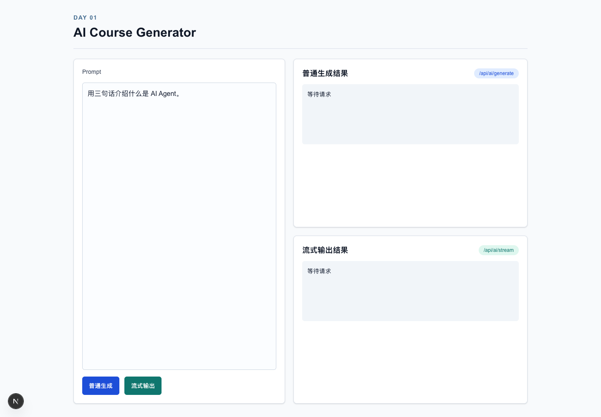

# AI Course Generator

一句话生成一门由多页关联 HTML 组成的课程。当前 Day 27 版本由受限 Supervisor 调度全局 Specialist，依赖感知 Page Worker 以默认并发度 2 生成页面，并在每页执行 Writer → Assets → HTML → QA → 最多两轮定向 Repair/re-QA。严格公开事件、SSE 和持久化 checkpoint 向 Seaca 学习工作区实时交付任务、Agent、页面进度、统一预览和可定位恢复能力。

## Day 01 交付

- Next.js + React + TypeScript 项目已创建。
- 模型供应商通过 `MODEL_BASE_URL`、`MODEL_API_KEY`、`MODEL_NAME` 配置，不在业务代码里硬编码。
- `POST /api/ai/generate` 返回普通文本。
- `POST /api/ai/stream` 返回 AI SDK UI message stream。
- 首页可以输入 prompt，并分别验证普通生成与流式输出。
- 项目已迁移到 `src/` 分层架构，目录规范见 `docs/architecture/directory-structure.md`。

## Day 02 交付

- AI 调用已抽到 `src/server/ai/client.ts`，提供 `generateTextSafe` 和 `streamTextSafe`。
- API 请求支持 `systemPrompt`、`temperature`、`maxTokens` 和 `traceId`。
- 错误响应统一为 `{ code, message, traceId }`，用于前端展示和服务端日志定位。
- Playground 支持编辑 system prompt、切换 temperature、调整 max tokens。
- Day 02 复盘记录见 `notes/day-02.md`。

## Day 03 交付

- 新增 `CourseIntentSchema`，约束 `topic`、`audienceAgeRange`、`courseLength`、`visualStyle`、`difficulty`、`mustInclude`、`avoid` 和 `language`。
- AI Client 新增 `generateStructuredObjectSafe`，通过 AI SDK structured output 生成并校验对象。
- 新增 `POST /api/agents/intent`，把 `userPrompt` 解析为结构化 CourseIntent。
- Playground 增加 CourseIntent JSON 展示，便于观察结构化输出和 schema 错误。
- Day 03 复盘记录见 `notes/day-03.md`。

## Day 04 交付

- Intent Agent 的 system/user Prompt 已迁移到带版本号的 Markdown 模板。
- 新增 `PromptTemplate` 契约与服务端 Prompt Loader，校验缺失变量和未知变量。
- 用户原始需求通过 JSON string 注入，Prompt 明确隔离不可信输入并拒绝角色越权。
- 新增 Prompt Review Checklist、5 个固定 bad case 与 Prompt Loader 单元测试。
- AI 日志只记录 Prompt 长度、版本、traceId、耗时和错误，不记录 Prompt 正文或私有推理过程。

## Day 05 交付

- 新增 Skill 契约和 Skill Registry，执行前后分别校验输入与输出。
- 新增功能模板搜索、样式模板搜索和 CourseIntent 校验三个 Skill。
- 新增 `POST /api/demo/tool-call`，由模型选择工具、后端执行并返回 Tool Result。
- 工具调用日志记录 `toolName`、输入、输出、耗时、成功状态和 `traceId`。
- Day 05 面试复盘见 `notes/day-05.md`。

## Day 06 交付

- 新增最小 `Agent<State>`、AgentState、AgentEvent 和手写循环引擎。
- SinglePageAgent 先调用 Day 5 模板 Tool，再生成结构化 PagePlan 草稿。
- AgentState 包含步骤预算、模板选择、PagePlan、事件和可序列化错误。
- 新增 `POST /api/agents/single-page`，返回最终状态与 Timeline 事件数组。
- Day 06 面试复盘见 `notes/day-06.md`。

## Day 07 交付

- 新增 `Course`、`CourseOutline`、`PagePlan`、`Asset`、`Theme` 和 `QualityReport` Zod Schema。
- `pageType` 明确覆盖封面、故事导入、知识卡、问答、对比、时间线、总结和成就页。
- 核心 Schema 与 TypeScript 类型从 `src/shared/course-schema` 统一导出，前后端共享。
- 为每个核心 Schema 提供受测试保护的 example JSON。
- Course 聚合校验页面顺序与依赖、素材引用和质量报告目标。
- 字段设计与 DSL 边界说明见 `docs/schema.md`，面试复盘见 `notes/day-07.md`。

## Day 08 交付

- 新增共享 `FunctionalTemplateSchema`、五种教学槽位和 Functional Template Registry。
- 实现封面、故事导入、知识卡、对比、时间线、选择题、任务成就和总结 8 个模板。
- 每个 Day 07 `pageType` 都有对应模板和通过 `PagePlanSchema` 的 mock。
- Day 05 `searchFunctionalTemplateSkill` 改为查询共享 Registry，并返回候选、分数和匹配理由。
- 新增 `/templates` TemplateGallery，前端可查看槽位、适用场景、约束和 PagePlan 示例。
- 设计说明见 `docs/templates-functional.md`，面试复盘见 `notes/day-08.md`。

## Day 09 交付

- 新增共享 `StyleTemplateSchema`，覆盖颜色、排版、间距、表面、装饰、动效、密度和素材指导。
- 实现科幻、童趣、极简、自然、黑板和游戏任务六套样式模板。
- 新增 Style Registry，并将 `professional` CourseIntent 兼容映射到 `minimal`。
- 新增 StyleTemplate 到 CSS Variables、CSS 文本和 Day 07 Theme 的转换器。
- Day 05 `searchStyleTemplateSkill` 改为查询共享 Registry 并返回候选、分数和理由。
- 通过测试验证全部 48 种功能模板和样式模板组合。
- `/templates` 新增六张由真实 CSS Variables 驱动的风格预览卡。
- 设计说明见 `docs/templates-style.md`，面试复盘见 `notes/day-09.md`。

## Day 10 交付

- `PagePlanSchema` 新增 `interactionType` 和规划阶段的 `assetNeeds`。
- 新增 `CoursePlanSchema`，约束 3–12 页、连续顺序、合法依赖和“引入—讲解—互动—总结”节奏。
- 新增版本化 Course Planner Prompt 和一步 `CoursePlannerAgent`。
- Planner 使用 Day 08/09 Registry 校验功能模板、pageType、样式模板和全课程视觉一致性。
- 新增 `POST /api/courses/plan`，支持一句话生成 CourseIntent 和 CoursePlan，也支持直接输入 CourseIntent。
- 首页新增 CourseOutlinePanel、PagePlanList、Agent Timeline 和五个固定测试主题。
- 设计决策和八道详细面试题见 `notes/day-10.md`。

## Day 11 交付

- 新增 `PedagogyPlanSchema`、`StoryArcSchema`、`VisualBriefSchema` 和逐页 `PageWorkerBriefSchema`。
- 实现单一职责的 PedagogyAgent、StoryAgent 和 VisualDirectorAgent，并使用独立版本化 Prompt。
- 新增串行 Course Design Workflow，支持失败短路、公开事件聚合、pageId 对齐和 HTML 越界校验。
- Visual Director 引用 Day 09 的真实 StyleTemplate，不复制颜色 Token。
- 新增 `POST /api/courses/design`，消费已完成的 CourseIntent 与 CoursePlan。
- 首页新增教学、故事、视觉三个 Tab、Professional Agent Timeline 和 Page Worker 交接协议检查器。
- 实现说明和八道详细面试题见 `notes/day-11.md`。

## Day 12 交付

- 新增 `PageContentDSLSchema`，覆盖语义 blocks、七类 interaction、assetSlots 和弱 layoutHints。
- 技术 ID、素材槽位和 readingOrder 由确定性代码从 PagePlan 补齐。
- 实现一步 `PageWriterAgent`、版本化 Prompt 和 `POST /api/pages/write`。
- Page Writer 校验 PagePlan、PageWorkerBrief、FunctionalTemplate、互动类型和素材需求的一致性。
- 为八个 FunctionalTemplate 分别提供一份合法 DSL example。
- 首页新增 PageDSLViewer，可选择任一页面生成并检查 DSL，并明确区分未来 HTML 输出。
- 边界设计见 `docs/dsl-boundary.md`，实现说明和八道详细面试题见 `notes/day-12.md`。

## Day 13 交付

- 新增完整文档 `GeneratedHtmlContract`，校验 doctype、html/head/body、viewport 和内联 style。
- 新增 `sanitizeHtmlLite`，拒绝外链脚本、外链 iframe、事件属性、危险 URL、跳转和主动嵌入内容。
- 新增确定性 Day 13 demo builder，从已校验的 PageContentDSL 生成自包含静态 HTML，不提前实现 HtmlEngineerAgent。
- Seaca `/chat` 右侧学习工作区使用 `srcDoc` 和空权限 `sandbox` 展示页面，生成 HTML 不进入主应用 DOM。
- 安全策略见 `docs/html-preview-security.md`，实现说明和详细面试题见 `notes/day-13.md`。

## Day 14 交付

- 新增一步 `HtmlEngineerAgent` 和版本化 Prompt，只消费 PageContentDSL、服务端 Registry 模板与 VisualBrief，不读取原始用户 Prompt。
- 新增 `POST /api/pages/generate-html`，返回完整 `HtmlOutput` 与公开 Agent 事件。
- 模型 HTML 在服务端立即执行完整文档合同、无脚本安全预检和 DSL 稳定标记检查。
- Seaca `/chat` 支持逐页生成、失败重试、上游失效和空权限 iframe 快速预览。
- 新增 `/preview/[previewId]` 独立预览路由；HTML 通过随机 ID 存入重新校验的浏览器临时缓存，不进入 URL。
- 同一 DSL 的 sci-fi、kids-playful、minimal 三风格用例和详细面试复盘见 `notes/day-14.md`。

## Day 15 交付

- 在现有 `QualityReportSchema` 上增加六维评分、结构化问题位置、证据来源、`repairHint` 与确定性 `shouldRepair`。
- 新增 `basicLayoutHeuristics`，检查 HTML 合同、安全、文本过载、固定宽度、裁切风险、低对比度和素材可用性。
- 新增只读 `PageQAAgent`、版本化 Prompt 和 `POST /api/pages/qa`，语义模型不会修改 HTML。
- 总分采用 30/22/17/13/10/8 权重，error 和关键低分通过程序硬门槛触发修复。
- Seaca `/chat` 增加逐页 QA 状态、公开事件、六维评分和可执行问题列表；重新生成上游产物时旧报告自动失效。
- 独立预览缓存可携带经过 Schema 校验且指向当前页面的质量报告，并在顶部显示评分状态。
- 十类固定失败分类、实现边界和详细面试复盘见 `notes/day-15.md`。

## Day 16 交付

- 新增 `AssetRequestSchema` 与 `AssetGenerationResultSchema`，明确素材用途、比例、透明背景、安全区、真实素材和 fallback。
- 新增 `ImagePromptAgent`，把 Page DSL 素材槽编译为背景、角色贴纸、图标与纹理四类无文字生图请求。
- 新增真实生图 Skill 和 `POST /api/pages/generate-assets`；服务端校验 PNG/JPEG/WebP 后写入 `.data/generated-assets`，通过随机 ID 路由读取。
- 方舟模式默认复用现有 `ARK_API_KEY` 调用 `doubao-seedream-4-5-251128`；Seedream 返回 JPEG 时会保留图片并显式标注透明通道警告。
- 图片服务未配置、调用失败、格式伪造或透明背景不满足时返回 CSS/SVG/占位降级，不阻塞 HTML Engineer。
- HTML Engineer 只能消费当前页面批准的内部素材 URI；Page QA 会报告素材缺失、未引用和 fallback。
- Seaca `/chat` 学习工作区增加逐页图片素材状态、公开事件与 AssetGallery，重新生图会失效旧 HTML 与 QA。
- 素材边界、四类用例和详细面试复盘见 `notes/day-16.md`。

## Day 17 交付

- 页面素材解析先按 Page DSL、VisualBrief 与 Image Prompt 版本复用结构化请求集，再按 prompt、style、aspectRatio 和图片模型查询 ready 素材；同一页复跑不会因模型措辞漂移重复生图。
- 缓存只保存通过 Schema 校验的 ready 结果；fallback 不做长期负缓存，下一次解析仍可重试真实图片供应商。
- 命中缓存时会检查内部 URI 的图片文件仍然存在；索引存在但文件缺失会作为 stale miss 重新生成。
- 缓存读写是 best-effort 辅助能力，损坏索引或写入失败只产生公开警告，不会让已生成素材或 HTML 流程失败。
- Image Assets Timeline 使用现有公开事件展示请求集、图片 hit/miss、stale 和 fallback 汇总，不把生产 Prompt、缓存键或服务端路径写入公开事件和界面。
- HTML Engineer 继续把背景、角色贴纸与课程任务卡合成为语义 HTML；URI 和精确 altText 必须绑定到对应素材槽节点，文字和互动不会被烘焙进图片。
- Seaca 学习工作区保持原有 AssetGallery 和两阶段生成流程，仅把重复操作表述为“重新解析素材”，不增加平行缓存控制台。
- 缓存失效、素材合成边界和详细面试复盘见 `notes/day-17.md`。

## Day 18 交付

- 新增共享 `CourseGenerationStateSchema`，统一保存整课阶段、逐页产物、公开事件、结构化错误和运行时间，持久化前后都执行 Zod 校验。
- 新增服务端串行 Course Generation Workflow：Intent → Planner → 专业设计 → 每页 Page Writer → Assets → HTML；页面严格按依赖顺序执行，不在浏览器复制编排规则。
- 新增 `.data/courses/{courseId}/course.json` 原子检查点；每个阶段和页面完成后保存，失败保留此前 HTML，恢复时跳过已完成页面并从失败阶段继续。
- 新增 `POST /api/courses/generate` 批量入口。默认尊重 Intent 并收敛到 3–5 页，也可显式指定页数；传已有 `courseId` 可恢复运行。
- `/chat` composer 现在用一个提示启动整课任务并提供取消按钮；Timeline 只消费结构化公开摘要，不保存 Agent event data。
- 右侧 learning workspace 增加统一多页预览与断点恢复入口；页面选择使用可访问 Tab 语义，并且始终只挂载当前页面的沙箱 iframe。
- 现有逐阶段按钮继续承担单页检查和局部重试，Page QA 保持可选，不成为 Day 18 主链阻塞条件。
- 状态边界、恢复语义、验证策略和面试复盘见 `notes/day-18.md`。

## Day 19 交付

- 新增严格的课程任务与 SSE Schema；流中只允许 `snapshot`、公开 `event` 和 `terminal`，不存在任意私有 `data` 或模型原始 chunk 通道。
- 新增持久化 task store 与单进程 EventBus。课程 checkpoint 成功写入后才发布实时消息，任务记录负责映射 `taskId`、`courseId`、`traceId` 和运行状态。
- 新增 `POST /api/courses/tasks`、`GET /api/courses/tasks/[taskId]/events` 与 `DELETE /api/courses/tasks/[taskId]`，分别负责创建、SSE 订阅和显式取消。
- SSE 使用公开事件 sequence 作为 `id`，支持 `Last-Event-ID` 增量重放、初始快照、订阅竞态缓冲、心跳和终态关闭。
- 新增 `useSSETask`，在 Controller 数据层完成 EventSource 生命周期、Schema 校验、顺序检查、重连去重和终态归并。
- Seaca `/chat` 继续使用现有 Composer、Agent Timeline 和 learning workspace；整课生成从批量 JSON 切换为实时任务流，没有重做 UI 或增加平行控制台。
- 协议、取消语义、单进程限制、验证策略和八道详细面试题见 `notes/day-19.md`。

## Day 20 交付

- 新增纯 `CourseRunTimeline` 投影模型，将已持久化任务状态投影为任务摘要、全局 Agent 和逐页 Writer/Assets/HTML/可选 QA 三层视图，不在组件中复制工作流规则。
- Timeline 展示任务与 SSE 连接的独立状态、完成页数、当前 Agent/页面、总耗时、阶段耗时、断点恢复和尝试次数。
- 阶段耗时仅由结构化 `agent_start` 与 `agent_done/error` 边界推导；恢复尝试仅由不同 `traceId` 证明，不解析面向用户的 summary 字符串。
- 失败卡同时显示 Agent/Workflow、`pageId`、错误码和公开错误信息；失败或取消的整课任务可在 Timeline 中直接从检查点继续。
- 右侧 learning workspace 新增逐页 Page DSL、图片素材、HTML 与 QA 状态面板；未运行 QA 明确标记为可选，不阻断页面交付。
- 新增原生可折叠结构化日志抽屉，只读取严格公开事件白名单，不序列化 Prompt、DSL/HTML 正文、snapshot、私有 event data 或 chain-of-thought。
- 实现边界、时间/恢复语义、验证策略与面试复盘见 `notes/day-20.md`。

## Day 21 交付

- 完成当前固定多 Specialist 工作流的架构评审，明确它由 TypeScript 决定执行顺序，并不是已经实现的 Supervisor Agent。
- 新增当前 MVP 与目标 Supervisor + Specialist 两张架构图，区分已实现能力、目标角色、Page Worker 执行范围、Generate Image Skill 和确定性基础设施。
- 为 Planner、Pedagogy、Story、Visual、Page Writer、Image Prompt、HTML Engineer、QA 与未来 Repair 建立输入、输出、校验和禁止职责契约。
- 记录单一超级 Agent 的具体失败模式、当前固定工作流的局限、Supervisor 与 LangGraph 的关系，以及什么时候不应该使用多 Agent。
- Day 21 只交付架构文档和面试讲解，不修改现有业务工作流、共享 Schema、SSE 协议或 Seaca 产品 UI。
- 总设计见 `docs/multi-agent-design.md`，当前/目标流程见 `docs/architecture/mvp-flow.md` 与 `docs/architecture/multi-agent-flow.md`，角色索引见 `src/server/agents/README.md`，复盘见 `notes/day-21.md`。

## Day 22 交付

- 保留 `runCourseGenerationWorkflow` 作为兼容 facade，任务服务、Route Handler 与既有调用方不需要改入口。
- 新增声明式串行运行层：`WorkflowNode` 通过 `requiredInputs` 与 `produces` 描述 handoff，`runSequentialWorkflow` 按节点列表执行、集中合并并把失败定位为带 `nodeName` 的 `WorkflowNodeError`。
- 新增课程节点装配：Intent、Planner、Course Design，以及每页 Writer、Assets、HTML 都被包装为聚焦节点；现有 Agent、素材子流程和专业设计子流程继续复用。
- API、SSE、公开事件 Schema、`CourseGenerationState`、checkpoint 时机、取消与断点恢复语义、Seaca `/chat` Timeline 和 learning workspace 均保持不变。
- 本日没有实现 Supervisor、Repair、自动 QA、独立 Page Worker、页面并发或 LangGraph；固定顺序仍由服务端 TypeScript 节点列表决定。
- 重构前后对比、节点合同、失败语义和详细面试复盘见 `notes/day-22.md`；当前/目标图与角色边界见 `docs/architecture/mvp-flow.md`、`docs/architecture/multi-agent-flow.md`、`docs/multi-agent-design.md` 和 `src/server/agents/README.md`。

## Day 27 交付

- 新增 `RepairRequestSchema`、`RepairResultSchema` 和持久化 `RepairAttemptRecord`，旧 checkpoint 可不包含 Repair 历史。
- 内容/教学问题只允许修改 QA 定位的 DSL blocks；排版、风格和 HTML 问题使用唯一匹配 patches，并重新通过原 HTML/DSL/asset 安全合同。
- Page Worker 接入最多两轮 QA → Repair → re-QA；预算耗尽、无定位问题、上游素材问题或候选越界会保留最新报告并结构化停止。
- Repair Prompt 从 draft 升级为 active `1.0.0/1.0.0`，不能读取原始用户 Prompt、扩大 scope、增加预算或自行宣布通过。
- `repair_attempt`、`repair_success` 和错误摘要进入现有 SSE、Timeline 与 learning workspace Repair 记录，不暴露候选正文和私有推理。
- 实现说明和面试复盘见 `notes/day-27.md`。

## Day 29 交付

- 从手写课程 facade 中提取共享运行时，统一初始化、恢复、节点生命周期、公开事件、失败、完成与 checkpoint；原手写 Supervisor workflow 行为保持不变。
- 新增复用 `CourseGenerationStateSchema.shape` 的生产 LangGraph State，以及独立 Intent、Planner、Briefs、Page Workers、Finalize 节点。
- 固定拓扑为 `START → intent-node → planner-node → briefs-node → page-workers-node → finalize-node → END`；Page Worker 内部依赖、并发、QA/Repair 不重复实现。
- 新增 `runCourseGenerationGraphWorkflow`，它与手写入口共享输入、依赖和最终状态合同；调用方显式选择运行时，Graph 失败不会自动双跑 fallback。
- 产品任务 API、SSE、Controller 与 Seaca UI 未改变，Graph streaming 映射留到 Day 30；迁移说明与面试复盘见 `notes/langgraph-migration.md` 和 `notes/day-29.md`。

## 启动

```bash
pnpm install
pnpm dev
```

默认访问地址：

```text
http://localhost:3000
```

如果 `3000` 端口已被占用，Next.js 会提示新的本地端口。

## 环境变量

复制示例文件后填写真实模型配置。当前优先使用火山方舟 / 豆包的 OpenAI-compatible 配置：

```bash
cp .env.local.example .env.local
```

```env
ARK_API_KEY=your_volcengine_ark_api_key
ARK_MODEL_ID=your_doubao_model_id
ARK_BASE_URL=https://ark.cn-beijing.volces.com/api/v3
```

如果没有设置 `ARK_API_KEY`，才会回退到通用 OpenAI-compatible 配置：

```env
MODEL_API_KEY=your_api_key
MODEL_BASE_URL=https://your-openai-compatible-endpoint/v1
MODEL_NAME=your_model_name
```

真实图片生成默认复用现有 `ARK_API_KEY` 与 `ARK_BASE_URL`，使用 Seedream 4.5。只需在需要切换方舟图片模型时增加：

```env
ARK_IMAGE_MODEL_ID=doubao-seedream-4-5-251128
```

如果要使用独立图片供应商，再配置以下覆盖项；所有 key 都只存在服务端，不要暴露给浏览器：

```env
IMAGE_API_KEY=your_image_api_key
IMAGE_BASE_URL=https://your-openai-compatible-image-endpoint/v1
IMAGE_MODEL_ID=your_image_model_id
IMAGE_PROVIDER_NAME=your_provider_label
```

Day 26 的 Playwright 截图证据默认关闭。需要启用时先安装本机 Chromium，再增加服务端环境变量；浏览器缺失或截图失败不会阻塞 Page QA：

```bash
pnpm exec playwright install chromium
```

```env
PAGE_QA_SCREENSHOTS_ENABLED=true
```

## API 验收

普通文本接口：

```bash
curl -X POST http://localhost:3000/api/ai/generate \
  -H "Content-Type: application/json" \
  -d '{"prompt":"用三句话介绍什么是 AI Agent。"}'
```

Intent Agent 接口：

```bash
curl -X POST http://localhost:3000/api/agents/intent \
  -H "Content-Type: application/json" \
  -d '{"userPrompt":"给 8 岁小朋友做一门太阳系入门课，要有互动问答。"}'
```

Tool Calling Demo：

```bash
curl -X POST http://localhost:3000/api/demo/tool-call \
  -H "Content-Type: application/json" \
  -d '{"pagePurpose":"为 8 岁儿童设计一个互动问答页面"}'
```

SinglePageAgent：

```bash
curl -X POST http://localhost:3000/api/agents/single-page \
  -H "Content-Type: application/json" \
  -d '{"pageGoal":"设计一个太阳系互动问答页面","audience":"8 岁儿童"}'
```

Course Planner Agent：

```bash
curl -X POST http://localhost:3000/api/courses/plan \
  -H "Content-Type: application/json" \
  -d '{"userPrompt":"为 8 岁儿童设计一门 5 页太阳系入门课，包含互动问答，使用科幻风格。"}'
```

Day 11 专业设计工作流（`intent` 与 `outline` 使用 Planner 的真实返回值）：

```bash
curl -X POST http://localhost:3000/api/courses/design \
  -H "Content-Type: application/json" \
  -d '{"intent": {"...": "CourseIntent"}, "outline": {"...": "CoursePlan"}}'
```

Day 18 串行整课生成（自动收敛到 3–5 页，也可显式传 `pageCount`）：

```bash
curl -X POST http://localhost:3000/api/courses/generate \
  -H "Content-Type: application/json" \
  -d '{"userPrompt":"为 8 岁儿童生成一门太阳系互动课程","pageCount":3}'
```

失败或取消后使用响应里的 `courseId` 从服务端检查点继续：

```bash
curl -X POST http://localhost:3000/api/courses/generate \
  -H "Content-Type: application/json" \
  -d '{"courseId":"course-..."}'
```

Day 19 创建异步整课任务（响应为 HTTP 202，并返回 `taskId`、`courseId` 与 `traceId`）：

```bash
curl -i -X POST http://localhost:3000/api/courses/tasks \
  -H "Content-Type: application/json" \
  -d '{"userPrompt":"为 8 岁儿童生成一门三页太阳系互动课程","pageCount":3}'
```

使用返回的 `taskId` 订阅实时进度；浏览器会自动维护 Last-Event-ID，curl 可手动验证从指定 sequence 重放：

```bash
curl -N http://localhost:3000/api/courses/tasks/task-.../events

curl -N http://localhost:3000/api/courses/tasks/task-.../events \
  -H "Last-Event-ID: 12"
```

只有显式 DELETE 才取消后台生成，关闭上面的 SSE 连接不会取消任务：

```bash
curl -X DELETE http://localhost:3000/api/courses/tasks/task-...
```

Day 12 单页 Page Writer（使用 Planner 和 Day 11 的真实返回值）：

```bash
curl -X POST http://localhost:3000/api/pages/write \
  -H "Content-Type: application/json" \
  -d '{"intent": {"...": "CourseIntent"}, "page": {"...": "PagePlan"}, "brief": {"...": "PageWorkerBrief"}}'
```

Day 16 单页图片素材（使用 Page Writer 与 Visual Director 的真实返回值）：

```bash
curl -X POST http://localhost:3000/api/pages/generate-assets \
  -H "Content-Type: application/json" \
  -d '{"content": {"...": "PageContentDSL"}, "visualBrief": {"...": "VisualBrief"}}'
```

Day 14/16 单页 HTML Engineer（同时传入素材工作流的 ready/fallback 结果）：

```bash
curl -X POST http://localhost:3000/api/pages/generate-html \
  -H "Content-Type: application/json" \
  -d '{"content": {"...": "PageContentDSL"}, "visualBrief": {"...": "VisualBrief"}, "assets": [{"...": "AssetGenerationResult"}]}'
```

Day 15 单页 Page QA（使用 Planner、Page Writer、HTML Engineer 与 Visual Director 的真实返回值）：

```bash
curl -X POST http://localhost:3000/api/pages/qa \
  -H "Content-Type: application/json" \
  -d '{"page": {"...": "PagePlan"}, "content": {"...": "PageContentDSL"}, "html": "<!doctype html>...", "visualBrief": {"...": "VisualBrief"}, "assets": [{"...": "AssetGenerationResult"}], "courseContext": {"learningObjectives": ["..."]}}'
```

流式接口：

```bash
curl -N -X POST http://localhost:3000/api/ai/stream \
  -H "Content-Type: application/json" \
  -d '{"prompt":"用三句话介绍什么是 AI Agent。"}'
```

接口也兼容 AI SDK UI messages：

```json
{
  "messages": [
    {
      "id": "1",
      "role": "user",
      "parts": [{ "type": "text", "text": "生成一段课程简介。" }]
    }
  ]
}
```

## 今日截图



## 验证命令

```bash
pnpm test
pnpm lint
pnpm build
```
