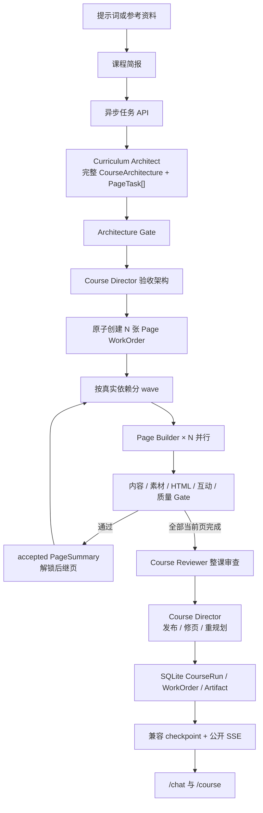

# 课芽 · AI 个性化课程生成器

课芽把一句自然语言需求或一组参考资料，转化为一门有教学顺序、统一视觉和互动练习的多章节 HTML 课程。

它不是“让一个模型一次性写完整课程”的演示：系统先确认学习目标，再由受约束的多 Agent 流程完成课程规划、教学与视觉设计、逐页内容生成、图片素材、HTML 工程、浏览器质量检查和定向修复。生成过程可暂停、恢复和取消，完成课程可以在安全沙箱中学习并导出 ZIP。

> 当前定位：用于展示 AI 应用工程、复杂前端交互和 Node.js Agent 编排能力的本地项目。它还不是带账号、权限、分布式队列和商业计费的生产 SaaS。

[GitHub 仓库](https://github.com/dxj-fe/ai-course-generator) · [简历项目亮点](docs/resume/project-bullets.md) · [逐条面试深挖](docs/resume/interview-deep-dive.md) · [截图与证据](docs/resume/screenshots.md)

## 五分钟了解项目

### 用户能做什么

1. 在 `/chat` 输入课程主题、受众和目标，也可以上传最多 3 个不超过 5 MB 的 `txt`、`md` 或 `pdf` 参考文件。
2. 确认课程简报后创建异步任务；页面可关闭或刷新，生成状态从持久化 checkpoint 恢复。
3. 在对话线程查看公开阶段状态，在右侧学习空间查看已完成章节。
4. 生成完成后进入 `/course/[courseId]` 学习，保留本地进度、互动结果和朗读偏好。
5. 从 `/course` 搜索历史课程，或导出包含课程状态、页面 HTML 和素材清单的 ZIP。


### 一条课程如何生成



当前 `/chat` 新任务固定使用 `agent-v2`。AI SDK `ToolLoopAgent` 负责单张 WorkOrder 内的自主工具循环，`CourseRunEngine` 负责跨 Agent 的依赖、并发、租约、持久化和恢复。旧 `workflow` / `langgraph` 值只用于读取历史任务，不再执行旧生成链。

完整链路见[架构入口](docs/architecture/README.md)和[从提示词到最终 HTML](docs/architecture/prompt-to-html-current-flow.md)。

### 核心技术亮点

- **结构化 AI 输出**：CourseCreationBrief、CourseArchitecture、PageContentDSL、QualityReport、CourseReview 等共享 Zod Schema 是前后端、Agent 与持久化之间的合同。
- **四类真实 Agent**：Architect 先提交整课架构，Director 验收后原子派工，Page Builder 按真实依赖波次并行，Reviewer 独立审整课；每次回合都有 WorkOrder、工具权限和终态提交。
- **耐久协作协议**：CourseRun 保存 current 指针，WorkOrder 保存封口输入、预算和 lease，Artifact 以不可变版本交接；旧结果不会静默覆盖当前分支。
- **功能模板与样式模板分离**：功能模板约束教学结构，样式模板提供 Design Tokens，同一内容结构可以组合不同视觉方向。
- **内容与页面实现分离**：Page Writer 生成语义 DSL；HTML Engineer 只实现已确认内容，避免在写页面时重新规划课程。
- **质量闭环**：确定性合同、三视口 Playwright 证据和模型 QA 共同产出六维报告；Repair 只能修改授权范围，并在 re-QA 后决定是否继续。
- **可恢复的长任务**：任务、CourseRun、WorkOrder、Artifact 和事件持久化到 SQLite；数据库 lease、CAS 与显式 worker 支持暂停、恢复、取消和进程重启后的接续。
- **安全 HTML 交付**：生成 HTML 必须通过服务端合同与安全预检；诊断预览使用空权限 sandbox，学习器只注入平台拥有的受限运行时。
- **模型与素材可靠性**：有限超时、AbortSignal、分级模型路由、一次瞬时降级、结构化结果缓存，以及图片生成失败时的类型化 fallback。

## 为什么这样设计

### 为什么不用一个超级 Prompt

课程规划、教学设计、页面内容、HTML 实现和质量评估需要不同输入、输出和失败处理。把它们放进一次模型调用会产生职责冲突、上下文膨胀、输出截断和错误无法定位等问题。课芽让每一步先通过 Schema，再把最小必要结果交给下一步；单页失败时也不必重跑整门课程。

### 为什么需要模板系统

模型擅长根据主题生成内容，但不天然保证每一页承担明确教学职责，也不保证整门课视觉一致。功能模板固定教学槽位和互动目标；样式模板固定颜色、排版、间距和素材指导。模板负责稳定性，DSL 与 HTML Engineer 保留表达空间。

### 为什么图片只作为素材

课程标题、正文、按钮和练习不能烘焙到图片中，否则会失去可访问性、响应式布局、文本选择和互动能力。Image Prompt Model Step 与生图 Tool 只生成背景、角色贴纸、图标或纹理，HTML Model Step 将批准素材绑定到语义节点；供应商失败时仍可使用 CSS、SVG 或占位 fallback 完成页面。

更完整的取舍见[为什么采用多 Agent](docs/why-multi-agent.md)。

## 产品表面

| 路由 | 职责 |
| --- | --- |
| `/` | 发现示例课程和进入课程创建 |
| `/chat` | 课程简报、资料上传、任务创建、公开进度和生成中的学习空间 |
| `/course` | 持久化课程、运行状态、搜索与筛选 |
| `/course/[courseId]` | 可恢复的课程详情、互动学习和 ZIP 导出 |
| `/templates` | 功能模板、样式模板、Design Tokens 和 PagePlan 示例 |
| `/preview/[previewId]` | 有时效的诊断预览，不承担持久课程历史 |

展示组件不直接调用业务 API，也不消费 Agent 私有消息、工具原始结果或运行时内部事件。API 客户端把 HTTP/SSE 转换为共享任务类型，`ChatApp` 作为 Task Controller，再将状态投影给对话和学习空间。

## 技术栈

| 层 | 主要技术 |
| --- | --- |
| Web | Next.js 16、React 19、TypeScript、Tailwind CSS |
| UI | 本地 shadcn/ui primitives、Radix UI、Lucide React |
| AI | Vercel AI SDK、OpenAI-compatible Provider、Volcengine Ark / Doubao |
| 编排 | AI SDK ToolLoopAgent、CourseRunEngine、耐久 WorkOrder、显式恢复 worker |
| 合同 | Zod 4、版本化 Prompt、严格公共事件 Schema |
| 质量 | Playwright、确定性 HTML/布局检查、模型 QA、Repair/re-QA |
| 存储 | SQLite、本地生成素材与 QA 证据 |
| 测试 | Vitest、ESLint、Next.js production build、固定 Demo runner |

## 本地启动

### 1. 环境要求

- Node.js `>=22.5.0`
- pnpm
- 至少一个 OpenAI-compatible 文本模型
- 可选：图片生成 Provider
- 可选：Playwright Chromium，用于浏览器截图 QA 和完整 Demo

### 2. 安装与配置

```bash
pnpm install
cp .env.local.example .env.local
```

方舟 / 豆包示例：

```env
MODEL_PROVIDER_STRONG=ark
MODEL_PROVIDER_BALANCED=ark
MODEL_PROVIDER_CHEAP=ark

ARK_API_KEY=your_volcengine_ark_api_key
ARK_MODEL_ID=your_doubao_model_id
ARK_BASE_URL=https://ark.cn-beijing.volces.com/api/v3
```

通用 OpenAI-compatible 示例：

```env
MODEL_PROVIDER_STRONG=generic
MODEL_PROVIDER_BALANCED=generic
MODEL_PROVIDER_CHEAP=generic

MODEL_API_KEY=your_api_key
MODEL_BASE_URL=https://your-openai-compatible-endpoint/v1
MODEL_NAME=your_model_name
```

每个档位可以分别覆盖模型：

```env
ARK_MODEL_ID_CHEAP=
ARK_MODEL_ID_BALANCED=
ARK_MODEL_ID_STRONG=

MODEL_NAME_CHEAP=
MODEL_NAME_BALANCED=
MODEL_NAME_STRONG=
```

图片生成默认可以复用方舟凭据：

```env
ARK_IMAGE_MODEL_ID=doubao-seedream-4-5-251128
```

也可以使用独立图片 Provider：

```env
IMAGE_API_KEY=your_image_api_key
IMAGE_BASE_URL=https://your-image-provider-endpoint/v1
IMAGE_MODEL_ID=your_image_model_id
IMAGE_PROVIDER_NAME=image-provider
```

可选超时与浏览器 QA 配置：

```env
AI_PLANNER_TIMEOUT_MS=180000
AI_HTML_TIMEOUT_MS=120000
# PAGE_QA_SCREENSHOTS_ENABLED=false
```

服务端密钥不要使用 `NEXT_PUBLIC_` 前缀。完整示例见[`.env.local.example`](.env.local.example)，路由和降级规则见[可靠性与成本合同](docs/reliability-cost.md)。

### 3. 启动

```bash
pnpm dev
```

默认访问 `http://localhost:3000`。若端口被占用，Next.js 会在终端显示实际地址。

需要在进程退出后持续领取未完成课程时，另开一个终端运行：

```bash
pnpm worker:course
```

Next 启动时只做一次恢复扫描；正式部署必须运行这个 worker 或提供等价的外部调度。

首次使用浏览器 QA 或完整 Demo 时安装 Chromium：

```bash
pnpm exec playwright install chromium
```

## 验证与 Demo

### 自动检查

```bash
pnpm lint
pnpm prompt:lint
pnpm test
pnpm build
```

### 固定 Demo

三个固定案例分别覆盖火星探险、太阳系和 AI 素养：

```bash
pnpm demo:run
pnpm demo:run -- --record
```

`--record` 会把聚合报告和成功生成的桌面/移动截图复制到 `docs/demo/results/<runId>`；原始课程 JSON、ZIP、日志和截图保留在被 Git 忽略的 `.data/demo-runs`。

也可以复核已有产物：

```bash
pnpm demo:check -- \
  --course .data/demo-runs/<runId>/<case>/course.json \
  --baseline docs/demo/baselines/<case>.json \
  --archive .data/demo-runs/<runId>/<case>/<courseId>.zip
```

固定 Prompt、质量阈值和人工评分方法见[Demo 验收说明](docs/demo/prompts.md)。

> 仓库中现有两次 2026-07-23 记录均未通过完整验收，也没有生成产品截图或 ZIP。它们是失败诊断证据，不代表当前版本已经通过真实模型 Demo。对外展示成功结果前必须重新执行 `pnpm demo:run -- --record`。

## 数据与安全边界

- `.data/keya.sqlite` 保存本地课程、任务、会话和预览记录。
- `.data/generated-assets`、`.data/quality-screenshots` 和 `.data/demo-runs` 保存本地生成证据并被 Git 忽略。
- SSE 只允许 `snapshot`、公开 `event` 和 `terminal`；不会传输 Prompt、参考资料原文、框架内部状态或 chain-of-thought。
- 模型生成 HTML 不进入主应用 DOM；所有预览都经过服务端校验并运行在 sandbox iframe。
- 扫描 PDF 暂不支持 OCR；资料解析也不包含向量数据库。
- WorkOrder 和 CourseRun 的执行权由 SQLite lease/CAS 保护；EventBus 仍只负责当前进程实时通知，持续恢复需运行 `pnpm worker:course`。

## 文档导航

- [架构入口](docs/architecture/README.md)
- [从提示词到最终 HTML](docs/architecture/prompt-to-html-current-flow.md)
- [为什么采用多 Agent](docs/why-multi-agent.md)
- [多 Agent 深度设计](docs/multi-agent-design.md)
- [共享 Schema](docs/schema.md)
- [产品 UI 集成合同](docs/ui-integration.md)
- [可靠性与成本](docs/reliability-cost.md)
- [HTML 预览安全](docs/html-preview-security.md)
- [3 / 8 / 15 分钟项目讲解](docs/interview-story.md)
- [简历项目亮点与源码证据](docs/resume/project-bullets.md)
- [七条亮点逐条面试深挖](docs/resume/interview-deep-dive.md)
- [截图与 Demo 证据清单](docs/resume/screenshots.md)
- [训练历程](docs/training-log.md)

## 当前边界与下一步

当前版本没有用户账号、团队权限、分布式队列、对象存储、向量检索、人工发布审批、商业计费或线上 SLA。真实模型效果和耗时仍受 Provider 账号、模型质量和本地运行环境影响。`ToolOperation` 是审计台账，不保证所有外部 Provider 副作用 exactly-once。

如果继续生产化，优先级应是：部署显式恢复 worker、在真实 Provider 环境运行多步工具 spike、接入分布式队列/事件总线和对象存储，再补权限隔离、成本账本、人工发布门槛与真实用户质量反馈。
