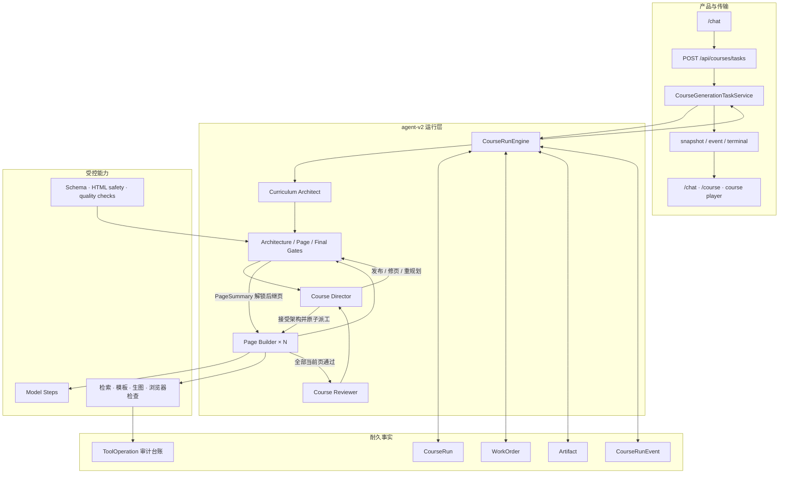

# 课芽架构入口

本文说明当前新课程的生产路径、模块职责和数据边界。完整逐步调用链见[从提示词到最终 HTML](./prompt-to-html-current-flow.md)。

## 1. 系统要解决什么

课芽把一句自然语言需求和可选资料转成一门由多份互动 HTML 组成的课程。工程重点不是“多调几次模型”，而是：

- 先把整课目标、页面职责和生成依赖想清楚，再开始写页面；
- 让互不依赖的页面并行，让真实依赖页拿到上游已验收摘要；
- 每次 Agent 回合有独立工作单、权限、预算、产物和验收结果；
- 单页合格后再审整门课，发现问题时只返工必要范围；
- 进程中断后从 SQLite 的当前事实继续；
- 对前端只公开可展示进度，不泄露 Prompt、资料原文或私有推理；
- 最终 HTML 通过安全、结构、互动和质量检查后才能交付。

## 2. 当前生产架构



新任务固定使用 `source: "agent-v2"`。`workflow` 和 `langgraph` 值仅用于读取历史任务；已删除的 LangGraph 和旧手写生成器不是当前执行入口。

## 3. 从 Brief 到课程的主链

```text
CourseCreationBrief + ReferencePack[]
→ CourseRun + architect_course WorkOrder
→ Curriculum Architect 一次提交完整 CourseArchitecture
→ Architecture Gate
→ Course Director 语义验收
→ 同一事务接受架构并创建恰好 N 张 Page WorkOrder
→ 按 buildDependsOnPageIds 分 wave
→ 同一 wave 的 Page Builder 并行执行
→ Page Gate
→ PageSummary 解锁依赖它的后继页
→ 冻结 CourseManifest
→ Course Reviewer 审整课
→ Course Director 发布 / 局部返工 / 整课重规划
→ Final Gate
→ CourseStateProjector
→ 既有 checkpoint、SSE 和 Keya UI
```

这里有两个不能交换的顺序：

1. Architect 必须先看到全局目标并提交全部 `PageTask`，页面不能边规划边零散启动。
2. Director 接受完整架构后才能原子派工，不能出现“架构已接受，但页面只建了一部分”的中间状态。

## 4. 哪些是真 Agent

| 类型 | 负责什么 | 例子 |
| --- | --- | --- |
| Agent | 接收独立 WorkOrder，在有限工具中自主选择下一步，提交可验收 Artifact | Architect、Director、Page Builder、Reviewer |
| Model Step | 完成 Page Builder 内的一次专业模型生成；没有独立工作单和全局调度权 | Page Writer、Image Prompt、HTML、QA、Repair |
| Tool | 执行系统授权的查询或副作用 | 资料检索、模板检索、生图、浏览器检查 |
| Agent Skill | 收录在项目 `resources/agent/skills` 的 `SKILL.md` 说明和资源包，由产品 Agent 通过受限本地读取 Tool 按需加载 | 课程设计方法、教学目标检查法 |
| Gate | 用代码验证候选产物，不相信 Agent 自称完成 | Architecture Gate、Page Gate、Final Gate |
| Repository 命令 | 原子修改业务事实、派工、切换 current 指针和记录事件 | accept、fanout、unlock、fix、publish |
| Engine / Worker | 领取租约、控制并发、驱动可运行 WorkOrder | CourseRunEngine、显式 course worker |

Course Director 只在“架构提交后”和“整课 Review 提交后”运行短回合。领取任务、检查依赖、续租、并发和保存状态都是代码工作，不需要一个每步过场的 Supervisor。

## 5. 数据事实与写入边界

agent-v2 的业务事实由以下对象表达：

- `CourseRun`：当前架构、当前页面、当前 Review、阶段、stale 标记和整课租约；
- `WorkOrder`：某次 Agent 回合的封口输入、权限、预算、依赖、执行租约和提交；
- `Artifact`：不可变的架构、页面内容、素材、HTML、质量、摘要、manifest 和 review；
- `CourseRunEvent`：可投影到 UI 的有序运行事件；
- `ToolOperation`：工具名、输入哈希、安全摘要和 ArtifactRef 的审计记录。

`ToolOperation` 当前是审计台账，不是通用 exactly-once（严格只执行一次）层，也不会自动重放工具结果。业务写入主要依靠 Repository 事务、WorkOrder 幂等键、不可变 Artifact 和缓存避免重复；外部 Provider 在“副作用已发生但结果尚未落库”时仍存在重复调用窗口。

Agent 只能通过授权工具提交；Repository 命令是业务写入的唯一所有者。`CourseStateProjector` 只读取 current 指针，生成兼容现有前端的 `CourseGenerationState`，不反向修改业务事实。

## 6. 页面协作和质量闭环

`PageTask.order` 决定学习顺序，`buildDependsOnPageIds` 决定生成依赖，两者不能混用。

```text
无依赖 Page WorkOrder
→ Page Builder 工具循环
→ content / assets / html / quality Artifacts
→ Page Gate
→ accepted PageSummary
→ 给真实后继页封口输入并 queued
```

后继页只读取上游已验收的 `PageSummary` 和 ArtifactRef，不读取整页 HTML。这样既能延续事实、术语和学习结果，也不会让跨页上下文无限增长。

页面内部的 Writer、Image Prompt、HTML、QA 和 Repair 是可复用 Model Steps。Page Builder 根据当前缺失产物和证据选择下一步；Gate 只用安全、合同和具体交付错误决定能否接受，主观分数只用于观测。全部页面通过后，Reviewer 还要检查目标覆盖、重复、断层、难度、术语、互动和课程闭合。

`block_page` 只允许用于“已经读过当前上下文、已有失败质量证据，而且修复被拒绝、
预算耗尽或确定性修复计划没有可行授权”的情况。普通 Provider 或生成工具报错不能
直接 block。Reviewer 的每条 issue 也必须绑定它实际读过的 current
Architecture/PageSummary/PageQuality 精确引用，不能拿 HTML/内容/素材引用凑证据。
页面 issue 还要用 `targetArtifact` 明确指定内容或 HTML；Fix WorkOrder 的旧页面只
是 baseline，必须产生新的目标 Artifact 和当前质量证据。依赖闭包页强制刷新内容，
避免上游已经变化、下游却原样复用。

## 7. 恢复、取消与后台执行

- CourseRun 和 WorkOrder 都使用数据库 lease、过期接管和版本围栏；
- `course_execution_claims` 是同一课程唯一活动 Task 的数据库真相，不保留跨实例会
  陈旧的内存 claim；
- 所有普通 Repository 事务都在同一 SQLite 写事务中核对
  `taskId/courseId/traceId/status=running` 且不存在 cancel intent；
- CourseStore checkpoint 使用 payload CAS，并在 SQL 内核对 Task trace/status；
- durable cancel intent 阻止 resume 和旧 runner 写入，并在恢复扫描中优先收口；
- pause 后重查 CourseRun；若终态已在竞态窗口提交，独立 `reconcile()` 只读投影并
  对齐 CourseStore/TaskRecord，同 courseId 的旧 trace 终态不会污染新 attempt；
- Artifact 不原地覆盖，恢复只读取 Repository 的 current 指针；
- 取消会在事务中取消当前非终态 WorkOrder 和 CourseRun；
- Next.js `instrumentation` 启动时只做一次有限恢复扫描；
- 持续恢复必须部署显式 worker：`npm run worker:course`；
- 无常驻进程的平台需要外部定时调度唤醒扫描。

`after()` 和单次启动扫描都不是耐久队列。没有显式 worker 时，进程退出后的 queued/running 任务不能保证被及时继续执行。

## 8. 前端和安全边界

SSE 只发送：

- `snapshot`：已校验的课程投影；
- `event`：带 sequence 的公开阶段摘要；
- `terminal`：完成、失败或取消。

SSE 在当前进程使用 EventBus 快速唤醒，同时每 500 ms 直接增量追读持久化
`course_run_events`，覆盖 Web 与 Worker 分进程部署。CourseStore/TaskStore 只提供
snapshot 和 terminal。游标包含 traceId 与数据库分配的 durable sequence；过滤旧
revision 后允许序号有空洞。pause/resume 切换 trace 时先发新 trace 基线 snapshot，
EventBus 窄窗口的增量由 durable log 随后重放，不会把新事件合并到旧课程快照。

浏览器不得收到 System Prompt、模型消息、chain-of-thought、工具原始参数、参考资料原始 chunks、服务器路径或未列入 Schema 的事件数据。
Provider/Agent 原始异常在持久化前转换为稳定错误码和固定公开文案；Projector 与 SSE
再清洗历史脏数据中的凭据、Prompt、request body 和路径。

课程 HTML 仍要通过结构、安全、素材绑定和互动协议检查；播放器只为再次通过合同的 HTML 注入平台拥有的互动运行时，并保持受限 iframe sandbox。

## 9. 当前限制

- 跨进程实时唤醒仍依赖轮询；EventBus 只负责当前进程实时通知。
- ToolOperation 尚未提供外部副作用的通用 exactly-once 保证。
- Reviewer 当前读取冻结 manifest 下的页面摘要、质量和受控证据，不是完整的多模态人工审美替代。
- 没有账号、租户权限、对象存储、分布式队列或生产 SLA。
- 真实模型和图片结果仍受 Provider 配置、配额和模型质量影响。

## 10. 继续阅读

- [从提示词到最终 HTML](./prompt-to-html-current-flow.md)：真实调用时序和文件落点。
- [多 Agent 执行流程](./multi-agent-flow.md)：WorkOrder、波次、验收和返工。
- [当前 MVP 流程](./mvp-flow.md)：最短生产流程。
- [目录结构](./directory-structure.md)：模块落点与依赖方向。
- [后端目标目录架构](./backend-target-architecture.md)：统一 Agent 能力中心、代码插件 Registry、项目内 Agent Skills 资源与受限本地读取、动态 Course Run、目录命名与渐进迁移计划。
- [多 Agent 课程生成架构](../multi-agent-design.md)：重构判断和核心对象。
- [产品 UI 集成](../ui-integration.md)：路由、Controller 和展示边界。
- [HTML 预览安全](../html-preview-security.md)：生成 HTML 的安全边界。
