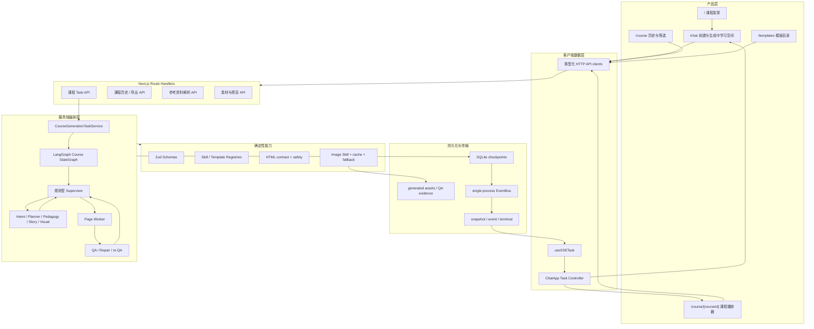
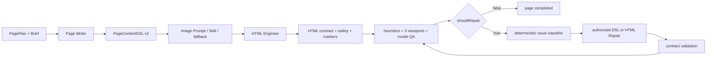

# 课芽架构入口

本文面向第一次阅读项目的开发者和面试官，说明当前生产路径、模块职责和数据边界。完整逐步调用链见[从提示词到最终 HTML](./prompt-to-html-current-flow.md)。

## 1. 系统要解决什么

课芽需要把开放的自然语言需求转化为可持久化、可恢复、可预览、可互动的多章节 HTML 课程。主要工程难点不是“调用一次模型”，而是：

- 把不稳定的模型输出转换成前后端都能消费的结构化状态；
- 维持整门课程的教学顺序、内容一致性和视觉一致性；
- 让每个页面独立生成、检查、修复和恢复；
- 在长任务中公开进度，但不暴露 Prompt、资料原文或模型私有推理；
- 安全展示模型生成的 HTML，并让失败能够定位和重试。

## 2. 当前运行架构

## 3. 默认路径与兼容路径

### `/chat` 默认路径

`POST /api/courses/tasks` 强制新任务使用 `source: "langgraph"`：

1. Route Handler 返回 `202`，并用 Next.js `after()` 启动后台执行。
2. `CourseGenerationTaskService` 管理 queued、running、paused、completed、failed、cancelled。
3. LangGraph 从规则型 Supervisor 开始，在合法全局节点、Page Worker、Retry、Repair 和终态节点之间路由。
4. 每个 checkpoint 先通过共享 Schema 并持久化，再映射为产品公共事件。

### 手写兼容路径

`POST /api/courses/generate` 仍调用手写 `runCourseGenerationWorkflow`，一次性返回完整 JSON。它和 LangGraph 共用 Agent、WorkflowNode、Page Worker、Schema、质量闭环和 checkpoint 语义，不是第二套业务实现。

运行时失败不会自动切换到另一条路径，因为自动双跑会重复模型调用、生图和持久化副作用。

## 4. Agent、Workflow、Skill 与 Template

| 类型 | 负责什么 | 不负责什么 | 例子 |
| --- | --- | --- | --- |
| Agent | 在受约束 Prompt 下生成专业结构化产物 | 持久化、任意路由、绕过 Schema | Planner、Page Writer、HTML Engineer、QA、Repair |
| Supervisor | 从后端给出的合法节点中选择下一步 | 生成课程正文、修改预算、访问完整 HTML | LangGraph Supervisor |
| Workflow / Worker | 编排已知步骤、合并状态、处理失败边界 | 自由创作业务产物 | Course Design Workflow、Page Worker |
| Skill | 执行有限、可验证的工具能力 | 决定课程结构或下一 Agent | 图片生成、模板检索、资料解析 |
| Template | 提供教学结构或视觉 Token | 生成当前主题的最终内容 | FunctionalTemplate、StyleTemplate |
| Validator | 判断数据和 HTML 是否满足合同 | 用模型猜测或修复内容 | Zod Schema、HTML safety、asset binding |

## 5. 课程状态与持久化

`CourseGenerationState` 是课程执行的共享事实来源，包含：

- 原始任务、Reference Packs、Intent、CoursePlan 和专业设计；
- 每页 DSL、素材、HTML、QA、Repair 历史和错误；
- Worker 配置、Supervisor 决策、公开事件和 trace；
- 课程阶段、状态和完成时间。

课程、任务、会话和临时预览保存在 `.data/keya.sqlite`。页面素材、浏览器 QA 截图和 Demo 原始产物保存在被 Git 忽略的 `.data` 子目录。

并发 Page Worker 不能直接写整课状态；更新经过单一 merge/checkpoint 队列串行进入 `CourseGenerationState`，避免覆盖页面结果或重复公共事件 sequence。

## 6. 公共事件和前端边界

SSE 只允许：

- `snapshot`：完整、已校验的课程快照；
- `event`：带 sequence 的公开阶段摘要；
- `terminal`：完成、失败或取消终态。

API client 和 `useSSETask` 负责解析 HTTP/SSE；`ChatApp` 负责课程、任务、会话和页面状态；展示组件只接收投影结果。

公共数据不得包含：

- System Prompt、完整模型消息或 chain-of-thought；
- LangGraph 原生 chunk、内部 node state 或框架 checkpoint；
- 参考资料原始 chunks、服务端文件路径或缓存键；
- Repair 候选全文、HTML diff 或任意未列入 Schema 的 event data。

## 7. 页面质量闭环

QA 只出报告。Repair 的 scope 由服务器根据 issue 和定位信息确定；模型不能修改无关页面或自行宣布通过。有效候选必须重新通过原合同和 re-QA。连续三次没有质量改善会触发 `QUALITY_STALLED`，另有独立紧急上限防止实现错误形成无限循环。

## 8. HTML 安全与互动运行时

- HTML Engineer 输出完整、默认无脚本的 HTML 文档。
- 服务端拒绝外部脚本、事件属性、危险 URL、导航和未授权素材。
- `/chat` 和诊断预览使用空权限 sandbox。
- 持久课程播放器只在再次通过合同和安全检查后注入平台拥有的运行时。
- 学习 iframe 可以 `allow-scripts`，但没有 same-origin、表单、弹窗、下载或页面导航权限。
- iframe 消息必须来自当前 frame，并通过严格消息 Schema。

## 9. 当前限制

- 任务执行权、AbortController 和 EventBus 是单进程实现。
- 没有用户账号、租户权限、分布式队列、对象存储或生产 SLA。
- PDF 不含 OCR；资料检索不含 embedding 或向量数据库。
- 真实模型与图片结果受 Provider 配置、配额和模型质量影响。
- Graph 使用项目自己的 SQLite 领域 checkpoint，不使用 LangGraph 原生持久化格式作为产品事实来源。
- 已实现本地 telemetry，但没有用户级成本账本或商业配额系统。

## 10. 继续阅读

- [从提示词到最终 HTML](./prompt-to-html-current-flow.md)：最完整的调用时序和文件落点。
- [LangGraph 多 Agent 流程](./multi-agent-flow.md)：Supervisor、Specialist、Page Worker 和质量路由。
- [手写兼容流程](./mvp-flow.md)：兼容入口及与当前 Graph 的关系。
- [目录结构](./directory-structure.md)：模块落点与依赖方向。
- [为什么采用多 Agent](../why-multi-agent.md)：单 Agent 对比和架构取舍。
- [共享 Schema](../schema.md)：核心数据合同。
- [产品 UI 集成](../ui-integration.md)：路由、Controller 和展示组件边界。
- [可靠性与成本](../reliability-cost.md)：超时、取消、缓存、路由和降级。
- [HTML 预览安全](../html-preview-security.md)：生成 HTML 的安全边界。
