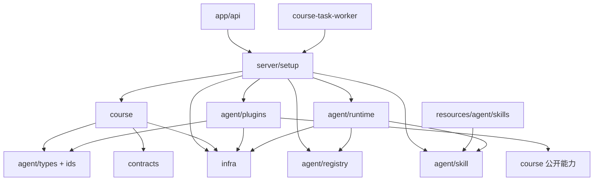

# 后端目标目录架构

> 状态：主体架构已于 2026-07-30 落地。本文保留设计依据、完整约束和迁移记录；当前源码快照以 `directory-structure.md` 为准。
>
> 核心选择：统一 Agent 能力中心、代码插件静态注册、项目内 Skill 资源注册、动态 WorkOrder、生课无固定 Workflow、Director 提议且 Engine/Gate 确定性授权。

## 1. 架构结论

后端继续保持 Next.js 模块化单体，但不再以全局 `storage`、`prompts`、`tools`、`workflows` 等技术目录组织，也不使用 `domain/application/infrastructure` 的重分层命名。

目标采用简洁的“可复用能力 + 少量业务目录”：

```text
agent          统一管理 Agent、代码插件和项目内 Agent Skills
course         课程业务、动态 Run、Task、Gate、Store
conversation   会话业务
preview        预览业务
reference      资料解析与检索业务
infra          AI、数据库、文件、浏览器等基础能力
setup          Web、Worker 和 Agent Registry 的唯一装配入口
resources      项目运行时只读资源；Agent Skill 位于 resources/agent/skills
```

当前不预建 `learning`。未来真正出现辅助学习业务时，再按 `course` 同级增加：

```text
server/learning/
```

Agent 不属于任何固定 Workflow。Agent 是业务运行中可动态选择的一个步骤，由统一 Registry 提供定义，由统一 Runtime 执行。

## 2. 关键运行模型

### 2.1 不再使用固定 Workflow

生课不预先写死：

```text
Architect → Director → Page Builder → Reviewer
```

而是运行一个耐久、事件驱动的 Course Run：

```text
CourseRun
→ 找到可执行 WorkOrder
→ 根据 agentId 从 Registry 获取 Agent
→ Agent Runtime 执行
→ Agent 提交 Artifact 或 Action Proposal
→ Gate 和 Policy 验证
→ 原子接受、派工、返工、审查或发布
→ 继续下一轮，直到终态
```

Engine 只认识标准 WorkOrder 和 Agent ID，不通过 `switch` 写死每一种 Agent。

```ts
const definition = agentRegistry.get(workOrder.agentId);
const result = await agentRuntime.run(definition, workOrder);
```

### 2.2 混合决策

使用已确认的混合模式：

- Course Director 负责语义判断，提交下一步 `CourseActionProposal`；
- Course Run Engine 负责调度、并发、租约、恢复和执行循环；
- Policy 检查当前阶段允许哪些动作和 Agent；
- Gate 检查候选产物是否满足确定性约束；
- Repository 在一个事务内写入状态、Artifact、WorkOrder 和 Event。

Director 不能直接操作数据库或绕过 Gate。它只能提议：

```text
dispatch_agents
request_revision
review_course
repair_pages
publish_course
fail_course
```

Engine 只有在以下条件全部通过后才执行提议：

- Agent ID 已注册；
- Agent 属于当前 Course Policy 的允许集合；
- 输入 Schema 与 WorkOrder 输入兼容；
- 引用的 Artifact 是当前有效版本；
- 页面依赖图无环；
- 并发、轮次和预算没有越界；
- 当前阶段允许该动作；
- 对应 Gate 已通过。

### 2.3 固定的是安全机制，不是业务步骤

以下逻辑必须由代码固定，不能交给模型自由决定：

- Task create/pause/resume/cancel；
- CourseRun 和 WorkOrder lease；
- trace、lockVersion、checkpoint CAS；
- Agent 权限与预算；
- Artifact 不可变和 current 指针；
- Gate；
- 持久化恢复；
- SSE 公开事件清洗；
- 最终发布条件。

业务步骤和 Agent 组合可以动态，执行安全和数据一致性不能动态。

## 3. 目标目录树

```text
src/
├── app/
│   └── api/                                  # Next.js HTTP/SSE 入站
│       ├── _http/
│       │   └── error-response.ts
│       ├── courses/
│       ├── conversations/
│       ├── previews/
│       ├── references/
│       └── pages/                            # 兼容的独立页面能力 API
├── contracts/                                # 可安全发送给浏览器的 Zod 合同
│   ├── course/
│   │   ├── task.ts
│   │   ├── public-event.ts
│   │   ├── public-state.ts
│   │   ├── history.ts
│   │   └── index.ts
│   ├── conversation/
│   ├── preview/
│   └── reference/
├── server/
│   ├── setup/                                # 唯一装配位置
│   │   ├── agent.ts
│   │   ├── skills.ts                         # 扫描项目资源并创建 Skill Registry
│   │   ├── web.ts
│   │   └── worker.ts
│   ├── agent/                                # Agent 通用能力中心
│   │   ├── index.ts                          # 对业务开放的稳定入口
│   │   ├── define.ts                         # defineAgent/Tool/Context
│   │   ├── types/
│   │   │   ├── agent.ts
│   │   │   ├── prompt.ts
│   │   │   ├── tool.ts
│   │   │   ├── context.ts
│   │   │   └── schema.ts
│   │   ├── ids/                              # 唯一 ID 常量来源
│   │   │   ├── agents.ts
│   │   │   ├── prompts.ts
│   │   │   ├── tools.ts
│   │   │   ├── contexts.ts
│   │   │   ├── schemas.ts
│   │   │   ├── skills.ts
│   │   │   └── index.ts
│   │   ├── registry/
│   │   │   ├── registry.ts                  # 统一根 Registry
│   │   │   ├── catalog.ts                   # 静态注册入口
│   │   │   └── validate.ts                  # 引用和冲突检查
│   │   ├── runtime/
│   │   │   ├── runner.ts
│   │   │   ├── loop.ts
│   │   │   ├── budget.ts
│   │   │   ├── permission.ts
│   │   │   ├── tool-runner.ts
│   │   │   ├── events.ts
│   │   │   └── errors.ts
│   │   ├── skill/                            # Agent Skills 开放规范客户端
│   │   │   ├── index.ts
│   │   │   ├── root.ts                      # 唯一项目 Skill 资源根
│   │   │   ├── discover.ts                  # 查找 SKILL.md
│   │   │   ├── parse.ts                     # Frontmatter 与正文解析
│   │   │   ├── registry.ts                  # 项目 Skill 注册中心
│   │   │   ├── catalog.ts                   # name + description 披露
│   │   │   ├── session.ts                   # 已读取文件、去重与上下文保护
│   │   │   ├── path.ts                      # 逻辑资源路径解析
│   │   │   ├── validate.ts
│   │   │   ├── types.ts
│   │   │   └── errors.ts
│   │   └── plugins/                          # TypeScript 代码插件
│   │       ├── index.ts                      # 汇总各业务代码插件
│   │       ├── agents/
│   │       │   └── course/
│   │       │       ├── index.ts
│   │       │       ├── architect.ts
│   │       │       ├── director.ts
│   │       │       ├── page-builder.ts
│   │       │       └── reviewer.ts
│   │       ├── prompts/
│   │       │   └── course/
│   │       │       ├── index.ts
│   │       │       ├── architect.system.v1.md
│   │       │       ├── director.system.v1.md
│   │       │       ├── page-builder.system.v1.md
│   │       │       └── reviewer.system.v1.md
│   │       ├── tools/
│   │       │   ├── system/
│   │       │   │   ├── index.ts
│   │       │   │   └── read-local-resource.ts
│   │       │   └── course/
│   │       │       ├── index.ts
│   │       │       ├── search-references.ts
│   │       │       ├── search-templates.ts
│   │       │       ├── generate-image.ts
│   │       │       ├── inspect-page.ts
│   │       │       └── submit-artifact.ts
│   │       ├── contexts/
│   │       │   └── course/
│   │       │       ├── index.ts
│   │       │       ├── brief.ts
│   │       │       ├── references.ts
│   │       │       ├── architecture.ts
│   │       │       ├── current-pages.ts
│   │       │       └── review.ts
│   │       └── schemas/
│   │           └── course/
│   │               ├── index.ts
│   │               ├── architect.ts
│   │               ├── director.ts
│   │               ├── page-builder.ts
│   │               ├── reviewer.ts
│   │               ├── proposals.ts
│   │               └── tools.ts
│   ├── course/                               # 完整课程业务
│   │   ├── index.ts                          # Route/Worker 使用的门面
│   │   ├── service/
│   │   │   ├── create.ts
│   │   │   ├── query.ts
│   │   │   ├── control.ts
│   │   │   ├── history.ts
│   │   │   └── export.ts
│   │   ├── task/
│   │   │   ├── manager.ts
│   │   │   ├── recovery.ts
│   │   │   ├── support.ts
│   │   │   └── types.ts
│   │   ├── run/
│   │   │   ├── engine.ts
│   │   │   ├── dispatcher.ts
│   │   │   ├── proposal.ts
│   │   │   ├── command.ts
│   │   │   ├── lease.ts
│   │   │   ├── state.ts
│   │   │   ├── work-order.ts
│   │   │   ├── artifact.ts
│   │   │   └── types.ts
│   │   ├── gate/
│   │   │   ├── architecture.ts
│   │   │   ├── page.ts
│   │   │   ├── review.ts
│   │   │   └── final.ts
│   │   ├── policy/
│   │   │   ├── agents.ts                    # 本业务允许的 Agent 集合
│   │   │   ├── dispatch.ts
│   │   │   ├── dependency.ts
│   │   │   ├── revision.ts
│   │   │   └── publish.ts
│   │   ├── page/
│   │   │   ├── validation.ts
│   │   │   ├── quality.ts
│   │   │   └── fallback.ts
│   │   ├── store/
│   │   │   ├── repository.ts                # 原子业务写入
│   │   │   ├── course.ts
│   │   │   ├── task.ts
│   │   │   ├── run.ts
│   │   │   ├── work-order.ts
│   │   │   ├── artifact.ts
│   │   │   ├── operation.ts
│   │   │   └── event.ts
│   │   ├── projection/
│   │   │   ├── state.ts
│   │   │   └── public-event.ts
│   │   ├── stream/
│   │   │   ├── reader.ts
│   │   │   ├── sse.ts
│   │   │   └── event-bus.ts
│   │   └── types/
│   │       ├── brief.ts
│   │       ├── architecture.ts
│   │       ├── page.ts
│   │       ├── review.ts
│   │       └── manifest.ts
│   ├── conversation/
│   │   ├── index.ts
│   │   ├── service.ts
│   │   ├── store.ts
│   │   └── types.ts
│   ├── preview/
│   │   ├── index.ts
│   │   ├── service.ts
│   │   ├── store.ts
│   │   └── types.ts
│   ├── reference/
│   │   ├── index.ts
│   │   ├── parse.ts
│   │   ├── search.ts
│   │   ├── store.ts
│   │   └── types.ts
│   └── infra/                                # 无业务语义的基础能力
│       ├── ai/
│       │   ├── client.ts
│       │   ├── provider.ts
│       │   ├── router.ts
│       │   ├── cache.ts
│       │   ├── model-step.ts
│       │   └── errors.ts
│       ├── database/
│       │   ├── connection.ts
│       │   ├── transaction.ts
│       │   ├── migrations.ts
│       │   └── codec.ts
│       ├── file/
│       │   └── safe-reader.ts
│       ├── browser/
│       └── concurrency/
│           └── pool.ts
├── shared/                                   # 真正跨浏览器/服务端的纯代码
│   ├── html-preview/
│   └── templates/
└── instrumentation.ts

resources/                                    # 课芽产品运行时只读资源
└── agent/
    └── skills/                               # 仅供项目内部 Agent 使用
        └── course-design/                    # 示例：课程架构设计能力
            ├── SKILL.md
            ├── scripts/                      # 可选；默认只读、不可执行
            │   └── validate-plan.js
            ├── references/                   # 可选
            │   ├── learning-objectives.md
            │   └── lesson-sequencing.md
            └── assets/                       # 可选
                └── course-outline.json

scripts/
└── course-task-worker.ts                     # 只调用 server/setup/worker

tests/
├── unit/
│   └── server/
│       ├── agent/
│       ├── course/
│       ├── conversation/
│       ├── preview/
│       ├── reference/
│       └── infra/
├── integration/
│   └── server/
└── architecture/
    └── server-boundaries.test.ts
```

## 4. Agent 能力与资源模型

### 4.1 代码插件 Registry

Agent、Prompt、Tool、Context 和 Schema 是本项目的 TypeScript 代码插件，使用静态 Registry：

```ts
type AgentSystemRegistry = {
  agents: AgentRegistry;
  prompts: PromptRegistry;
  tools: ToolRegistry;
  contexts: ContextRegistry;
  schemas: SchemaRegistry;
};
```

`server/setup/skills.ts` 先建立 Skill Registry，`server/setup/agent.ts` 再完成代码插件注册和交叉校验：

```text
扫描并冻结项目 Skill Registry
→ 创建代码 Registry
→ 注册 Schema
→ 注册 Prompt
→ 注册 Tool
→ 注册 Context
→ 注册 Agent
→ 校验 Agent 引用的 Skill 和本地资源 Tool 权限
→ 冻结代码 Registry
```

注册完成后冻结。运行期间不能替换 Agent、Prompt 或 Tool，避免同一任务在执行中发生配置漂移。Agent Skill 不是 TypeScript 插件，但同样属于项目版本的一部分：`setup/skills.ts` 从项目资源目录建立独立 Skill Registry，然后与 Agent Registry 交叉校验并冻结。

### 4.2 ID 统一管理

业务和插件代码不得硬编码注册 ID。

```ts
export const AgentIds = {
  CourseArchitect: "curriculum-architect",
  CourseDirector: "course-director",
  CoursePageBuilder: "page-builder",
  CourseReviewer: "course-reviewer",
} as const;

export type AgentId =
  (typeof AgentIds)[keyof typeof AgentIds];
```

Prompt、Tool、Context、Schema 和项目 Skill 使用同样方式：

```ts
PromptIds.CourseArchitectSystemV1
ToolIds.SearchReferences
ToolIds.ReadLocalResource
ContextIds.CourseBrief
SchemaIds.CourseArchitectInputV1
SkillIds.CourseDesign
```

推荐使用 `as const`，不使用 TypeScript `enum`：

- 不产生额外枚举运行时代码；
- 可以直接推导联合类型；
- 更容易按插件目录组合；
- 更适合 Zod 和泛型约束。

Agent 的运行 ID 使用稳定、简洁的 kebab-case，Tool 使用与模型调用协议一致的 snake_case；Prompt、Context 和 Schema 使用点分业务命名空间：

```text
curriculum-architect
page-builder
search_references
course.architect.system.v1
course.current-run
course.architecture.v1
```

`SkillIds` 的值是例外：它必须与 Agent Skills 规范中的目录名和 frontmatter `name` 完全一致，因此使用不带点号的 kebab-case，例如 `course-design`。

### 4.3 Agent 定义

每名 Agent 只有一个定义文件，不为单个 Agent 创建 Prompt、Tool、Skill 和 Context 子目录。它通过统一常量声明允许使用的 Skill，并显式获得本地资源只读 Tool：

```ts
export const courseArchitectAgent = defineAgent({
  id: AgentIds.CourseArchitect,
  version: 1,
  description: "根据课程目标和资料设计课程结构",
  input: SchemaIds.CourseArchitectInputV1,
  output: SchemaIds.CourseArchitectureV1,
  prompt: PromptIds.CourseArchitectSystemV1,
  tools: [
    ToolIds.ReadLocalResource,
    ToolIds.SearchReferences,
    ToolIds.SearchTemplates,
    ToolIds.SubmitCourseArchitecture,
  ],
  contexts: [
    ContextIds.CourseBrief,
    ContextIds.CourseReferences,
  ],
  skills: [SkillIds.CourseDesign],
  runtime: {
    maxSteps: 8,
    maxToolCalls: 8,
    timeoutMs: 180_000,
    maxOutputTokens: 32_000,
  },
});
```

`skills` 同时决定：

- 当前 Agent 能看见哪些 Skill metadata；
- `read_local_resource` 可以读取哪些 Skill 子树；
- 启动时必须校验并完整加载哪些 Skill 的 `SKILL.md`；
- 哪些 `references/` 可以在当前 Session 中渐进读取。

定义文件只描述组合关系，不实现数据库写入、Prompt 加载、文件读取或 Tool 逻辑。未声明 `SkillIds` 的 Agent 看不到也读不到对应 Skill。

Agent 定义中的 `tools` 与 `runtime` 同时是新 WorkOrder 的默认权限和预算来源。Course 只能通过统一 Agent Catalog 按 `agentId` 获取它们，不能在 Repository、Command 或业务 Service 中重新声明一套 `ARCHITECT_TOOLS`、`PAGE_BUDGET`。业务策略可以基于实际规模收窄预算，例如 Reviewer 按页面批次数减少 Tool 调用额度，但上限仍来自 Agent 定义。

### 4.4 Prompt、Tool、Context 和 Schema

| 插件 | 职责 | 禁止 |
| --- | --- | --- |
| Prompt | 版本化模板和变量声明 | 直接查询数据库或执行副作用 |
| Tool | Agent 可调用的执行能力，拥有输入输出 Schema | 绕过权限直接访问任意 Store |
| Context | 按 WorkOrder 权限加载只读上下文 | 修改业务状态或返回未授权数据 |
| Schema | Agent、Tool 和 Proposal 的 Zod 输入输出合同 | 混入运行时实现 |

Context Provider 只能读取，业务写入必须经过 Tool 或 Course Command。

### 4.5 真正的 Agent Skill

Agent Skill 遵循 [Agent Skills 开放规范](https://agentskills.io/specification)，是可移植的资源目录，不是 `defineSkill()` 创建的 TypeScript 对象。

```text
skill-name/
├── SKILL.md                  # 必需：YAML metadata + Markdown instructions
├── scripts/                  # 可选：Python、Bash、JavaScript 等脚本
├── references/               # 可选：按需读取的参考资料
└── assets/                   # 可选：模板、图片、数据文件
```

规范允许 Skill 携带其他目录和文件；`scripts/`、`references/`、`assets/` 是约定用途，不是唯一可用资源。

`SKILL.md` 最小格式：

```md
---
name: course-design
description: Design structured courses with observable learning objectives. Use when planning a new course or revising its architecture.
---

# Course Design

## Instructions

...
```

规范要求：

- 目录名必须与 frontmatter 的 `name` 一致；
- `name` 长度 1～64，只允许小写字母、数字和连字符；
- 不能以连字符开头或结尾，不能包含连续连字符；
- `description` 长度 1～1024，同时描述“做什么”和“何时使用”；
- `SKILL.md` 文件名必须完全一致；
- 可选 frontmatter 包含 `license`、`compatibility`、`metadata`；
- `compatibility` 提供时长度不超过 500，`metadata` 是字符串键值映射；
- `allowed-tools` 仍是实验字段，不能作为本系统唯一权限来源；
- `SKILL.md` 建议小于 500 行，详细内容放入 `references/`；
- Skill 内文件使用相对 Skill 根目录的路径。

Skill 和 Tool 的边界：

```text
Skill   = 可移植的说明、流程、知识、脚本和资源包
Tool    = 本系统注册并授权的可执行 API
Prompt  = Agent 的固定角色与行为底座
Context = 当前 WorkOrder 的只读业务事实
```

Skill 可以携带脚本，但脚本不会自动变成 Tool，也不能自动获得数据库、网络、文件写入或进程执行权限。

本项目必须区分两类完全不同的 Skill：

```text
resources/agent/skills/   课芽产品内部 Agent 的运行时资源
.codex/skills/            开发本仓库的 Codex Skill
.agents/skills/           其他开发代理可能使用的 Skill
.claude/skills/           Claude 等开发代理可能使用的 Skill
```

产品 Runtime 只读取第一项，绝不扫描后三项。

### 4.6 项目 Skill 资源根和发现

本项目只设一个确定性资源根：

```text
<project>/resources/agent/skills/
```

代码中只导出这一处根配置：

```ts
export const AGENT_RESOURCE_ROOT = "resources/agent";
export const AGENT_SKILL_ROOT = "resources/agent/skills";
```

发现流程：

```text
定位 resources/agent/skills
→ 遍历它的直接子目录
→ 只识别包含精确 SKILL.md 的目录
→ 解析 frontmatter
→ 校验目录名、name、description 和 compatibility
→ 计算目录 digest
→ 与 SkillIds 交叉校验
→ 注册并 freeze
```

不存在用户级、组织级和覆盖优先级，也不支持运行时热插拔。Skill 随项目代码一起评审、测试、打包和发布；Web 与 Worker 的部署产物都必须复制 `resources/agent`。

### 4.7 Skill Registry

Skill Registry 保存项目 Skill 的索引，不在启动时读取完整正文：

```ts
type ProjectSkill = {
  id: SkillId;
  description: string;
  logicalDir: string;
  logicalSkillFile: string;
  license?: string;
  compatibility?: string;
  metadata: Record<string, string>;
  resourcePaths: string[];
  digest: string;
  diagnostics: SkillDiagnostic[];
};
```

项目内部会引用 Skill，因此统一维护类型安全常量：

```ts
export const SkillIds = {
  CourseDesign: "course-design",
} as const;

export type SkillId =
  (typeof SkillIds)[keyof typeof SkillIds];
```

Skill Registry 对外提供：

```ts
type SkillRegistry = {
  initialize(): Promise<void>;
  get(id: SkillId): ProjectSkill;
  catalog(ids: readonly SkillId[]): SkillCatalogEntry[];
  resolve(id: SkillId, relativePath: string): ResolvedSkillResource;
};
```

绝对路径只在 Registry 和安全文件读取器内部存在。Catalog、模型上下文、Artifact、日志和公开事件只使用逻辑路径，例如：

```text
agent/skills/course-design/SKILL.md
agent/skills/course-design/references/objectives.md
```

### 4.8 使用本地资源 Tool 渐进读取

按照 [Agent Skills 客户端接入指南](https://agentskills.io/client-implementation/adding-skills-support)，拥有文件读取能力的 Agent 可以直接读取 `SKILL.md`。本项目采用受限的 `read_local_resource` Tool，而不是专用 `activate_skill`：

```text
Tier 1：Agent Session 启动
Registry 只注入已授权 Skill 的 name + description + logical path

Tier 2：Skill 匹配当前任务
Agent 调用 read_local_resource 读取对应 SKILL.md

Tier 3：Skill 指令引用其他文件
Agent 再调用 read_local_resource 按需读取 references/assets/其他资源
```


Catalog 示例：

```xml
<available_skills>
  <skill>
    <name>course-design</name>
    <description>...</description>
    <location>agent/skills/course-design/SKILL.md</location>
  </skill>
</available_skills>
```

Agent 读取：

```ts
await readLocalResource({
  path: "agent/skills/course-design/SKILL.md",
});
```

读取 `SKILL.md` 的 Tool 结果会被 Agent Session 标记为已激活 Skill，并在上下文压缩时保护；重复读取同一 digest 不再次注入。其他引用文件按路径和内容 digest 去重，但不默认全部保留。

Agent 可以：

- 根据 Catalog 描述自主选择 Skill；
- 由用户显式指定 Skill；
- 读取 Agent 定义中声明的 Skill；
- 在同一次 Agent Session 中激活多个 Skill。

Agent 不可以：

- 读取 Agent 定义中未声明的 Skill；
- 读取 `resources/agent` 以外的文件；
- 使用绝对路径、`..` 或符号链接逃出授权 Skill 子树；
- 仅凭 `allowed-tools` frontmatter 扩大自身 Tool 权限。

### 4.9 `read_local_resource` 权限和安全

`read_local_resource` 是系统级只读 Tool：

```ts
type ReadLocalResourceInput = {
  path: string;
};

type ReadLocalResourceGrant = {
  skillIds: readonly SkillId[];
  maxFileBytes: number;
  maxSessionBytes: number;
  allowedMediaTypes: readonly string[];
};
```

Tool 是否可调用由 `ToolIds.ReadLocalResource` 决定；可以读取哪些路径由 Agent 的 `skills` 决定。两项权限必须同时满足。

实现必须：

- 只接受 `agent/...` 逻辑路径，不接受宿主绝对路径；
- 使用 `realpath` 后再次检查目标仍在授权 Skill 子树；
- 拒绝 `..`、空字节、越界符号链接、目录读取和特殊设备；
- 限制单文件、单次 Agent Session 的累计字节数和读取次数；
- 文本按 UTF-8 返回，二进制只返回受控 ResourceRef 和 MIME 信息；
- 不读取 `.env`、`.git`、`.data`、源码目录、数据库或其他运行时秘密；
- 记录 `agentId`、`workOrderId`、逻辑路径、digest、字节数和结果；
- 将读取 Tool 纳入 WorkOrder 的步数、Tool 调用数和超时预算。

`scripts/` 在本阶段只是可读取资源，不能执行。以后确实需要执行 Skill 脚本时，必须新增独立的 `run_skill_script` Tool、沙箱和显式 Agent 权限，不能借用读取 Tool 执行。

### 4.10 启动校验

代码插件的 `registry.validate()` 必须检查：

- 所有 ID 唯一；
- Agent 引用的 Prompt、Tool、Context、Schema 全部存在；
- Agent 输入输出 Schema 已注册；
- Tool 输入输出 Schema 已注册；
- Prompt 所需变量能由输入或 Context 提供；
- Agent 默认预算合法；
- Tool 权限和 Agent 允许列表兼容；
- 已弃用插件不能被新 Agent 引用；
- Agent 版本和 Prompt 版本完整；
- Course Policy 引用的 Agent 已注册。

Skill Registry 单独检查：

- `resources/agent/skills` 存在且部署产物可读；
- 必需的 `SKILL.md` 可解析；
- `name` 和 `description` 存在；
- 目录名、frontmatter `name` 和 `SkillIds` 值完全相同；
- 每个 `SkillIds` 都有资源目录，每个资源目录也都登记在 `SkillIds`；
- 每个 Agent 引用的 Skill 已注册；
- 声明 Skill 的 Agent 同时拥有 `ToolIds.ReadLocalResource`；
- compatibility 与当前运行环境不冲突；
- 所有资源真实路径仍在 `resources/agent/skills`；
- Web 和 Worker 看到相同的 Skill digest。

这些 Skill 是项目自身的受信资源，不采用面向第三方客户端的宽松解析。目录、frontmatter、ID 或打包结果不一致时，Web/Worker 启动失败。

## 5. Course Run 动态派工

### 5.1 WorkOrder

每个 WorkOrder 至少包含：

```ts
type WorkOrder = {
  id: string;
  runId: string;
  agentId: AgentId;
  scope: CourseWorkScope;
  inputArtifactRefs: ArtifactRef[];
  dependencies: string[];
  allowedTools?: ToolId[];
  budget?: AgentBudget;
  status: WorkOrderStatus;
  lease?: WorkOrderLease;
};
```

`agentId` 是统一常量约束的 ID。WorkOrder 可以进一步收窄 Agent 定义中的 Tool 和预算，但不能扩大权限。

### 5.2 Action Proposal

Director 不直接创建 WorkOrder，而是提交结构化 Proposal：

```ts
type CourseActionProposal =
  | DispatchAgentsProposal
  | RequestRevisionProposal
  | RepairPagesProposal
  | ReviewCourseProposal
  | PublishCourseProposal
  | FailCourseProposal;
```

派工提议示例：

```ts
{
  action: "dispatch_agents",
  assignments: [
    {
      agentId: AgentIds.CoursePageBuilder,
      scope: { type: "page", pageId: "page-3" },
      inputs: [architectureRef, pageTaskRef],
      dependsOn: ["page-1"],
    },
  ],
}
```

### 5.3 Engine 执行循环

```text
领取 CourseRun lease
→ 加载当前事实和非终态 WorkOrder
→ 执行当前可运行 WorkOrder
→ Gate 验收提交
→ 若还有可运行 WorkOrder，继续并行执行
→ 若需要语义决策，创建 Director WorkOrder
→ 校验 Director Proposal
→ 原子创建下一批 WorkOrder 或进入终态
→ 写入投影与公开事件
```

Engine 不需要知道未来新增 Agent 的实现。新增 Agent 后，只要：

1. 新增 ID 常量；
2. 注册 Schema、Prompt、Tool、Context；
3. 注册 Agent 定义；
4. 在 Course Policy 中允许；
5. Director 能在 Proposal 中选择；
6. 对应 Gate 能验证交付物。

就可以进入现有 Run。

### 5.4 Director 的边界

Director 是课程业务中的协调 Agent，不是 Agent Registry 的管理者。

```text
Agent Registry：代码系统，管理所有 Agent 定义
Course Director：模型 Agent，提议当前课程下一步动作
Course Run Engine：代码系统，执行和持久化被授权动作
```

三者不能混为一个万能 Supervisor。

## 6. 依赖方向



强制规则：

1. Route 和 Worker 只能调用 `setup` 提供的已装配门面。
2. `course` 不导入任何具体 Agent 插件，只依赖 Agent 类型、ID 和注入的 Agent Executor。
3. `agent/runtime` 不包含课程判断。
4. `agent/plugins` 不直接导入 Course Store；Tool 和 Context 通过 setup 注入的课程公开能力访问业务。
5. `course/store` 可以依赖 `infra/database`，但 `infra` 不能反向依赖 `course`。
6. `infra` 不能包含 CourseRun、WorkOrder、Artifact 等业务名词。
7. `contracts` 和 `shared` 不能导入 `server`。
8. Prompt、Tool、Context、Schema 和 Agent 通过代码插件 Registry 使用。
9. 新代码不得恢复固定 `workflow` 目录。
10. Skill 只能来自 `resources/agent/skills`，不能放进 `agent/plugins`，也不能从开发代理目录发现。
11. Agent 只能通过授权的 `read_local_resource` Tool 读取 Skill 文件，不能获得任意宿主文件读取权限。
12. `resources/agent/skills` 只保存资源，不允许 TypeScript 业务代码直接 import 其中脚本。

为避免 `course ↔ agent/plugins` 循环，Course Run 使用调用方定义的执行接口：

```ts
type AgentExecutor = {
  run(workOrder: WorkOrder): Promise<AgentRunResult>;
};
```

`server/setup` 将 Agent Runtime 适配为 `AgentExecutor` 后注入 Course Engine。具体 Course Tool/Context 所需的查询和命令也由 setup 注入插件工厂。

## 7. 命名规则

### 7.1 目录命名

- 顶层使用单数能力名：`agent`、`course`、`conversation`、`preview`、`reference`、`infra`；
- 仓库根级 `resources` 只存放随产品发布的运行时资源，不是服务端业务模块；
- 不使用 `modules`、`domain`、`application`、`platform`；
- 不创建空的未来目录；
- 禁止根级 `common`、`utils`、`helpers`、`shared-server`；
- 目录已经表达上下文时，文件名不要重复目录名。

推荐：

```text
course/run/engine.ts
course/gate/page.ts
course/store/artifact.ts
agent/runtime/runner.ts
agent/plugins/agents/course/director.ts
```

不推荐：

```text
course/run/course-run-engine.ts
course/gate/course-page-gate.ts
course/store/course-artifact-store.ts
agent/runtime/agent-runtime-runner.ts
```

### 7.2 文件命名

- TypeScript 文件统一 kebab-case；
- 文件名使用职责名或动宾结构；
- Tool 使用动宾形式：`search-references.ts`、`submit-artifact.ts`；
- Context 使用名词：`course-brief.ts`、`current-run.ts`；
- Agent 文件使用角色名：`architect.ts`、`director.ts`、`reviewer.ts`；
- Prompt 文件保留版本：`architect.system.v1.md`；
- ID 常量按类别集中：`ids/agents.ts`、`ids/tools.ts`、`ids/skills.ts`；
- `index.ts` 只做稳定导出，不写业务逻辑。

Skill 文件不遵循普通 TypeScript 插件命名，而遵循 Agent Skills 规范：

```text
course-design/
├── SKILL.md
├── scripts/
│   └── validate-plan.js
├── references/
│   └── learning-objectives.md
└── assets/
    └── course-template.json
```

- Skill 目录使用 kebab-case；
- 目录名必须与 `SKILL.md` 的 `name` 相同；
- `SKILL.md` 必须使用大写固定文件名；
- `scripts/`、`references/`、`assets/` 使用规范目录名；
- Skill 名称由目录和 frontmatter 决定，并同步登记到 `ids/skills.ts`；
- Agent 代码只通过 `SkillIds` 引用，不硬编码 Skill 名称或物理路径；
- Skill 内引用使用相对 Skill 根目录的路径，Agent Catalog 使用 `agent/skills/...` 逻辑路径。

### 7.3 类型和接口

- 文件私有类型留在使用文件；
- 同一能力多个文件共享的类型才进入该目录的 `types.ts`；
- 浏览器合同进入 `src/contracts`；
- Agent 私有输入输出进入 `agent/plugins/schemas`；
- 服务端 CourseRun、WorkOrder、Artifact 进入 `course/run` 或 `course/types`；
- 不创建全局 `types` 垃圾目录；
- 单实现且不会替换的局部函数不创建无意义接口；
- 对外部能力、Store、Agent Executor 等测试边界使用小接口。

### 7.4 文件规模

- 单文件硬上限 1000 行；
- 800 行开始评估拆分；
- 按职责拆分，禁止 `part-1.ts`、`part-2.ts`；
- 不为少于 30 行且只被一个文件使用的实现创建独立文件；
- Agent 定义文件只保留配置，通常应明显小于 200 行。

## 8. 公开合同与内部 Schema

`src/contracts` 只保存能安全发给浏览器的 API/SSE 合同：

- Course Task 创建、控制、公开状态和公开事件；
- Course History、详情、封面和导出响应；
- Conversation；
- Preview；
- Reference 上传与解析结果。

以下内容不得放入公开合同：

- Agent Prompt；
- Tool 原始参数；
- Agent 私有 Context；
- CourseRun lease 和 lockVersion；
- WorkOrder 权限；
- 私有 Artifact payload；
- Provider 原始错误；
- 服务器文件路径。

Agent 输入输出 Schema 放在：

```text
server/agent/plugins/schemas/<业务>/
```

并通过 `SchemaIds` 注册。若同一个 Zod Schema 确实同时属于浏览器合同和 Agent 输入，可以直接注册 `src/contracts` 导出的 Schema 对象，避免复制两份定义。

## 9. Infra 的职责

`infra` 只保存无业务语义、可被多个业务能力复用的基础实现：

| 目录 | 内容 |
| --- | --- |
| `infra/ai` | Provider、Client、Router、Cache、通用 Model Step |
| `infra/database` | SQLite connection、transaction、migration、codec |
| `infra/file` | 通用文件读写和路径安全 |
| `infra/browser` | Playwright 启动和浏览器基础操作 |
| `infra/concurrency` | 通用 Promise Pool 等并发原语 |

以下文件不能进入 `infra`：

- `course-run-store.ts`；
- `work-order-store.ts`；
- `page-gate.ts`；
- `course-task-service.ts`；
- `course-review.ts`。

它们具有明确课程语义，应留在 `course`。

## 10. 已完成代码迁移映射

| 当前代码 | 目标位置 |
| --- | --- |
| `server/course-generation/agents/*`、Page Builder | `agent/plugins/agents/course/*` |
| Agent Context 文件 | `agent/plugins/contexts/course/*` |
| Agent Tool 文件 | `agent/plugins/tools/course/*` |
| Agent 输入输出 Zod Schema | `agent/plugins/schemas/course/*` |
| `server/course-generation/runtime/*` | `agent/runtime/*` |
| Agent 预算、权限、Tool result | `agent/runtime` 与 `agent/types` |
| `server/prompts/*`、Prompt 模板 | `agent/plugins/prompts/course/*` |
| `server/tools/skill-registry.ts` | 该文件实际注册可执行函数，迁入 `agent/registry` 并更名为 Tool Registry；项目 Skill Registry 新建于 `agent/skill/registry.ts` |
| `server/tools/retrieval-skills.ts` | 现有检索执行代码迁入 `agent/plugins/tools/course/search-references.ts`；标准说明资源另放 `resources/agent/skills` |
| `server/tools/generate-image-skill.ts` | `agent/plugins/tools/course/generate-image.ts` |
| `server/model-steps/*` | 可执行部分变为 `agent/plugins/tools/course/*`；纯通用执行器进入 `infra/ai/model-step.ts` |
| HTML/页面纯校验和 fallback | `course/page/*` |
| `architecture-gate.ts`、`page-gate.ts`、Review Gate | `course/gate/*` |
| Run/Revision Policy | `course/policy/*` |
| `course-run-engine*` | `course/run/engine.ts`、`dispatcher.ts`、`lease.ts` |
| `course-run-commands.ts`、`course-revision-commands.ts` | `course/run/command.ts` 与 `course/store/repository.ts` |
| `course-run-repository*` | `course/store/repository.ts` |
| `course-state-projector.ts`、公开事件投影 | `course/projection/*` |
| `server/tasks/*` | `course/task/*` 和 `course/stream/*` |
| Course、Task、Run、WorkOrder、Artifact Store | `course/store/*` |
| `storage/database.ts`、`storage-codec.ts` | `infra/database/*` |
| `server/ai/*` | `infra/ai/*`；HTTP Response 映射移到 `app/api/_http` |
| `server/quality/*` | 纯规则进 `course/page` 或 `course/gate`；浏览器基础实现进 `infra/browser` |
| `server/repair/*` | Repair Tool 进 `agent/plugins/tools/course`，纯策略进 `course/policy` |
| `server/workflows/image-asset-workflow.ts` | 拆为生图 Tool 与课程策略；若另有生图方法论 Skill，则收录到 `resources/agent/skills` |
| `server/workflows/qa-repair-loop.ts` | Repair Tool + `course/policy/revision.ts` |
| `server/workflows/course-design-workflow.ts` | 拆为 Architect Agent、Prompt、Tool 与 Context；课程设计方法论可整理为 `resources/agent/skills/course-design` |
| `server/workflows/promise-pool.ts` | `infra/concurrency/pool.ts` |
| `server/courses/*` | `course/service/*` |
| `server/conversations`、Conversation Store | `conversation/*` |
| Preview Store | `preview/*` |
| `skills/parse-uploaded-file.ts` | `reference/parse.ts` |
| `shared/course-schema` | 浏览器合同进入 `contracts/course`；Agent Schema 进入插件；运行事实进入 `course` |

## 11. 渐进迁移记录

迁移按可验证阶段完成；以下记录用于解释当前目录从何而来。

### 阶段 0：依赖安全网

- 新增非法 import 检查；
- 固化 API、SSE 和数据库兼容测试；
- 记录当前文件级循环依赖；
- 禁止新文件进入旧 `workflows/prompts/model-steps/tools/storage`。

### 阶段 1：建立 Agent 类型、ID 与 Registry

- 创建 `agent/types`、`agent/ids`、`agent/registry`；
- 实现 `defineAgent/Tool/Context`；
- 实现静态 `catalog`、启动校验和 freeze；
- 先使用兼容 Adapter 注册现有 Agent，不改变运行行为。

完成标准：现有四类 Agent 都能通过统一 ID 从 Registry 解析。

### 阶段 2：建立标准 Skill 子系统

- 创建 `resources/agent/skills`、`agent/skill` 和 `setup/skills.ts`；
- 创建 `ids/skills.ts`，实现项目 Skill 发现、严格解析、digest 和 freeze；
- 实现含 `name`、`description`、逻辑路径的 Agent Catalog；
- 新增系统 Tool `read-local-resource.ts` 和 `infra/file/safe-reader.ts`；
- 按 Agent 的 `skills` 列表生成只读授权子树；
- 实现 Skill 指令与引用资源的按需读取、Session 去重和上下文保护；
- Skill 脚本只读不可执行。

完成标准：项目 Agent 只能读取其定义中声明的 `resources/agent/skills/<skill>`，无法读取源码、配置、数据库或其他 Agent 的 Skill。

### 阶段 3：统一 Agent Runtime

- 迁移 Runner、预算、权限、事件和 Tool 执行；
- WorkOrder 改为保存受约束的 `AgentId`；
- Course Engine 通过注入的 `AgentExecutor` 执行，不直接 import Agent；
- Agent Session 接入 Skill Catalog、本地资源读取记录和上下文保护；
- 修复 Model Step 的两组循环依赖。

完成标准：新增 Agent 不需要修改 Agent Runtime。

### 阶段 4：迁移代码插件

- Agent 定义进入 `plugins/agents/course`；
- Prompt、Tool、Context、Schema 分类别集中注册；
- 当前 `model-steps` 和生成流程拆成可注册 Tool；
- 所有插件引用统一 ID 常量；
- Registry 启动时验证所有引用。

完成标准：业务代码中不存在 Agent/Tool/Prompt ID 硬编码字符串。

### 阶段 5：改造动态 Course Run

- 定义 `CourseActionProposal`；
- Director 只提交 Proposal；
- 新增 Dispatch Policy 和 Proposal Gate；
- Engine 改为通用 WorkOrder 循环；
- Repository 原子执行合法 Proposal；
- 保留现有 lease、trace、CAS、Artifact 和恢复语义。

完成标准：Engine 中不再按具体 Agent 名称硬编码固定执行链。

### 阶段 6：收拢 Course 与 Infra

- Task、Run、Gate、Policy、Store、Projection、Stream 移入 `course`；
- AI 和 SQLite 基础能力移入 `infra`；
- conversations、preview、reference 分别收拢；
- 删除固定 Workflow 和旧全局技术目录；
- 拆分公开合同与 Agent 私有 Schema。

### 阶段 7：删除兼容层

- Route/Worker 只调用 `setup`；
- 删除旧路径 re-export；
- 更新源码路径文档；
- 将边界测试加入持续验证；
- 删除空目录和 `.gitkeep`。

## 12. 测试与验收

每个阶段至少运行：

```bash
npm run lint
npx tsc --noEmit
npm test
```

新增或重点维护：

- Registry 重复 ID、缺失引用和 freeze 测试；
- Agent 定义 Schema 兼容测试；
- Tool 权限和预算测试；
- `resources/agent/skills` 唯一根、部署资源缺失和 Registry freeze 测试；
- `SKILL.md` frontmatter、目录同名、缺失字段和 compatibility 校验测试；
- `SkillIds`、资源目录和 Agent `skills` 引用一致性测试；
- Skill Catalog 只披露 `name`、`description` 和逻辑路径的测试；
- `read_local_resource` Tool 授权存在性与 Skill 子树隔离测试；
- `SKILL.md` 读取去重、上下文压缩保留和引用资源按需加载测试；
- Skill 资源的 `..`、符号链接逃逸、文件大小与累计预算测试；
- 二进制资源返回、MIME allowlist 和审计事件测试；
- `scripts/` 不能通过读取 Tool 执行的测试；
- Product Runtime 不扫描 `.codex/.agents/.claude` Skill 的隔离测试；
- Web 与 Worker 部署产物包含相同 Skill digest 的集成测试；
- Director Proposal Policy/Gate 测试；
- 动态派工和新增 Agent 测试；
- WorkOrder 并发、租约、恢复和幂等测试；
- SQLite 原子派工集成测试；
- Web/Worker 跨进程 SSE 回放测试；
- 前端 bundle 不包含 Agent Prompt、私有 Context 和 Node-only 代码；
- import 边界测试；
- 单文件不超过 1000 行。

## 13. 新增 Agent 的标准流程

未来新增 Agent 时只需要：

```text
1. 在 ids/agents.ts 增加 Agent ID
2. 按需增加 Schema/Prompt/Tool/Context/Skill ID
3. 实现并注册缺少的插件
4. 新增一个 Agent 定义文件
5. 在 skills 中声明可用 Skill；非空时同时授予 ReadLocalResource Tool
6. 在对应业务 Policy 中允许该 Agent
7. 补充定义校验、资源权限和动态派工测试
```

不需要：

- 新建 Workflow；
- 修改 Agent Runtime；
- 在 Course Engine 增加具体 Agent 分支；
- 为该 Agent 创建一套独立 Prompt/Tool/Context 管理目录；
- 直接修改数据库访问逻辑。

## 14. 引入项目 Agent Skill 的标准流程

可以从外部仓库或 Skill 市场选择成熟 Skill，但引入后它就是项目受版本控制的运行时资源，不是安装给开发代理的个人 Skill。

```text
1. 从外部 Skill 仓库、包或内部制品库选择兼容版本
2. 审查来源、许可证、SKILL.md、脚本和全部资源
3. 复制到 resources/agent/skills/<skill-name>
4. 使用规范校验器检查目录和 SKILL.md
5. 在 ids/skills.ts 增加对应 SkillIds 常量
6. 在目标 Agent 定义的 skills 中声明该 Skill
7. 确认 Agent 拥有 ToolIds.ReadLocalResource
8. 运行 Registry、路径隔离和部署资源测试
9. 随 Web/Worker 版本一起发布
```

Agent Runtime 不提供联网安装、用户级覆盖或热更新。新增、升级和删除 Skill 都走正常代码评审与发版，保证一次 WorkOrder 使用的 Skill 内容可复现。
