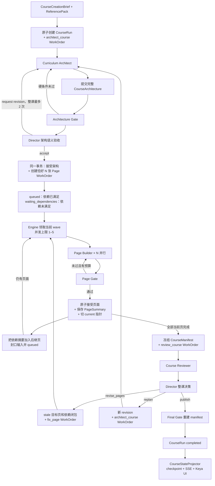

# agent-v2 多 Agent 执行流程

> 本文描述当前生产事实。旧 Supervisor、九名 Specialist、Page Worker 固定流水线和 LangGraph 内容属于历史实现，不再是新任务入口。

## 1. 设计目标

多 Agent 不是多起几个名字，而是让每个需要模型判断的角色都有：

- 独立目标和 `WorkOrder`；
- 封口输入和 Artifact 版本；
- 明确的可用工具和禁止范围；
- 模型可以根据工具结果选择下一步；
- 可验证的提交或阻塞终态；
- 独立预算、租约、恢复和返工边界。

机械动作由 TypeScript 引擎、Repository 命令和 Gate 完成，不伪装成 Agent。

## 2. 四个 Agent

| Agent | 输入 | 负责 | 不负责 | 终态工具 |
| --- | --- | --- | --- | --- |
| Curriculum Architect | Brief、资料、模板、修订意见 | 一次设计完整 CoursePack、CourseBlueprint 和全部 PageTask | 写单页 HTML、派工、发布 | `submit_course_architecture` |
| Course Director | 当前 Run 摘要、完整架构或冻结 Review | 在两个语义时点选择接受、退回、发布、修页、重规划或失败 | 每步调度、写页面、绕过 Gate | 架构决策或整课决策 terminal tool |
| Page Builder | 一张 PageTask、授权资料、依赖 PageSummary、可选旧产物和 issue | 自主调用模型步骤与工具，生成并定向修订一页 | 改架构、改其他页、自评通过 | `submit_page` / `block_page` |
| Course Reviewer | 冻结 manifest、全部页面摘要和受控质量证据 | 检查跨页目标、重复、断层、难度、一致性和互动 | 修改页面、派工、发布 | `submit_course_review` / `block_course_review` |

Director 是主 Agent，但不是常驻 Supervisor。它只在架构提交后和整课 Review 提交后运行短回合。

Page Writer、Image Prompt、HTML Engineer、Page QA、Repair、Pedagogy、Story 和 Visual 等能力现在是 `src/server/agent/plugins/model-steps/course/` 中的 Model Step。它们能完成专业模型生成，但没有独立 WorkOrder、派工权和恢复边界，因此不算顶层 Agent。

## 3. 全局时序



核心顺序是：

```text
先完成整课架构
→ Director 确认整体方向
→ 原子派发全部页面工作单
→ 页面才按真实依赖波次并行
```

Architect 不能一边规划一边启动 Page Builder，否则各页看不到完整目标矩阵，运行层也无法证明已经创建了恰好 N 张页面任务。

## 4. 协作协议

### CourseArchitecture

一次提交三类全局事实：

- `CoursePack`：事实、术语、例子、约束和资料引用；
- `CourseBlueprint`：受众、目标、统一教学与视觉规则；
- `PageTask[]`：每页职责、目标、互动、素材、验收和 build 依赖。

Architecture Gate 检查 ID、顺序、目标覆盖、模板、互动、引用和无环依赖；Director 再判断页面是否重复、难度是否合适、依赖是否真的必要。

### WorkOrder

每个 Agent 回合都绑定一张工作单，保存：

- kind、course/page scope 和父任务；
- 输入 ArtifactRef、输入封口时间和依赖；
- allowedTools、acceptance 和预算；
- executionAttempt、lease、状态和 submission。

Agent 运行中不能突然读取未授权的新版本。

当前首张 `architect_course` 是一个明确例外：它的 `inputArtifactRefs` 为空，
`creationBrief` 和 `referencePacks` 固定在 TaskRecord，由 Engine 按当前 task/trace
传入；修订回合才附带旧架构等 ArtifactRef。要把所有输入统一成 ArtifactRef，仍需
另做 Brief/ReferencePack 产物化，不能把它当成当前已有能力。

### Artifact

架构、内容、素材、HTML、质量、摘要、manifest 和 review 都是不可变 Artifact。修订会产生新 Artifact，`CourseRun` 只切换 current 指针。Reviewer 因此能明确自己审的是哪一版。

### PageSummary

后继页不读取上游完整 HTML，只读取已验收摘要：

- 已讲知识和学习结果；
- 需要延续的事实、术语和状态；
- 质量结论；
- 可安全引用的 ArtifactRef。

### CourseManifest

全部当前页完成后，系统把架构和每页精确 ArtifactRef 固定成 manifest 并计算 hash。Reviewer 和 Final Gate 都以这个版本为准。

## 5. 页面 wave 如何运行

`order` 只决定学习展示顺序；`buildDependsOnPageIds` 才决定生成顺序。

```text
page-1: 无依赖
page-2: 无依赖
page-3: 依赖 page-1
page-4: 依赖 page-1
page-5: 依赖 page-3、page-4

wave 1: page-1 + page-2
wave 2: page-3 + page-4
wave 3: page-5
```

Engine 每轮领取当前可运行 WorkOrder，并用 Promise Pool 并行。页面通过 Gate 后，Repository 在事务中保存 PageSummary、更新 current page 并解锁依赖已满足的后继页。

不要为了“课程有顺序”把所有页串成依赖链。只有后页必须读取前页实际生成结果时才声明 build 依赖。

## 6. Page Builder 内部

Page Builder 是一个真 Agent；它调用的能力不是子 Agent：

```text
读取封口上下文
→ 按需运行 Page Writer Model Step
→ 按需生成素材
→ 运行 HTML Model Step
→ 运行确定性检查和 Page QA Model Step
→ 仅在 Gate 给出可定位 error 时运行受限 Repair Model Step
→ terminal submit / block
```

`AgentRunner` 强制：

- 只能调用 WorkOrder allowlist 内的工具；
- 模型步数、工具次数、时间等预算不能自行扩大；
- terminal 工具必须真正提交到 Repository；
- Agent 返回后重新读取同 trace、同 WorkOrder 的终态；
- 暂时性 Provider 错误才允许一次配置好的模型 fallback。

模型说“已经完成”不算完成，Repository 中的终态才算。

质量分用于发现 Prompt、模型、Skill 或页面设计的系统性改进方向，不是自动返工条件。没有具体 `error` 的低分页面可以首轮提交；Schema 或业务错误会立即停止当前执行，不会通过同一 Tool 的循环重试掩盖上游问题。

`block_page` 也不是普通错误出口。它要求当前 execution attempt 已读取封口上下文，
已有失败的 current `PageQuality`，并且出现以下至少一种情况：修复被明确拒绝、有效
质量修订预算耗尽，或确定性修复计划无法授权任何可行修复。普通 Provider、内容、
素材或 HTML 工具失败都不能让模型直接阻塞页面。缺失 ReferencePack/Chunk 则在
Page Builder 启动前以 `PAGE_REFERENCE_INPUT_INVALID` 失败，不交给 Agent 自行解释。

## 7. 两层质量验收

### Page Gate

代码检查：

- DSL 是否覆盖 PageTask；
- 素材槽是否齐全；
- HTML 合同、安全和素材绑定；
- 互动、完成条件和反馈；
- 质量报告和截图证据是否属于当前版本。

Page Builder 可以修订候选，但不能给自己盖章。

### Reviewer + Final Gate

Reviewer 检查整课：

- 目标是否既有教学覆盖又有学习证据；
- 是否有重复、断层或难度突跳；
- 事实、术语、例子和视觉规则是否一致；
- 互动是否落地并有反馈；
- 开头承诺和结尾回扣是否对应。

Reviewer 不能抽样后直接交活。它必须先读取课程目标矩阵，再把当前 manifest 下的
`PageSummary` 和 `QualityReport` 分页读到末尾，最后才能校验、提交或阻塞。
工具调用预算按页数计算：每批最多 20 页，200 页课程也能在有界预算内完成完整审查。
批量质量结果只返回分数、问题摘要和截图指标，避免 16 KB ToolResult 截断后仍被误判
为“已经看完”。

`block_course_review` 不是 Reviewer 的主观退出按钮。只有全量证据已经读完，且机器
检查发现 PageSummary 的 `courseId/order` 与冻结 manifest 冲突，或 PageSummary 的
质量投影 `overallScore/decision/issueCodes` 与对应 PageQuality 冲突时才会动态开放。
PageQuality 本身没有课程和顺序字段。健康证据下该工具既不出现在 active tools 中，
执行层也会拒绝；少读证据只会要求继续读取，内容质量问题必须提交
`revise_pages` 或 `replan`。

每条 Review issue 都必须引用 Reviewer 实际读过的 current 证据：

- 页面级 issue 至少包含该页的 `page_summary` 或 `page_quality` 精确
  ArtifactRef；
- 课程级 issue 只能引用 current `course_architecture`、`page_summary` 或
  `page_quality`；
- 只引用 `page_html`、`page_content` 或 `page_assets` 会被 Schema 和 Gate 拒绝。

Director 只能根据 Review 选择发布、局部返工或重规划。发布前 Final Gate 会从 current 指针重建 manifest；旧 Review 不能发布新页面。

Director 的所有终态动作也有证据前置条件：

- 架构回合先调用 `inspect_architecture`，才能接受、退回或失败；
- Review 回合先调用 `inspect_course_review`，才能发布、返工、重规划或失败。

“先 inspect”只是必要条件，不会自动获得失败权限。合法架构和 `pass` Review 下
`fail_course` 会被隐藏并在执行层拒绝；只有架构语义退回、页面返工或 replan 的
持久化预算确实耗尽后，机器 Gate 才会开放失败动作。架构语义退回在整个任务内最多
2 次，第三次 `request_architecture_revision` 会返回确定性预算错误，Director 随后
只能按该机器原因终止，不能采用模型自报的错误码或“我觉得不可恢复”。

## 8. 返工和失效传播

局部问题使用 `fix_page`：

1. 标记 Reviewer 点名页面为 stale；
2. 计算真正依赖这些页面的传递后继页；
3. 为目标集合创建修订 WorkOrder；
4. 页面 issue 必须用机器字段 `targetArtifact` 明确指定
   `page_content` 或 `page_html`，不能从自然语言建议里猜；
5. 旧页面 Artifact 只作为只读 `baseline`，不是新 WorkOrder 的 checkpoint；
6. 直接命中 issue 的页面必须先生成新的目标 Artifact；依赖闭包页一律按
   `page_content` 重新生成，以消费新的上游 `PageSummary`；
7. 内容返工继续重建素材、HTML 和质量；HTML 返工可以复用未改动的 baseline
   内容/素材，但必须生成新 HTML 和新质量证据；
8. 重新执行 Page Gate、manifest、Reviewer 和 Director。

`submit_page` 还会核对本次 Fix WorkOrder 是否真的产生了目标 Artifact 和当前
`PageQuality`。把旧 content/html/quality 原样塞回去，或只写一句“已修复”，都不能
交活。

全局目标、页面职责或课程顺序本身错误时才 `replan`。新 revision 从 Architect 开始；
旧分支保留审计，但不再是 current。架构验收阶段的语义退回最多 2 次，整课 Review
触发的 replan 最多 1 次；达到上限后由机器资格 Gate 决定是否允许失败，不无限循环。

## 9. 持久化、审计和恢复

| 表 | 作用 |
| --- | --- |
| `course_execution_claims` | 同一 `courseId` 的唯一活动 Task 执行权 |
| `course_task_control_intents` | 跨进程取消意图；阻止 resume 和旧 runner 复活任务 |
| `course_runs` | 当前指针、阶段、stale 标记、整课 lease |
| `course_work_orders` | Agent 工作单、输入、预算、状态和 lease |
| `course_artifacts` | 不可变业务产物 |
| `course_tool_operations` | 工具输入哈希、状态、安全摘要和 ArtifactRef 审计 |
| `course_run_events` | 可投影的有序运行事件 |

`ToolOperation` 不提供通用 exactly-once 和自动 tool replay。当前安全保证分层实现：

- Repository 事务保证业务状态不会只改一半；
- WorkOrder 幂等键避免重复派发同一业务任务；
- Artifact 不可变并通过 current 指针选择版本；
- 图片缓存等具体工具降低重复外部调用；
- ToolOperation 记录输入哈希和结果引用，便于排错和审计。

如果外部 Provider 已成功，但进程在缓存或 Artifact 落库前崩溃，恢复时仍可能重复调用。需要 Provider 幂等键或工具级预留/提交协议，才能进一步收窄这个窗口。

恢复依赖显式执行者：

```text
Next instrumentation：启动时 scanOnce，仅一次快路径
npm run worker:course：常驻轮询 queued/running agent-v2 Task
CourseRunEngine：通过数据库 lease 原子 claim
```

只有部署常驻 worker（或等价外部调度）才有持续恢复。`after()`、内存 EventBus 和一次启动扫描都不能单独保证进程退出后的任务被继续执行。

Task 控制面另有两层数据库围栏：

- `course_execution_claims` 通过 SQLite 唯一键保证两个进程不能同时为同一门课程创建
  活动任务；它是唯一 claim 真相，Task Service 不再保留会跨实例陈旧的内存
  `courseClaims`；
- `CourseStore.save()` 使用旧 payload CAS，并在同一条 SQL 中核对 TaskRecord 的
  `taskId + traceId + status`。暂停或取消一旦提交，旧 runner 就不能再覆盖课程
  checkpoint。

所有普通 CourseRun 业务事务还在同一 `BEGIN IMMEDIATE` 内统一核对当前
TaskRecord 的 task/course/trace/status=running，并确认没有 cancel intent。架构、
页面、Review、发布、返工、失败、claim/renew 和事件追加都经过这个 guard；cancel、
reconcile 和 lease release 是显式控制路径。这样 cancel intent 先提交时，旧 runner
不能再留下任何部分 Artifact、WorkOrder 或 Event。

取消不是先改 CourseRun、再碰运气 CAS TaskRecord。TaskStore 会先在 SQLite 写锁内
登记 `cancel` intent；之后 resume、普通 Task CAS 和普通 CourseStore checkpoint
都会失败，只有携带该 intent 的取消终态提交能清除它。恢复扫描遇到遗留 intent 时
优先继续取消，不会被普通长任务挤出扫描配额。即使 resume 已先换了 trace、CourseRun
尚未 adopt，Repository 也只在 intent 与当前 TaskRecord 一致时允许取消旧 trace 并
对齐终态。同一 `courseId` 的旧 Task/trace 终态不能被新 attempt 继承；同 trace 的
CourseStore 与权威 CourseRun 终态不一致时，以 CourseRun 的只读投影对齐。

跨进程暂停不依赖内存 `AbortController`：Engine 在 WorkOrder 边界和每次工具调用前
重读 TaskRecord。发现 paused/cancelled 或 trace 已变化时立刻停止写入，并在 `finally`
释放自己持有的 CourseRun/WorkOrder lease。恢复时若旧 trace 的 lease 尚未释放，任务
会原子退回 queued，交给恢复 worker 稍后重试。pause 提交后会重查当前 taskId 的
CourseRun；若它已在竞态窗口进入终态，独立 `reconcile()` 会只读投影并对齐
CourseStore/TaskRecord。恢复扫描也会处理这种 paused + terminal Run，不会永久跳过。

## 10. 公开事件边界

Repository 的 `CourseRunEvent` 经 Projector 和 Task Service 转成现有 SSE：

- `snapshot`
- allowlist `event`
- `terminal`

同进程事件由 EventBus 低延迟唤醒；SSE Route 同时每 500 ms 通过
`CoursePublicEventReader` 直接增量读取持久化 `course_run_events`，因此另一个 worker
执行的 Agent/Tool 事件不必等 CourseStore checkpoint 才能出现。CourseStore 和
TaskStore 只提供 snapshot 与 terminal 判断。

`Last-Event-ID` 使用 `traceId + durable sequence` 游标。Projector 过滤旧 revision
和私有事件后保留数据库原序号，允许出现空洞，绝不重新编号。Reader 分开记录已扫描
raw sequence 和已发送 public sequence。replan 期间选择最新非 inactive Architect，
即使旧 Architecture 仍 active，新 Architect 自己的 claimed/tool/submitted 事件也
能实时显示；旧分支的其他事件继续过滤。pause/resume 更换 trace 后从新 trace 的 0
开始，并且必须先发送新 trace 的基线 snapshot，再发送任何增量 event。CourseStore
尚未对齐的窄窗口内，EventBus 增量直接丢弃，随后从 durable log 完整重放，不会把新
页面事件错误合并进旧 snapshot。

公开内容可以包含角色、pageId、阶段、attempt、Artifact 公共摘要和结构化错误；不能包含 System Prompt、原始模型消息、chain-of-thought、工具原始 payload、资料原文或服务器路径。

Provider/Agent 原始异常在持久化前统一转换成稳定 `code/causeCode` 和固定公开文案。
Projector 与 SSE 的统一 `send` 出口再对 durable 读取和同进程 EventBus 消息做第二次
清洗，凭据、Prompt、request body、Unix 路径和带 authority 的 `file://` 路径不能
通过 snapshot、event 或 terminal 到达浏览器。若 terminal 的旧 checkpoint 游标落后
于已经发出的 durable event，Route 仍用已发送游标编码终态并关闭连接，不会静默丢掉
terminal。

## 11. 历史实现说明

仓库仍允许历史 TaskRecord 使用 `source: "workflow" | "langgraph"`，目的是读取旧记录，不是继续执行旧生成器。

以下概念只应出现在历史回顾中：

- LangGraph StateGraph 和 graph stream mapper；
- 每一步都经过的规则 Supervisor；
- 九名一次性 Specialist；
- 固定 Page Worker 流水线；
- `POST /api/courses/generate` 手写兼容入口；
- `createMinimalAgent` 和旧 Supervisor Agent。

当前代码入口：

| 关注点 | 文件 |
| --- | --- |
| 总引擎 | `src/server/course/run/engine.ts` |
| Repository | `src/server/course/store/repository.ts` |
| 四个 Agent | `src/server/agent/plugins/agents/course/` |
| Agent Runtime | `src/server/agent/runtime/` |
| Model Steps | `src/server/agent/plugins/model-steps/course/` |
| Gates | `src/server/course/gate/architecture.ts`、`page.ts`、`review.ts` |
| 返工与发布 | `src/server/course/run/commands.ts`、`revision-commands.ts` |
| UI 投影 | `src/server/course/projection/state.ts` |
| 持续恢复 | `scripts/course-task-worker.ts` |
