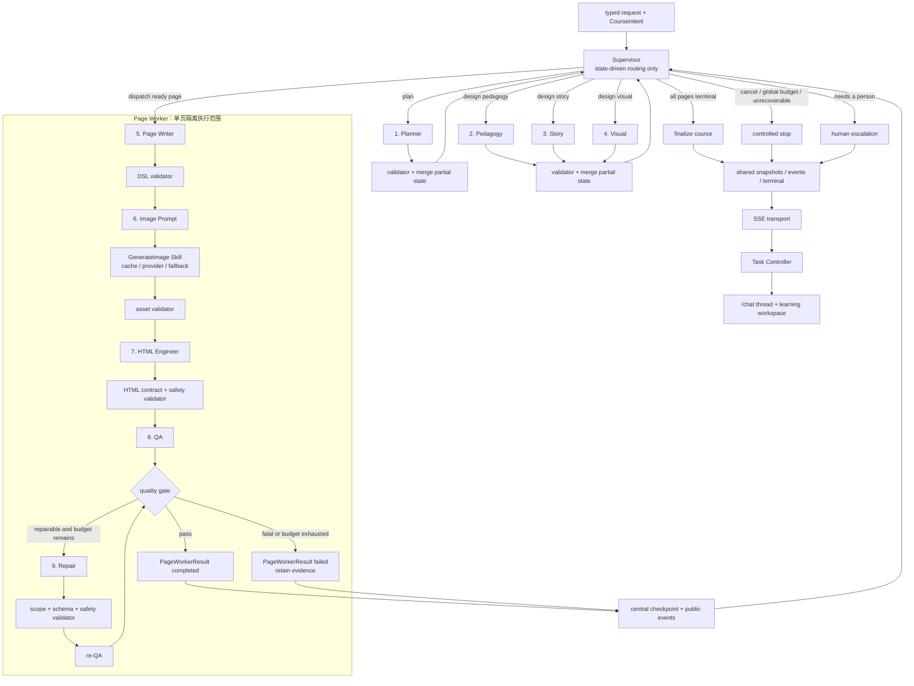
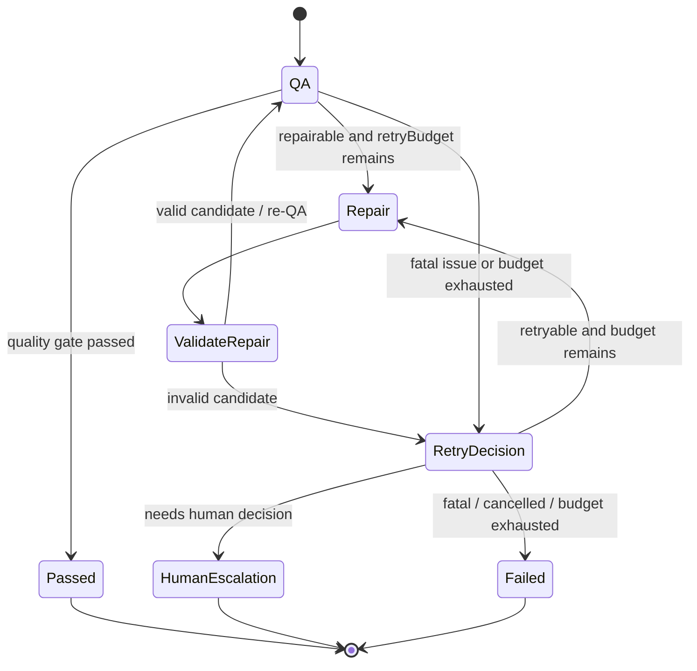
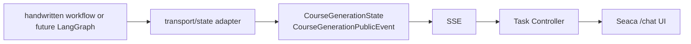

# 目标 Supervisor + Specialist 多 Agent 流程

> **TARGET / 未实现**
>
> 本文是 Day 21 的目标架构，并用 Day 22 当前实现校准迁移起点，不把目标图描述成运行代码。当前系统执行 [`mvp-flow.md`](./mvp-flow.md) 中显式 `WorkflowNode[]` 驱动的固定串行 workflow；Supervisor、Repair、Page Worker 隔离、自动 QA 循环、并发和 LangGraph 均未实现。

## 设计目标

目标不是增加更多模型调用，而是把调度、专业产出、工具执行、确定性校验和持久化分开：

- Supervisor 只根据类型化状态决定下一节点、重试、停止或人工升级。
- Specialist 只产出自己负责的专业协议，不控制全局流程。
- Page Worker 隔离单页执行范围，但它不是第十名 Specialist。
- GenerateImage Skill 是 Image Prompt 之后的工具执行，不是 Agent。
- validators 决定输出能否合并到共享状态，不能由 Agent 自行宣布通过。
- checkpoint 和公开事件由运行层统一写入，Specialist 不直接修改全局状态或推送 UI。
- QA 与 Repair 构成有预算、有停止条件、可审计的闭环，而不是无限自我修正。

## 目标流程



图中的边代表目标路由策略，不代表已经存在的 Route Handler 或源码文件。

## Supervisor 边界

Supervisor 是状态驱动的调度者，不是“万能课程 Agent”。目标输入应限制为：

- 当前已校验的 `CourseGenerationState` 摘要；
- 可执行节点清单及其 `requiredInputs / produces`；
- 最近一次结构化错误和公开质量结论；
- page/node 级 attempt 计数；
- retry、成本、时长和取消预算。

目标决策至少包含 `nextNode`、目标 `pageId`、公开 `reasonSummary`、可选 `retryTarget` 和 `stopReason`。无论由规则还是模型提出决策，都必须经过确定性路由规则校验。

Supervisor **不负责**：

- 编写 CoursePlan、教学策略、故事、视觉 brief 或 PageContentDSL；
- 写 HTML、图片 Prompt 或修复后的页面正文；
- 调用生图 provider；
- 自行修改 checkpoint；
- 绕过 validator、提升自己的 retry budget，或根据私有推理向 UI 解释决策。

Day 22 已把原先集中在 [`course-generation-workflow.ts`](../../src/server/workflows/course-generation-workflow.ts) 的固定调度拆成兼容 facade、[`course-generation-nodes.ts`](../../src/server/workflows/course-generation-nodes.ts) 的节点列表和 [`runSequentialWorkflow`](../../src/server/workflows/sequential-workflow.ts) 的通用串行运行层。未来 Supervisor 可以选择、重试或循环这些受限节点，但不应替代 `requiredInputs / produces` 合同、集中状态合并、validator 或公开事件安全边界。

## 九名 Specialist

Supervisor 和 Page Worker 都不计入以下九名 Specialist；GenerateImage 也不计入。

| # | Specialist | 最小输入 | 类型化输出 | 禁止职责 |
|---|---|---|---|---|
| 1 | Planner | `CourseIntent`、功能/样式模板摘要 | `CoursePlan` | 不写逐页正文、HTML、素材 URI 或运行状态 |
| 2 | Pedagogy | `CourseIntent + CoursePlan` | `PedagogyPlan` | 不决定视觉实现、故事文案或 HTML |
| 3 | Story | `CourseIntent + CoursePlan + PedagogyPlan` | `StoryArc` | 不覆盖教学目标或发明与课程冲突的事实 |
| 4 | Visual | `CoursePlan + PedagogyPlan + StoryArc + StyleTemplate` | `VisualBrief` | 不生成图片二进制、PageContentDSL 或 HTML |
| 5 | Page Writer | 单页 `PagePlan + PageWorkerBrief + CourseIntent` | `PageContentDSL` | 不读取原始全局运行状态，不输出 HTML 或素材 URI |
| 6 | Image Prompt | 单页 DSL 素材槽 + `VisualBrief` | `AssetRequest[]` | 不直接调用 provider，不发明 asset slot，不生成页面内容 |
| 7 | HTML Engineer | DSL、模板、视觉指导、已校验素材 | `HtmlOutput` | 不重新规划课程，不改写 DSL，不读取原始用户 Prompt |
| 8 | QA | PagePlan、DSL、brief、HTML、素材与确定性检查结果 | `QualityReport` | 只报告证据，不修改 HTML，不自行宣布修复完成 |
| 9 | Repair | 原始产物、限定目标、`QualityReport`、repair budget | 目标 `RepairResult` / 修复候选 | 不扩大修复范围，不改无关页面，不跳过 re-QA，不自我判定通过 |

表中前八类已有可复用实现或协议：[`course-planner-agent.ts`](../../src/server/agents/course-planner-agent.ts)、[`pedagogy-agent.ts`](../../src/server/agents/pedagogy-agent.ts)、[`story-agent.ts`](../../src/server/agents/story-agent.ts)、[`visual-director-agent.ts`](../../src/server/agents/visual-director-agent.ts)、[`page-writer-agent.ts`](../../src/server/agents/page-writer-agent.ts)、[`image-prompt-agent.ts`](../../src/server/agents/image-prompt-agent.ts)、[`html-engineer-agent.ts`](../../src/server/agents/html-engineer-agent.ts) 和 [`page-qa-agent.ts`](../../src/server/agents/page-qa-agent.ts)。Repair 目前没有实现，文档不得把目标 `RepairResult` 当成现有 schema。

## Page Worker 是执行边界，不是 Specialist

目标 Page Worker 接收一个已准备好的页面任务，只管理该页局部状态：

```text
PagePlan + PageWorkerBrief
  → Page Writer
  → Image Prompt
  → GenerateImage Skill / cache / fallback
  → HTML Engineer
  → QA
  → 可选、受限的 Repair / re-QA
  → PageWorkerResult
```

Page Worker 应遵守以下边界：

- 不直接修改整课状态，只返回带 `pageId` 的局部结果与公开事件。
- 不改变 CoursePlan 的页面顺序、全局目标或 StyleTemplate。
- 每页拥有独立的 attempts、错误、事件和取消检查。
- 未来可由 promise pool 控制并发，但并发度和依赖就绪由 Supervisor/运行层决定。
- 某一页失败不会删除其他页面已完成产物。

当前项目已有按页装配的 Writer/Assets/HTML `WorkflowNode` 和 [`PageWorkerBrief`](../../src/shared/course-schema/course-design.ts)，但这些节点仍共享整课状态并由同一运行器串行执行；它们不是独立 Page Worker，也没有页面级隔离上下文或并发池。

## GenerateImage Skill 不是 Agent

[`GenerateImage Skill`](../../src/server/tools/generate-image-skill.ts) 的目标边界保持与当前实现一致：

- Image Prompt Specialist 决定结构化 `AssetRequest`；
- Skill Registry 校验工具输入输出并执行 provider/storage 调用；
- cache、ready、fallback 和 provider 错误都转换为 `AssetGenerationResult`；
- Skill 不决定课程结构、页面内容、是否重试整个节点或下一个 Agent。

把工具执行算成 Specialist 会混淆“谁做专业判断”和“谁执行受控副作用”。

## Validators、状态合并与 checkpoint

每个 Specialist 的输出必须先经过确定性 validator，再由运行层合并到共享状态。Day 22 的固定串行运行层已经实现其中的 `requiredInputs` 前置检查、`produces` patch 白名单、合并后完整状态复验和 `WorkflowNodeError.nodeName` 定位；目标运行时继续复用这些边界：

```text
specialist candidate
  → schema / registry / reference / HTML safety validator
  → accepted partial state OR typed node error
  → central merge
  → checkpoint
  → public event projection
```

目标架构继续复用现有事实来源：

- [`shared/course-schema`](../../src/shared/course-schema)：Agent handoff 和持久化状态合同；
- [`CourseGenerationStateSchema`](../../src/shared/course-schema/course-generation-state.ts)：课程、页面、公开事件和失败状态；
- [`Course Design Workflow`](../../src/server/workflows/course-design-workflow.ts)：brief 对齐和 Page Worker 投影规则；
- [`shared/html-preview`](../../src/shared/html-preview) 与 HTML Engineer 校验：HTML 合同和安全预检；
- [`quality`](../../src/server/quality)：确定性页面质量检查；
- [`CourseStore`](../../src/server/storage/course-store.ts)：可校验的原子 checkpoint。

Specialist 不获得 `courseStore.save`，也不能直接发布 SSE。当前 `runSequentialWorkflow` 已让 Specialist 节点 patch 的合并只有一个所有者；facade 只处理课程生命周期迁移。未来加入重试、并行或迁移运行框架时仍必须保留这一属性。

## 公开事件边界

目标节点事件应继续投影为当前共享的 [`CourseGenerationPublicEvent`](../../src/shared/course-schema/course-generation-state.ts)，可以增加未来明确设计的新事件类型，但不能把框架事件原样透传。公开信息只包含：

- node/Agent、pageId、阶段、attempt 和状态；
- 可展示的 `reasonSummary`、错误 code 和停止原因；
- checkpoint、QA、Repair 与人工升级的结构化摘要；
- trace、sequence 和时间信息。

不得包含 System Prompt、原始模型消息、任意 tool payload、私有 event data 或 chain-of-thought。当前 facade、节点适配与运行层仍会在进入 checkpoint 前把 Agent 事件投影为共享公开协议并丢弃原生 `data`；目标运行层必须保留这一安全属性。

## 有界 QA、Repair 与 re-QA

目标质量循环必须由代码预算约束。具体上限应在后续训练日进入类型化策略并由自动化测试保护，而不是在 Day 21 提前确定数值，或把预算藏在 Prompt 中。



强制停止条件至少包括：

- QA 已通过；
- page/node retry budget 耗尽；
- 安全违规或不可恢复 schema/reference 错误；
- 用户取消；
- 整课成本或时长预算耗尽；
- 修复没有减少问题集合，或连续产生同一错误 code；
- Supervisor 决策不符合可用节点或前置输入合同。

人工升级必须保存最后一个有效 checkpoint、QA 证据、已用 attempts 和公开停止原因。UI 可以提供“重新运行目标节点”或“接受当前页面”的产品决策，但不能让展示组件复制 Supervisor 规则。

## LangGraph 的未来位置

LangGraph 只是后续可替换的运行工具，不是多 Agent 架构本身。未来可以把：

- `CourseGenerationState` 映射为 graph state；
- Specialist / validator / checkpoint 映射为 nodes；
- Supervisor 决策映射为 conditional edges；
- page results 和公开事件映射为有规则的 reducers。

但是业务合同仍由本项目的共享 schemas 和 Route Handler/workflow 规则拥有。LangGraph 原生 chunks、内部 node state 或 checkpoint 格式不能进入前端。



因此从手写 workflow 迁移到 LangGraph 时，只替换服务端执行和状态更新方式；[`useSSETask`](../../src/features/course-planner/hooks/use-sse-task.ts)、[`ChatApp`](../../src/features/seaca/chat-app.tsx)、Timeline 和 learning workspace 不应重新设计，也不应依赖 LangGraph。

## Day 21 之后的实施顺序

1. **Day 22 已完成：** 把现有固定流程包装为声明式、可测试的 `WorkflowNode` 接口和集中串行运行层；兼容 facade、API、SSE、Schema、checkpoint、恢复和 UI 语义保持不变。
2. **后续目标：** 加入只负责结构化调度的 Supervisor 和规则兜底。
3. **后续目标：** 继续收紧九名 Specialist 的 Prompt、输入输出和禁止项。
4. **后续目标：** 把逐页节点提取为真正隔离的 Page Worker，再评估受控并发。
5. **后续目标：** 将现有 report-only QA 接入质量门槛，并实现 Repair 候选与 re-QA。
6. **后续目标：** 最后评估是否用 LangGraph 替换手写运行层，同时保持 SSE 和前端数据合同不变。
