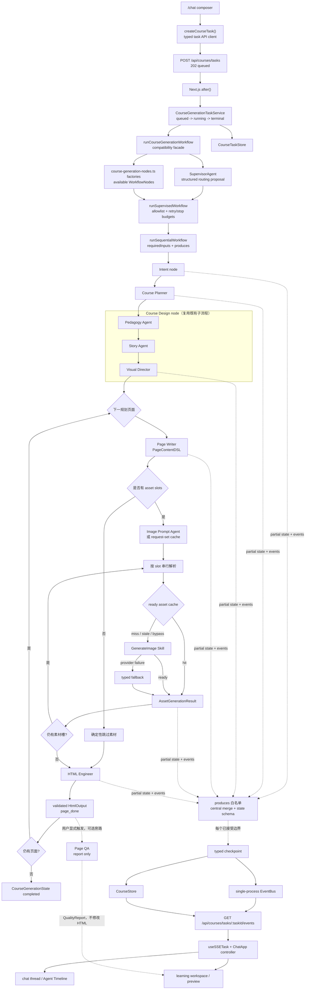

# 当前课程生成 MVP 流程

> **IMPLEMENTED / 当前事实**
>
> 本文只描述当前产品真实运行的课程生成链路。它由受限 Supervisor 在 TypeScript `WorkflowNode` 候选中串行调度，支持可恢复 checkpoint 和有限重试；它没有使用 LangGraph。

## 产品入口与完整调用链

`/chat` 通过类型化任务客户端创建后台任务；Route Handler 返回 `202` 后，任务服务在服务端持有任务生命周期和取消信号。兼容 facade 根据 checkpoint 计算可用节点，Supervisor 提出结构化决策，运行层校验后串行执行一个节点并保存 checkpoint。SSE 只传输共享协议中的快照、公开事件和终态，前端 controller 再把它们投影到对话 Timeline 与右侧 learning workspace。

## 当前受监督串行顺序

顶层兼容入口仍是 [`runCourseGenerationWorkflow`](../../src/server/workflows/course-generation-workflow.ts)，已有任务服务与测试不需要迁移到新调用方式。它负责创建新状态或校验恢复状态，装配运行上下文与节点列表，再把结果映射回原有成功/失败合同。

[`course-generation-nodes.ts`](../../src/server/workflows/course-generation-nodes.ts) 定义节点工厂，兼容 facade 根据已校验 checkpoint 跳过已有产物并计算当前可执行候选。Supervisor 只能选择候选节点，正常路径仍保持以下依赖顺序：

1. `Intent` 节点只在状态缺少 `intent` 时运行入口解析；恢复时保留已有产物。
2. `Planner` 节点消费已校验 `intent` 并生成 `CoursePlan`；确定性适配仍补齐 ID、模板和页面依赖。
3. `Course Design` 节点复用 [`runCourseDesignWorkflow`](../../src/server/workflows/course-design-workflow.ts)，内部仍严格执行 `Pedagogy -> Story -> Visual`，再投影逐页 `PageWorkerBrief`。
4. 依据 `CoursePlan.pages` 为每页依次装配 `Page Writer -> Assets -> HTML Engineer` 节点。现有页面依赖和 fail-fast 规则保持不变：当前页失败会停止当前页及所有后继页，但保留此前已完成的 HTML。
5. 所有页面完成后，兼容 facade 把课程置为 `completed` 并保存最终 checkpoint。

[`runSequentialWorkflow`](../../src/server/workflows/sequential-workflow.ts) 是固定节点列表的唯一通用执行器：运行前检查 `requiredInputs`，执行节点，拒绝 `produces` 之外的 patch，通过集中 merge 复验 `CourseGenerationStateSchema`，然后才在既有稳定边界 checkpoint。节点抛错、缺少输入、缺少声明产物或越权写字段都会转换成带 `nodeName` 的 `WorkflowNodeError`，facade 再映射为原有公开阶段、页面、Agent、错误码和消息。

每个 Agent 自己仍使用统一的最小状态、步骤上限和结构化事件合同，见 [`minimal-agent.ts`](../../src/server/agents/core/minimal-agent.ts)。Supervisor 可以在确定性候选中提出 `run / retry / complete / stop`，但不能编造节点、提高预算或绕过输入检查。

## WorkflowNode 合同与边界

`WorkflowNode<State, Context, Event>` 只描述协调信息，不是新的模型 Agent：

- `name` 是稳定的运行与错误定位名称；
- `requiredInputs` 声明节点执行前必须可读取的状态值；
- `produces` 同时声明执行后必须存在的产物，并作为 patch 顶层字段白名单；
- `run(state, context)` 只返回 `partial state + events`，不能直接持久化整课状态或向 SSE 推送；
- `runSequentialWorkflow` 是节点 patch 合并的唯一所有者，合并后的完整状态必须再次通过共享 Schema；facade 仍负责开始、失败、完成等课程生命周期迁移。

这个合同减少了顶层大函数的隐式 handoff；Day 23 的受监督运行层在合同之外增加了有限动态选择和重试，但仍没有并发调度。

## 素材子流程

[`runImageAssetWorkflow`](../../src/server/workflows/image-asset-workflow.ts) 是页面素材阶段的真实实现：

- 先查询完整 `AssetRequest[]` 的 request-set cache；未命中时才调用 Image Prompt Agent。
- 按素材槽顺序逐个查询 ready asset cache。
- 未命中、失效或没有可用模型身份时调用 [`GenerateImage Skill`](../../src/server/tools/generate-image-skill.ts)。Skill 是有类型输入输出的工具，不是 Specialist Agent。
- 生图失败可以返回结构化 fallback，素材 workflow 仍可完成。
- cache 读写错误被计入公开摘要，但不会阻断生图主链路。
- 父 workflow 只在整页素材阶段完成后保存该页全部 `assets`。

## Checkpoint、任务服务与 SSE

[`CourseGenerationTaskService`](../../src/server/tasks/course-generation-task-service.ts) 负责 `queued / running / completed / failed / cancelled` 生命周期，而不是生成课程内容。它把 workflow 的 checkpoint 回调接到：

- [`CourseStore`](../../src/server/storage/course-store.ts)：保存可恢复的课程聚合；
- [`CourseTaskStore`](../../src/server/storage/course-task-store.ts)：保存 task 与 course 的映射及任务终态；
- [`CourseTaskEventBus`](../../src/server/tasks/course-task-event-bus.ts)：向当前进程的订阅者发布新事件；
- [`SSE Route`](../../src/app/api/courses/tasks/[taskId]/events/route.ts)：先从 checkpoint 快照或 `Last-Event-ID` 重放，再切到实时订阅。

workflow 会在长耗时 Agent 运行前保存 `agent_start`，并在校验后的阶段结果、页面完成、失败和整课完成处再次 checkpoint。恢复时依据已保存的 `intent`、`outline`、brief、DSL、素材阶段和 `htmlOutput` 跳过已完成工作，而不是从 UI 状态推测进度。

SSE 合同由 [`course-task-event.ts`](../../src/shared/course-schema/course-task-event.ts) 定义，只允许：

- 完整、已校验的课程快照；
- 结构化公开事件；
- 与课程 checkpoint 一致的终态。

顶层 workflow 在持久化 Agent 事件时只保留 `type`、`stage`、`pageId`、`agent`、`step`、`summary`、时间和 trace 信息，不复制 Agent 原生 `data`，因此不会把 Prompt、模型私有上下文或 chain-of-thought 发送给前端。

## 前端数据边界

[`course-task-api.ts`](../../src/features/course-planner/lib/course-task-api.ts) 只负责创建和取消任务；[`use-sse-task.ts`](../../src/features/course-planner/hooks/use-sse-task.ts) 把 SSE 消息转换为共享的类型化任务状态。[`ChatApp`](../../src/features/seaca/chat-app.tsx) 充当当前产品的 Task Controller，再把状态传给：

- [`ChatThread`](../../src/features/seaca/chat-thread.tsx) 与 [`CourseRunTimeline`](../../src/features/seaca/course-run-timeline.tsx)：公开 Agent 进度、耗时、错误和恢复；
- [`CourseWorkspacePanel`](../../src/features/seaca/course-workspace-panel.tsx)：规划、DSL、素材、HTML、安全预览和质量报告。

展示组件不直接调用生成业务 API，也不消费框架原生流事件。

## QA 是可选旁路

[`Page QA Agent`](../../src/server/agents/page-qa-agent.ts) 与 [`/api/pages/qa`](../../src/app/api/pages/qa/route.ts) 已经存在，但它们没有接入 `runCourseGenerationWorkflow` 的必需成功路径。当前用户在 HTML 已生成后显式运行 QA：

- QA 只返回 `QualityReport`；
- QA 不修改 HTML；
- QA 失败不抹掉已经交付的页面；
- 当前没有自动 `QA -> Repair -> re-QA` 循环。

## 当前明确不存在的能力

- Supervisor 只调度现有六类课程节点，不拥有课程正文能力，也没有成本/token 计费器或人工审批队列。
- 没有 Repair Agent 或自动修复循环。
- 没有 Page Worker 隔离执行单元或受控页面并发；逐页 `WorkflowNode` 仍共享课程状态并串行运行，“Page Worker brief”只是逐页输入合同。
- 没有 LangGraph StateGraph、条件边、Reducer 或框架原生 streaming。
- 没有自动 Page QA 质量门槛。
- EventBus 与活动任务去重都是单进程实现，不是分布式任务队列或 lease。

目标架构及其停止条件见 [`multi-agent-flow.md`](./multi-agent-flow.md)。
