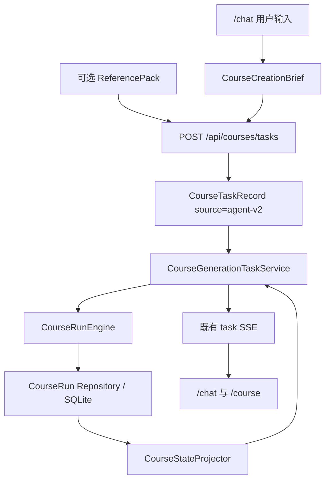
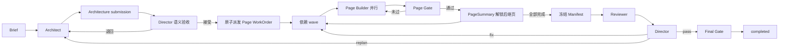

# 当前 MVP 课程生成流程

> 新建课程统一使用 `agent-v2`。`workflow` 和 `langgraph` 只用于读取历史记录，不再是新任务执行入口。

## 1. 从产品到运行时



Route 只负责校验、创建任务并唤醒后台执行。业务事实由 agent-v2 Repository 保存；Task Service 仍是旧任务状态和 SSE 的单一发布者。

## 2. 课程生成主链



## 3. 谁做判断，谁做机械工作

| 动作 | 执行者 | 是否调用模型 |
| --- | --- | --- |
| 设计整课和 PageTask | Architect | 是 |
| 判断架构是否值得执行 | Director | 是 |
| 创建 Page WorkOrder | Repository 命令 | 否 |
| 检查依赖、并发领取 | CourseRunEngine | 否 |
| 逐页生成和定向修订 | Page Builder | 是 |
| 校验单页产物 | Page Gate | 否 |
| 解锁后继页 | Repository 命令 | 否 |
| 检查整课跨页质量 | Reviewer | 是 |
| 选择发布 / 修页 / 重规划 | Director | 是 |
| 最终发布校验 | Final Gate | 否 |
| 投影旧 UI 状态 | CourseStateProjector | 否 |

这张表是判断“真 Agent”和“假 Agent”的最短标准。机械动作不需要模型，也不应该叫 Supervisor。

## 4. 当前耐久状态

业务事实分为四层：

```text
CourseTaskRecord
  产品任务、source、Brief、取消和 SSE 生命周期

CourseRun
  当前架构、当前页面、当前 Review、阶段、租约

WorkOrder
  某次 Agent 回合的输入、权限、预算、状态和提交

Artifact
  架构、页面内容、HTML、质量、摘要、manifest、review
```

工具调用的输入哈希、状态、安全摘要和结果引用另存 `ToolOperation`，公开进度另存 `CourseRunEvent`。ToolOperation 是审计台账，不是通用 exactly-once 或自动重放层。

五张 agent-v2 表：

- `course_runs`
- `course_work_orders`
- `course_artifacts`
- `course_tool_operations`
- `course_run_events`

Task 层另有 `course_execution_claims`，用 SQLite 唯一键保证同一 `courseId` 只有一个
queued/running/paused 任务。`courses` 仍保存前端兼容读模型，但所有更新都使用旧
payload CAS，并同时核对 TaskRecord 的 trace/status。

## 5. 关键事务

以下操作必须原子完成：

1. 创建 CourseRun 和第一张 Architect WorkOrder；
2. 接受架构并创建恰好 N 张 Page WorkOrder；
3. 接受页面、切换 current page 指针并解锁依赖页；
4. 冻结 manifest 并创建 Reviewer WorkOrder；
5. Review 提交为 submitted 后，Engine 在另一个事务创建 Director round；
6. 指派返工、标记 stale 页面和创建 fix WorkOrder；
7. Final Gate 通过后把 CourseRun 置为 completed。

事务中途失败不能留下半套页面任务或半套当前指针。

## 6. 并行规则

`PageTask.order` 只控制学习顺序。

`PageTask.buildDependsOnPageIds` 才控制生成顺序。没有依赖的页同时进入第一波；依赖页面 Page Gate 通过并生成 `PageSummary` 后，后继页才封口输入并进入下一波。

最大并发由任务配置控制，范围 1–5。并发写入仍通过每张 WorkOrder 的 lease、CourseRun 的围栏和 Repository 事务保护。

## 7. 恢复规则

- CourseRun 同时只能有一个有效 lease owner；
- WorkOrder 同时只能有一个有效 lease owner；
- 进程中断后可接管过期 lease；
- Artifact 不原地覆盖；
- Repository 事务和 WorkOrder 幂等键避免重复业务派工；
- 外部工具仍要依靠各自缓存或 Provider 幂等能力缩小重复副作用窗口；
- 只从 Repository current 指针恢复；
- 历史 checkpoint 的 `workflow` / `langgraph` 不重新进入旧生成器。

Next 启动钩子只扫描一次；持续恢复必须运行 `npm run worker:course`，或配置等价的外部调度。
跨进程暂停靠持久化 TaskRecord 生效：Engine 在工作单边界和每次工具前重读控制态，
并在退出时释放自己持有的 lease。

## 8. 质量规则

单页完成要经过 Page Gate：

- DSL 和 PageTask 一致；
- 素材覆盖；
- HTML 合同与安全；
- 互动和反馈；
- 页面质量和截图证据。

整课完成还要经过：

```text
CourseManifest
→ Reviewer
→ Director publish 决策
→ Final Gate
```

旧 Review、缺页、stale 页面或 manifest hash 不一致都不能发布。

## 9. API 和 UI 边界

产品路由不变：

- `/chat`：输入、任务创建、公开进度、右侧学习空间；
- `/course`：历史课程；
- `/course/[courseId]`：持久课程播放器；
- `/templates`：模板目录。

浏览器只收到：

- strict task snapshot；
- allowlist public event；
- terminal。

当前进程由 EventBus 快速推送；SSE Route 每 500 ms 直接追读
`course_run_events`，补齐其他 worker 的工具级增量。Task/CourseStore 只提供
snapshot 和 terminal。Last-Event-ID 同时包含 traceId 和 durable sequence，resume
后不会漏掉新 trace 的事件。

不发送模型私有推理、工具原始参数、服务器路径或框架原生事件。

## 10. 主要源码

- `src/server/course/task/service.ts`
- `src/server/course/run/engine.ts`
- `src/server/course/store/repository.ts`
- `src/server/agent/plugins/agents/course/`
- `src/server/course/gate/page.ts`
- `src/server/course/gate/review.ts`
- `src/server/course/projection/state.ts`
- `src/shared/course-schema/`
