# 当前课程生成 MVP 流程

> **IMPLEMENTED / 当前事实**
>
> 本文只描述当前产品真实运行的课程生成链路。全局 Specialist 由受限 Supervisor 串行调度，页面生成由隔离 Page Worker 和受控 Promise Pool 执行；全链路支持可恢复 checkpoint 和有限重试。Day 29 已实现共享同一状态与生命周期合同的 LangGraph 固定图，但产品任务服务仍显式使用本页所述手写入口。

## 产品入口与完整调用链

`/chat` 通过类型化任务客户端创建后台任务；Route Handler 返回 `202` 后，任务服务在服务端持有任务生命周期和取消信号。兼容 facade 先让 Supervisor 调度 Intent、Planner 和 Course Design，再让页面运行层调度隔离 Worker。serial 模式按学习依赖逐页生成；parallel 模式保留依赖作为学习顺序，并独立并发生成页面。Worker 局部更新只有通过串行 merge/checkpoint 队列才能进入课程事实来源。SSE 继续只传输共享协议中的快照、公开事件和终态。

```mermaid
flowchart TD
  Chat["/chat composer"] --> Client["createCourseTask()<br/>typed task API client"]
  Client --> TaskRoute["POST /api/courses/tasks<br/>202 queued"]
  TaskRoute --> After["Next.js after()"]
  After --> TaskService["CourseGenerationTaskService<br/>queued -> running -> terminal"]
  TaskService --> Facade["runCourseGenerationWorkflow<br/>compatibility facade"]
  Facade --> Supervisor["SupervisorAgent<br/>structured routing proposal"]
  Facade --> NodeList["global WorkflowNodes<br/>Intent / Planner / Course Design"]
  Supervisor --> Guard["runSupervisedWorkflow<br/>allowlist + retry/stop budgets"]
  NodeList --> Guard
  Guard --> Runner["runSequentialWorkflow<br/>requiredInputs + produces"]

  Runner --> Intent["Intent node"]
  Intent --> Planner["Course Planner"]

  subgraph DesignNode ["Course Design node（复用既有子流程）"]
    Pedagogy["Pedagogy Agent"] --> Story["Story Agent"]
    Story --> Visual["Visual Director"]
  end

  Planner --> Pedagogy

  Visual --> WorkerScheduler["course-workers-workflow<br/>serial dependency / parallel independent"]
  WorkerScheduler --> Mode{"serial / parallel"}
  Mode --> Pool["Promise Pool<br/>default concurrency = 2"]

  subgraph PageWorker ["isolated generatePageWorker(page)"]
  Pool --> PageWriter["Page Writer<br/>PageContentDSL"]
  PageWriter --> AssetSlots{"是否有 asset slots"}
  AssetSlots -->|"否"| SkipAssets["确定性跳过素材"]
  AssetSlots -->|"是"| ImagePrompt["Image Prompt Agent<br/>或 request-set cache"]
  ImagePrompt --> AssetLoop["按 slot 串行解析"]
  AssetLoop --> AssetCache{"ready asset cache"}
  AssetCache -->|"hit"| AssetResult["AssetGenerationResult"]
  AssetCache -->|"miss / stale / bypass"| ImageSkill["GenerateImage Skill"]
  ImageSkill -->|"ready"| AssetResult
  ImageSkill -->|"provider failure"| Fallback["typed fallback"]
  Fallback --> AssetResult
  AssetResult --> MoreSlots{"仍有素材槽?"}
  MoreSlots -->|"是"| AssetLoop
  SkipAssets --> Html["HTML Engineer"]
  MoreSlots -->|"否"| Html
  Html --> QA["Page QA<br/>report only"]
  QA --> PageDone["PageWorkerResult<br/>page_done"]
  end
  PageDone --> WorkerMerge["serialized worker merge<br/>state schema + event resequence"]
  WorkerMerge --> Complete{"全部依赖页面完成?"}
  Complete -->|"否"| WorkerScheduler
  Complete -->|"是"| CourseDone["CourseGenerationState completed"]

  Intent -. "partial state + events" .-> Merge["produces 白名单<br/>central merge + state schema"]
  Planner -. "partial state + events" .-> Merge
  Visual -. "partial state + events" .-> Merge
  WorkerMerge -. "page-local state + events" .-> Merge
  Merge -. "每个已接受边界" .-> Checkpoint["typed checkpoint"]
  Checkpoint --> CourseStore["CourseStore"]
  Checkpoint --> EventBus["single-process EventBus"]
  TaskService --> TaskStore["CourseTaskStore"]
  EventBus --> SSE["GET /api/courses/tasks/:taskId/events"]
  CourseStore --> SSE
  SSE --> Controller["useSSETask + ChatApp controller"]
  Controller --> Timeline["chat thread / Agent Timeline"]
  Controller --> Workspace["learning workspace / preview"]

  QA -. "QualityReport，不修改 HTML" .-> Workspace
```

## 当前全局调度与页面 Worker 顺序

顶层兼容入口仍是 [`runCourseGenerationWorkflow`](../../src/server/workflows/course-generation-workflow.ts)，已有任务服务与测试不需要迁移到新调用方式。它负责创建新状态或校验恢复状态，装配运行上下文与节点列表，再把结果映射回原有成功/失败合同。

[`course-generation-nodes.ts`](../../src/server/workflows/course-generation-nodes.ts) 继续定义全局节点工厂，Supervisor 只能选择运行层给出的候选。全局设计完成后不再把整课状态交给逐页 Specialist 节点，而是切换到页面 Worker 运行层：

1. `Intent` 节点只在状态缺少 `intent` 时运行入口解析；恢复时保留已有产物。
2. `Planner` 节点消费已校验 `intent` 并生成 `CoursePlan`；确定性适配仍补齐 ID、模板和页面依赖。
3. `Course Design` 节点复用 [`runCourseDesignWorkflow`](../../src/server/workflows/course-design-workflow.ts)，内部仍严格执行 `Pedagogy -> Story -> Visual`，再投影逐页 `PageWorkerBrief`。
4. [`runCourseWorkersWorkflow`](../../src/server/workflows/course-workers-workflow.ts) 在 serial 模式根据 `dependsOnPageIds` 计算就绪页面；parallel 模式不让学习顺序依赖串行化生成，而是通过默认并发度 2 的 [`runPromisePool`](../../src/server/workflows/promise-pool.ts) 执行。
5. 每个 [`generatePageWorker`](../../src/server/workflows/page-worker.ts) 只管理当前页，依次执行 `Page Writer -> Assets -> HTML Engineer -> Page QA`，每阶段最多执行 3 次；HTML 重试继续接收上一次安全校验反馈。
6. 单页失败不会取消同批其他 Worker，也不会删除已完成页面；依赖失败页面的后继页保持未执行，互不依赖的页面仍可完成。
7. 所有规划页面完成后，兼容 facade 把课程置为 `completed` 并保存最终 checkpoint。

[`runSequentialWorkflow`](../../src/server/workflows/sequential-workflow.ts) 是固定节点列表的唯一通用执行器：运行前检查 `requiredInputs`，执行节点，拒绝 `produces` 之外的 patch，通过集中 merge 复验 `CourseGenerationStateSchema`，然后才在既有稳定边界 checkpoint。节点抛错、缺少输入、缺少声明产物或越权写字段都会转换成带 `nodeName` 的 `WorkflowNodeError`，facade 再映射为原有公开阶段、页面、Agent、错误码和消息。

每个 Agent 自己仍使用统一的最小状态、步骤上限和结构化事件合同，见 [`minimal-agent.ts`](../../src/server/agents/core/minimal-agent.ts)。Supervisor 可以在确定性候选中提出 `run / retry / complete / stop`，但不能编造节点、提高预算或绕过输入检查。兼容 Provider 的 union JSON 校验失败时，只在运行层已经证明动作唯一的情况下确定性降级；多个候选仍然失败，白名单边界不放宽。

## WorkflowNode 合同与边界

`WorkflowNode<State, Context, Event>` 只描述协调信息，不是新的模型 Agent：

- `name` 是稳定的运行与错误定位名称；
- `requiredInputs` 声明节点执行前必须可读取的状态值；
- `produces` 同时声明执行后必须存在的产物，并作为 patch 顶层字段白名单；
- `run(state, context)` 只返回 `partial state + events`，不能直接持久化整课状态或向 SSE 推送；
- `runSequentialWorkflow` 是节点 patch 合并的唯一所有者，合并后的完整状态必须再次通过共享 Schema；facade 仍负责开始、失败、完成等课程生命周期迁移。

这个合同仍负责全局节点 handoff；Day 25 的页面并发不让多个 Worker 直接合并课程 patch，而是让课程运行层串行接受每个 `PageWorkerUpdate`，因此并发不会破坏课程事件顺序和 checkpoint 所有权。

## 素材子流程

[`runImageAssetWorkflow`](../../src/server/workflows/image-asset-workflow.ts) 是页面素材阶段的真实实现：

- 先查询完整 `AssetRequest[]` 的 request-set cache；未命中时才调用 Image Prompt Agent。
- 按素材槽顺序逐个查询 ready asset cache。
- 未命中、失效或没有可用模型身份时调用 [`GenerateImage Skill`](../../src/server/tools/generate-image-skill.ts)。Skill 是有类型输入输出的工具，不是 Specialist Agent。
- 生图失败可以返回结构化 fallback，素材 workflow 仍可完成。
- cache 读写错误被计入公开摘要，但不会阻断生图主链路。
- 父 workflow 只在整页素材阶段完成后保存该页全部 `assets`。

## Checkpoint、任务服务与 SSE

[`CourseGenerationTaskService`](../../src/server/tasks/course-generation-task-service.ts) 负责 `queued / running / completed / failed / cancelled` 生命周期，而不是生成课程内容。它把 workflow 的 checkpoint 回调接到：

- [`CourseStore`](../../src/server/storage/course-store.ts)：保存可恢复的课程聚合；
- [`CourseTaskStore`](../../src/server/storage/course-task-store.ts)：保存 task 与 course 的映射及任务终态；
- [`CourseTaskEventBus`](../../src/server/tasks/course-task-event-bus.ts)：向当前进程的订阅者发布新事件；
- [`SSE Route`](../../src/app/api/courses/tasks/[taskId]/events/route.ts)：先从 checkpoint 快照或 `Last-Event-ID` 重放，再切到实时订阅。

workflow 会在长耗时 Agent 运行前保存 `agent_start`，并在校验后的阶段结果、页面完成、失败和整课完成处再次 checkpoint。并行 Worker 的 update 先经过单一 Promise 链串行合并，避免两个 checkpoint 覆盖页面结果或重复事件序号。恢复时依据已保存的 DSL、素材、HTML、QA 和页面阶段跳过已完成工作；新的手动恢复会为失败阶段开启一轮新的三次页面预算。

SSE 合同由 [`course-task-event.ts`](../../src/shared/course-schema/course-task-event.ts) 定义，只允许：

- 完整、已校验的课程快照；
- 结构化公开事件；
- 与课程 checkpoint 一致的终态。

顶层 workflow 在持久化 Agent 事件时只保留 `type`、`stage`、`pageId`、`agent`、`step`、`summary`、时间和 trace 信息，不复制 Agent 原生 `data`，因此不会把 Prompt、模型私有上下文或 chain-of-thought 发送给前端。

## 前端数据边界

[`course-task-api.ts`](../../src/features/course-planner/lib/course-task-api.ts) 只负责创建和取消任务；[`use-sse-task.ts`](../../src/features/course-planner/hooks/use-sse-task.ts) 把 SSE 消息转换为共享的类型化任务状态。[`ChatApp`](../../src/features/keya/chat-app.tsx) 充当当前产品的 Task Controller，再把状态传给：

- [`ChatThread`](../../src/features/keya/chat-thread.tsx) 与 [`CourseRunTimeline`](../../src/features/keya/course-run-timeline.tsx)：公开 Agent 进度、耗时、错误和恢复；
- [`CourseWorkspacePanel`](../../src/features/keya/course-workspace-panel.tsx)：规划、DSL、素材、HTML、安全预览和质量报告。

展示组件不直接调用生成业务 API，也不消费框架原生流事件。

## Day 29 可选 LangGraph 运行时

[`runCourseGenerationGraphWorkflow`](../../src/server/langgraph/course-generation/run-course-graph.ts) 已能以同一 `CourseGenerationWorkflowInput`、依赖注入和 `CourseGenerationState` 合同运行完整课程。它使用固定拓扑 `START → intent-node → planner-node → briefs-node → page-workers-node → finalize-node → END`：前三个节点复用既有 `WorkflowNode`，页面节点复用完整 Page Worker 调度，finalize 复用共享生命周期函数。

两种运行时现在共同依赖 [`course-generation-runtime.ts`](../../src/server/workflows/course-generation-runtime.ts) 中的初始化、节点执行、公开事件投影、失败、完成和 checkpoint 逻辑。Graph State 的字段直接来自 `CourseGenerationStateSchema.shape`，每个节点输出仍重新通过完整聚合 Schema；没有第二套课程状态模型。

当前产品没有自动切换或失败后双跑：`CourseGenerationTaskService` 仍注入手写 `runCourseGenerationWorkflow`，LangGraph runner 由服务端测试或显式调用方选择。这样可避免 Graph 失败后重复模型、生图和存储副作用。Graph 原生 streaming 尚未映射到 SSE，前端继续只消费共享快照与公开事件。

## QA 与有界 Repair 是 Worker 的页面质量闭环

[`Page QA Agent`](../../src/server/agents/page-qa-agent.ts) 已接入每个新 Page Worker 的末段；已有 [`/api/pages/qa`](../../src/app/api/pages/qa/route.ts) 仍支持显式重跑：

- QA 只返回 `QualityReport`；
- QA 不修改 HTML；
- QA 按内容、教学、排版、风格、HTML、素材六个语义维度报告，旧字段名和 checkpoint 保持兼容；
- 静态启发式、可选 Playwright 固定视口指标和模型评价合并后由服务端按内容错误优先稳定排序；
- 截图文件只保存在 `.data/quality-screenshots`，共享报告不暴露服务器路径；截图失败不影响 QA 主流程；
- QA 结果保存到页面局部 `qualityReport` 并投影到现有六维质量面板；
- QA 执行失败只使当前 Worker 失败，不抹掉其他成功页面；
- `shouldRepair=false` 时页面直接完成；否则由确定性分类器选择 located DSL blocks 或 HTML patches，Repair Agent 不能自行选页面、扩大 scope 或宣布通过；
- 每次 Repair 保存来源报告、issue、目标和公开变更摘要，候选应用后必须经过原合同和 re-QA；只有成功应用并完成 re-QA 才计为质量迭代；
- 连续三次有效修订没有改善质量向量时触发 `QUALITY_STALLED`；执行失败独立重试，但相同 Schema/model 合同错误只做一次恢复重试；另有 24 次紧急安全上限防止实现错误形成无限循环。

## 当前明确不存在的能力

- Supervisor 当前只调度全局课程节点，不拥有课程正文能力，也没有成本/token 计费器或人工审批队列。
- 已有生产状态支持的固定 LangGraph StateGraph runner，但尚未成为任务服务默认入口，也没有生产 conditional edge、Graph checkpointer 或框架原生 streaming 到 SSE 的映射。
- QA/Repair 形成页面内部质量闭环，尚未引入人工审批或课程发布门槛。
- EventBus 与活动任务去重都是单进程实现，不是分布式任务队列或 lease。

目标架构及其停止条件见 [`multi-agent-flow.md`](./multi-agent-flow.md)。
