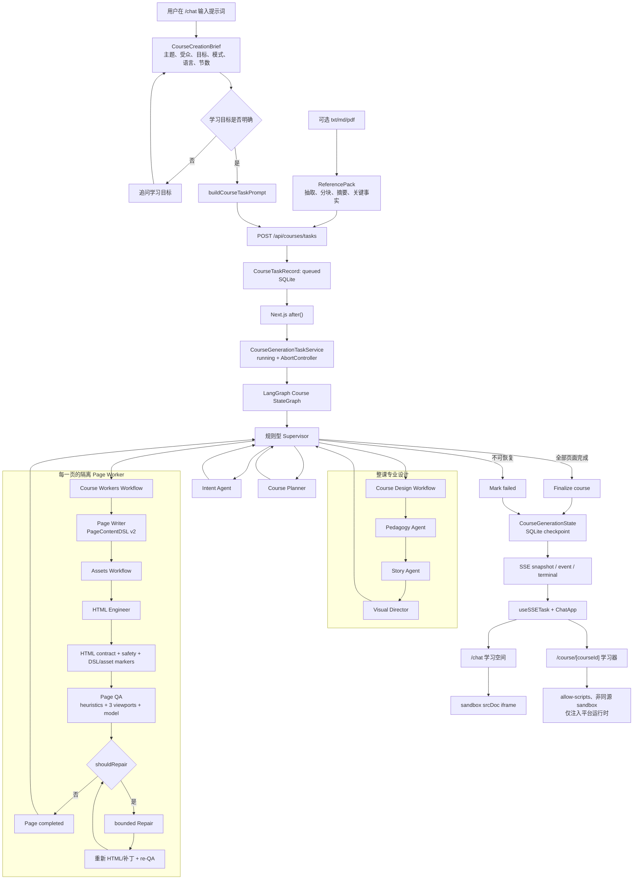
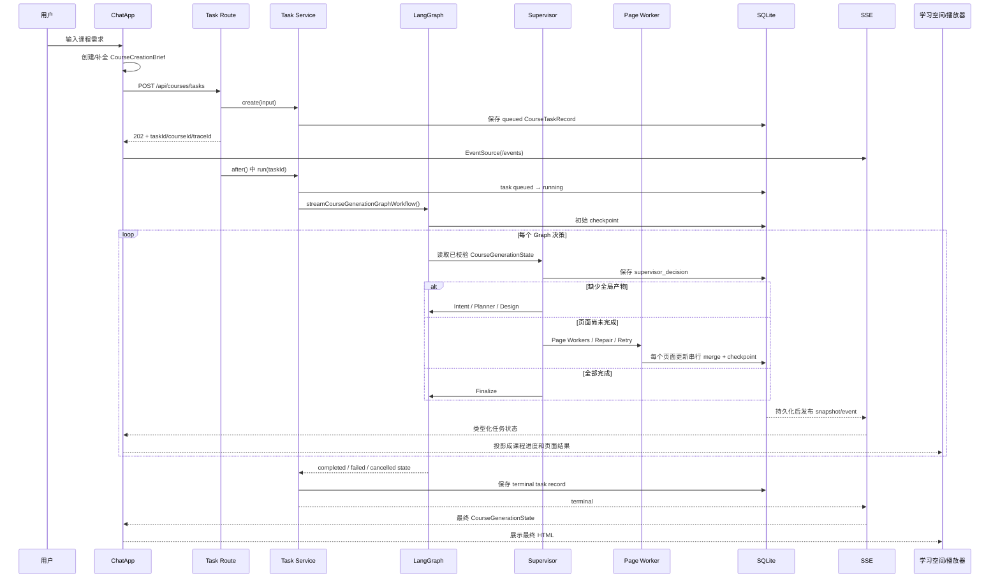

# 从提示词到最终 HTML：当前真实运行流程

> 文档基线：2026-07-28 当前工作区代码  
> 适用入口：课芽产品 UI 的 `/chat` 新建课程流程  
> 最终产物：每个课程章节一份经过校验和质量闭环的完整 HTML 文档

## 1. 先说结论

当前项目不是把用户提示词直接交给一个模型生成整门课 HTML，而是经过三层处理：

1. **产品输入层**：把自然语言整理成课程简报，必要时追问学习目标，并把可选参考资料解析成 `ReferencePack`。
2. **课程编排层**：创建异步任务，由 LangGraph 中的规则型 Supervisor 依次完成意图解析、整课规划、教学/故事/视觉设计，再调度单页 Worker。
3. **页面交付层**：每页依次生成内容 DSL、素材、HTML，再执行确定性检查、三视口浏览器 QA、必要的 Repair/re-QA，最后持久化并通过安全 iframe 展示。

当前默认主链路是：

```text
用户输入
  → CourseCreationBrief
  → 编译后的 taskPrompt
  → POST /api/courses/tasks
  → CourseGenerationTaskService
  → LangGraph rule-first Supervisor
  → Intent
  → Planner
  → Pedagogy
  → Story
  → Visual
  → Page Worker（每页）
      → Page Writer
      → Image Prompt / 图片 Skill / fallback
      → HTML Engineer
      → HTML 合同与安全校验
      → Page QA（启发式 + Playwright + 模型）
      → 可选 Repair → 重新生成/修补 → re-QA
  → Finalize
  → SQLite checkpoint
  → SSE snapshot/event/terminal
  → /chat 学习空间或 /course/[courseId] 学习器
  → sandbox iframe 中展示最终 HTML
```

一个非常重要的边界是：

- `Page Writer` 只写结构化课程内容，不写 HTML。
- `HTML Engineer` 只把已确认的内容、模板、视觉规范和素材实现成 HTML，不重新规划课程。
- `Page QA` 只给报告，不直接修改 HTML。
- `Repair` 只能修改服务器明确授权的 DSL 字段或 HTML 位置。
- `Supervisor` 只做路由，不生成课程正文，也不调用模型进行自由决策。

## 2. 当前真实架构总览



## 3. 从点击提交开始的时序



## 4. 阶段 0：前端先把“输入”整理成可执行课程简报

### 4.1 `/chat` 页面加载

入口文件：

- [`src/app/chat/page.tsx`](../../src/app/chat/page.tsx)
- [`src/features/keya/chat-app.tsx`](../../src/features/keya/chat-app.tsx)

服务端页面先读取持久化对话列表，也可以通过 `conversation`、`course`、`prompt` 查询参数恢复指定会话或预填提示词。真正的输入和任务控制由客户端 `ChatApp` 持有。

### 4.2 第一次提交不会立即调用课程生成任务

`handleSubmit()` 首先执行：

1. `trim()` 清理输入。
2. 检查当前会话是否忙碌。
3. 检查参考资料是否都已解析完成。
4. 如果是新会话，调用 `createCourseCreationBrief(text)`。
5. 保存用户消息和会话到 SQLite。
6. 打开右侧课程简报空间。

相关实现：

- [`src/features/keya/course-creation-model.ts`](../../src/features/keya/course-creation-model.ts)
- [`src/server/conversations/conversation-history-service.ts`](../../src/server/conversations/conversation-history-service.ts)
- [`src/server/storage/conversation-store.ts`](../../src/server/storage/conversation-store.ts)

### 4.3 `CourseCreationBrief` 包含什么

```ts
type CourseCreationBrief = {
  originalRequest: string;
  topic: string;
  audience: string;
  goal?: string;
  sectionCount?: "auto" | number;
  learningMode: "guided" | "practice" | "mixed";
  language: "zh-CN" | "en-US" | "bilingual";
};
```

当前前端会确定性提取：

- 主题；
- 受众，默认“初学者”；
- 学习目标；
- 明确写出的章节数，否则为 `auto`；
- 学习方式，默认讲练结合；
- 语言，默认中文。

只有学习目标不明确时才阻塞并追问。章节数不是必填项，默认交给后端 Intent 根据内容复杂度决定。

### 4.4 课程简报如何编译回模型提示词

用户确认后，`buildCourseTaskPrompt()` 把原始请求和结构化简报合并为最终 `taskPrompt`。它会明确写入：

- 课程主题；
- 适合对象；
- 学习目标；
- 自动或明确的课程节数；
- 学习方式；
- 课程语言；
- 每节必须形成独立互动 HTML；
- 完整性优先，不为压缩数量牺牲知识、练习、反馈和总结。

因此，后端收到的 `userPrompt` 通常不是用户输入的原始一句话，而是“原始请求 + 已确认课程简报”的编译文本。

## 5. 可选分支：参考资料如何进入课程

相关文件：

- [`src/app/api/references/parse/route.ts`](../../src/app/api/references/parse/route.ts)
- [`src/server/skills/parse-uploaded-file.ts`](../../src/server/skills/parse-uploaded-file.ts)
- [`src/features/course-planner/lib/reference-api.ts`](../../src/features/course-planner/lib/reference-api.ts)

每个会话最多接受 3 个 `txt`、`md` 或 `pdf` 文件，每个文件最大 5 MB。

处理流程：

1. 校验扩展名、媒体类型和文件头。
2. `txt/md` 必须是 UTF-8，拒绝二进制空字节。
3. PDF 使用 `pdf-parse` 提取文字；扫描件不做 OCR。
4. 规范化换行和空白。
5. 按最多 1,500 字符分块，生成稳定的 `chunk-01` 等 ID。
6. 调用低成本模型生成摘要和最多 12 条关键事实。
7. 每条事实必须引用真实 `chunkIds`。
8. 用文件内容 SHA-256 前缀生成稳定 `ReferencePack.id`。
9. 整个 `ReferencePack` 通过 Zod 校验后才进入课程任务。

资料内容被明确视为“不可信数据”，其中的指令不能覆盖系统任务。

后续不是把全部资料无条件塞给每个 Agent：

- Planner 只接收短摘要、检索命中和可引用 ID。
- Planner 为每页选择允许引用的 pack/chunk。
- Page Writer 只拿到当前页已授权的原始 chunks。
- Page Writer 的实际引用必须是 Planner 授权集合的子集。

## 6. 阶段 1：创建异步课程任务

### 6.1 前端请求

`startCourseGeneration()` 生成：

- `conversationId`
- `courseId`
- `traceId`
- 临时的 `KeyaCourseRun`
- 一条“正在生成”的 Assistant 消息

然后调用：

```http
POST /api/courses/tasks
Content-Type: application/json
X-Trace-Id: <traceId>

{
  "courseId": "...",
  "userPrompt": "...",
  "referencePacks": [],
  "pageCount": 5
}
```

`pageCount` 只在用户明确指定章节数时出现。

前端客户端：

- [`src/features/course-planner/lib/course-task-api.ts`](../../src/features/course-planner/lib/course-task-api.ts)

Route Handler：

- [`src/app/api/courses/tasks/route.ts`](../../src/app/api/courses/tasks/route.ts)

### 6.2 Route Handler 强制选择 LangGraph

当前 `POST /api/courses/tasks` 会把输入的 `source` 强制覆盖为：

```ts
source: "langgraph"
```

所以 `/chat` 新任务的当前默认运行时是 LangGraph。

Route Handler 做两件事：

1. 同步创建任务并返回 `202 Accepted`。
2. 通过 Next.js `after()` 在响应之后调用 `courseGenerationTaskService.run(taskId)`。

这意味着浏览器不需要保持 POST 请求直到整门课程完成。

### 6.3 Task Service 创建记录

[`src/server/tasks/course-generation-task-service.ts`](../../src/server/tasks/course-generation-task-service.ts) 校验：

- `userPrompt` 或可恢复的 `courseId` 至少存在一个；
- prompt 长度 2–4,000；
- pageCount 是正整数；
- 并发度 1–5；
- 恢复时不能更换原始 prompt；
- 恢复时不能更换 Reference Pack；
- 已有 Intent 后不能改变页数；
- 已有 Worker 配置后不能改变执行模式或并发度。

随后生成并保存：

```ts
type CourseTaskRecord = {
  taskId: string;
  courseId: string;
  traceId: string;
  userPrompt: string;
  referencePacks?: ReferencePack[];
  pageCount?: number;
  executionMode?: "serial" | "parallel";
  concurrency?: number;
  source: "langgraph";
  status: "queued";
  createdAt: string;
  updatedAt: string;
};
```

## 7. 阶段 2：任务运行、状态初始化和 checkpoint

Task Service 为每个活动任务创建一个 `AbortController`，并把任务状态从 `queued` 改为 `running`。

它加载已有课程 checkpoint，然后构造：

```ts
workflowInput = {
  courseId,
  userPrompt,
  referencePacks,
  pageCount,
  executionMode,
  concurrency,
  existingState,
};
```

新任务默认 Worker 配置：

```ts
{
  mode: "parallel",
  concurrency: 2
}
```

课程聚合状态由 [`CourseGenerationStateSchema`](../../src/shared/course-schema/course-generation-state.ts) 约束，核心字段如下：

```ts
type CourseGenerationState = {
  courseId: string;
  traceId: string;
  userPrompt: string;
  status: "running" | "completed" | "failed" | "cancelled";
  currentStage:
    | "intent"
    | "planner"
    | "design"
    | "page_writer"
    | "assets"
    | "html"
    | "qa"
    | "repair"
    | "complete";
  intent?: CourseIntent;
  outline?: CoursePlan;
  briefs?: CourseDesignBriefs;
  pageWorkerBriefs?: PageWorkerBrief[];
  workerConfig?: PageWorkerConfig;
  pages: PageGenerationState[];
  events: CourseGenerationPublicEvent[];
  errors: CourseGenerationError[];
  supervisor?: SupervisorRuntimeState;
};
```

每次写入前都重新通过完整 Schema。无效状态不会进入数据库或 SSE。

## 8. 阶段 3：LangGraph 和规则型 Supervisor

核心文件：

- [`src/server/langgraph/course-generation/run-course-graph.ts`](../../src/server/langgraph/course-generation/run-course-graph.ts)
- [`src/server/langgraph/course-generation/course-graph.ts`](../../src/server/langgraph/course-generation/course-graph.ts)
- [`src/server/langgraph/course-generation/supervisor-routing.ts`](../../src/server/langgraph/course-generation/supervisor-routing.ts)

Graph 拓扑为：

```text
START
  → supervisor-node
      → intent-node
      → planner-node
      → briefs-node
      → page-workers-node
      → repair-page-node
      → retry-page-node
      → finalize-node → END
      → mark-failed-node → END
  每个非终态业务节点执行后都返回 supervisor-node
```

### 8.1 Supervisor 不调用模型

当前 Supervisor 是 `decideCourseGraphSupervisor()` 中的确定性规则，不是 LLM 自由路由：

| 当前状态 | 决策 |
|---|---|
| 没有 `intent` | 运行 Intent |
| 有 Intent、没有 `outline` | 运行 Planner |
| 没有 briefs/worker config | 运行 Course Design |
| 某页 QA 要求修复 | 运行该页 Repair |
| 某页失败且可重试 | Retry 该页 Page Worker |
| 仍有未完成页 | 运行 Page Workers |
| 所有页完成 | Finalize |
| 取消、不可重试、无合法节点、预算耗尽 | Stop/Mark failed |

每个决策都会：

1. 增加 `decisionCount`。
2. 增加目标节点/页面的 attempt 计数。
3. 写入 `supervisor.lastDecision`。
4. 生成一条公开 `supervisor_decision` 事件。
5. 保存 checkpoint。

决策上限随课程页数增长，不把安全保护变成课程页数上限。

### 8.2 LangGraph 原生事件不会直接进入浏览器

Graph 使用 `updates` 和 `custom` 两种 stream mode，但会先经过：

- [`src/server/langgraph/course-generation/graph-stream-map.ts`](../../src/server/langgraph/course-generation/graph-stream-map.ts)

映射层只接受：

- 已知 Graph 节点；
- 完整通过 `CourseGenerationStateSchema` 的状态；
- 当前 trace；
- 连续 sequence 的公开事件。

框架内部 metadata、debug data、Prompt 和任意原始 chunk 都不会进入产品 SSE。

## 9. 阶段 4：Intent Agent——理解课程需求

实现：

- [`src/server/agents/intent-agent.ts`](../../src/server/agents/intent-agent.ts)
- [`src/server/prompts/intent.ts`](../../src/server/prompts/intent.ts)
- [`src/shared/course-schema/intent.ts`](../../src/shared/course-schema/intent.ts)

输入：

```text
编译后的 userPrompt
```

模型输出：

```text
CourseIntent
```

主要内容包括主题、受众、学习目标、必须覆盖的内容、视觉风格、课程长度等。

调用特征：

- 结构化 JSON 输出；
- `capability: "intent"`；
- strong 模型优先、balanced fallback；
- `maxTokens: 900`；
- `temperature: 0.2`；
- 支持结果缓存；
- 结果必须通过 `CourseIntentSchema`。

如果用户在前端明确指定了章节数，运行层会用该值覆盖模型的 `courseLength`；否则由 Intent 决定一个正整数长度。

成功后：

```text
state.intent = validated CourseIntent
state.currentStage = "planner"
```

## 10. 阶段 5：Course Planner——规划整门课

实现：

- [`src/server/agents/course-planner-agent.ts`](../../src/server/agents/course-planner-agent.ts)
- [`src/server/prompts/course-planner.ts`](../../src/server/prompts/course-planner.ts)
- [`src/shared/course-schema/course-plan.ts`](../../src/shared/course-schema/course-plan.ts)

Planner 输入：

- `CourseIntent`
- 功能模板 ID/pageType 白名单
- 最相关的功能模板 Card
- 选中的样式模板 Card
- 可选 Reference Hits

模型只负责语义草稿：

- 课程 overview；
- 整体 learningObjectives；
- 每页 pageType；
- 标题；
- 学习目标；
- 内容摘要；
- 互动类型；
- 素材需求；
- 参考资料使用。

稳定技术字段由代码生成，而不是让模型编造：

- `pageId`
- `order`
- `functionalTemplateId`
- `styleTemplateId`
- `dependsOnPageIds`
- `assetIds`
- 初始 `status`

业务校验包括：

- 页数必须等于 `CourseIntent.courseLength`；
- 首尾页面和教学节奏满足 CoursePlan 规则；
- 功能模板必须真实存在且 pageType 匹配；
- 所有页使用选定的真实样式模板；
- Reference usage 必须引用真实 pack/chunk；
- Planner 阶段不能提前携带 HTML 或生成资产。

调用特征：

- strong → balanced；
- `temperature: 0.2`；
- token 上限随页数增长；
- 单次默认超时 180 秒，可用 `AI_PLANNER_TIMEOUT_MS` 配置；
- 主模型和 fallback 各自拥有完整超时；
- 支持结果缓存。

输出是完整 `CoursePlan`，不是 HTML。

## 11. 阶段 6：整课专业设计

入口：

- [`src/server/workflows/course-design-workflow.ts`](../../src/server/workflows/course-design-workflow.ts)

固定串行顺序：

```text
Pedagogy → Story → Visual
```

后一步只读取前一步已校验的结果，任一步失败都会立即停止这一设计阶段。

### 11.1 Pedagogy Agent

实现：

- [`src/server/agents/pedagogy-agent.ts`](../../src/server/agents/pedagogy-agent.ts)

输入：

- `CourseIntent`
- `CoursePlan`

输出 `PedagogyPlan`：

- 受众和年龄适配；
- 学习递进；
- 互动节奏；
- 常见误区及纠正方式；
- 无障碍策略；
- 每页认知层级、脚手架、互动目的和理解检查。

每页指导数量必须与 CoursePlan 页数一致，代码按顺序补齐 `pageId`。

### 11.2 Story Agent

实现：

- [`src/server/agents/story-agent.ts`](../../src/server/agents/story-agent.ts)

输入：

- `CourseIntent`
- `CoursePlan`
- `PedagogyPlan`

输出 `StoryArc`：

- 叙事模式；
- premise；
- 学习者角色；
- mission；
- 可选角色；
- 每页 beat 和 transition；
- 语气和连续性规则。

故事结构服务于教学，不得覆盖学习目标。

### 11.3 Visual Director

实现：

- [`src/server/agents/visual-director-agent.ts`](../../src/server/agents/visual-director-agent.ts)

输入：

- Intent、Plan、Pedagogy、Story；
- Planner 已选定的真实 `StyleTemplate`。

输出 `VisualBrief`：

- 视觉概念；
- 跨页布局原则；
- 字体和颜色策略；
- 素材方向；
- 每页视觉焦点、构图和素材目的；
- 动效和无障碍规则。

Visual Director 不能更换未知样式模板，也不生成 HTML 或图片二进制。

### 11.4 生成每页 Worker handoff

设计完成后，代码按 `pageId` 把三个全局 brief 投影为最小 `PageWorkerBrief`：

```ts
{
  pageId,
  styleTemplateId,
  pedagogy: onePageGuidance,
  story: onePageBeat,
  visual: onePageGuidance
}
```

同时初始化每页状态：

```ts
{
  pageId,
  order,
  status: "pending",
  currentStage: "page_writer",
  assets: [],
  attempts: []
}
```

## 12. 阶段 7：页面调度与并发

实现：

- [`src/server/workflows/course-workers-workflow.ts`](../../src/server/workflows/course-workers-workflow.ts)
- [`src/server/workflows/promise-pool.ts`](../../src/server/workflows/promise-pool.ts)

默认模式是：

```text
parallel + concurrency 2
```

两种模式的区别：

| 模式 | 调度规则 |
|---|---|
| `serial` | 只有 `dependsOnPageIds` 全部完成的页面才可执行，每批 1 页 |
| `parallel` | 页面依赖只保留为学习顺序元数据，所有未完成页可独立生成，受并发池限制 |

并发 Worker 不直接修改全局课程对象。每个 Worker 发出的局部 update 都进入同一个串行 Promise merge 队列：

```text
PageWorkerUpdate
  → 合并当前 page
  → 重建 course errors
  → 为事件分配全局 sequence
  → CourseGenerationStateSchema
  → SQLite checkpoint
```

因此并发页面不会互相覆盖 checkpoint，也不会产生重复事件序号。

LangGraph 首次运行 Page Workers 时使用：

```ts
{
  maxRepairRoundsPerRun: 0,
  pauseOnRoutablePage: true
}
```

含义是：Worker 先推进到 QA；如果需要 Repair，先回到 Graph Supervisor，由 Supervisor 显式路由一次 Repair，而不是在一个 Graph 节点里无限循环。

## 13. 阶段 8：单页 Page Worker

实现：

- [`src/server/workflows/page-worker.ts`](../../src/server/workflows/page-worker.ts)

单页内部主序列：

```text
Page Writer
  → Assets
  → HTML Engineer
  → Page QA
  → 可选 Repair/re-QA
  → completed
```

每个普通阶段有独立 attempt，最多 3 次。可重试错误包括：

- Schema 错误；
- 超时；
- 限流；
- 普通模型错误；
- Page Writer/Assets/HTML/QA 的可恢复失败。

认证、配置、配额、取消等错误不会被盲目反复请求。

恢复时会跳过已存在的可信产物：

- 有 `content` 就不重跑 Page Writer；
- 有 `htmlOutput` 就不重跑 Assets/HTML；
- 有 `qualityReport` 就不重跑初始 QA；
- completed 页面直接返回。

## 14. 阶段 9：Page Writer——从页面规划生成内容 DSL

实现：

- [`src/server/agents/page-writer-agent.ts`](../../src/server/agents/page-writer-agent.ts)
- [`src/server/prompts/page-writer.ts`](../../src/server/prompts/page-writer.ts)
- [`src/shared/course-schema/page-content-dsl.ts`](../../src/shared/course-schema/page-content-dsl.ts)

输入：

- `CourseIntent`
- 当前 `PagePlan`
- 当前 `PageWorkerBrief`
- 真实 `FunctionalTemplate`
- 当前页被 Planner 授权的 Reference chunks
- 可选的上一次结构校验反馈

模型生成的是语义草稿。代码再补齐：

- 稳定 `block-01` 等 block ID；
- 稳定 interaction item/question/option ID；
- PagePlan 中的标题和模板 ID；
- 稳定 `asset-slot-01` 等素材槽；
- reading order；
- `LessonRuntime`；
- 页面 scene kind；
- code-native visual primitive；
- motion cue plan；
- completion rule。

最终输出为 `PageContentDSL v2`，示意：

```ts
{
  version: 2,
  pageId: "page-01-cover",
  functionalTemplateId: "...",
  title: "...",
  narration: ["..."],
  blocks: [
    {
      id: "block-01",
      kind: "concept",
      heading: "...",
      body: "...",
      supportingPoints: []
    }
  ],
  interaction: { type: "navigate", ... },
  assetSlots: [
    {
      id: "asset-slot-01",
      type: "image",
      role: "hero",
      purpose: "...",
      required: true,
      altTextGuidance: "..."
    }
  ],
  layoutHints: { ... },
  runtime: { ... }
}
```

重要校验：

- DSL 中禁止 HTML；
- title、pageId、templateId、interactionType 必须与 PagePlan 一致；
- choice 固定画布当前只能有 1 道完整题；
- quiz 页面只能有 1 个题目内容块；
- assetSlots 必须逐项对应 Planner 的 assetNeeds；
- 模板槽位数量必须在 Registry 允许范围；
- 引用必须是 Planner 授权子集；
- 正文、讲解和反馈不能只是空洞短句；
- readingOrder 必须完整覆盖 blockIds。

调用特征：

- strong → balanced；
- `maxTokens: 4,000`；
- `temperature: 0.2`。

## 15. 阶段 10：素材处理

入口：

- [`src/server/workflows/image-asset-workflow.ts`](../../src/server/workflows/image-asset-workflow.ts)

### 15.1 无素材槽

如果 `PageContentDSL.assetSlots.length === 0`，素材阶段确定性跳过，不调用模型或图片 Provider。

### 15.2 先复用整页请求集缓存

缓存键由以下稳定输入组成：

- 完整 PageContentDSL；
- VisualBrief；
- Image Prompt 版本。

命中时直接复用 `AssetRequest[]`，避免同一页因模型措辞漂移导致图片缓存失效。

### 15.3 Image Prompt Agent

实现：

- [`src/server/agents/image-prompt-agent.ts`](../../src/server/agents/image-prompt-agent.ts)

它把每个 asset slot 编译为：

```ts
type AssetRequest = {
  assetSlotId: string;
  assetType: "background" | "character_sticker" | "icon" | "texture";
  usage: string;
  prompt: string;
  transparentBackground: boolean;
  safeArea: { ... };
  aspectRatio: "1:1" | "4:3" | "3:4" | "16:9";
};
```

请求必须无重复地覆盖全部素材槽。Prompt 明确禁止生成文字、按钮、卡片、导航或完整课程页面，图片只作为 HTML 中的独立视觉素材。

调用特征：

- balanced → cheap；
- `maxTokens: 2,500`；
- `temperature: 0.2`。

### 15.4 单素材缓存和真实生图

素材缓存键包含：

- Provider；
- 模型；
- StyleTemplate ID；
- 素材类型；
- 规范化 Prompt；
- 透明背景要求；
- 安全区；
- 宽高比。

命中前还会检查底层图片文件是否仍存在；文件丢失则视为 stale。

未命中时通过：

- [`src/server/tools/generate-image-skill.ts`](../../src/server/tools/generate-image-skill.ts)
- [`src/server/tools/skill-registry.ts`](../../src/server/tools/skill-registry.ts)

执行真实图片模型。Skill Registry 同时校验工具输入和输出。

图片输出必须是：

- PNG、JPEG 或 WebP；
- MIME 与魔数一致；
- 最大 10 MB；
- 不能是 SVG 或 HTML。

图片文件保存到：

```text
.data/generated-assets/
```

对 HTML 只暴露随机内部 URI：

```text
/api/assets/asset-<uuid>
```

不暴露服务器文件路径。

### 15.5 图片失败不会自动让整页失败

Provider 或格式失败会转换成类型化 fallback：

| 素材类型 | fallback |
|---|---|
| background | CSS gradient |
| texture | CSS texture |
| icon | 可信内联 SVG |
| character sticker | placeholder |

因此 Assets 阶段仍可完成，HTML Engineer 必须用 `data-asset-fallback` 标记呈现降级结果。

取消是例外：Abort 后不能把取消伪装成 fallback，也不能继续后续生图或 HTML。

## 16. 阶段 11：HTML Engineer——真正生成 HTML

实现：

- [`src/server/agents/html-engineer-agent.ts`](../../src/server/agents/html-engineer-agent.ts)
- [`src/server/prompts/html-engineer.ts`](../../src/server/prompts/html-engineer.ts)
- [`src/server/html/deterministic-page-fallback.ts`](../../src/server/html/deterministic-page-fallback.ts)

### 16.1 输入

HTML Engineer 只能读取：

- 当前页 `PageContentDSL`；
- 当前页真实 `FunctionalTemplate`；
- 真实 `StyleTemplate` 及生成的 CSS token 文本；
- `VisualBrief` 和当前页视觉指导；
- 已批准的素材结果；
- 可选的上一次 HTML 校验反馈。

它不读取原始对话，也不重新决定课程规划。

### 16.2 模型调用

HTML 使用纯文本生成，不套 JSON：

- strong → balanced；
- `maxTokens: 8,000`；
- `temperature: 0.2`；
- 默认超时 120 秒，可用 `AI_HTML_TIMEOUT_MS` 配置；
- 输出上限 200,000 字符。

### 16.3 模型输出后的确定性规范化

在校验前，代码会补齐或规范化：

- `data-keya-canvas-mode="fluid"`；
- DSL block 的稳定标记；
- interaction 根标记；
- choice question/option/runtime 标记；
- reveal/explore 标记；
- code-native visual primitive 标记；
- ready 背景素材的可访问语义。

这些是对可信 DSL 的结构恢复，不允许凭空改写课程知识。

### 16.4 HTML 必须通过的合同

基础完整文档合同：

- `<!doctype html>`
- `<html>`
- `<head>`
- `<body>`
- viewport meta
- 内联 `<style>`
- 恰好一个 `<main>`

安全预检：

- 禁止外链脚本；
- 禁止任何生成内容内联脚本；
- 禁止外链 iframe；
- 禁止远程图片、媒体和 CSS；
- 禁止 `onload`、`onclick` 等内联事件；
- 禁止 `javascript:` URL；
- 禁止 meta refresh；
- 禁止 `object`、`embed`、`base`；
- 禁止外部 stylesheet 和远程 `@import`。

DSL 一致性：

- 必须有正确的 `data-page-id`；
- 每个 block 必须有 `data-block-id`；
- 每个素材槽必须有 `data-asset-slot-id`；
- 互动必须有正确的 `data-interaction-type`；
- v2 runtime target 和 visual primitive 标记必须完整；
- DSL 中要求常显的正文必须真实出现在 HTML 中；
- choice 控件不能是 disabled。

素材一致性：

- Assets 结果必须覆盖全部素材槽；
- HTML 只能引用已批准的内部 URI；
- 每个 URI 必须被对应槽位恰好引用一次；
- ready 图片必须有合法 alt 或背景可访问合同；
- fallback 必须带正确类型标记。

### 16.5 模型 HTML 校验失败时的确定性回退

如果模型 HTML 没通过 `AiSchemaValidationError` 类合同校验，系统不会立即让页面失败，而是：

1. 记录服务器错误日志；
2. 从可信的 PageContentDSL、StyleTemplate 和 Assets 调用确定性页面渲染器；
3. 再次执行同一套 HTML 校验；
4. 校验通过后把 fallback HTML 保存为正式 `HtmlOutput`。

输出结构：

```ts
{
  html: "<!doctype html>...",
  generatedAt: "...",
  version: 1
}
```

这时才出现第一份可进入 QA 的完整 HTML。

## 17. 阶段 12：Page QA——HTML 还不能直接交付

实现：

- [`src/server/agents/page-qa-agent.ts`](../../src/server/agents/page-qa-agent.ts)
- [`src/server/quality/basic-layout-heuristics.ts`](../../src/server/quality/basic-layout-heuristics.ts)
- [`src/server/quality/playwright-screenshot.ts`](../../src/server/quality/playwright-screenshot.ts)
- [`src/server/quality/page-quality.ts`](../../src/server/quality/page-quality.ts)

QA 是只读 Agent，输入：

- PagePlan；
- PageContentDSL；
- HTML；
- VisualBrief；
- Assets；
- 前后页和整课目标上下文。

### 17.1 确定性静态检查

先检查：

- HTML/DSL 结构；
- 布局和内容密度；
- 素材槽和 fallback；
- 对比度、重复 CSS 等可确定问题；
- 互动静态状态。

### 17.2 三视口 Playwright 检查

固定视口：

| 名称 | 尺寸 |
|---|---:|
| desktop | 922 × 460 |
| tablet | 712 × 650 |
| mobile | 366 × 500 |

浏览器上下文禁止外部网络，并测量：

- 水平/垂直溢出；
- 嵌套滚动；
- 裁剪元素；
- 0 尺寸互动控件；
- 24/44px 触控目标；
- 主按钮是否在首屏；
- 反馈是否默认泄露；
- choice 提交后是否显示正确反馈；
- 视觉元素是否过大或过小；
- 主内容首屏覆盖率；
- viewport fit scale。

截图保存到：

```text
.data/quality-screenshots/
```

共享报告只保留 opaque `artifactId`、视口和 metrics，不保留服务器路径。

### 17.3 模型六维评价

Page QA 模型返回六个维度的语义评价和可定位 issues：

| 字段 | 含义 | 发布门槛 |
|---|---|---:|
| `contentAccuracy` | 内容正确性 | 88 |
| `courseCoherence` | 教学有效性/课程连贯性 | 88 |
| `layoutQuality` | 页面排版 | 82 |
| `styleConsistency` | 视觉风格 | 82 |
| `htmlRuntime` | HTML/互动运行质量 | 92 |
| `assetUsability` | 素材可用性 | 80 |

调用特征：

- strong → balanced；
- `maxTokens: 4,000`；
- `temperature: 0.1`。

最终分数、issue 合并、严重度 cap、`shouldRepair` 和 `decision` 由代码计算，不由模型自行决定。

任何 error 级问题或任一维度低于门槛都会令：

```text
shouldRepair = true
```

## 18. 阶段 13：确定性紧凑重建

如果 QA 发现：

```text
BROWSER_VIEWPORT_SCALE_TOO_SMALL
```

并且当前还不是确定性渲染页面，Page Worker 会先执行一次专门恢复：

1. 用可信 DSL 重建紧凑 HTML；
2. 再次运行 HTML 合同；
3. 重新执行 Page QA；
4. 用新 HTML 和报告继续质量判断。

这一步解决“模型构图整体无法在固定学习画布内收敛”的问题，比让 Repair 反复做小范围 CSS 补丁更稳定。

## 19. 阶段 14：Repair 和 re-QA

实现：

- [`src/server/workflows/qa-repair-loop.ts`](../../src/server/workflows/qa-repair-loop.ts)
- [`src/server/agents/repair-agent.ts`](../../src/server/agents/repair-agent.ts)
- [`src/server/repair/repair-candidate.ts`](../../src/server/repair/repair-candidate.ts)

### 19.1 先由代码决定能修什么

`planRepairRound()` 按 issue 选择唯一最小目标：

| 问题类型 | Repair 目标 |
|---|---|
| 内容正确性、课程连贯性且有 blockId | 只允许修改指定 DSL blocks |
| 特定 narration/interaction 问题 | 只允许修改对应 DSL 字段 |
| 排版、风格、HTML runtime | 只允许修改授权 selector |
| HTML 中的素材呈现问题 | 只允许修改对应槽位或样式 |
| 上游图片 Provider/素材缺失 | 不允许 Repair 伪造素材，停止并报告 |
| 无法定位的语义问题 | 拒绝盲目重写 |

模型不能自己扩大范围。

### 19.2 Repair 输出

Repair 可以返回：

- `dsl_candidate`
- `html_patch_candidate`
- `declined`

候选必须：

- 只处理本轮允许的 issue codes；
- 只改允许的 block/field/selector；
- 保留未授权内容；
- 再次通过原始 DSL 或 HTML 合同；
- 不能引入外链、脚本或未批准素材。

部分问题有确定性修复，不调用模型，例如：

- 触控尺寸基线；
- 不透明素材的安全容器。

其他问题才调用 Repair 模型：

- strong → balanced；
- `maxTokens: 8,000`；
- `temperature: 0.1`；
- 主超时 120 秒；
- fallback 超时 60 秒。

### 19.3 DSL Repair 与 HTML Repair 的后续不同

DSL Repair：

```text
修复 DSL
  → 重新运行 HTML Engineer
  → 得到新版 HTML
  → re-QA
```

HTML Repair：

```text
应用受限 patch
  → HtmlOutput.version + 1
  → re-QA
```

### 19.4 Repair 的停止条件

当前边界：

- Repair 审计记录最多 24 轮紧急安全上限；执行失败不会算作“完成的质量迭代”，但仍占用这一防实现死循环的总记录上限；
- Repair 执行错误最多连续重试 3 次；
- 相同 Schema/model 合同错误不会无限重复；
- 连续 3 次成功修订没有改善确定性质量向量，触发 `QUALITY_STALLED`；
- 取消、认证、配置、配额错误立即停止；
- 无合法修复范围立即停止。

“改善”不是看模型总分随机上升，而是按以下稳定顺序：

1. error 数量减少；
2. 低于门槛的总缺口减少；
3. actionable issue 集合严格缩小。

### 19.5 允许带非阻断建议发布的窄分支

确定性紧凑页面如果：

- 内容、课程连贯性、HTML runtime 达标；
- 排版、风格、素材达到较低但可接受的 presentation floor；
- 没有 error；

则可以保留视觉建议但不再阻塞整课。这只适用于带确定性 renderer 标记的页面。

## 20. 阶段 15：页面和整课完成

单页通过质量门后：

```ts
page.status = "completed";
page.currentStage = "complete";
```

并发布 `page_done`。

`PageGenerationStateSchema` 还会确认 completed 页面一定具有：

- `PageContentDSL`
- 覆盖全部素材槽的 `assets`
- `HtmlOutput`
- 正确的 pageId/order

所有页面完成后，Supervisor 返回 `complete`，Graph 进入 Finalize：

```ts
course.status = "completed";
course.currentStage = "complete";
course.completedAt = now;
course.durationMs = ...;
```

并发布：

```text
整课生成完成，共交付 N 个 HTML 页面。
```

Task Service 随后把 `CourseTaskRecord` 也保存为 terminal 状态，并发布 SSE `terminal`。

## 21. 持久化：最终 HTML 存在哪里

当前持久化不是散落的课程 JSON 文件，而是：

```text
.data/keya.sqlite
```

相关实现：

- [`src/server/storage/database.ts`](../../src/server/storage/database.ts)
- [`src/server/storage/course-store.ts`](../../src/server/storage/course-store.ts)
- [`src/server/storage/course-task-store.ts`](../../src/server/storage/course-task-store.ts)

主要表：

| 表 | 内容 |
|---|---|
| `courses` | 完整 `CourseGenerationState` JSON payload |
| `course_tasks` | taskId/courseId/trace/status 映射 |
| `conversations` | 对话元数据 |
| `messages` | 用户和 Assistant 消息 |
| `html_previews` | 临时预览记录 |
| `asset_cache_entries` | 图片缓存 |
| `asset_request_sets` | 素材请求集缓存 |

最终 HTML 位于：

```text
courses.payload
  → CourseGenerationState.pages[]
  → page.htmlOutput.html
```

每个章节各有一份完整 HTML，不是把整门课程合并为单一 HTML 文件。

数据库启用：

- WAL；
- 5 秒 busy timeout；
- foreign keys。

图片和 QA 截图仍是文件，数据库只保存内部引用或报告 metadata。

## 22. 实时进度如何回到前端

### 22.1 服务端公开事件

公开事件只允许：

```ts
{
  id,
  sequence,
  type,
  traceId,
  timestamp,
  step,
  summary,
  stage,
  pageId?,
  agent?
}
```

不保存 Agent 原始 `data`，也不发送：

- System Prompt；
- 原始模型消息；
- DSL/HTML 原文作为事件 payload；
- 工具完整输入输出；
- chain-of-thought；
- LangGraph 原生 debug chunk。

这里限制的是公开增量 `event` 的字段。`snapshot` 和 `terminal` 为了让学习空间恢复真实课程产物，会携带经过共享 Schema 校验的完整 `CourseGenerationState`，其中可以包含已生成的 DSL 和 HTML；它们不是任意 Agent event data。

### 22.2 checkpoint 后才发布

Task Service 的顺序是：

```text
校验 state
  → 保存 CourseStore
  → 计算新公开事件
  → 发布 EventBus snapshot/event
```

所以浏览器看到的进度已经有持久化依据。

### 22.3 SSE 协议

实现：

- [`src/app/api/courses/tasks/[taskId]/events/route.ts`](../../src/app/api/courses/tasks/%5BtaskId%5D/events/route.ts)
- [`src/server/tasks/course-task-sse.ts`](../../src/server/tasks/course-task-sse.ts)
- [`src/server/tasks/course-task-event-bus.ts`](../../src/server/tasks/course-task-event-bus.ts)

只允许三类消息：

| 类型 | 用途 |
|---|---|
| `snapshot` | 完整课程 checkpoint |
| `event` | 单个连续公开事件 |
| `terminal` | completed/failed/cancelled 最终状态 |

事件 `sequence` 同时作为 SSE `id`。浏览器重连时用 `Last-Event-ID` 从 SQLite checkpoint 重放缺失事件，再切换到当前进程 EventBus。

每 15 秒发送注释 heartbeat：

```text
: ping
```

关闭 EventSource 只会停止订阅，不会取消服务器任务。

## 23. 前端如何把状态变成课程页面

实现：

- [`src/features/course-planner/hooks/use-sse-task.ts`](../../src/features/course-planner/hooks/use-sse-task.ts)
- [`src/features/course-planner/lib/course-generation-adapter.ts`](../../src/features/course-planner/lib/course-generation-adapter.ts)
- [`src/features/keya/chat-app.tsx`](../../src/features/keya/chat-app.tsx)
- [`src/features/keya/course-workspace-panel.tsx`](../../src/features/keya/course-workspace-panel.tsx)

`useSSETask` 会：

1. 校验每条 SSE JSON；
2. 确认 taskId、courseId、source 不变；
3. 拒绝 snapshot 倒退；
4. 去重重放事件；
5. 要求 sequence 严格连续；
6. 增量合并后重新校验 `CourseGenerationStateSchema`；
7. terminal 后关闭 EventSource。

`courseGenerationToKeyaRun()` 只做展示投影，把服务端状态映射为：

- planner；
- design；
- pageWrites；
- pageAssets；
- pageHtml；
- pageQa。

它不在浏览器复制业务编排规则。

右侧学习空间直接从：

```text
generation.pages[i].htmlOutput.html
```

取得页面 HTML。

## 24. 最终 HTML 如何安全展示

### 24.1 `/chat` 诊断预览

实现：

- [`src/features/keya/html-preview-frame.tsx`](../../src/features/keya/html-preview-frame.tsx)
- [`src/shared/html-preview/validation.ts`](../../src/shared/html-preview/validation.ts)

展示前再次执行：

- HTML contract；
- `sanitizeHtmlLite`。

诊断预览使用：

```html
<iframe sandbox="" srcdoc="...">
```

没有脚本、同源、表单、弹窗、下载、导航等能力。

### 24.2 `/course/[courseId]` 学习器

读取路径：

```text
/course/[courseId]
  → GET /api/courses/[courseId]
  → CourseHistoryService
  → CourseGenerationState
  → buildCoursePlayerManifest()
```

相关文件：

- [`src/features/keya/course-history-detail.tsx`](../../src/features/keya/course-history-detail.tsx)
- [`src/features/keya/course-player-model.ts`](../../src/features/keya/course-player-model.ts)
- [`src/features/keya/interactive-course-player.tsx`](../../src/features/keya/interactive-course-player.tsx)

播放器只把 completed 且有 `htmlOutput` 的页面标为 ready。

### 24.3 互动脚本不是模型生成的

生成 HTML 本身必须无脚本。学习器确认 HTML 安全后，才调用：

- [`src/shared/html-preview/lesson-runtime.ts`](../../src/shared/html-preview/lesson-runtime.ts)

注入平台维护的固定 runtime：

- choice 判断和反馈；
- reveal/explore；
- sort；
- input；
- completion event；
- 受控 motion cue；
- 严格 `postMessage` 协议。

学习 iframe 使用：

```html
<iframe sandbox="allow-scripts" srcdoc="...">
```

它允许执行平台注入脚本，但仍不允许 `allow-same-origin`、外部网络、表单提交、弹窗、下载和顶层导航。

父页面还会校验：

- `message.source` 必须是当前 iframe；
- `pageId` 必须是当前页；
- `runtimeVersion` 必须匹配；
- 消息必须通过 `LessonRuntimeEventSchema`。

## 25. 模型调用矩阵

| 节点 | 是否调用文本模型 | 主档位 → fallback | 输出 |
|---|---|---|---|
| Reference summary | 是，可选 | cheap | ReferencePack 摘要和关键事实 |
| Supervisor | **否** | - | 确定性路由决策 |
| Intent | 是 | strong → balanced | CourseIntent |
| Planner | 是 | strong → balanced | CoursePlan 语义草稿 |
| Pedagogy | 是 | strong → balanced | PedagogyPlan |
| Story | 是 | strong → balanced | StoryArc |
| Visual | 是 | strong → balanced | VisualBrief |
| Page Writer | 每页一次或重试 | strong → balanced | PageContentDSL |
| Image Prompt | 有素材槽时 | balanced → cheap | AssetRequest[] |
| Image generation | 每个未命中素材 | 独立图片模型 | 图片二进制或 fallback |
| HTML Engineer | 每页一次或重试 | strong → balanced | 完整 HTML 文本 |
| Page QA | 每次 QA/re-QA | strong → balanced | 六维语义评价 |
| Repair | 需要且非确定性修复时 | strong → balanced | DSL candidate / HTML patches |

`generateStructuredObjectSafe()` 会：

- 使用 OpenAI-compatible Provider；
- 给模型 JSON object 输出约束；
- 执行可选 normalize；
- 最终用 Zod Schema 校验；
- 对允许的瞬时错误做一次模型档位 fallback；结构化调用在主模型返回不合 Schema 的对象时，也允许换用备用模型再尝试一次；
- 传递任务 AbortSignal；
- 记录模型身份、耗时、usage、cache 状态；
- 不把这些遥测直接发送到普通产品 UI。

## 26. 重试、fallback 和终止边界

| 层级 | 行为 |
|---|---|
| 模型路由 | 瞬时错误可从主档位 fallback 一次；结构化输出的 Schema 错误也可换备用模型再试一次 |
| 单页普通阶段 | Page Writer/Assets/HTML/QA 每阶段最多 3 次 |
| HTML 合同失败 | 优先使用可信 DSL 的确定性 HTML fallback |
| 图片失败 | 转为 CSS/SVG/placeholder fallback |
| viewport scale 太小 | 确定性紧凑 HTML 重建后 re-QA |
| Repair 执行失败 | 可恢复错误最多连续 3 次 |
| Repair 质量不进步 | 连续 3 次后 `QUALITY_STALLED` |
| Repair 总安全阈值 | 24 条 Repair 审计记录上限，独立于“成功质量迭代”计数 |
| Graph 页面失败 | Supervisor 判断 retry 或 stop |
| 取消 | Abort 当前模型/图片/Worker，不转为普通 fallback |
| 暂停 | 保留 running course checkpoint，不写 terminal |
| 显式恢复 | 新 trace，从已有 DSL/assets/HTML/QA 继续 |

## 27. 暂停、取消和恢复

控制 Route：

- [`src/app/api/courses/tasks/[taskId]/route.ts`](../../src/app/api/courses/tasks/%5BtaskId%5D/route.ts)

### 暂停

```http
PATCH /api/courses/tasks/:taskId
{ "action": "pause" }
```

- task 状态变为 `paused`；
- 当前 runner 被 Abort；
- 课程 checkpoint 保持 `running`，因为它还不是业务终态；
- SSE 发送带 `taskStatus: "paused"` 的 snapshot；
- resume 使用同一 taskId/courseId 和新 traceId。

### 取消

```http
DELETE /api/courses/tasks/:taskId
```

- task 和 course 都收敛到 `cancelled`；
- 保存最终 checkpoint；
- Abort 当前执行；
- 发布 terminal；
- 已完成页面不会被删除。

### 从失败 checkpoint 重新创建任务

前端也可以用相同 courseId 新建一个 task。恢复逻辑会：

- 校验 prompt/reference/worker config 不变；
- 保留已完成页面；
- 清理课程终态和顶层 errors；
- 为可恢复失败阶段重新开放 attempt；
- 给新执行生成新的 traceId；
- 跳过已有可信产物。

## 28. 主要数据产物的演进

| 阶段 | 新增的核心产物 |
|---|---|
| 输入整理 | `CourseCreationBrief` |
| 资料解析 | `ReferencePack[]` |
| 任务创建 | `CourseTaskRecord` |
| Intent | `CourseIntent` |
| Planner | `CoursePlan` |
| Pedagogy | `PedagogyPlan` |
| Story | `StoryArc` |
| Visual | `VisualBrief` |
| Worker handoff | `PageWorkerBrief[]` |
| Page Writer | `PageContentDSL` |
| Assets | `AssetGenerationResult[]` |
| HTML Engineer | `HtmlOutput` |
| Page QA | `QualityReport` |
| Repair | `RepairAttemptRecord[]` + 新 DSL/HTML |
| Finalize | completed `CourseGenerationState` |
| UI | `KeyaCourseRun` / `CoursePlayerManifest` |

## 29. 代码职责索引

| 职责 | 主要文件 |
|---|---|
| 产品输入和任务 Controller | [`chat-app.tsx`](../../src/features/keya/chat-app.tsx) |
| 课程简报 | [`course-creation-model.ts`](../../src/features/keya/course-creation-model.ts) |
| Task API 客户端 | [`course-task-api.ts`](../../src/features/course-planner/lib/course-task-api.ts) |
| 创建异步任务 | [`tasks/route.ts`](../../src/app/api/courses/tasks/route.ts) |
| 任务生命周期 | [`course-generation-task-service.ts`](../../src/server/tasks/course-generation-task-service.ts) |
| Graph 拓扑 | [`course-graph.ts`](../../src/server/langgraph/course-generation/course-graph.ts) |
| Supervisor 规则 | [`supervisor-routing.ts`](../../src/server/langgraph/course-generation/supervisor-routing.ts) |
| Graph stream 映射 | [`graph-stream-map.ts`](../../src/server/langgraph/course-generation/graph-stream-map.ts) |
| 课程节点运行时 | [`course-generation-runtime.ts`](../../src/server/workflows/course-generation-runtime.ts) |
| 页面调度 | [`course-workers-workflow.ts`](../../src/server/workflows/course-workers-workflow.ts) |
| 单页 Worker | [`page-worker.ts`](../../src/server/workflows/page-worker.ts) |
| 内容 DSL | [`page-writer-agent.ts`](../../src/server/agents/page-writer-agent.ts) |
| 素材工作流 | [`image-asset-workflow.ts`](../../src/server/workflows/image-asset-workflow.ts) |
| HTML 生成与验证 | [`html-engineer-agent.ts`](../../src/server/agents/html-engineer-agent.ts) |
| QA | [`page-qa-agent.ts`](../../src/server/agents/page-qa-agent.ts) |
| Repair 规划 | [`qa-repair-loop.ts`](../../src/server/workflows/qa-repair-loop.ts) |
| Repair 执行 | [`repair-agent.ts`](../../src/server/agents/repair-agent.ts) |
| 课程状态 Schema | [`course-generation-state.ts`](../../src/shared/course-schema/course-generation-state.ts) |
| SQLite | [`database.ts`](../../src/server/storage/database.ts) |
| SSE | [`course-task-sse.ts`](../../src/server/tasks/course-task-sse.ts) |
| SSE 客户端 | [`use-sse-task.ts`](../../src/features/course-planner/hooks/use-sse-task.ts) |
| HTML 安全预览 | [`html-preview-frame.tsx`](../../src/features/keya/html-preview-frame.tsx) |
| 学习器 runtime | [`lesson-runtime.ts`](../../src/shared/html-preview/lesson-runtime.ts) |

## 30. 当前主链路与兼容接口的区别

项目中仍存在一些较早的分阶段或兼容 API，例如：

- `/api/courses/generate`
- `/api/courses/plan`
- `/api/courses/design`
- `/api/pages/write`
- `/api/pages/generate-assets`
- `/api/pages/generate-html`
- `/api/pages/qa`
- `/api/agents/single-page`

它们可用于测试、训练日兼容或单阶段调用，但**不是当前 `/chat` 新课程的默认端到端路径**。

当前产品主路径是：

```text
POST /api/courses/tasks
  + source: langgraph
  + SSE /api/courses/tasks/:taskId/events
```

另外，旧的 [`docs/architecture/mvp-flow.md`](./mvp-flow.md) 中仍有“任务服务默认走手写 workflow”“LangGraph 尚未成为默认入口”等过时描述。判断当前行为应以本文件列出的代码路径为准。

## 31. “最终 HTML”在本项目里的准确含义

最终 HTML 不是：

- 用户 Prompt 直接生成的字符串；
- 一张带文字的整页图片；
- React 页面源码；
- 带模型自定义 JavaScript 的任意网页；
- 整门课程唯一一个 HTML。

它是：

1. **每个章节一份完整 HTML 文档**；
2. 内容来自已校验的 `PageContentDSL`；
3. 样式来自真实 Template Registry 和 VisualBrief；
4. 只能引用服务器批准的内部素材 URI；
5. 不包含模型生成脚本；
6. 通过 HTML 合同和安全预检；
7. 通过确定性、浏览器和模型组合 QA；
8. 必要时经过受限 Repair/re-QA；
9. 保存为 `page.htmlOutput.html`；
10. 在 sandbox iframe 中展示；
11. 互动能力由平台在学习器中安全注入。

所以从产品交付角度，真正的终点不是 `HTML Engineer 返回字符串`，而是：

```text
validated HtmlOutput
  + passed/accepted QualityReport
  + completed PageGenerationState
  + persisted CourseGenerationState
  + safe iframe delivery
```
