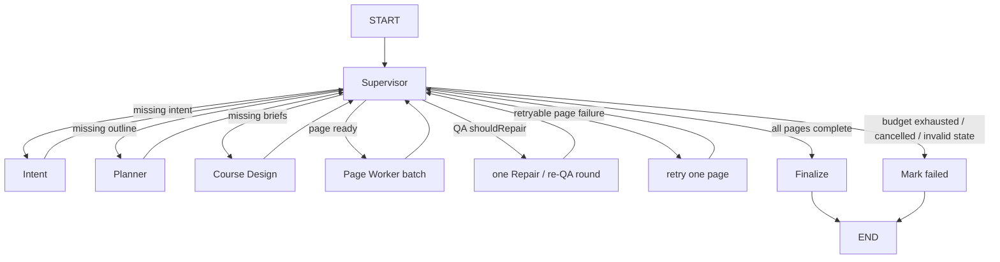

# 多 Agent 架构设计

> Day 21 架构评审文档，已更新至 Day 31：手写 Supervisor 兼容入口与生产 LangGraph 入口共享领域状态、节点生命周期和公开事件；LangGraph 已通过受限条件边调度 Specialist、页面重试及两轮 QA/Repair/re-QA。

## 1. 结论

项目应保留现有类型化 Specialist 与确定性校验边界，只在“状态驱动路由、有限修复、失败隔离”确实创造价值的地方演进编排方式。

当前产品已经不是一个包办所有工作的超级 Agent：

- Intent、Planner、Pedagogy、Story、Visual、Page Writer、Image Prompt、HTML Engineer 与 Page QA 已按领域职责拆分；
- 每个已实现 Agent 只返回一种聚焦的领域产物，校验通过后才能进入共享状态；
- 服务端负责执行顺序、checkpoint、取消和公开事件；
- 浏览器只消费类型化任务状态，不消费模型框架原生 chunk。

当前 [课程生成工作流](../src/server/workflows/course-generation-workflow.ts)保留为兼容 facade；[生产 LangGraph](../src/server/langgraph/course-generation/course-graph.ts)则由规则优先的 Supervisor 条件边选择全局 Specialist、Page Worker、Retry、Repair 或终态节点。两种入口都复用同一领域状态和底层 Agent/Worker。页面模型调用可以受控并发，但跨页状态仍由单一 merge/checkpoint 队列写入。

因此，目标不是“增加更多 Agent”，而是：

1. 让每种产物只有一个明确负责人；
2. 让 Agent 交接具备最小、类型化、可独立校验的契约；
3. 把失败限制在最小且值得恢复的 checkpoint；
4. 让协调者只能从有限动作集合中选择下一步；
5. 保持现有 API、任务 Controller、公开事件和 Seaca UI 边界稳定。

## 2. 三种架构，而不是两种

| 架构 | 谁生成业务产物 | 谁决定下一步 | 当前状态 | 主要权衡 |
| --- | --- | --- | --- | --- |
| 单一超级 Agent | 一个模型上下文同时生成规划、内容、视觉、HTML 与评估 | 同一个模型隐式决定 | 不采用 | 入口简单，但上下文过载、失败粒度粗 |
| 固定多 Specialist 工作流 | 聚焦 Agent 与确定性 Skill | TypeScript `WorkflowNode[]` 按固定顺序调度 | **作为底层原语保留** | handoff 与错误边界显式、可测试 |
| Supervisor + Specialist + Page Worker | 聚焦 Agent 与确定性 Skill | 手写兼容入口或 LangGraph 条件边调度；运行层执行页面 Worker | **已实现** | 支持有限重试、页面隔离和受控并发，但成本与状态管理更复杂 |

把大函数拆成多个带 Agent 名字的函数，不会自动得到 Supervisor 架构；同样，一个有明确 Specialist 的确定性工作流，在没有动态路由之前也已经具有工程价值。

## 3. 当前实现边界

完整的现状图见[当前 MVP 流程](./architecture/mvp-flow.md)。当前业务事实来源在服务端：

1. `/chat` 创建类型化课程任务；
2. [CourseGenerationTaskService](../src/server/tasks/course-generation-task-service.ts)负责任务生命周期和取消；
3. 新建产品任务选择生产 LangGraph 流入口；[runCourseGenerationWorkflow](../src/server/workflows/course-generation-workflow.ts)保留为显式兼容入口，两者共享初始化、恢复、checkpoint 和终态合同；
4. [course-generation-nodes.ts](../src/server/workflows/course-generation-nodes.ts)提供 Intent、Planner、Course Design 全局节点候选，[runSupervisedWorkflow](../src/server/workflows/supervised-workflow.ts)负责白名单、预算和停止规则；
5. [runSequentialWorkflow](../src/server/workflows/sequential-workflow.ts)校验全局节点的 `requiredInputs`、`produces` 和集中状态合并；
6. [runCourseDesignWorkflow](../src/server/workflows/course-design-workflow.ts)串行执行 Pedagogy、Story、Visual，再投影每页 `PageWorkerBrief`；
7. [runCourseWorkersWorkflow](../src/server/workflows/course-workers-workflow.ts)按页面依赖和 serial/parallel 配置调度 [generatePageWorker](../src/server/workflows/page-worker.ts)，Promise Pool 默认并发度为 2；
8. 每个 Worker 执行 Writer、Assets、HTML、QA；LangGraph 在 QA 要求修订时每次只授权一轮定向 Repair/re-QA，并在页面失败时按同一三次预算选择 Retry 或 Stop；
9. [routeBySupervisor](../src/server/langgraph/course-generation/supervisor-routing.ts)只读取已经校验并持久化的 `SupervisorDecision`，条件边不会从公开摘要文本推断业务状态；
10. Task Service 只在持久化成功后发布 strict snapshot、event 或 terminal；前端 Adapter 与 Controller 把并发页面状态投影到现有 `/chat` Timeline 和 learning workspace。

Page QA 自身保持只读；Page Worker 根据报告执行确定性 issue 分类，再调用有界 Repair 并 re-QA。旧 checkpoint 可以没有报告或 `repairHistory`，恢复时不会重置已经持久化的 Repair 轮次。

## 4. 单一超级 Agent 的上限

以下问题直接来自“一句话生成多页 HTML 课程”的业务，而不是泛泛的微服务论证。

### 4.1 角色与指令冲突

一个上下文需要同时扮演课程规划师、教师、故事设计师、视觉总监、文案、图片创意、前端工程师和评估者。“保留 DSL 精确文字”“增强视觉表现”“满足年龄适配”等指令会争夺注意力。

当前项目让 Planner 只生成 `CoursePlan`，Page Writer 只生成 `PageContentDSL`，HTML Engineer 只实现已经校验的 DSL，从源头减少职责冲突。

### 4.2 上下文膨胀与注意力稀释

多页课程会累积原始需求、规划、专业 brief、页面内容、素材描述、内部 URI、HTML 和 QA 证据。把全部内容传给每次模型调用既增加 token 成本，也会削弱“哪个字段才是事实来源”的清晰度。

当前 handoff 刻意保持最小化。例如 HTML Engineer 只消费当前页面 DSL、相关视觉指导、服务端解析的模板和批准素材，不读取原始用户 Prompt。

### 4.3 结构化输出漂移与截断

如果一次输出同时包含整课规划、全部页面、图片 Prompt、HTML 和 QA，Schema 面积过大，任何末尾截断或局部不一致都可能让整个结果失效。

当前系统分别校验 `CoursePlan`、`PedagogyPlan`、`StoryArc`、`VisualBrief`、`PageContentDSL`、`AssetRequest[]`、`HtmlOutput` 和 `QualityReport`，错误可以停留在对应产物边界。

### 4.4 全局一致性与局部页面质量冲突

Planner 关注课程节奏、依赖和跨页连贯；HTML Engineer 关注单页 DOM、可访问性、交互和素材绑定。让一个 Agent 同时优化两者，通常会得到模糊的全局规划或脆弱的页面实现。

本项目把全局决策保存在 CoursePlan 与专业 briefs 中，再通过 page-scoped `PageWorkerBrief` 交给每页执行者。页面层消费全局决策，但不拥有全局决策。

### 4.5 失败隔离过粗与无谓重跑

如果一个 Agent 包办全部工作，第 4 页 HTML 出错时就没有可靠边界判断第 1–3 页、课程规划和已生成素材能否复用。全量重试既昂贵，也会引入无关漂移。

现有 checkpoint 已能保留页面内容、素材和 HTML，并从失败页面阶段继续。真正提供复用能力的是持久化领域产物，而不是 Agent 数量。

### 4.6 自我评估偏差

让生成 HTML 的 Agent 同时宣布自己的结果正确，容易产生自我合理化，也可能在“修复”时越权修改内容。

[PageQAAgent](../src/server/agents/page-qa-agent.ts)保持 report-only。Day 27 Repair 只消费明确 issue 和运行层授权 scope，修复后仍需重新 QA，不能自行判定通过。

### 4.7 错误归因与可观测性不足

一个黑盒运行很难回答问题来自规划、教学、内容、素材、HTML 还是评估。把私有推理发送给浏览器也不是可接受的排障方式。

当前 Workflow 只发布带 `stage`、可选 `pageId`、可选 `agent` 和安全摘要的结构化公开事件，模型私有上下文留在服务端。

## 5. 当前受监督 Worker 工作流的局限

当前架构比单一超级 Agent 更安全，并已经具备有限 Supervisor 和页面隔离，但仍保留以下边界。

### 5.1 Supervisor 仍受确定性候选限制

Supervisor 可以在类型化候选中提出 run/retry/complete/stop，但不能改变页面依赖、扩大预算或调度任意工具。页面并发和依赖就绪由确定性课程运行层决定，不由模型自由规划。

### 5.2 队头阻塞

Design 内三个 Agent 串行，每个 Page Worker 内 Writer → Assets → HTML → QA 串行，素材槽也串行。只有彼此依赖已满足的页面可以并发；这避免为了速度破坏页面 handoff。

### 5.3 页面失败隔离仍受依赖图约束

一个 Worker 失败不会取消同批独立 Worker，也不会删除成功页面；但依赖失败页面的后继页保持 pending。课程在所有仍可运行的独立页面结束后进入失败终态。

### 5.4 子工作流 checkpoint 粒度较粗

父流程只有在 Pedagogy、Story、Visual 全部完成后才保存 Design；素材结果也要等当前页全部槽位结束后才合并。进程在子工作流中途退出时，部分已完成步骤可能重复执行，尽管 ready 图片有机会从缓存复用。

### 5.5 长 Agent 调用期间进度稀疏

Workflow 先 checkpoint `agent_start`，再等待 Agent 完整返回，之后才聚合 Agent 事件。UI 能准确显示当前运行者，但不会收到私有中间推理，也不能伪造比服务端事实更细的进度。

### 5.6 执行基础设施局限于单进程

活动任务 Map、AbortController 和 EventBus 都在当前进程。加入 Supervisor 不会自动获得耐久 Worker、course 级租约或跨实例 Pub/Sub；这些是独立基础设施问题，不能被包装成多 Agent 自动带来的能力。

## 6. 目标 Supervisor 边界

目标图见[多 Agent 目标流程](./architecture/multi-agent-flow.md)。Supervisor 是控制面角色，只能从有限动作集合中选择下一步，不生成课程产物。

### 6.1 允许读取的输入

Supervisor 只应读取调度所需的验证事实：

- 当前课程和页面状态；
- 已存在的类型化产物；
- 最新结构化错误或 QA 报告；
- 页面依赖完成情况；
- attempt 与 repair budget；
- 取消状态；
- 必要时的人工批准或拒绝。

它不应读取 chain-of-thought、任意原始模型事件或浏览器根据文本猜测出的状态。

### 6.2 有限决策集合

后续实现应将决策约束为类似以下动作：

- 调度一个当前可执行的 Specialist；
- 在预算内重试失败 Specialist；
- 把经过校验的 QA issue 路由给相应 Repair 能力；
- 跳过明确可选的阶段；
- 以 completed 或 failed 停止；
- 请求人工介入。

这些只是 Day 21 的设计动作，不是已经存在的 TypeScript 类型。

### 6.3 禁止职责

Supervisor 不得：

- 编写 `CoursePlan`、`PageContentDSL`、图片 Prompt、HTML 或 QA 结论；
- 绕过责任 Agent 直接修改其产物；
- 从公开 summary 文本反推缺失状态；
- 在没有有限预算时自动重试；
- 把私有推理当成 Timeline 日志；
- 把规划或质量规则复制到前端组件。

### 6.4 确定性策略优先

很多路由不需要模型判断：

- 没有 `CoursePlan` 时下一步必然是 Planner；
- required stage 失败时按显式预算重试或停止；
- 页面依赖完成后才解锁后继页面；
- cancellation 必须停止继续调度；
- 旧 checkpoint 没有 QA report 时保持兼容；Day 25 新建 Page Worker 会自动执行 report-only QA。

只有“下一步取决于无法被可靠规则表达的语义分类”时，才值得引入模型判断。简单分支保持确定性，成本更低，也更容易测试。

## 7. Specialist 分类与边界

权威角色索引位于 [src/server/agents/README.md](../src/server/agents/README.md)。它把职责分为四组：

1. **入口解析：** Intent 把不可信用户输入转换为验证后的 `CourseIntent`；
2. **业务产物 Specialist：** Planner、Pedagogy、Story、Visual、Page Writer、Image Prompt、HTML Engineer、QA 与 Repair；
3. **协调范围：** 已实现的 Supervisor 与 Page Worker 页面执行范围；
4. **确定性能力：** Generate Image Skill、Registry、Validator、Storage、checkpoint 和 SSE。

不能把每个函数都称为 Agent。Skill 执行有限能力；Validator 判断契约是否成立；Workflow 协调已知步骤；Agent 在模型契约下生成专业产物。

## 8. Handoff 契约原则

每个 Specialist handoff 必须满足：

1. **最小输入：** 只传入当前职责需要的验证产物；
2. **稳定标识：** 跨调用保留 `courseId`、`pageId`、模板 ID、素材槽 ID 和 issue ID；
3. **类型化输出：** 模型输出通过结构与领域规则校验后才能合并；
4. **单一所有者：** 每种产物语义只能有一个负责角色；
5. **无隐式修改：** 下游消费上游产物，不偷偷重写；
6. **验收后 checkpoint：** 保存经过校验的事实，而非原始模型返回；
7. **安全可观测：** 公开事件只有状态和安全摘要，不包含 Prompt、私有 event data 或隐藏推理。

## 9. QA 与有限 Repair

目标质量闭环必须保持 evaluator–optimizer 分离：

```text
HTML 候选
  -> QA 报告（只读）
  -> 已通过：完成页面
  -> 可修复且仍有预算：定向 Repair
  -> 校验修复产物
  -> 再次 QA
  -> 预算耗尽或不可修复：失败或请求人工处理
```

Repair 只能针对明确 issue 和最小责任产物。HTML 排版问题不能授权它重写课程规划，事实错误也不能用 CSS 隐藏。每次修复都要保留原报告并生成可追踪结果。

Repair 已由 Page Worker 按 `QualityReport` 的明确 issue 和授权 scope 实现。Day 31 没有复制修复规则到 Graph：Supervisor 只判断 `shouldRepair`、已用轮次和停止预算，`repair-page-node` 每次只授权一个现有 Repair/re-QA round；候选校验、issue 分类和产物合并仍由 Page Worker 负责。

## 10. 产品和事件边界

加入 Supervisor 时不能再造一套前端控制台。产品表面保持不变：

- `/chat` composer：用户意图与任务创建；
- `/chat` thread：公开 Agent 进度、错误、重试与取消；
- `/chat` learning workspace：规划、brief、DSL、素材、HTML 预览、QA 与导出；
- `/course`：后续持久历史；
- `/templates`：模板发现。

稳定数据流仍然是：

```text
Route / Agent / Workflow
  -> 验证后的 CourseGenerationState checkpoint
  -> strict public task stream
  -> API client 与 task controller
  -> 现有 Timeline 与 learning workspace
```

Supervisor 与 Repair 事件已经在服务端映射成共享公开协议；Day 29 的可选固定 LangGraph runner 继续写入同一协议，后续 Graph streaming 也必须遵守这一边界。UI 不直接消费框架原生 chunk，也不从面向用户的 summary 推断调度规则。

## 11. 不该使用多 Agent 的场景

以下情况优先使用单次模型调用或确定性函数：

- 任务只有一个窄输出契约；
- 没有值得保留的中间结果；
- 一个重试边界已经足够；
- handoff 成本高于被隔离的失败成本；
- 确定性转换或校验已经可以解决问题。

单页摘要、CSS Token 转换、缓存查询、Schema 校验和素材文件读取都不需要 Supervisor。是否采用多 Agent 应由职责和失败边界决定，而不是由功能是否显眼决定。

## 12. Supervisor 与 LangGraph 的关系

Supervisor 是架构角色；LangGraph 是实现 State、Node、Edge、Reducer、Streaming 与持久化的一种运行工具。Day 31 已把稳定的调度合同映射成生产条件图，同时保留手写兼容入口。Graph Supervisor 采用规则优先策略，不调用模型重复判断唯一合法的下一步。



迁移必须保留：

- 共享领域 Schema；
- checkpoint 与恢复语义；
- 公开事件安全边界；
- API Client 与 Controller 边界；
- Seaca 产品表面；
- 确定性校验与停止规则。

把同一套职责过载逻辑搬进 Graph Node，并不会改善架构。

## 13. 演进顺序

1. **Day 21（已完成）：** 文档化当前和目标边界，不改运行时；
2. **Day 22（已完成）：** 把固定顺序表达为显式手写 Specialist Workflow，同时保持 API、SSE、Schema、checkpoint、恢复和 UI 合同；
3. **Day 23 已完成：** 引入有限 Supervisor 路由、重试、停止和可解释决策；
4. **Days 24–26（已完成）：** 强化 Specialist Prompt，实现 Page Worker、自动 report-only QA、受控并发和多证据六维 QA；
5. **Day 27（已完成）：** 实现受限 Repair/re-QA、两轮预算、失败分类和公开事件；
6. **Days 28–30（已完成）：** 学习 LangGraph、迁移生产状态图，并把 Graph stream 映射到既有公开 SSE；
7. **Day 31（已完成）：** 用条件边接入规则优先 Supervisor、单页重试和有界 QA/Repair 回路，不重做前端。

每一步都应独立验收，不提前宣称后续能力已经完成。

## 14. Day 21 验收清单

- [x] 当前流程明确标记“已实现”，并与服务端源码一致；
- [x] 目标流程明确标记“未实现”；
- [x] 至少五类单 Agent 失败模式有本项目实例；
- [x] 当前固定工作流局限没有与单 Agent 局限混为一谈；
- [x] Intent、九名手册 Specialist、Supervisor、Page Worker、Skill、Validator 和传输边界区分清楚；
- [x] 每名 Specialist 都有输入、输出、校验边界和禁止职责；
- [x] QA 保持 report-only，Repair 保持 target-only；
- [x] 能解释 Supervisor 是架构角色、LangGraph 是可选运行工具；
- [x] 公开事件不包含 Prompt、私有 event data 或 chain-of-thought；
- [x] 文档没有声称 Day 21 修改了业务源码、UI、Schema 或增加了运行时能力。

## 15. Day 22 当前实现说明

- [x] `runCourseGenerationWorkflow` 仍是任务服务调用的兼容 facade；没有新增平行 Route Handler。
- [x] `WorkflowNode` 以 `name / requiredInputs / produces / run` 描述协调合同，节点只返回 partial state 与事件。
- [x] `runSequentialWorkflow` 统一检查输入与声明输出，并通过集中 merge 校验完整状态；节点失败携带稳定 `nodeName`。
- [x] Day 22 当日把 Intent、Planner、Course Design 和逐页 Writer/Assets/HTML 包装为节点工厂；Day 25 已用隔离 Worker 取代页面主链，旧逐页工厂仅保留为兼容参考。
- [x] 共享 Schema、checkpoint 时机、恢复跳过、取消、公开事件、任务 API、SSE 与 Seaca 产品表面保持原语义。
- [x] Day 22 当日 Repair、自动 QA、独立 Page Worker、并发和 LangGraph 均未实现；后续能力按各训练日独立交付。

## 16. Day 23 当前实现说明

- [x] `SupervisorDecisionSchema` 用互斥的 `run / retry / complete / stop` 合同限制结构化输出。
- [x] Supervisor 只接收压缩状态、确定性候选节点、最近失败和持久化 attempts，不接收 HTML、完整 DSL 或私有推理。
- [x] `runSupervisedWorkflow` 校验候选节点、同 node/page 最多 3 次执行、取消、无进展和全局决策上限。
- [x] accepted decision 与确定性 stop 都先 checkpoint，再通过既有 SSE 公开 `supervisor_decision` 摘要。
- [x] Seaca `/chat` Timeline 在原产品表面展示最近调度摘要，没有新增路由或平行控制台。

## 17. Day 25 当前实现说明

- [x] `generatePageWorker` 只消费单页合同和局部 checkpoint，不接收或修改整课状态。
- [x] Worker 内固定执行 Writer → Assets → HTML → report-only QA，并保存页面局部 attempts、错误和事件。
- [x] `runPromisePool` 默认并发度为 2，结果保持输入顺序，单项失败隔离，取消后不启动新任务。
- [x] 课程运行层根据页面依赖和 serial/parallel 配置调度，并通过单一 merge/checkpoint 队列写入整课状态。
- [x] Seaca Timeline 和质量面板复用现有产品表面展示并发页面状态与 QA 报告。
- [x] Day 25 当日 Repair/re-QA 和 LangGraph 尚未实现；它们已分别在 Day 27 与 Days 28–31 完成。

## 18. Day 31 当前实现说明

- [x] `START` 先进入 Supervisor；所有非终态 Specialist、Page Worker、Retry 和 Repair 节点执行后都返回 Supervisor。
- [x] `routeBySupervisor` 只接受 `SupervisorDecisionSchema` 校验后的最后决策，并只返回图中声明的节点白名单。
- [x] 缺失产物、页面依赖、QA `shouldRepair`、阶段 attempts、两轮 Repair 预算、取消和完成状态都由确定性规则判断。
- [x] 普通 Page Worker 在 QA 后暂停；Repair 节点每次只执行一轮 Repair/re-QA，失败页 Retry 每次只恢复一个页面，避免节点内部形成无界循环。
- [x] Supervisor decisions 与手写入口共享 attempt、checkpoint 和公开事件语义；Graph streaming 继续经过 Day 30 的严格映射。
- [x] 原始页面错误码在终态中保留，使用户显式恢复时可以重新判断 retryability；Supervisor stop 原因保存在 `lastDecision`。
- [x] API、Controller、Timeline、learning workspace、路由和视觉系统均未新增或重做。
