# 多 Agent 课程生成架构

> 当前新任务运行源：`agent-v2`
> 适用目标：从一句话生成一门由多份互动 HTML 组成、可审查、可返工、可恢复的课程

## 1. 结论

新主链路不需要 LangGraph。

这里真正需要的不是“画一张图来跳节点”，而是：

- 每个 Agent 有清楚的工作单；
- 每份产物不可变、可引用；
- 谁能改什么有硬限制；
- 页面能按真实依赖并行；
- 进程中断后能从数据库继续；
- 单页合格后还要审整门课；
- 返工只重做有问题的范围。

这些事情由 TypeScript 引擎、SQLite、`CourseRun`、`WorkOrder` 和 `Artifact` 直接实现，比再套一层图框架更简单，也更容易排错。历史 `workflow` / `langgraph` 记录保留读取兼容，但新任务不再进入旧执行链。

## 2. 最小角色

最终只保留四个真正需要模型自主判断的角色。

| 角色 | 负责什么 | 不负责什么 | 交活方式 |
| --- | --- | --- | --- |
| Curriculum Architect | 从全局设计课程：事实底稿、目标、统一规则、每页任务、真实生成依赖 | 不写页面，不派工，不发布 | `submit_course_architecture` |
| Course Director | 在架构和整课 Review 两个语义时点选择接受、退回、发布、局部返工、重规划或失败 | 不做机械调度，不写页面，不绕过 Gate | 对应回合的 terminal tool |
| Page Builder | 围绕一张 `PageTask` 调工具，生成内容、素材、HTML、页面质量证据，并根据 Gate 反馈定向修订 | 不改整课架构，不改其他页面，不宣布自己通过 | `submit_page` / `block_page` |
| Course Reviewer | 阅读冻结版本的全部页面摘要和质量证据，检查跨页目标、重复、断层和互动完整性 | 不修页，不派工，不发布 | `submit_course_review` / `block_course_review` |

Course Director 是课程负责人，但不是每一步都过一遍的“万能 Supervisor”。

Director 只在两个确实需要语义判断的时点运行：

1. Architect 提交完整架构后：接受并派工，或退回具体修改意见。
2. Reviewer 提交整课报告后：发布、局部返工、整课重规划或失败。

领取工作单、检查依赖、控制并发、续期租约、保存产物、运行 Gate 等机械动作全部由代码完成，不浪费模型调用。

## 3. 主流程

```mermaid
flowchart LR
  Brief["CourseCreationBrief"] --> Bootstrap["CourseRun + Architect WorkOrder"]
  Bootstrap --> Architect["Curriculum Architect"]
  Architect --> Submission["原子提交 CourseArchitecture"]
  Submission --> DirectorA["Director 语义验收"]
  DirectorA -->|"退回，整课最多 2 次"| Architect
  DirectorA -->|"接受"| Fanout["原子创建 N 张 Page WorkOrder"]
  Fanout --> Wave["按 build 依赖分 wave"]
  Wave --> Builders["Page Builder 并行执行"]
  Builders --> PageGate["Page Gate"]
  PageGate -->|"未过"| Builders
  PageGate -->|"通过"| Summary["PageSummary 解锁后继页"]
  Summary -->|"下一 wave"| Wave
  Summary -->|"全部页完成"| Manifest["冻结 CourseManifest"]
  Manifest --> Reviewer["Course Reviewer"]
  Reviewer --> DirectorR["Director 选择动作"]
  DirectorR -->|"局部返工"| Fix["fix_page + 依赖闭包"]
  Fix --> Wave
  DirectorR -->|"重规划"| Architect
  DirectorR -->|"通过"| FinalGate["Final Gate"]
  FinalGate --> Publish["completed + checkpoint + SSE"]
```



最重要的时序是：

```text
先设计完整课程
→ 再由 Director 确认整体方向
→ 然后一次性派发所有 Page WorkOrder
→ 页面才按依赖波次并行
```

不能让 Architect 一边想一边零散创建 Page Agent。这样会导致后面的页面看不到完整课程目标，也无法保证“创建了恰好 N 页”这个事实。

## 4. 四个核心对象

### 4.1 CourseRun：整门课现在走到哪

`CourseRun` 是根状态，只保存当前事实指针，不把所有正文塞进去。

关键字段：

- `phase`：planning / building / reviewing / revising / completed / failed / cancelled；
- `activeArchitecture`：当前被接受的架构；
- `currentPages`：每页当前已接受的内容、素材、HTML、质量和摘要引用；
- `stalePageIds`：返工后已经过期、不能发布的页面；
- `currentManifestHash` / `currentReview`：本轮整课审查锁定的版本；
- `leaseOwner` / `leaseExpiresAt` / `lockVersion`：防止并发乱写。

Schema 在 `src/shared/course-schema/course-run.ts`。

### 4.2 WorkOrder：一名 Agent 的明确任务

每次 Agent 回合都必须绑定一张 `WorkOrder`。工作单说明：

- 做什么：`kind`；
- 做哪门课、哪一页：`scope`；
- 可以读取哪些产物：`inputArtifactRefs`；
- 依赖哪些页面：`buildDependencyPageIds`；
- 怎么算完成：`acceptance`；
- 可以调哪些工具：`allowedTools`；
- 最多运行多久、几步、几次工具：`budget`；
- 当前状态、执行次数、租约和提交结果。

输入在工作单进入 `queued` 时封口。Agent 执行中不能突然读到新的页面版本。

Schema 在 `src/shared/course-schema/work-order.ts`。

### 4.3 Artifact：一次提交形成的不可变产物

主要产物包括：

- `course_architecture`
- `page_content`
- `page_assets`
- `page_html`
- `page_quality`
- `page_summary`
- `course_manifest`
- `course_review`

Artifact 创建后不原地覆盖。修订会产生新版本和新引用，`CourseRun` 再把 current 指针切过去。这样可以知道 Reviewer 审的是哪一版，也能在失败时保留旧版本。

Schema 在 `src/shared/course-schema/course-artifact.ts`。

### 4.4 ToolOperation：工具调用审计台账

`course_tool_operations` 记录一次工具调用的 WorkOrder、attempt、工具名、输入哈希、状态、安全摘要和输出 ArtifactRef。它用于排错、审计和核对恢复后的调用序号，大体积 HTML、图片和原始工具参数不会复制进台账。

当前 AgentRunner 没有把它做成通用 exactly-once（严格只执行一次）或自动 tool replay 层。重复业务写入主要由 Repository 事务、WorkOrder 幂等键、不可变 Artifact 和具体工具缓存防护；外部 Provider 在“副作用已发生、结果尚未落库”时仍存在重复调用窗口。不能仅凭 ToolOperation 记录宣称工具副作用已安全重放。

## 5. CourseArchitecture 为什么必须一次提交

`CourseArchitecture` 包含三个部分：

```text
CoursePack
  事实、术语、示例、资料引用、硬约束

CourseBlueprint
  课程标题、受众、难度、目标、统一教学和视觉规则

PageTask[]
  每页职责、覆盖目标、互动、素材、模板、验收条件、build 依赖
```

Architecture Gate 负责能用代码判断的硬条件：

- pageId 和 order 唯一；
- order 从 1 连续；
- 每个目标有页面承接；
- 模板和互动类型合法；
- `buildDependsOnPageIds` 指向真实页面且无环；
- 参考资料引用存在；
- 页面验收条件完整。

Director 再检查代码判断不了的东西：

- 课程目标有没有真的落到讲解和练习；
- 页面是不是各干一件事；
- 有没有重复页和凑数页；
- 难度是否适合受众；
- build 依赖是不是确实需要读取前页生成结果。

两层都通过后，接受架构和创建 N 张 Page WorkOrder 在同一个事务里完成。不能出现“架构已接受，但只创建了 3/5 页”的中间状态。

## 6. 页面如何并行协作

`PageTask.order` 是学习展示顺序，`buildDependsOnPageIds` 是生成依赖，两者不是一回事。

例子：

```text
page-1: 无 build 依赖
page-2: 无 build 依赖
page-3: 依赖 page-1
page-4: 依赖 page-1
page-5: 依赖 page-3、page-4
```

执行波次：

```text
wave 1: page-1 + page-2
wave 2: page-3 + page-4
wave 3: page-5
```

同一 wave 用 Promise Pool 并行，默认最多 5。页面通过 Page Gate 后生成一份受控 `PageSummary`，依赖它的 WorkOrder 才会加入这份摘要、封口输入并变成 `queued`。

后继页不读取整份前页 HTML。它只读：

- 前页已经讲了什么；
- 产生了什么学习结果；
- 哪些事实、术语和状态需要延续；
- 质量结论和可安全引用的 ArtifactRef。

这样既保留协作，又避免上下文越来越大。

## 7. Page Builder 为什么算真正的 Agent

Page Builder 不是一段固定顺序函数外面换了个名字。它有：

- 独立 WorkOrder；
- 有限但可选择的工具；
- 可读取的当前上下文；
- 基于工具结果决定下一步的模型循环；
- 明确预算和停止条件；
- Repository 终态校验；
- 中断后的持久化 checkpoint。

常用工具覆盖：

- 读取页面任务、依赖摘要和资料；
- 生成或修订内容 DSL；
- 生成素材；
- 生成 HTML；
- 运行页面质量检查；
- 按 Gate 反馈修订；
- 提交或阻塞页面。

Agent 说“完成了”不算完成。只有 terminal 工具成功落库，并且 AgentRunner 重新读取到相同 trace、WorkOrder 和 terminal 状态，当前回合才结束。

Agent 也不能把普通工具错误包装成 `block_page`。阻塞前必须读过当前 attempt 的
上下文，存在失败的 current `PageQuality`，并且修复已被明确拒绝、有效质量修订
预算耗尽，或确定性修复计划无法授权任何可行修复。缺失封口的 ReferencePack/Chunk
在 Agent 启动前确定性失败。

## 8. 两层质量闭环

### 8.1 Page Gate：单页是否能交

Page Gate 用代码检查：

- 内容是否覆盖 PageTask；
- 素材槽是否完整；
- HTML 是否安全且符合 DSL/素材绑定；
- 互动和反馈是否真实存在；
- 三视口截图是否齐全，质量报告是否没有具体交付 error；
- 所有证据是否属于本次提交。

Page Builder 不能自己给自己盖章。

### 8.2 Reviewer：整门课是否成立

所有页通过后构造 `CourseManifest`，把架构和每页精确 ArtifactRef 固定下来并计算 hash。

Reviewer 必须读完全部页面摘要，检查：

- 每个学习目标是否既被讲过又被考过；
- 页面是否重复、断层、顺序突跳；
- 事实、术语、例子和视觉规则是否一致；
- 互动是否真的可操作并有反馈；
- 如果课程在开场提出学习承诺，后续是否兑现，课程目标是否在合适位置闭合。

页面 issue 至少绑定该页 current `page_summary` 或 `page_quality`；课程 issue 只能
引用 current `course_architecture`、`page_summary` 或 `page_quality`。HTML、内容和
素材原文不是 Reviewer 已读取的受控证据，不能用它们凑 evidence。Gate 会逐项核对
ArtifactRef 的 kind、scope、version、hash 和 current manifest。

结论只有三种：

- `pass`
- `revise_pages`
- `replan`

Director 根据报告选择唯一动作。即使选择发布，Final Gate 还会重建当前 manifest，防止旧 Review 发布新页面。

Reviewer 只有在读完全部封口证据，且机器检查发现 PageSummary 的 `courseId/order`
与冻结 manifest 冲突，或 PageSummary 的质量投影
`overallScore/decision/issueCodes` 与对应 PageQuality 冲突时，才会看到
`block_course_review`。PageQuality 本身不含课程或顺序字段；健康证据、少读证据和
普通内容质量问题都不能 blocked。

Director 也没有任意失败权。合法架构与 `pass` Review 下 `fail_course` 会被隐藏并
被执行层拒绝；架构语义退回最多 2 次、整课 replan 最多 1 次、页面返工最多 2 轮，
只有对应持久化预算耗尽后，机器 Gate 才会用固定原因开放失败动作。

## 9. 返工规则

### 局部返工

适用于内容、HTML、互动或单页质量问题。

系统创建 `fix_page` WorkOrder，并把这些页面纳入范围：

1. Reviewer 点名的页面；
2. 在 `buildDependsOnPageIds` 上真正依赖它们的传递后继页。

不是“显示顺序在它后面的全部页面”。

每个 page-scoped issue 还必须带 `targetArtifact`：

- `page_content`：先产出新内容，再重建素材、HTML 和质量；
- `page_html`：可把旧内容/素材当只读 baseline，但必须产出新 HTML 和新质量；
- 依赖闭包页：系统固定为 `dependency_refresh → page_content`，确保它真正消费新的
  上游摘要。

旧页面 Artifact 只用于比较和定向修改，不是 Fix WorkOrder 的 checkpoint。
`submit_page` 会检查当前 WorkOrder 是否已经产生机器指定的目标 Artifact 和当前
`PageQuality`；原样提交旧页面不算返工。

返工后必须重新：

```text
Page Gate → Manifest → Reviewer → Director
```

旧 Review 不能继续用。

### 整课重规划

只有目标矩阵、页面职责或整体顺序本身有问题时才 `replan`。系统创建更高 revision 的 `architect_course` WorkOrder，旧分支保留审计，但不再是当前分支。

## 10. 失败与恢复

### 允许自动换模型

只对暂时性的 Provider 错误使用一次配置好的 fallback，例如：

- 超时；
- 限流；
- 短暂网络或服务故障。

Schema 不合法、工具越权、质量未过、认证错误和配置错误不能靠盲换模型掩盖。

### 进程中断

恢复依赖数据库，不依赖内存：

- CourseRun lease 过期后可被新 worker 领取；
- running WorkOrder lease 过期后可重新领取；
- 已提交/已接受的 Artifact 不重做；
- Repository 事务、WorkOrder 幂等键和具体工具缓存避免大部分重复业务写入；
- ToolOperation 提供输入哈希和结果引用审计，但不会自动重放工具结果；
- Projector 从 current 指针重建前端 checkpoint。

Next 启动钩子只做一次恢复扫描。持续恢复必须运行 `npm run worker:course`，或由外部调度反复触发等价扫描；`after()` 和单次启动扫描都不是耐久队列。

### 无法继续

下列情况进入明确失败，不无限循环：

- WorkOrder blocked / failed；
- 依赖图损坏导致没有任何可运行工作；
- Final Gate 长期不成立；
- replan / revision 预算耗尽；
- lease、trace 或数据版本不一致。

## 11. 存储和所有权

agent-v2 新增五张运行时耐久表，并给原 Task 层增加执行权和控制意图表：

| 表 | 保存什么 |
| --- | --- |
| `course_execution_claims` | 同一 courseId 当前唯一的活动 Task |
| `course_task_control_intents` | 跨进程取消意图和控制面写入围栏 |
| `course_runs` | 整课当前指针、阶段、租约和错误 |
| `course_work_orders` | 每次 Agent 任务、依赖、预算、提交和租约 |
| `course_artifacts` | 不可变业务产物 |
| `course_tool_operations` | 工具输入哈希、状态、安全摘要和 ArtifactRef 审计台账 |
| `course_run_events` | 可投影的有序运行事件；`safeSummary` 可公开，原始 `payload` 仍是内部数据 |

写入所有权必须保持单一：

- Agent 只能通过授权工具写 Repository；
- Repository 命令负责事务、幂等、围栏和状态迁移；所有普通业务事务都在同一
  SQLite 写事务内核对 Task 的 course/trace/running 状态和 cancel intent；
- Projector 只读，不反向修改业务事实；
- Task Service 负责把投影后的状态写入旧 CourseStore/TaskStore 并发布 SSE；
- UI 只消费公开投影，不参与调度。

CourseStore 写入不是无条件 upsert：调用方必须带刚读取的旧 checkpoint，Store 用
payload CAS 更新，并在同一条 SQL 中确认 TaskRecord 的 trace 和 status 仍允许写入。
EventBus 只负责当前进程低延迟通知；SSE Route 每 500 ms 通过
`CoursePublicEventReader` 直接追读 `course_run_events`，补齐其他进程的 Agent/Tool
事件。公开事件保留数据库分配的 durable sequence，过滤旧分支后允许有空洞，不按
数组位置重新编号；CourseStore/TaskStore 只用于 snapshot 和 terminal。trace 切换
时先发新基线 snapshot，EventBus 窄窗口事件随后从 durable log 重放。

Agent/Provider 原始异常在写入任何运行事实前都转换为稳定错误码和固定公开文案；
Projector 与 SSE 统一发送出口再清洗 durable 读取和 EventBus 历史脏数据中的凭据、
Prompt、request body、Unix 路径和 `file://` 路径。terminal checkpoint 的事件游标
即使落后于已发送 durable event，也要沿用当前已发送游标发出终态并关闭连接。

## 12. 代码入口

| 关注点 | 主要文件 |
| --- | --- |
| 总引擎 | `src/server/course/run/engine.ts` |
| Repository | `src/server/course/store/repository.ts` |
| Architect | `src/server/agent/plugins/agents/course/architect-handler.ts` |
| Director | `src/server/agent/plugins/agents/course/director-handler.ts` |
| Page Builder | `src/server/agent/plugins/agents/course/page-builder-handler.ts` |
| Reviewer | `src/server/agent/plugins/agents/course/reviewer-handler.ts` |
| 单页 Gate | `src/server/course/gate/page.ts` |
| 整课与最终 Gate | `src/server/course/gate/review.ts` |
| 派工/发布命令 | `src/server/course/run/commands.ts` |
| 返工/重规划命令 | `src/server/course/run/revision-commands.ts` |
| UI 投影 | `src/server/course/projection/state.ts` |
| 共享 Schema | `src/shared/course-schema/` |

## 13. 维护时的判断标准

新增一个“Agent”前先问：

1. 它是否有独立、需要模型判断的目标？
2. 它是否有自己的 WorkOrder、输入边界、工具和交付物？
3. 它失败后是否值得单独恢复或返工？
4. 它是否会对最终质量负责，而不是只把上一步改写一遍？

如果答案不是四个“是”，通常应该做成：

- 一个确定性 Gate；
- 一个 Repository 命令；
- 一个工具；
- 或 Page Builder 内部的一步。

不要再用 `Agent`、`Supervisor`、`Skill` 这些名字包装普通函数。
