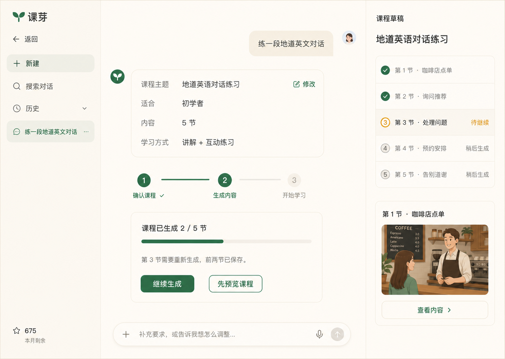

# 课芽课程创建对话 PRD

| 项目 | 内容 |
| --- | --- |
| 文档状态 | Draft v1.0 |
| 更新时间 | 2026-07-24 |
| 文档类型 | 产品方案 + 对话需求规格 |
| 产品表面 | `/chat`、右侧课程草稿 |
| 默认设计方向 | 阶段式创建 |
| 关联文档 | [互动 HTML 课程播放器 PRD](./interactive-html-course-player-prd.md) |



## 1. 背景

当前 `/chat` 已经能够执行课程需求理解、课程规划、专业设计、逐节内容生成、素材生成、HTML 生成、QA 和修复。但界面直接展示了大量内部运行信息，包括 Agent 名称、Supervisor 决策、Workflow 来源、Repair 次数、Trace ID、原始 Schema 错误和逐节点耗时。

这些信息对开发和排障有价值，但不能帮助普通用户完成“描述想学什么 → 确认课程 → 等待生成 → 开始学习”的核心任务。内部流程暴露还会造成：

- 用户无法判断自己下一步应该做什么。
- 技术错误被误认为需要用户理解或修复。
- 真正重要的课程主题、对象、节数和成果被大量日志淹没。
- 生成失败时，用户不知道已完成内容是否保留。
- 右侧工作区同时展示规划、错误、QA 和底层数据，缺少明确主任务。

本需求将 `/chat` 收敛为面向普通用户的课程创建对话，并把内部运行状态投影为少量、稳定、可行动的产品状态。

## 2. 产品目标

### 2.1 核心目标

1. 用户可以用自然语言描述课程需求。
2. 系统只询问缺失且会明显影响课程结果的信息。
3. 用户回答后，课程简报实时更新，不重复询问已知信息。
4. 用户在生成前能确认主题、对象、目标、节数和学习方式。
5. 生成过程中只展示课程级进度、已完成成果和可执行操作。
6. 第一节完成后即可预览，不必等待整课结束。
7. 生成失败时说明影响范围、保留内容和下一步操作。
8. 内部 Agent、工作流和错误细节不进入普通用户界面。

### 2.2 成功指标

- 从发送首条需求到开始生成的中位交互轮次 ≤ 3。
- 信息充分的 Prompt 直接进入课程简报确认的比例 ≥ 80%。
- 用户完成澄清问题的比例 ≥ 75%。
- 用户因看不懂错误而放弃的比例较当前基线下降 ≥ 50%。
- 第一节生成后进入预览的点击率 ≥ 40%。
- 暂停任务的继续生成成功率 ≥ 80%。
- 课程简报被用户主动修改的比例可被准确统计。

### 2.3 非目标

- 不向普通用户提供 Agent、模型、运行时或并发设置。
- 不展示完整生成日志、Trace ID 或原始错误对象。
- 不在对话中提供独立的流程编排器。
- 不要求用户理解 PageContentDSL、HTML、QA 或 Repair。
- 不在 MVP 中实现自由拖拽式课程大纲编辑器。
- 不新增产品路由。

## 3. 产品原则

### 3.1 用户目标优先

界面始终回答三个问题：

1. 我正在创建什么课程？
2. 现在进行到哪里？
3. 我接下来可以做什么？

任何不能帮助回答这三个问题的信息默认不展示。

### 3.2 少问，但问关键问题

不是每个课程都执行固定问卷。只有某字段缺失、存在多种合理解释，并且不同答案会明显改变课程结构时才提问。

### 3.3 一次只问一个问题

默认一次只突出一个需要确认的问题，提供 2–4 个推荐答案和自由输入。用户在一条自然语言回复中回答多个问题时，应一次性提取并更新，不再重复询问。

### 3.4 推断透明，可随时修改

系统可以使用合理默认值，但必须在课程简报中明确展示。用户可以修改任何推断字段。

### 3.5 渐进交付

课程节完成后立即进入右侧课程草稿；第一节达到最低可预览条件后即可打开。

### 3.6 技术细节默认隐藏

技术信息继续保留在服务端日志、测试和受限诊断工具中，但不进入普通用户对话。

## 4. 页面信息架构

### 4.1 左侧：对话历史

保留：

- 返回。
- 新建对话。
- 搜索对话。
- 最近课程对话。
- 当前用户入口。

调整：

- 对话标题使用课程主题，不使用内部任务名称。
- 历史项可显示简短产品状态，例如“生成中”“可继续”“已完成”。
- 不显示运行源、模型或技术状态。

### 4.2 中间：课程创建对话

按顺序包含：

1. 用户自然语言需求。
2. 必要的单个澄清问题。
3. 可编辑课程简报。
4. 三阶段课程旅程。
5. 单一课程生成状态卡。
6. 固定输入框。

中间区域不再展示：

- Agent 时间线。
- Supervisor 调度。
- 全局 Agent 列表。
- Repair 轮次。
- 页面节点日志。
- Trace ID。
- 连接状态。
- 模型调用耗时。

### 4.3 右侧：课程草稿

生成前：

- 课程标题。
- 已确认的课程简报摘要。
- 暂定课程结构。

生成中：

- 有序课程节列表。
- 每节的“已完成 / 生成中 / 待继续 / 稍后生成”状态。
- 已完成节的预览缩略图。
- “查看内容”操作。

生成完成：

- 完整课程结构。
- “开始学习”主操作。
- “调整课程”次操作。

右侧不展示：

- 原始错误对象。
- QA 分数和修复详情。
- Prompt、DSL、HTML 源码。
- Agent 或工作流状态。
- 运行日志。

## 5. 核心流程

### 5.1 新建课程

1. 用户进入 `/chat`。
2. 输入自然语言需求或选择示例。
3. 系统解析已有课程信息。
4. 系统判断信息是否足够。
5. 信息充分时直接展示课程简报。
6. 信息不足时进入动态澄清。

### 5.2 动态澄清

1. 系统从缺失字段中选择影响最大的一个。
2. 在对话中展示关键问题、推荐答案和可见默认值。
3. 用户点击答案或自由输入。
4. 系统更新课程简报。
5. 重新判断是否需要继续询问。
6. 达到生成门槛后停止提问，展示课程简报。

默认最多连续提出 3 个阻塞问题。超过 3 个仍缺失的非关键字段使用可见默认值，避免把课程创建变成问卷。

### 5.3 确认课程简报

课程简报至少展示：

- 课程主题。
- 适合对象。
- 学习目标。
- 课程结构规划方式，或用户明确指定的节数。
- 学习方式。

用户可以：

- 点击“修改”进入字段编辑。
- 直接在对话中说“改成 3 节”“适合零基础”“多加练习”。
- 点击“开始生成”。

当用户改变目标等结构字段时，右侧简报同步更新；实际章节列表等待后端 Outline 返回后再展示。

### 5.4 生成课程

生成阶段只展示以下课程级状态：

- 正在整理课程需求。
- 课程方向已确认。
- 正在规划课程结构。
- 课程已生成 `X / Y` 节。
- 正在完善第 `N` 节。
- 课程生成暂停。
- 课程已完成。

界面保持单一生成状态卡，不追加重复进度消息。

### 5.5 渐进预览

- 第一节生成完成并通过最低安全检查后显示“先预览课程”。
- 用户预览时，后续课程节继续生成。
- 返回对话后恢复最新生成状态。
- 预览不改变生成任务的运行状态。

### 5.6 暂停与继续

生成失败或中止时，产品文案必须说明：

1. 哪一节未完成。
2. 已完成多少节。
3. 已完成内容是否保留。
4. 用户可以执行什么操作。

示例：

> 第 3 节需要重新生成，前两节已经保存。

操作：

- 主操作：继续生成。
- 次操作：先预览课程。
- 文本操作：调整课程。

不展示内部错误原因。只有错误可由用户修复时，才转成产品语言说明，例如“参考资料无法读取，请重新上传”。

## 6. 动态提问策略

### 6.1 生成门槛

开始生成前必须明确：

- `topic`：课程主题。
- `audience`：适合对象或可接受的默认对象。
- `goal`：主要学习目标。
- `sectionCount`：默认由后端按内容规划；用户明确提出合法数量时作为约束。
- `learningMode`：讲解、互动或混合。

其中主题和目标不能完全缺失。其余字段允许使用明确展示的默认值。

### 6.2 提问条件

只有同时满足以下条件才提问：

1. 字段缺失或歧义较大。
2. 不同答案会改变课程内容或结构。
3. 无法使用低风险默认值。
4. 该问题尚未被用户自然语言回答。

### 6.3 问题优先级

按影响从高到低：

1. 学习目标。
2. 适合对象与已有水平。
3. 明确的学习时长或内容范围限制。
4. 学习方式。
5. 内容重点与不需要的内容。
6. 视觉风格和其他偏好。

### 6.4 问题库

| 字段 | 何时询问 | 推荐问题 | 推荐答案 | 默认值 |
| --- | --- | --- | --- | --- |
| 学习目标 | 主题宽泛或可能有多种用途 | “你最希望通过这门课做到什么？” | 入门理解、考试复习、实际应用、系统学习 | 入门理解 |
| 适合对象 | 无法判断年龄或专业程度 | “这门课主要给谁学习？” | 零基础、初学者、有一定基础、进阶学习者 | 初学者 |
| 已有水平 | 难度依赖先验知识 | “你目前对这个主题了解多少？” | 完全不了解、知道一点、学过但不熟、比较熟悉 | 知道一点 |
| 课程结构 | 不主动询问 | 无；简报显示“由课芽按内容深度规划” | 用户可在自然语言中明确提出合法节数 | 根据主题、目标、受众与练习需要规划 |
| 学习方式 | 内容既可讲解也可练习 | “你更希望怎样学习？” | 讲解为主、互动练习为主、讲解 + 互动 | 讲解 + 互动 |
| 学习时长 | 用户使用分钟描述或有时间限制 | “你准备花多长时间学习？” | 10 分钟、20 分钟、30 分钟、不限制 | 20 分钟 |
| 内容重点 | 主题范围过大 | “你最想优先学习哪部分？” | 根据主题动态生成 2–4 项 | 自动选择核心内容 |
| 语言 | 教学语言或目标语言不明确 | “课程内容使用什么语言？” | 中文、英文、中英双语 | 跟随用户输入 |
| 参考资料 | 用户提到文件或指定内容 | “要基于你提供的资料生成吗？” | 使用资料、资料只作参考、不使用资料 | 使用资料 |

### 6.5 课程结构规划

课程节数不是默认必答项。界面不展示固定 3、4、5 节选项，课程简报统一显示“由课芽按内容深度规划”。

后端 Intent 根据主题范围、知识依赖、受众基础、学习目标、示例、主动练习、反馈和总结的需要，选择足够且不重复的正整数章节数，不设置固定上限。它不因生成成本压缩关键内容，也不为了增加数量拆分重复内容。

用户在自然语言中明确提出合法节数时，系统继续把它作为约束传给课程任务。界面对用户统一使用“节”，不显示“页面”“并行”“串行”或“并发”。

### 6.6 用户回答解析

用户可能通过以下方式回答：

- 点击推荐答案。
- 输入一句自然语言。
- 一次回答多个问题。
- 修改之前的答案。

示例：

> 给零基础大学生，5 节，讲解少一点，多做互动。

系统应一次更新：

- 适合对象：零基础大学生。
- 课程节数：5 节。
- 学习方式：互动练习为主。
- 内容偏好：减少长篇讲解。

系统不得继续询问已经回答的字段。

## 7. 课程简报

### 7.1 数据结构

```ts
type CourseCreationBrief = {
  topic: string;
  audience: {
    label: string;
    priorKnowledge?: string;
  };
  goal: string;
  sectionCount: "auto" | number;
  learningMode: "guided" | "practice" | "mixed";
  estimatedMinutes?: number;
  language: string;
  focusAreas: string[];
  excludedAreas: string[];
  referencePackIds: string[];
};
```

### 7.2 字段来源

每个字段在内部记录来源：

- `explicit`：用户明确输入。
- `answered`：用户回答澄清问题。
- `inferred`：系统从上下文推断。
- `default`：系统使用默认值。

来源不需要作为技术标签展示给用户。课程简报中仅对推断和默认字段使用轻提示：

- “根据你的描述填写”
- “课芽推荐”

### 7.3 修改规则

- 用户修改结构字段后，未开始生成时直接更新。
- 已开始生成时修改结构字段，需要提示“更新后将重新规划未完成课程节”。
- 已完成课程节默认保留，除非修改影响其主题、目标或适合对象。
- 用户取消修改时恢复上一个已确认版本。

## 8. 三阶段旅程

### 8.1 确认课程

完成条件：

- 已达到生成门槛。
- 课程简报已展示。
- 用户点击开始生成，或明确说“开始吧”。

### 8.2 生成内容

显示：

- 已生成节数。
- 当前正在生成的课程节名称。
- 已完成内容可预览状态。
- 暂停、继续或取消操作。

不显示：

- 节点名称。
- Agent 名称。
- 技术阶段。
- 每次重试。
- 内部耗时。

### 8.3 开始学习

完成条件：

- 全部必需课程节生成完成。
- 每节通过最低 HTML 和安全检查。

操作：

- 主操作：开始学习。
- 次操作：预览课程。
- 可选操作：调整课程。

## 9. 用户可见状态合同

### 9.1 允许展示

| 内部状态 | 用户可见文案 |
| --- | --- |
| 需求解析中 | 正在整理课程需求 |
| 课程规划中 | 正在规划课程结构 |
| 专业设计生成中 | 正在完善课程风格 |
| 第 N 节写作/素材/HTML 处理中 | 正在生成第 N 节：{课程节标题} |
| 第 N 节 QA/Repair 中 | 正在完善第 N 节 |
| 已完成 X/Y | 课程已生成 X / Y 节 |
| 任务失败且可恢复 | 课程生成暂停 |
| 任务取消 | 已停止生成，完成内容已保存 |
| 全部完成 | 课程已完成，可以开始学习 |

### 9.2 永不展示

- Agent、Supervisor、Workflow、LangGraph。
- Planner、Writer、HTML Engineer、QA、Repair。
- Trace ID、任务 ID、Page ID。
- Schema、JSON、校验路径和错误代码。
- 重试次数和预算。
- 模型名称、Provider、Token、缓存。
- SSE、连接状态、Graph 节点。
- 原始 Prompt、DSL、HTML。
- 私有推理或模型消息。

### 9.3 错误翻译

| 错误类别 | 用户文案 | 操作 |
| --- | --- | --- |
| 暂时性生成失败 | 这一节暂时没有生成成功，已完成内容不会丢失。 | 继续生成 |
| 参考资料解析失败 | 这份资料暂时无法读取，请重新上传或移除。 | 重新上传、移除 |
| 内容不符合要求 | 这一节需要重新整理。 | 继续生成 |
| 用户取消 | 已停止生成，完成内容已经保存。 | 继续生成 |
| 网络中断 | 连接中断，正在尝试恢复。 | 自动恢复、稍后重试 |
| 无法恢复 | 这次生成无法继续，已完成内容仍可预览。 | 查看已完成内容、重新创建 |

只有用户可以解决的问题才需要解释原因；其余错误只说明影响范围和下一步。

## 10. 功能需求

### 10.1 对话理解

- **CC-001**：系统必须从用户自然语言中提取课程简报字段。
- **CC-002**：系统必须保留用户明确输入，不得被默认值覆盖。
- **CC-003**：系统必须识别用户对已确认字段的修改。
- **CC-004**：同一条回复包含多个字段时必须批量更新。
- **CC-005**：系统不得重复询问已经明确回答的问题。

### 10.2 动态问题

- **CC-010**：系统每次最多突出一个阻塞问题。
- **CC-011**：每个问题提供 2–4 个推荐答案和自由输入。
- **CC-012**：存在安全默认值时提供“交给课芽”。
- **CC-013**：默认连续阻塞问题不超过 3 个。
- **CC-014**：用户可以跳过非必需问题。
- **CC-015**：选择答案后，课程简报必须立即更新。

### 10.3 课程简报

- **CC-020**：课程简报必须展示主题、对象、目标、节数和学习方式。
- **CC-021**：课程简报必须支持修改。
- **CC-022**：修改节数后，右侧课程草稿数量必须同步变化。
- **CC-023**：推断和默认字段必须对用户可见但不使用技术标签。
- **CC-024**：开始生成后修改结构字段必须说明对未完成内容的影响。

### 10.4 生成状态

- **CC-030**：同一课程同时只显示一个课程级生成状态卡。
- **CC-031**：状态卡必须显示已完成节数和总节数。
- **CC-032**：第一节可预览后必须显示预览操作。
- **CC-033**：失败状态必须说明已完成内容是否保留。
- **CC-034**：可恢复时必须提供“继续生成”。
- **CC-035**：生成完成时主操作切换为“开始学习”。

### 10.5 课程草稿

- **CC-040**：右侧课程草稿必须与 Outline 顺序一致。
- **CC-041**：每节只显示产品状态，不显示内部阶段。
- **CC-042**：已完成节允许查看内容。
- **CC-043**：未完成节不可打开，并说明“生成中”“待继续”或“稍后生成”。
- **CC-044**：右侧工作区不得渲染原始错误和内部评估信息。

### 10.6 参数隐藏

- **CC-050**：普通用户界面不得提供执行方式和并发数量。
- **CC-051**：课程节数默认由服务端按内容规划；用户明确提出合法数量时作为约束。
- **CC-052**：执行方式、并发和重试策略由服务端决定。
- **CC-053**：开发诊断能力必须与普通用户产品界面隔离。

## 11. 示例对话

### 11.1 信息充分：直接确认

用户：

> 为零基础职场新人生成 5 节地道英文面试对话课，每节包含简短讲解和互动练习。

系统不提问，直接展示：

- 课程主题：英文面试对话。
- 适合：零基础职场新人。
- 学习目标：掌握常见面试问答。
- 内容：5 节。
- 学习方式：讲解 + 互动练习。

### 11.2 信息不足：逐步提问

用户：

> 帮我学英语。

系统：

> 你最希望通过这门课做到什么？

答案：

- 日常交流。
- 职场沟通。
- 旅行英语。
- 考试复习。

用户选择“日常交流”。

系统：

> 你目前的英语水平怎么样？

答案：

- 零基础。
- 初学者。
- 有一定基础。
- 交给课芽。

系统获得足够信息后展示课程简报，不继续执行固定问卷。

### 11.3 一次回答多个字段

用户：

> 给初学者，做 3 节就好，讲解少一点，多练习。

系统：

> 已更新：适合初学者、3 节快速课程、互动练习为主。

课程简报同步更新，不再分别询问对象、节数和学习方式。

### 11.4 生成中修改

用户：

> 改成 5 节，再加一节餐厅点餐。

系统：

> 会将课程调整为 5 节，并重新规划尚未完成的内容。已经完成的课程节会先保留。

操作：

- 确认调整。
- 取消。

## 12. 响应式与可访问性

### 12.1 响应式

- ≥ 1200px：左侧历史、中间对话、右侧课程草稿同时显示。
- 768–1199px：右侧课程草稿作为可切换面板。
- < 768px：单列对话；课程简报和生成状态保持在消息流中；课程草稿使用全屏抽屉。

### 12.2 可访问性

- 推荐答案使用真实按钮或单选组。
- 问题和答案具有明确标签与阅读顺序。
- 课程简报更新通过克制的 `aria-live` 通知。
- 进度条提供当前值、最小值和最大值。
- 状态不能只依赖颜色。
- 键盘可完成提问、修改、生成、预览和继续生成。
- 点击目标不小于合理触控尺寸。
- 200% 缩放时不丢失主要操作。

## 13. 数据与事件

建议记录：

- `course_creation_started`
- `clarification_question_shown`
- `clarification_answered`
- `clarification_skipped`
- `course_brief_confirmed`
- `course_brief_edited`
- `course_generation_started`
- `first_section_previewed`
- `course_generation_resumed`
- `course_generation_completed`

不得记录到前端分析事件：

- 原始参考资料内容。
- 完整自由输入答案。
- 原始 Prompt、DSL 或 HTML。
- 私有 Agent 数据和原始错误。

## 14. 与现有实现的关系

### 14.1 保留

- `/chat` 路由和现有三栏响应式壳层。
- 对话历史。
- 参考资料上传。
- 任务创建、SSE、断点恢复和取消能力。
- 右侧课程结构、页面预览和已完成结果。

### 14.2 收敛

- `CourseRunTimeline` 改为课程级公开状态投影。
- `GenerationLogDrawer` 不在普通用户界面出现。
- `CourseWorkspacePanel` 默认只展示课程草稿和预览。
- QA、Repair、素材和逐节点进度从普通用户视图移除。
- 原始错误必须先经过产品错误映射。

### 14.3 参数调整

当前 Composer 中：

- “课程页数”改为课程简报中的“课程节数”。
- “执行方式”从普通用户界面移除。
- “最大并发”从普通用户界面移除。
- 服务端继续使用默认执行策略，不改变现有 API 能力。

## 15. MVP 验收标准

1. 用户输入信息充分的课程需求后，不出现多余问题。
2. 信息不足时，系统一次只问一个关键问题。
3. 用户一条回复可以更新多个课程简报字段。
4. 未指定节数时由后端按内容规划；明确提出任意正整数节数时可以正确传递。
5. 生成前明确展示课程主题、对象、目标、节数和学习方式。
6. 普通用户界面不出现 Agent、Workflow、Repair、QA、Trace 或原始错误。
7. 生成中只显示一个课程级状态卡。
8. 第一节完成后可以预览。
9. 失败时明确说明已完成内容不会丢失，并提供继续生成。
10. 右侧课程草稿只显示课程结构、产品状态和预览入口。
11. 执行方式和并发设置不再对普通用户可见。
12. 手机端可以完成从需求输入到开始生成的完整流程。
13. 自动规划不会把复杂主题固定压缩为 5 节，也不会用重复章节凑数量。
14. 每个核心目标在总结前至少经历讲解或示例、主动应用或检查、解释性反馈。
15. 页面教学连贯性低于质量门槛时必须进入定向修订，不能仅因 HTML 可运行而通过。

## 16. 分阶段交付

### P0：信息收敛

- 隐藏内部 Agent、Trace、Repair、QA 和原始错误。
- 用单一课程级状态卡替代时间线。
- 右侧工作区收敛为课程草稿。
- 隐藏执行方式和并发参数。

### P1：课程简报

- 从 Prompt 构建课程简报。
- 支持简报编辑。
- 自动模式不传 `pageCount`；用户明确节数时映射现有 `pageCount`。
- 简报与右侧草稿同步。

### P2：动态澄清

- 缺失字段判断。
- 问题优先级。
- 推荐答案与自由输入。
- 多字段回答解析。
- 最多 3 个阻塞问题。

### P3：渐进预览

- 第一节完成后开放预览。
- 生成状态与右侧草稿实时同步。
- 失败后的继续生成和已完成内容预览。

## 17. 待确认问题

1. 课程简报确认后，是自动开始生成，还是必须点击“开始生成”？
2. “交给课芽”选择是否在所有非必需问题中统一提供？
3. 已开始生成后修改结构字段，是否默认只重做未完成课程节？
4. 首版动态问题由规则优先，还是完全交给模型决定？
5. 是否需要为高级用户保留独立的受限诊断入口？
