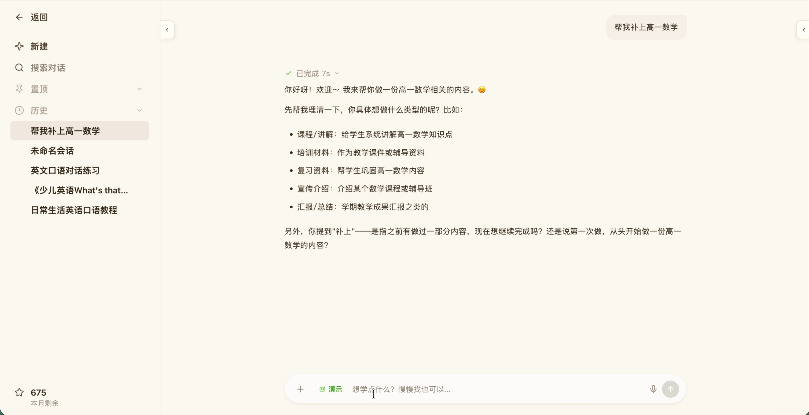
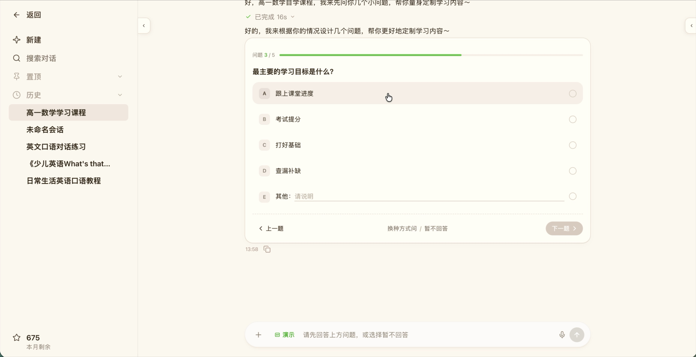
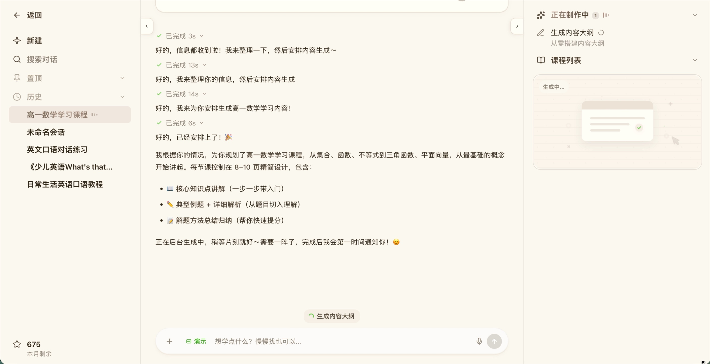
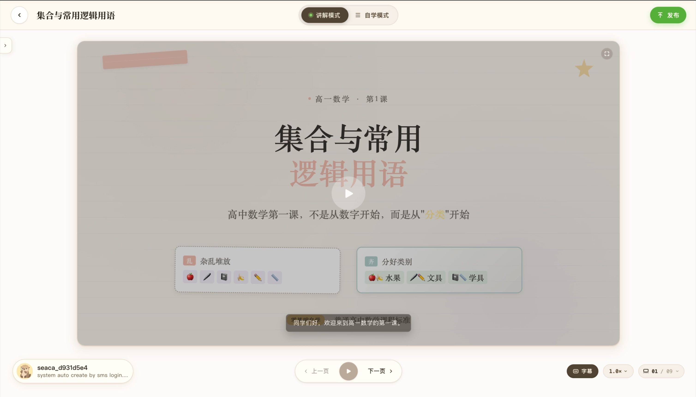
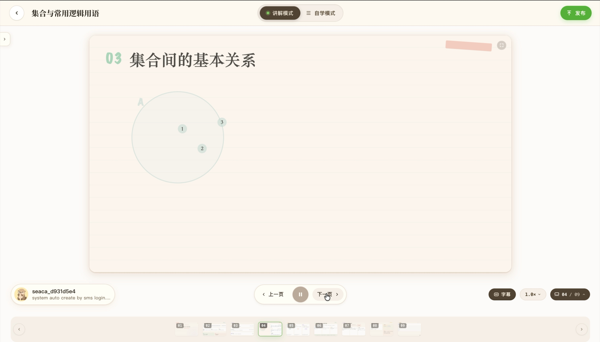
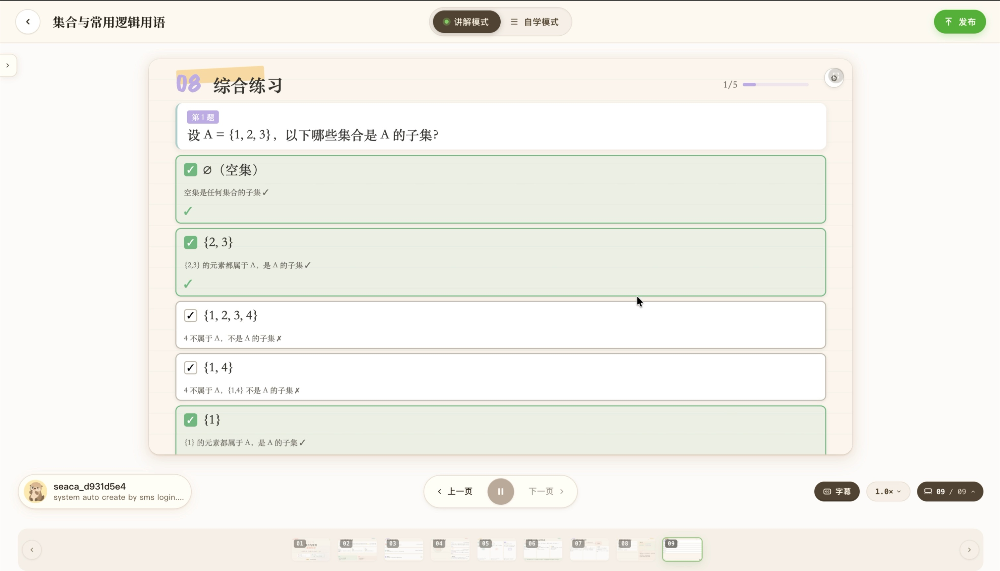

# 课芽互动 HTML 课程播放器 PRD

| 项目 | 内容 |
| --- | --- |
| 文档状态 | Draft v1.1 |
| 更新时间 | 2026-07-24 |
| 文档类型 | 体验审计 + 产品方案 + 需求规格 |
| 产品表面 | `/chat`、右侧学习工作区、`/course/[courseId]` |
| 默认设计方向 | 课程地图 |
| 目标版本 | 互动播放器 MVP |


课程创建阶段的对话、课程简报和动态提问规则见：

[课芽课程创建对话 PRD](./course-creation-chat-prd.md)

## 1. 背景

课芽已经具备从用户 Prompt 生成课程规划、单页 PageContentDSL、素材、HTML、QA 报告和持久化课程记录的完整链路。目前生成结果以独立静态 HTML 页面预览为主，用户可以查看每页内容，但无法获得连续、可交互、可恢复的完整授课体验。

本需求要把一门课程中按顺序生成的多节 HTML 组织成统一课程，并由稳定的播放器壳层负责目录、导航、讲解、字幕、进度和学习状态。每节生成 HTML 只负责本节的教学内容与局部互动，不重复实现全局播放器能力。

### 1.1 关键定义

- **课程**：一组具有明确顺序、依赖关系和学习目标的课程节。
- **课程节**：当前系统中的单个 Page，拥有 PageContentDSL、素材结果、独立 HTML 和 QA 状态。
- **生成 HTML**：模型基于结构化内容生成的单节教学页面，只包含本节内容和局部互动标记。
- **播放器壳层**：由课芽前端维护的可信 UI，负责跨节能力和学习状态。
- **可信互动运行时**：由平台维护、版本固定的脚本，用于解释生成 HTML 中的互动标记并向播放器上报事件。

### 1.2 “拼接”的产品与技术含义

产品上，多节 HTML 应呈现为一门连续课程。

技术上，不应把多个完整 HTML 文档直接进行字符串拼接。直接拼接会产生重复的 `html/head/body`、样式污染、ID 冲突、脚本冲突和不可控的生命周期。

MVP 采用以下装配方式：

1. 课程记录保存有序的课程节 Manifest。
2. 播放器一次只挂载当前课程节的独立 HTML。
3. 切节时卸载当前节并挂载目标节。
4. 播放器可预取下一节的 HTML 和素材，但不同时执行多个课程节。
5. 课程目录、进度和状态让用户感知到它是一门连续课程。

该方案与当前“只挂载选中 sandbox iframe”的产品边界一致，也为未来的连续滚动模式保留扩展空间。

## 2. 录屏体验审计

### 2.1 审计范围

- 课程生成流程录屏：约 232 秒，覆盖提出需求、意图澄清、学习诊断、生成等待和课程完成通知。
- 最终课程录屏：约 122 秒，覆盖讲解模式、课程导航、概念可视化、例题、总结和综合练习。
- 审计目标：识别参考体验中值得继承的产品结构，以及课芽可以明显优化的交互和教学问题。
- 审计方式：按时间抽取关键画面，结合可见流程评估任务效率、信息层级、教学节奏、互动深度和可访问性风险。

### 2.2 总体结论

参考体验已经形成“提出需求 → 诊断学习目标 → 后台生成 → 课程播放 → 练习反馈”的完整闭环。最值得继承的是：

- 对话生成课程的低门槛入口。
- 讲解模式和自学模式的区分。
- 统一播放器中的导航、字幕、倍速和课程进度。
- 练习后的逐项反馈和原因解释。

不建议直接复制的是：

- 生成前过多的强制问题。
- 长时间停留在缺少成果预览的“生成中”状态。
- 将互动练习集中在课程结尾。
- 部分页面使用大量空白，却没有把 HTML 的动态能力转化为有效学习操作。
- 页面 HTML 和播放器能力边界不够明确，容易让不同生成页面重复实现全局控制。

因此，本 PRD 采用“课芽可信播放器壳层 + 独立生成课程节 + 平台互动运行时”的产品方案。

### 2.3 流程评估

| 步骤 | 健康度 | 已有优势 | 主要问题 | 产品机会 |
| --- | --- | --- | --- | --- |
| 意图澄清 | 良好，对话偏长 | 能识别课程用途和上下文 | 大段文本确认，进入生成较慢 | 用可编辑课程简报承载结构化确认 |
| 学习诊断 | 方向正确，摩擦偏高 | 能收集基础、年级和目标 | 五道问题全部成为前置门槛 | 首次只问高信息量问题，其余在课程中自适应获取 |
| 生成等待 | 可理解，等待感明显 | 阶段和进度可见 | 重复完成消息、缺少可用成果和剩余预期 | 第一节完成后立即预览，任务卡统一展示状态 |
| 课程播放器 | 框架成熟 | 模式、字幕、倍速、导航连续存在 | 页面、辅助控件和发布控件存在竞争 | 壳层只保留跨节能力，课程节只保留局部学习动作 |
| 概念讲解 | 视觉统一，互动不足 | 版式和课程风格一致 | 大画布利用率低，学习者偏被动 | 每节定义一个明确的预测、操作或判断任务 |
| 练习反馈 | 清楚，但出现较晚 | 正误和原因靠近选项 | 练习集中在末尾，主要依赖颜色表达状态 | 将低风险检查穿插到知识节，反馈同时使用图标和文字 |

### 2.4 生成流程证据

意图澄清已经能识别“补上”等上下文，但助手文本较长，适合收敛为结构化课程简报。



学习诊断拥有清晰进度，但所有问题成为生成前门槛。MVP 应允许快速生成，并在课程中继续诊断。



生成阶段能够解释任务状态，但用户长时间看不到可用课程节。播放器应支持“生成一节、预览一节”。



### 2.5 播放与互动证据

参考播放器已经证明统一壳层是正确方向：模式、导航、字幕、倍速和页码不随课程内容变化。



概念页视觉统一，但单一小图占据的有效面积过少。生成 HTML 应围绕具体学习动作组织，而不是仅播放装饰动画。



综合练习能够逐项给出解释，这是应保留的优势；同时需要把同类即时反馈前置到知识学习过程中。



### 2.6 审计导出的产品机会

#### 2.6.1 生成前：从问答改为课程简报

- 在 `/chat` 中持续维护主题、对象、目标、时长、难度和模式。
- 已知信息自动填充，只有真正影响课程结构的缺口才阻塞生成。
- 学习诊断结果立即说明“将如何影响课程”。

#### 2.6.2 生成中：从等待改为渐进交付

- 第一节通过最低检查后立即开放预览。
- 将重复 Agent 消息合并为一条可展开任务卡。
- 明确显示已完成节、当前生成节、失败节和可恢复状态。

#### 2.6.3 学习中：从翻页改为教学循环

每个关键知识点遵循：

1. 简短解释。
2. 预测或操作。
3. 即时反馈。
4. 一句归纳。
5. 进入下一知识点。

原则上每 60–90 秒至少出现一次与学习目标直接相关的动作。

#### 2.6.4 课程结束：从结果页改为学习闭环

- 总结页引用学习者本次的关键表现，而不是只重复固定知识。
- 答错后提供具体复习课程节入口。
- `/course` 显示完成度、最近学习位置和继续学习操作。

### 2.7 审计证据限制

- 录屏无法确认完整键盘路径、读屏语义、颜色对比数值和移动端重排。
- 未检查参考产品代码，因此安全实现、状态持久化和旁白技术只能通过可见界面推断。
- 本 PRD 的可访问性和安全要求需要在实现阶段通过代码检查与自动化测试验证。

## 3. 用户问题

### 3.1 学习者

- 生成完成后只能逐页查看，缺少完整课程入口。
- 页面之间没有统一的学习进度、播放控制和恢复位置。
- 互动主要是静态呈现，操作结果不能稳定反馈或保存。
- 页面刷新或离开后，无法回到上次学习位置。

### 3.2 课程创建者

- 无法像学习者一样连续体验整门课程。
- 单页质量通过不代表整课导航、节奏和状态管理可用。
- 不容易定位某一节的运行错误，也不容易只重试失败节。

## 4. 产品目标

### 4.1 核心目标

1. 把一门课程的多节生成 HTML 装配成统一播放器体验。
2. 支持真实的页内互动、即时反馈和学习状态保存。
3. 保持生成 HTML 与可信播放器壳层之间的安全边界。
4. 复用课芽现有产品表面，不建立第二套课程产品或视觉系统。
5. 允许课程生成完成前预览已就绪课程节。

### 4.2 成功指标

- 完成课程生成后，可进入播放器的课程比例 ≥ 95%。
- 播放器打开后首个可用课程节渲染成功率 ≥ 99%。
- 互动事件成功上报率 ≥ 99%。
- 已开始课程的恢复位置准确率 ≥ 99%。
- 课程中至少包含一次有效互动的比例 ≥ 90%。
- 播放器引起的课程中断率低于单页预览基线。

### 4.3 非目标

- 不在 MVP 中允许模型生成任意 JavaScript。
- 不在 MVP 中支持第三方网页、外链脚本或外链样式。
- 不在 MVP 中实现多人课堂、教师实时控制或班级管理。
- 不在 MVP 中实现自由拖拽式课程编辑器。
- 不将 `/preview/[previewId]` 变成新的持久化课程中心。
- 不让单节 HTML 自己管理课程目录、全局导航或播放状态。

## 5. 目标用户与场景

### 5.1 主要用户

- 希望快速学习一个主题的自主学习者。
- 使用 AI 生成复习课、知识讲解或练习课的学生。
- 生成课程后需要检查完整学习体验的课程创建者。

### 5.2 核心场景

1. 用户在 `/chat` 输入课程需求并启动生成。
2. 第一节完成后，右侧学习工作区允许即时预览。
3. 全部或部分课程节可用后，用户进入课程播放器。
4. 用户通过课程地图切换课程节，完成讲解和互动。
5. 播放器自动保存当前节、页内状态和完成进度。
6. 用户之后从 `/course` 返回并继续学习。

## 6. 产品原则

### 6.1 壳层稳定，内容可变

课程标题、目录、模式、播放、字幕、倍速、上一节、下一节、总体进度和恢复状态由播放器壳层统一提供。生成 HTML 不能重复这些能力。

### 6.2 内容生成，行为受控

模型负责生成内容、视觉结构和互动语义；平台可信运行时负责执行互动、判断状态和上报事件。

### 6.3 一次突出一个学习动作

每个课程节应围绕一个主要学习目标和一个主要动作组织。避免在一节中堆叠过多卡片、题型或全局控制。

### 6.4 反馈靠近操作

互动反馈必须出现在触发操作附近，并同时使用图标、文字和颜色表达状态。

### 6.5 渐进可用

第一节就绪后即可预览；后续节继续生成。单节失败不阻止已完成节的查看。

## 7. 信息架构

| 产品关注点 | 产品表面 | 责任 |
| --- | --- | --- |
| 输入课程需求 | `/chat` Composer | Prompt、参考资料、生成选项 |
| 查看生成进度 | `/chat` 对话区 | 公共事件、阶段、错误、取消与恢复 |
| 检查生成结果 | `/chat` 右侧学习工作区 | 课程地图、单节预览、QA、单节重试 |
| 完整课程播放器 | `/course/[courseId]` | 连续学习、互动、状态保存与恢复 |
| 浏览课程历史 | `/course` | 搜索、筛选、完成度、最近学习位置 |
| 临时独立预览 | `/preview/[previewId]` | 单节 HTML 的短期安全预览 |

MVP 不新增产品路由。`/course/[courseId]` 在课程完成后提供“开始学习/继续学习”，并切换到播放器视图。

## 8. 播放器体验

### 8.1 页面布局

播放器由四个稳定区域构成：

1. **顶部栏**
   - 返回课程详情。
   - 课程标题。
   - 讲解/自学模式切换。
   - 总体课程进度。

2. **左侧课程地图**
   - 展示章、节层级。
   - 展示已完成、当前、未开始、失败状态。
   - 点击可切换到已就绪课程节。
   - 未就绪课程节不可进入，并说明当前状态。

3. **中央课程画布**
   - 一次只挂载一个生成 HTML。
   - 负责本节内容、局部互动和反馈。
   - 不包含全局课程导航或播放控制。

4. **底部播放器**
   - 上一节、播放/暂停、旁白进度、字幕、倍速、下一节。
   - 显示自动保存状态。
   - 在小屏下收敛为主要控制，次要控制进入菜单。

### 8.2 视觉状态

课程地图中的课程节至少包含以下状态：

| 状态 | 显示 | 可操作性 |
| --- | --- | --- |
| 未开始 | 空心状态标记 | 已就绪时可进入 |
| 当前 | 绿色实心标记和背景强调 | 当前挂载 |
| 已完成 | 对勾图标和文字状态 | 可回看 |
| 生成中 | 加载状态和“生成中”文本 | 不可进入 |
| 失败 | 错误图标和失败说明 | 创建者可重试 |

状态不得只依赖颜色表达。

### 8.3 进入与退出

- 首次进入默认打开第一个已就绪且未完成的课程节。
- 存在历史进度时默认恢复最近课程节和页内状态。
- 用户退出前不要求手动保存。
- 自动保存失败时保留本地状态，并显示非阻塞提示。

## 9. 功能需求

### 9.1 课程装配

- **FR-001**：系统必须根据课程 Outline 和 `order` 构建有序课程节 Manifest。
- **FR-002**：Manifest 必须记录课程节 ID、标题、状态、HTML 版本、互动类型、依赖和 QA 状态。
- **FR-003**：播放器一次只能挂载一个当前课程节。
- **FR-004**：切换课程节时必须先保存当前页内状态，再卸载旧节。
- **FR-005**：播放器可以预取下一节资源，但不得提前执行下一节脚本。
- **FR-006**：课程节重新生成后，播放器必须按 HTML 版本判断旧状态是否仍可恢复。

### 9.2 课程地图

- **FR-010**：课程地图必须按规划顺序展示章、节和状态。
- **FR-011**：当前节必须在视觉和辅助技术语义上明确标识。
- **FR-012**：用户只能进入已经生成且通过最低安全检查的课程节。
- **FR-013**：点击失败节时，学习者看到不可用说明；创建者看到重试入口。
- **FR-014**：窄屏下课程地图必须折叠为抽屉，不占用课程画布宽度。

### 9.3 讲解模式

- **FR-020**：讲解模式按照旁白段落和提示点推进内容。
- **FR-021**：播放、暂停、倍速和字幕状态跨课程节保持。
- **FR-022**：遇到必须完成的互动时，自动播放必须暂停。
- **FR-023**：用户完成互动或明确跳过后才能继续自动推进。
- **FR-024**：切换课程节时，旁白必须停止旧节并加载新节。

### 9.4 自学模式

- **FR-030**：自学模式默认不自动播放旁白。
- **FR-031**：所有内容和互动必须可以在无音频情况下理解。
- **FR-032**：用户可主动播放当前旁白段落。
- **FR-033**：模式切换不能清空当前页内互动状态。

### 9.5 页内互动

MVP 优先支持以下确定性互动：

| 类型 | 行为 | 完成条件 |
| --- | --- | --- |
| `reveal` | 展开、翻转或热点揭示 | 查看规定项目 |
| `choice` | 单选或多选并即时反馈 | 提交有效答案 |
| `sort` | 拖拽或键盘排序/分类 | 提交完整顺序或分类 |
| `explore` | 切换对象、热点或状态 | 完成规定探索数量 |

- **FR-040**：生成 HTML 只能声明互动语义和稳定元素 ID，不能包含任意业务脚本。
- **FR-041**：可信运行时必须为每种互动提供键盘操作方式。
- **FR-042**：每次提交必须反馈正确、错误或需要补充。
- **FR-043**：反馈必须包含文字原因，不能只显示正误颜色。
- **FR-044**：达到最大尝试次数时，根据 DSL 规则显示解析或复习入口。
- **FR-045**：互动状态必须上报给播放器并参与自动保存。

### 9.6 进度与恢复

- **FR-050**：系统必须保存当前课程节、完成状态、互动答案、尝试次数和模式偏好。
- **FR-051**：刷新页面后必须恢复到最近保存的课程节。
- **FR-052**：完成条件由课程节的 `completionRule` 决定，不能只依据是否打开过。
- **FR-053**：课程总体进度按已完成课程节计算。
- **FR-054**：HTML 版本变化导致状态不兼容时，必须保留课程级进度并重置当前节状态，同时向用户说明。

### 9.7 错误和降级

- **FR-060**：当前节加载失败时，播放器壳层仍必须可用。
- **FR-061**：用户可以重试加载当前节或切换到其他已就绪节。
- **FR-062**：可信运行时初始化失败时，课程节必须进入静态降级模式。
- **FR-063**：静态降级必须保留完整教学文本、阅读顺序和参考解析。
- **FR-064**：单节失败不得清空其他节的学习状态。

## 10. 生成 HTML 合同

### 10.1 生成 HTML 可以包含

- 单个本节主内容区域。
- 标题、正文、图示、素材和局部互动区。
- 稳定的 `data-page-id`、`data-block-id` 和 `data-interaction-type`。
- 可信运行时约定的互动项、选项、反馈和状态挂载点。
- 本节内部的 CSS 和课芽课程 Token。

### 10.2 生成 HTML 禁止包含

- 课程标题和整课目录。
- 上一节、下一节或返回课程。
- 讲解/自学模式切换。
- 全局播放、字幕、倍速和总体进度。
- 任意外部脚本、样式、字体、媒体或网络请求。
- 任意内联事件属性和 `javascript:` URL。
- 顶层导航、弹窗、下载、表单提交或嵌套 iframe。
- 自己实现的持久化、登录或分析逻辑。

### 10.3 建议的 DSL v2 扩展

现有 `narration: string[]` 和互动语义可继续作为基础，但播放器需要新增：

```ts
type LessonSectionRuntime = {
  runtimeVersion: number;
  sceneKind: "explain" | "demo" | "practice" | "reflect" | "recap";
  narrationSegments: Array<{
    id: string;
    text: string;
    targetId?: string;
  }>;
  cuePoints: Array<{
    narrationId: string;
    action: "highlight" | "reveal" | "wait-for-interaction";
    targetId?: string;
  }>;
  completionRule:
    | { type: "view" }
    | { type: "interaction-complete"; interactionId: string }
    | { type: "correct-answer"; interactionId: string };
};
```

该结构只表达授课和互动意图，不包含前端组件、CSS 或可执行代码。

## 11. 可信互动运行时

### 11.1 运行边界

1. 模型生成的 HTML 在服务端完成合同和安全检查。
2. 服务端或预览组装层注入平台维护的固定版本 runtime。
3. iframe 只开放运行固定脚本所需的最小能力。
4. 不开放 `allow-same-origin`、表单、弹窗、下载和顶层导航。
5. iframe 不允许网络访问。
6. runtime 只能通过严格协议与宿主通信。

### 11.2 消息协议

允许的课程节事件：

```ts
type LessonSectionEvent =
  | { type: "section-ready"; pageId: string; runtimeVersion: number }
  | { type: "interaction-started"; pageId: string; interactionId: string }
  | {
      type: "interaction-submitted";
      pageId: string;
      interactionId: string;
      attempt: number;
      result: "correct" | "incorrect" | "partial";
    }
  | { type: "section-completed"; pageId: string }
  | { type: "section-error"; pageId: string; code: string };
```

宿主必须校验消息来源窗口、事件类型、Page ID、Runtime 版本和 payload Schema。未知消息直接忽略并记录安全日志。

## 12. 状态模型

建议新增独立于生成状态的学习会话：

```ts
type CourseLearningSession = {
  courseId: string;
  learnerId?: string;
  currentPageId: string;
  mode: "guided" | "self-paced";
  narrationRate: number;
  captionsEnabled: boolean;
  pageStates: Record<
    string,
    {
      htmlVersion: number;
      status: "not-started" | "in-progress" | "completed";
      interactionState?: unknown;
      attempts: number;
      updatedAt: string;
    }
  >;
  updatedAt: string;
};
```

生成状态与学习状态必须分离：

- `CourseGenerationState` 说明课程是否生成完成。
- `CourseLearningSession` 说明某个学习者学到了哪里。

## 13. 响应式与可访问性

### 13.1 响应式

- ≥ 1024px：左侧课程地图 + 中央课程画布。
- 768–1023px：课程地图折叠，顶部保留入口。
- < 768px：单列课程画布，底部播放器使用安全区域，次要控制进入菜单。
- 课程节 HTML 必须支持 320、375、768 和 1440 宽度。

### 13.2 可访问性

- 所有互动支持键盘和可见焦点。
- 拖拽操作必须提供选择后移动的替代方式。
- 正误状态同时使用图标、文字和颜色。
- 旁白内容必须有等价字幕。
- 动态反馈使用克制的 `aria-live`。
- 支持 `prefers-reduced-motion`。
- 触控目标不得小于合理的可操作尺寸。
- 页面缩放至 200% 时核心内容和操作不可丢失。

## 14. 数据与事件

MVP 只记录改进学习体验所需的最小事件：

- `course_player_opened`
- `course_section_viewed`
- `course_section_completed`
- `interaction_started`
- `interaction_submitted`
- `course_mode_changed`
- `course_resumed`
- `course_player_error`

事件不能包含原始 Prompt、完整 DSL、HTML、自由输入答案或私有 Agent 数据。

## 15. QA 要求

### 15.1 自动检查

- HTML 合同与安全检查。
- 课程节 ID、互动 ID 和 DSL 一致性。
- 320、375、768、1440 宽度的布局检查。
- 横向溢出、遮挡、正文截断和最小触控目标。
- runtime 初始化和消息 Schema。
- choice、sort、reveal、explore 的行为测试。
- 切节前保存、刷新恢复和版本不兼容重置。
- 禁止网络请求、顶层导航和未授权消息。

### 15.2 人工验收

- 课程地图与实际课程顺序一致。
- 当前节、完成节和失败节容易区分。
- 讲解模式暂停后，旁白和相关动画同时暂停。
- 自学模式不依赖音频也能完成课程。
- 反馈紧邻操作，原因清楚。
- 单节错误不会破坏播放器壳层或其他课程节。

## 16. MVP 验收标准

1. 后端规划的任意合法章节数都可以在 `/course/[courseId]` 连续学习，课程地图支持长列表滚动。
2. 播放器一次只挂载一个独立生成 HTML。
3. 用户可从课程地图进入任意已就绪课程节。
4. 至少支持 `reveal`、`choice` 和 `sort` 三种真实互动。
5. 互动结果可以保存，并在刷新后恢复。
6. 讲解/自学模式、字幕和倍速跨节保持。
7. 当前节失败时可以重试或切换到其他节。
8. 生成 HTML 无法加载外部网络资源或控制宿主页面。
9. 键盘用户可以完成整门课程。
10. 已有 `/chat` 生成、QA、Repair 和 `/course` 历史流程保持可用。

## 17. 分阶段交付

### P0：课程装配与静态播放器

- 课程 Manifest。
- 课程地图。
- 单 iframe 切节。
- 上一节/下一节。
- 学习位置保存与恢复。
- 静态 HTML 降级。

### P1：可信互动 MVP

- 可信 runtime。
- `reveal`、`choice`、`sort`。
- 互动反馈和完成条件。
- 页内状态保存。
- 行为级 QA。

### P2：讲解体验

- 旁白分段、字幕和提示点。
- 播放、暂停、倍速。
- 讲解/自学模式。
- 生成一节、预览一节。

### P3：教学优化

- 学科专用互动模板。
- 错误类型驱动的复习跳转。
- 更细粒度的学习效果指标。
- 可选连续滚动课程模式。

## 18. 依赖与风险

| 风险 | 影响 | 应对 |
| --- | --- | --- |
| 放开脚本权限扩大攻击面 | 高 | 只注入平台 runtime；不执行模型脚本；最小 sandbox 和 CSP |
| 不同 HTML 视觉差异过大 | 中 | 统一课程 Token、模板约束和视觉 QA |
| 页面版本变化导致旧状态失效 | 中 | 状态绑定 HTML 版本；不兼容时只重置当前节 |
| 旁白与页面状态不同步 | 中 | 使用稳定 narration ID 和 cuePoint，不依赖纯时间猜测 |
| 拖拽不支持键盘 | 高 | 所有拖拽必须提供选择/移动替代操作 |
| 多节同时挂载影响性能 | 中 | MVP 只挂载当前节，最多预取下一节资源 |

## 19. 待确认问题

1. MVP 是否必须包含 TTS，还是先完成字幕和手动播放状态？
2. 学习状态首版只保存到浏览器，还是直接绑定登录用户持久化？
3. 课程创建者与普通学习者是否共用同一播放器视图？
4. 开放输入题由本地规则判断，还是提交服务端 Agent 评价？
5. 课程完成后是否需要生成可分享的公开学习链接？
