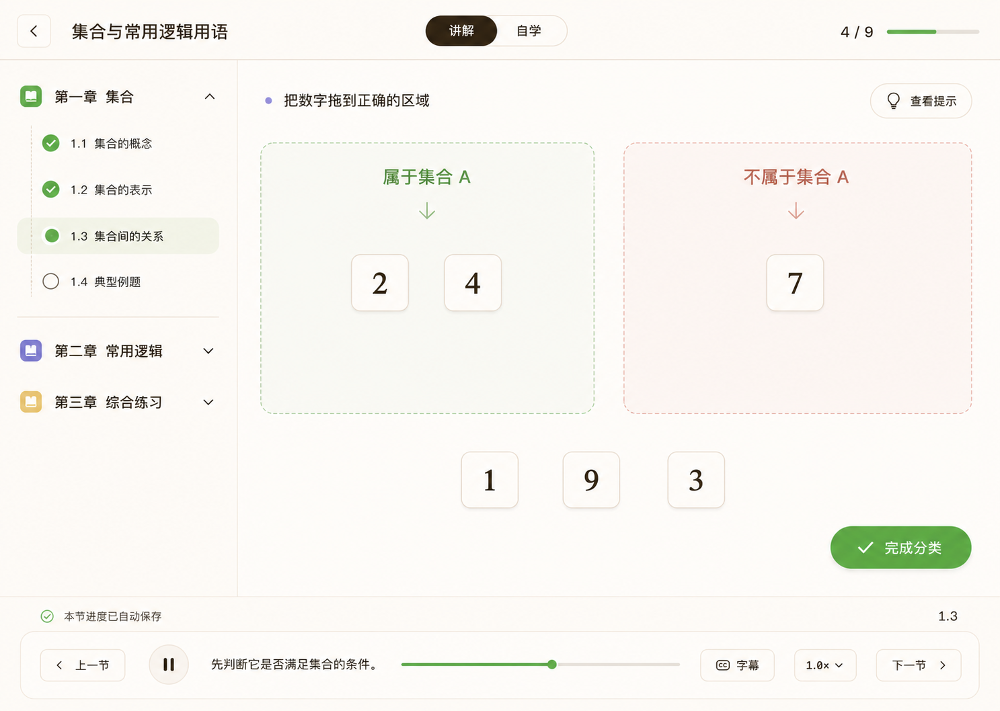

# 课芽简历截图与证据清单

本文记录可用于简历、README 和面试演示的截图来源。图片只证明画面中可见的产品能力；不能替代源码、测试或真实模型端到端验收。

## 使用规则

1. 对外材料优先使用与当前“课芽”品牌和 Keya 产品表面一致的图片。
2. 截图必须标明它证明的路由、状态和能力。
3. 历史截图可以解释产品演进，但不能描述为当前 HEAD 的精确视觉验收。
4. 设计展示图不能包装成真实模型 Demo 通过证据。
5. 图片中不得出现 API Key、本地绝对路径、资料原文或私有 Agent 数据。

## 推荐主图

### 1. 课程创建与断点继续


- **文件：** [`course-creation-chat-guided-v1.png`](../product/assets/course-creation-chat-guided-v1.png)
- **对应产品表面：** `/chat`
- **可证明：** 课程简报、章节状态、已完成页面预览、断点继续和右侧学习工作区的信息架构。
- **不可证明：** 当前 Provider 已真实完成该图中的整门课程；图片不是已通过的 Day 36 Demo run 截图。
- **推荐用途：** README 首图、简历项目附件、面试开场。

### 2. 互动课程播放器



- **文件：** [`interactive-course-player-course-map-v1.png`](../product/assets/interactive-course-player-course-map-v1.png)
- **对应产品表面：** `/course/[courseId]`
- **可证明：** 章节导航、讲解/自学模式、互动页面、学习进度、字幕和播放控制的产品设计。
- **不可证明：** 该课程来自一次已通过的真实模型 Demo；图片本身不证明导出或 QA 结果。
- **推荐用途：** README 第二张图、面试中的重前端能力展示。

## 历史产品截图

以下 JPG 记录较早的产品过程和播放器界面。它们仍可用于解释交互演进，但部分画面包含旧命名、旧布局、测试账号或当时的本地状态，因此不作为当前 README 主图。

| 文件 | 画面内容 | 可辅助说明 | 对外限制 |
| --- | --- | --- | --- |
| [`01-intent-clarification.jpg`](../product/assets/01-intent-clarification.jpg) | `/chat` 意图澄清 | 为什么先建立课程简报 | 历史布局，不宣称当前精确 UI |
| [`02-learning-diagnostic.jpg`](../product/assets/02-learning-diagnostic.jpg) | 学习诊断问题 | 结构化交互而非纯文本聊天 | 历史流程截图 |
| [`03-generation-wait.jpg`](../product/assets/03-generation-wait.jpg) | 生成中线程与右侧面板 | 长任务阶段反馈 | 不代表当前 SSE/Graph 事件字段 |
| [`04-lesson-player.jpg`](../product/assets/04-lesson-player.jpg) | 课程播放器封面 | 讲解/自学模式与课程导航 | 包含旧测试标识 |
| [`05-concept-visual.jpg`](../product/assets/05-concept-visual.jpg) | 概念可视化页面 | HTML 内容和视觉表达 | 包含旧测试标识 |
| [`06-exercise-feedback.jpg`](../product/assets/06-exercise-feedback.jpg) | 练习即时反馈 | 互动状态与解释反馈 | 包含旧测试标识 |

## 真实 Demo 证据状态

仓库当前有两次正式记录：

| Run | 结果 | 截图 | ZIP |
| --- | --- | --- | --- |
| [`2026-07-23T06-36-41-307Z`](../demo/results/2026-07-23T06-36-41-307Z/summary.json) | 失败；三个案例均未生成页面 | 无 | 无 |
| [`2026-07-23T07-10-04-686Z`](../demo/results/2026-07-23T07-10-04-686Z/summary.json) | 失败；火星案例形成规划但课程未完成 | 无 | 无 |

这两次记录用于证明 Demo runner 能保存失败诊断，不是成功作品证据。只有重新运行：

```bash
pnpm demo:run -- --record
```

并满足三个固定案例全部通过、`summary.json` 的 `passed` 为 `true`、桌面/移动截图和 ZIP 文件实际存在后，才能新增“真实模型端到端通过”截图。

## 简历和 README 链接

- **GitHub：** [github.com/dxj-fe/ai-course-generator](https://github.com/dxj-fe/ai-course-generator)
- **项目入口：** [README](../../README.md)
- **简历亮点：** [project-bullets.md](./project-bullets.md)
- **面试深挖：** [interview-deep-dive.md](./interview-deep-dive.md)
- **Demo 验收规则：** [docs/demo/prompts.md](../demo/prompts.md)
- **Demo 结果说明：** [docs/demo/results/README.md](../demo/results/README.md)

## 对外发布检查

- [ ] 图片仍存在，Markdown 能正常渲染。
- [ ] 图中没有凭据、本地绝对路径或私人资料。
- [ ] 说明文字没有把设计图或历史截图写成当前真实运行结果。
- [ ] GitHub 链接与 `git remote get-url origin` 一致。
- [ ] 若引用真实 Demo，通过状态、截图和 ZIP 三项证据必须同时存在。
