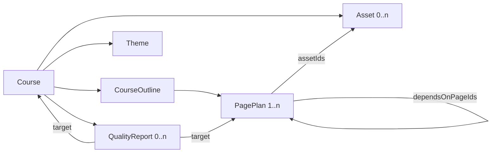

# Course Domain Schema

Day 07 把课程生成流水线中的共享状态收敛为一套 Zod Schema。它们不是数据库表定义，也不描述按钮、阴影或 DOM 层级；它们是 Intent、Planner、Content、Asset、HTML Engineer 和 Quality Agent 之间可以校验、序列化和版本化的协作协议。

## 实体关系

`Course` 是一门课程的聚合根；`CourseOutline` 定义共享学习路径；`PagePlan` 是每个页面的生成任务；`Theme` 提供跨页视觉约束；`Asset` 是可复用视觉素材；`QualityReport` 把评估结果送回生成闭环。

## CourseSchema

| 字段 | 为什么存在 |
| --- | --- |
| `id` / `version` | 让 Agent、缓存和持久化层引用同一课程版本。 |
| `title` / `goal` | 区分用户看到的课程名与 Agent 必须持续遵守的全局目标。 |
| `audience` | 保存受众描述、年龄、先验知识和无障碍要求，避免每页重新猜测。 |
| `difficulty` / `language` | 为内容深度和输出语言提供跨页一致约束。 |
| `status` | 表示课程处于规划、生成、完成或失败阶段，便于恢复任务和展示进度。 |
| `outline` | 保存有序页面序列和学习路径，是多页生成的主干。 |
| `theme` | 让所有页面共享同一个样式模板与有限 design tokens。 |
| `assets` | 集中管理图片等可复用素材，页面只保存 ID 引用。 |
| `qualityReports` | 保存课程级或页面级检查结果，支持修改与再生成。 |
| `createdAt` / `updatedAt` | 支持审计、缓存失效和版本比较。 |

## CourseOutlineSchema

| 字段 | 为什么存在 |
| --- | --- |
| `overview` | 给后续 Agent 一个短小、稳定的课程叙事摘要。 |
| `learningObjectives` | 定义整门课程最终可验收的学习结果。 |
| `pages` | 用数组顺序表达学习路径，并承载每页 PagePlan。 |

Outline 校验页面 ID 唯一、`order` 从 1 连续递增，并要求页面依赖指向已经出现的前置页。这样可以在生成 HTML 前发现断裂或环形学习路径。

## PagePlanSchema

| 字段 | 为什么存在 |
| --- | --- |
| `id` / `order` | 提供稳定引用和明确页面顺序。 |
| `pageType` | 限定为 `cover`、`story_intro`、`knowledge_card`、`quiz`、`comparison`、`timeline`、`summary`、`achievement`，让 Planner 与模板系统使用相同语义。 |
| `title` / `learningObjective` / `contentSummary` | 分别约束页面展示主题、教学目的和内容范围。 |
| `functionalTemplateId` | 描述页面承担的教学交互结构，不绑定具体 CSS。 |
| `styleTemplateId` | 描述视觉风格来源，与功能模板解耦。 |
| `assetIds` | 通过 ID 复用素材，避免把二进制或完整素材对象塞进页面状态。 |
| `dependsOnPageIds` | 显式表达学习前置关系，帮助生成内容承上启下。 |
| `status` / `htmlOutput` | 分离规划态与产物态；只有 `ready` 页面必须已有 HTML。 |

Day 06 的 `PagePlanDraftSchema` 继续作为 SinglePageAgent 的中间输出。它允许 Agent 先形成轻量草稿；Day 07 的 `PagePlanSchema` 则是进入多页课程流水线后的完整对象，两者不混用。

## AssetSchema

| 字段 | 为什么存在 |
| --- | --- |
| `type` / `role` | 说明素材是什么、在页面中承担什么作用。 |
| `source` / `generationPrompt` | 支持生成、上传或素材库来源，并保留可复现信息。 |
| `status` / `uri` | 允许先规划素材再异步生成；`ready` 时必须有可读取地址。 |
| `altText` | 保证视觉素材进入 HTML 前具备可访问文本；纯装饰素材显式使用空字符串。 |
| `dimensions` / `mimeType` | 帮助 HTML 生成器预留空间并选择正确加载方式。 |
| `usedByPageIds` | 表达一个素材被哪些页面复用。 |

Day 16 在领域 `Asset` 之前增加两层执行协议。`AssetRequest` 由 ImagePromptAgent 从一个真实 `assetSlot` 编译，固定包含 `assetType`、`usage`、`prompt`、`transparentBackground`、`safeArea` 和 `aspectRatio`；背景必须保留 HTML 文本安全区，角色贴纸与图标必须请求透明背景。`AssetGenerationResult` 只允许 `ready + Asset` 或 `fallback + 降级描述`，并保留 provider、model、耗时和稳定错误码。这样下游 HTML Engineer 不需要猜测一次生图失败是否应该终止页面。

四类生产素材保持为 HTML 的配件：背景提供氛围和安全区，角色贴纸辅助解释，图标标记语义，纹理提供低对比装饰。模型 Prompt 明确禁止文字、公式、按钮、卡片、导航和完整 UI；页面标题、正文、互动和响应式布局始终由 HTML 实现。

## ThemeSchema

`styleTemplateId` 指向样式模板，`visualDirection` 保存人类可读的视觉原则，`tokens` 只约束跨页必须一致的颜色、字体、密度和圆角。Theme 不定义组件树、像素坐标或每个页面的布局，因此不会把 UI 表现锁死。

## QualityReportSchema

质量报告可以指向整门课程或单页。`dimensions` 的持久化键保持内容准确性、排版质量、课程连贯性、风格一致性、HTML 可运行性和素材可用性，并分别映射到手册的内容、排版、教学、风格、HTML、素材六维；每个维度派生 `issueCodes` 和去重 `repairHints`。`issues` 是完整问题的唯一事实来源，保存维度、严重程度、静态/浏览器/模型证据来源、结构化位置和 `repairHint`；`shouldRepair` 与 `decision` 为后续工作流提供确定性分支。

Day 15 的页面总分按内容 30%、排版 22%、连贯 17%、风格 13%、HTML 10%、素材 8% 加权。出现 error，或内容、排版、HTML 低于硬门槛时，程序必须设置 `shouldRepair: true`。模型只提供语义维度和候选问题，ID、时间、总分、限分和工作流决策都由代码补齐。

Day 26 增加内容错误优先的服务端稳定排序，并允许报告携带可选 `screenshotEvidence`。共享证据只有状态、opaque artifact ID、固定 viewport 和几何指标；真实 PNG 路径保持在服务器内部。旧报告缺少维度问题索引或截图证据时仍能直接解析。

## RepairRequestSchema / RepairResultSchema

`RepairRequest` 把一个页面、来源 `QualityReport`、允许 issue codes、DSL block/HTML selector scope 和固定两轮预算绑定在一起。DSL 请求必须至少定位一个真实 block；所有 issue code 必须存在于来源报告。

`RepairResult` 是三分支联合：`dsl_candidate`、`html_patch_candidate` 或 `declined`。DSL 候选重新通过 `PageContentDSLSchema` 并拒绝未授权字段变化；HTML patches 必须唯一匹配、与 addressed issues 对应，应用后重新通过 HTML 文档、安全、DSL 文本、稳定标记和素材引用合同。`RepairAttemptRecord` 只持久化来源报告和公开审计摘要，不重复保存候选正文；旧页面 checkpoint 可以没有 `repairHistory`。

## 关键跨实体校验

- 页面 ID 与素材 ID 必须唯一。
- 页面顺序必须连续，依赖只能指向已出现的页面。
- 页面引用的素材必须存在；素材引用的页面也必须存在。
- `ready` 页面必须有 HTML；`ready` 素材必须有 URI 和 `altText`，非装饰素材的 `altText` 不能为空。
- 质量报告只能指向当前课程或当前课程中的页面。

这些规则约束的是数据完整性和 Agent 交接，不是 UI 细节。

## DSL 为什么不能太死，也不能完全自由

DSL 太死时，Schema 会逐个枚举组件、布局和样式属性。模型虽然容易通过校验，但只能生成同质化页面，每次设计系统调整都会造成协议迁移。DSL 完全自由时，Agent 可以任意发明字段和 HTML 结构，下游无法稳定渲染、缓存、重试或定位错误。

本项目采用“稳定语义骨架 + 开放实现细节”：严格约束课程目标、页面类型、顺序、依赖、模板引用、素材引用、状态和质量结果；把具体文案、HTML 内部结构和页面布局留给后续 Agent。边界判断标准是：字段是否需要被两个以上 Agent 或前后端共同理解。如果只影响单个渲染实现，就不应进入核心 Course Schema。

## Examples

每个核心 Schema 都有可直接校验的 JSON：

- `src/shared/course-schema/examples/course.example.json`
- `src/shared/course-schema/examples/course-outline.example.json`
- `src/shared/course-schema/examples/page-plan.example.json`
- `src/shared/course-schema/examples/asset.example.json`
- `src/shared/course-schema/examples/theme.example.json`
- `src/shared/course-schema/examples/quality-report.example.json`

单元测试会逐个解析这些 example，防止文档示例与真实协议漂移。
